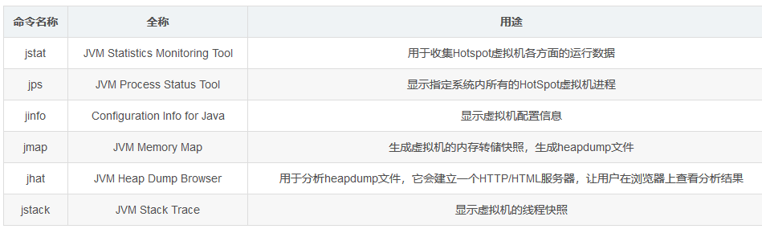

六．Java中的垃圾回收
====================

6.1 内存分区
------------

>   在Java运行时的数据区里，由JVM管理的内存区域分为下图几个模块：

### 6.1.1 程序计数器

程序计数器（Program Counter
Register）是一个比较小的内存区域，用于指示当前线程所执行的字节码执行到了第几行，可以理解为是当前线程的行号指示器。字节码解释器在工作时，会通过改变这个计数器的值来取下一条语句指令。

每个程序计数器只用来记录一个线程的行号，所以它是线程私有（一个线程就有一个程序计数器）的。

如果程序执行的是一个Java方法，则计数器记录的是正在执行的虚拟机字节码指令地址；如果正在执行的是一个本地（native，由C语言编写完成）方法，则计数器的值为Undefined，由于程序计数器只是记录当前指令地址，所以不存在内存溢出的情况，因此，程序计数器也是所有JVM内存区域中唯一一个没有定义OutOfMemoryError的区域。

### 6.1.2 栈

**虚拟机栈（JVM
Stack）**是一个线程的每个方法在执行的同时，都会创建一个栈帧（Statck
Frame），栈帧中存储的有局部变量表、操作站、动态链接、方法出口等，当方法被调用时，栈帧在JVM栈中入栈，当方法执行完成时，栈帧出栈。

局部变量表中存储着方法的相关局部变量，包括各种基本数据类型，对象的引用，返回地址等。在局部变量表中，只有long和double类型会占用2个局部变量空间（Slot，对于32位机器，一个Slot就是32个bit），其它都是1个Slot。需要注意的是，**局部变量表是在编译时就已经确定好的，方法运行所需要分配的空间在栈帧中是完全确定的**，**在方法的生命周期内都不会改变。**

虚拟机栈中定义了两种异常，如果线程调用的栈深度大于虚拟机允许的最大深度，则抛出StatckOverFlowError（栈溢出）。不过多数Java虚拟机都允许动态扩展虚拟机栈的大小(有少部分是固定长度的)，所以线程可以一直申请栈，直到内存不足，此时，会抛出OutOfMemoryError（内存溢出）。

每个线程对应着一个虚拟机栈，因此虚拟机栈也是线程私有的。

**本地方法栈（Native Method
Statck）**：本地方法栈在作用，运行机制，异常类型等方面都与虚拟机栈相同，唯一的区别是：虚拟机栈是执行Java方法的，而本地方法栈是用来执行native方法的，在很多虚拟机中（如Sun的JDK默认的HotSpot虚拟机），会将本地方法栈与虚拟机栈放在一起使用。本地方法栈也是线程私有的。

### 6.1.3 堆

**堆区（Heap）是理解Java
GC机制最重要的区域。**在JVM所管理的内存中，堆区是最大的一块，**堆区也是Java
GC机制所管理的主要内存区域，堆区由所有线程共享，在虚拟机启动时创建。**堆区的存在是为了存储对象实例，原则上讲，所有的对象都在堆区上分配内存（不过现代技术里，也不是这么绝对的，也有栈上直接分配的）。

一般的，根据Java虚拟机规范规定，堆内存需要在逻辑上是连续的（在物理上不需要），在实现时，可以是固定大小的，也可以是可扩展的，目前主流的虚拟机都是可扩展的。如果在执行垃圾回收之后，仍没有足够的内存分配，也不能再扩展，将会抛出OutOfMemoryError:Java
heap space异常。

### 6.1.4 方法区

方法区（Method
Area）：在Java虚拟机规范中，将方法区作为堆的一个逻辑部分来对待，但事实上，方法区并不是堆（Non-Heap）。在HotSpot
Java虚拟机的实现方式中，**将分代收集的思想扩展到了方法区，并将方法区设计成了永久代。不过，除HotSpot之外的多数虚拟机，并不将方法区当做永久代，HotSpot本身，也计划取消永久代。**

方法区是各个线程共享的区域，用于存储已经被虚拟机加载的类信息（即加载类时需要加载的信息，包括版本、field、方法、接口等信息）、final常量、静态变量、编译器即时编译的代码等。

方法区在物理上也不需要是连续的，可以选择固定大小或可扩展大小，并且方法区比堆还多了一个限制：可以选择是否执行垃圾收集。一般的，方法区上执行的垃圾收集是很少的，这也是方法区被称为永久代的原因之一（HotSpot），但这也不代表着在方法区上完全没有垃圾收集，其上的垃圾收集主要是针对常量池的内存回收和对已加载类的卸载。

在方法区上定义了OutOfMemoryError:PermGen space异常，在内存不足时抛出。

**运行时常量池（Runtime Constant
Pool）是方法区的一部分**，用于存储编译期就生成的字面常量、符号引用、翻译出来的直接引用（符号引用就是编码是用字符串表示某个变量、接口的位置，直接引用就是根据符号引用翻译出来的地址，将在类链接阶段完成翻译）。

运行时常量池除了存储编译期常量外，也可以存储在运行时间产生的常量（比如String类的intern()方法，作用是String维护了一个常量池，如果调用的字符“abc”已经在常量池中，则返回池中的字符串地址，否则，新建一个常量加入池中，并返回地址）。

### 6.1.5 直接内存

直接内存（Direct
Memory）并不是JVM管理的内存，可以这样理解，直接内存，就是JVM以外的机器内存，比如有4G的内存，JVM占用了1G，则其余的3G就是直接内存。JDK中有一种基于通道（Channel）和缓冲区（Buffer）的内存分配方式，将由C语言实现的native函数库分配在直接内存中，用存储在JVM堆中的DirectByteBuffer来引用。由于直接内存收到本机器内存的限制，所以也可能出现OutOfMemoryError的异常。

Java的内存模型可参考这篇文章：https://blog.csdn.net/javazejian/article/details/72772461

6.2 Java内存分配机制
--------------------

这里所说的内存分配，主要指的是在堆上的分配。Java内存分配和回收的机制概括的说，就是：分代分配，分代回收。对象将根据存活的时间被分为：年轻代（Young
Generation）、年老代（Old Generation）、永久代（Permanent
Generation，也就是方法区）。这样分配的依据主要有两点：**大多数对象会很快变得不可达以及只有很少的由老对象（创建时间较长的对象）指向新生对象的引用。**

### 6.2.1 年轻代

**年轻代（Young
Generation）**：对象被创建时，内存的分配首先发生在年轻代（大对象可以直接被创建在年老代），大部分的对象在创建后很快就不再使用，因此很快变得不可达，于是被年轻代的GC机制清理掉（IBM的研究表明，98%的对象都是很快消亡的），这个GC机制被称为Minor
GC或叫Young GC。注意，Minor
GC并不代表年轻代内存不足，它事实上只表示在Eden区上的GC。

年轻代上的内存分配是这样的，年轻代可以分为3个区域：Eden区（用来表示内存首次分配的区域）和两个存活区（Survivor
0 、Survivor 1）。内存分配过程如下：

绝大多数刚创建的对象会被分配在Eden区，其中的大多数对象很快就会消亡。Eden区是连续的内存空间。

最初一次，当Eden区满的时候，执行Minor
GC，将消亡的对象清理掉，并将剩余的对象复制到一个存活区Survivor0（此时，Survivor1是空白的，两个Survivor总有一个是空白的。

紧接着等到下次Eden区满了，再执行一次Minor
GC，将消亡的对象清理掉，将存活的对象复制到Survivor1中，然后清空Eden区。同时将Survivor0中消亡的对象清理掉，将其中可以晋级的对象晋级到Old区，将存活的对象也复制到Survivor1区，然后清空Survivor0区。

当两个存活区切换了几次（**HotSpot虚拟机默认15次**，用-XX:MaxTenuringThreshold控制，大于该值进入老年代，但这只是个最大值，并不代表一定是这个值）之后，仍然存活的对象（一小部分），将被复制到老年代。

从上面的过程可以看出，Eden区是连续的空间，且Survivor总有一个为空。经过一次GC和复制，一个Survivor中保存着当前还活着的对象，而Eden区和另一个Survivor区的内容都不再需要了，可以直接清空，到下一次GC时，两个Survivor的角色再互换。因此，这种方式分配内存和清理内存的效率都极高。

在Eden区，HotSpot虚拟机使用了两种技术来加快内存分配。分别是bump-the-pointer和TLAB（Thread-Local
Allocation
Buffers），这两种技术的做法分别是：由于Eden区是连续的，因此bump-the-pointer技术的核心就是跟踪最后创建的一个对象，在

对象创建时，只需要检查最后一个对象后面是否有足够的内存即可，从而大大加快内存分配速度。而对于TLAB技术是对于多线程而言的，将Eden区分为若干段，每个线程使用独立的一段，避免相互影响。TLAB结合bump-the-pointer技术，将保证每个线程都使用Eden区的一段，并快速的分配内存。

### 6.2.2 年老代

**年老代（Old
Generation）：**对象如果在年轻代存活了足够长的时间而没有被清理掉（即在几次Young
GC后存活了下来），则会被复制到年老代，年老代的空间一般比年轻代大，能存放更多的对象，在年老代上发生的GC次数也比年轻代少。当年老代内存不足时，将执行Major
GC，也叫 Full
GC。可以使用-XX:+UseAdaptiveSizePolicy开关来控制是否采用动态控制策略，如果动态控制，则动态调整Java堆中各个区域的大小以及进入老年代的年龄。

如果对象比较大（比如长字符串或大数组），Young空间不足，则大对象会直接分配到老年代上（大对象可能触发提前GC，应少用，更应避免使用短命的大对象）。用-XX:PretenureSizeThreshold来控制直接升入老年代的对象大小，大于这个值的对象会直接分配在老年代上。

可能存在年老代对象引用新生代对象的情况，如果需要执行Young
GC，则可能需要查询整个老年代以确定是否可以清理回收，这显然是低效的。解决的方法是，年老代中维护一个512
byte的块（card table），所有老年代对象引用新生代对象的记录都记录在这里。Young
GC时，只要查这里即可，不用再去查全部老年代，因此性能大大提高。

6.3 GC算法
----------

GC是垃圾收集的意思（Gabage
Collection），Java提供的GC功能可以自动也只能自动地回收堆内存中不再使用的对象，释放资源，但是Java语言没有提供释放已分配内存的显式操作方法（GC方法只是通知，不是立即执行）。

垃圾回收是一种动态存储管理技术，它自动地释放不再被程序引用的对象，当一个对象不再被引用的时候,按照特定的垃圾收集算法来实现资源自动回收的功能。

### 6.3.1 什么样的对象需要回收

**引用计数法：**每个对象上都有一个引用计数，对象每被引用一次，引用计数器就+1，对象引用被释放，引用计数器-1，直到对象的引用计数为0，对象就标识可以回收。但是这个算法有明显的缺陷，对于循环引用的情况下，循环引用的对象就不会被回收。

**可达性分析法：**可达性算法是通过一个称为 GC Roots
的对象向下搜索，整个搜索路径就称为引用链，当一个对象到 GC Roots 没有任何引用链
JVM
就认为该对象是可以被回收的。[可达性分析的问题](https://blog.csdn.net/tjiyu/article/details/53982412)主要在于消耗大量时间和GC停顿。

**可以作为GC Roots的对象：**

>   被启动类（bootstrap加载器）加载的类和创建的对象

>   JVM运行时方法区类静态变量(static)引用的对象

>   JVM运行时方法去常量池引用的对象

>   JVM当前运行线程中的虚拟机栈变量表引用的对象

>   本地方法栈中(JNI)引用的对象

>   下面介绍典型的垃圾回收算法。

### 6.3.2 Mark-Sweep（标记-清除）算法

Mark-Sweep（标记-清除）算法是最基础的垃圾回收算法，它分为两个阶段：标记阶段和清除阶段。标记阶段的任务是标记出所有需要被回收的对象，清除阶段就是回收被标记的对象所占用的空间。具体过程如下图所示：

从图中可以很容易看出标记-清除算法实现起来比较容易，但是有一个比较严重的问题就是容易产生**内存碎片**，碎片太多可能会导致后续过程中需要为大对象分配空间时无法找到足够的空间而提前触发新的一次垃圾收集动作。

### 6.3.3 复制算法

为了解决Mark-Sweep算法的缺陷，复制算法就被提了出来。它将可用内存按容量划分为大小相等的两块，每次只使用其中的一块。当这一块的内存用完了，就将还存活着的对象复制到另外一块上面，然后再把已使用的内存空间一次清理掉，这样一来就不容易出现内存碎片的问题。具体过程如下图所示：

这种算法虽然实现简单，运行高效且不容易产生内存碎片，但是却对内存空间的使用做出了高昂的代价，因为能够使用的内存缩减到原来的一半。很显然，复制算法的效率跟存活对象的数目多少有很大的关系，如果存活对象很多，那么复制算法的效率将会大大降低。

### 6.3.4 Mark-Compact（标记-整理）算法

为了解决复制算法的缺陷，充分利用内存空间，提出了Mark-Compact算法。该算法标记阶段和Mark-Sweep一样，但是在完成标记之后，它不是直接清理可回收对象，而是将存活对象都向一端移动，然后清理掉端边界以外的内存。具体过程如下图所示：

### 6.3.5 Generational Collection（分代收集）算法

分代收集算法是目前大部分JVM的垃圾收集器采用的算法。它的核心思想是根据对象存活的生命周期将内存划分为若干个不同的区域。一般情况下将堆区划分为老年代（Tenured
Generation）和新生代（Young
Generation），老年代的特点是每次垃圾收集时只有少量对象需要被回收，而新生代的特点是每次垃圾回收时都有大量的对象需要被回收，那么就可以根据不同代的特点采取最适合的收集算法。

在新生代中，使用“停止-复制”算法进行清理，将新生代内存分为2部分，1部分
Eden区较大，1部分Survivor比较小，并被划分为两个等量的部分。每次进行清理时，将Eden区和一个Survivor中仍然存活的对象拷贝到
另一个Survivor中，然后清理掉Eden和刚才的Survivor。这里也可以发现，停止复制算法中，用来复制的两部分并不总是相等的（传统的停止复制算法两部分内存相等，但新生代中使用1个大的Eden区和2个小的Survivor区来避免这个问题）

由于绝大部分的对象都是短命的，甚至存活不到Survivor中，所以，Eden区与Survivor的比例较大，HotSpot默认是
8:1，即分别占新生代的80%，10%，10%。如果一次回收中，Survivor+Eden中存活下来的内存超过了10%，则需要将一部分对象分配到
老年代。用-XX:SurvivorRatio参数来配置Eden区域Survivor区的容量比值，默认是8，代表Eden：Survivor1：Survivor2=8:1:1。

老年代存储的对象比年轻代多得多，而且不乏大对象，对老年代进行内存清理时，如果使用停止-复制算法，则相当低效。一般，老年代用的算法是标记-整理算法，即：标记出仍然存活的对象（存在引用的），将所有存活的对象向一端移动，以保证内存的连续。

在发生Minor
GC时，虚拟机会检查每次晋升进入老年代的大小是否大于老年代的剩余空间大小，如果大于，则直接触发一次Full
GC，否则，就查看是否设置了-XX:+HandlePromotionFailure（允许担保失败），如果允许，则只会进行MinorGC，此时可以容忍内存分配失败；如果不允许，则仍然进行Full
GC（这代表着如果设置-XX:+Handle PromotionFailure，则触发MinorGC就会同时触发Full
GC，哪怕老年代还有很多内存，所以，最好不要这样做）。

注意，在堆区之外还有一个代就是永久代（Permanet
Generation），它用来存储class类、常量、方法描述等。永久代的回收并不是必须的，可以通过参数来设置是否对类进行回收。对永久代的回收主要回收两部分内容：废弃常量和无用的类。常量的回收很简单，没有引用了就可以被回收。对于无用的类进行回收，必须保证3点：

**类的所有实例都已经被回收**

**加载类的ClassLoader已经被回收**

**类对象的Class对象没有被引用（即没有通过反射引用该类的地方）**

6.4 垃圾收集器
--------------

在GC机制中，起重要作用的是垃圾收集器，垃圾收集器是GC算法的具体实现，Java虚拟机规范中对于垃圾收集器没有任何规定，所以不同厂商实现的垃圾收集器各不相同，这里需要明确一点，就是在新生代采用的停止复制算法中，“停止（Stop-the-world）”的意义是在回收内存时，需要暂停其他所
有线程的执行。这个是很低效的，现在的各种新生代收集器越来越优化这一点，但仍然只是将停止的时间变短，并未彻底取消停止。

JDK7/8后，HotSpot虚拟机所有收集器及组合（连线），如下图：

**并发垃圾收集和并行垃圾收集的区别**：

**并行（Parallel）收集**指多条垃圾收集线程并行工作，但此时用户线程仍然处于等待状态。如ParNew、Parallel
Scavenge、Parallel Old。

**并发（Concurrent）收集**指用户线程与GC线程同时执行（不一定是并行，可能交替，但总体上是在同时执行的），不需要停顿用户线程（其实在CMS中用户线程还是需要停顿的，只是非常短，GC线程在另一个CPU上执行）。

垃圾收集器期望的目标：**停顿时间：**停顿时间越短就适合需要与用户交互的程序，良好的响应速度能提升用户体验。**吞吐量**：高吞吐量则可以高效率地利用CPU时间，尽快完成运算的任务，主要适合在后台计算而不需要太多交互的任务。

### 6.4.1 Serial/Serial Old

Serial/Serial
Old收集器是最基本最古老的收集器，是HotSpot在Client模式下默认的新生代收集器，它是一个单线程收集器，并且在它进行垃圾收集时，必须暂停所有用户线程。

Serial收集器是针对新生代的收集器，采用的是Copying算法。

Serial
Old收集器是针对老年代的收集器，采用的是Mark-Compact算法。它的优点是实现简单高效，但是缺点是会给用户带来停顿（**Stop
The
World**：JVM在后台自动发起和自动完成的，在用户不可见的情况下，把用户正常的工作线程全部停掉）。

### 6.4.2 ParNew

ParNew垃圾收集器是Serial收集器的多线程版本。ParNew/Serial
Old组合收集器运行示意图如下：

在**Server模式下**，ParNew收集器是一个非常重要的收集器，因为除Serial外，目前只有它能与CMS收集器配合工作。但在单个CPU环境中，不会比Serail收集器有更好的效果，因为存在线程交互开销。

### 6.4.3 Parallel Scavenge

Parallel
Scavenge收集器是一个新生代的多线程收集器（并行收集器），它在回收期间不需要暂停其他用户线程，其采用的是Copying算法。

Parallel
Scavenge收集器的目标是达一个可控制的吞吐量（Throughput），即减少垃圾收集时间，让用户代码获得更长的运行时间；，而CMS等收集器的关注点是尽可能地缩短垃圾收集时用户线程的停顿时间。

Parallel Scavenge关注CPU吞吐量，即
CPU用于运行用户代码的时间与CPU总消耗时间的比值，比如：JVM运行100分钟，其中运行用户代码99分钟，垃圾收集1分钟，则吞吐量是99%，这种收集器能最高效率的利用CPU，适合运行后台运算。

### 6.4.4 Parallel Old

Parallel Old是Parallel
Scavenge收集器的老年代版本（并行收集器），使用多线程和Mark-Compact算法（与Serial
Old不同，这里的整理是Summary（汇总）和Compact（压缩），汇总的意思就是将幸存的对象复制到预先准备好的区域，而不是像Sweep（清理）那样清理废弃的对象）算法，在Parallel
Old执行时，仍然需要暂停其它线程。

Parallel Old在多核计算中很有用。Parallel Old出现后（JDK 1.6），与Parallel
Scavenge配合有很好的效果，充分体现Parallel Scavenge收集器吞吐量优先的效果。

### 6.4.5 CMS

CMS（Concurrent Mark
Sweep）收集器：老年代收集器，致力于**获取最短回收停顿时间（即缩短垃圾回收的时间）**，使用标记清除算法，多线程，优点是并发收集（用户线程可以和GC线程同时工作），停顿小。

**CMS收集器运作过程分为四步：**

**1.初始标记（CMS initial mark）：**仅标记一下GC
Roots能直接关联到的对象，速度很快，但需要"Stop The World"。

**2.并发标记（CMS concurrent mark）：**进行GC Roots Tracing的过程，刚才产生的集

合中标记出存活对象，应用程序也在运行，并不能保证可以标记出所有的存活对象。

**3.重新标记（CMS
remark）：**为了修正并发标记期间因用户程序继续运作而导致标记变动的那一部分对象的标记记录，需要"Stop
The
World"，且停顿时间比初始标记稍长，但远比并发标记短，采用多线程并行执行来提升效率；

**4.并发清除（CMS concurrent sweep）：**回收所有的垃圾对象。

整个过程中耗时最长的并发标记和并发清除都可以与用户线程一起工作，所以总体上说，CMS收集器的内存回收过程与用户线程一起并发执行；

CMS收集器运行示意图如下：

**CMS收集器3个明显的缺点**

>   **对CPU资源非常敏感：**并发收集虽然不会暂停用户线程，但因为占用一部分CPU资源，还是会导致应用程序变慢，总吞吐量降低。CMS的默认收集线程数量是=(CPU数量+3)/4，当CPU数量多于4个，收集线程占用的CPU资源多于25%，对用户程序影响可能较大；不足4个时，影响更大，可能无法接受。

>   **无法处理浮动垃圾,可能出现"Concurrent Mode
>   Failure"失败：**浮动垃圾（Floating
>   Garbage）**是指**在并发清除时，用户线程新产生的垃圾，称为浮动垃圾。这使得并发清除时需要预留一定的内存空间，不能像其他收集器在老年代几乎填满再进行收集，也要可以认为CMS所需要的空间比其他垃圾收集器大；"Concurrent
>   Mode
>   Failure"失败是指如果CMS预留内存空间无法满足程序需要，就会出现一次"Concurrent
>   Mode Failure"失败，这时JVM启用后备预案：临时启用Serail
>   Old收集器，而导致另一次Full GC的产生；

>   **产生大量内存碎片：**由于CMS基于"标记-清除"算法，清除后不进行压缩操作，产生大量不连续的内存碎片会导致分配大内存对象时，无法找到足够的连续内存，从而需要提前触发另一次Full
>   GC动作。

>   **解决方法：**

>   **"-XX:+UseCMSCompactAtFullCollection"**

使得CMS出现上面这种情况时不进行Full
GC，而开启内存碎片的合并整理过程，但合并整理过程无法并发，停顿时间会变长。默认开启（但不会进行，结合下面的CMSFullGCsBeforeCompaction）。

>   **"-XX:+CMSFullGCsBeforeCompaction"**

设置执行多少次不压缩的Full
GC后，来一次压缩整理；为减少合并整理过程的停顿时间，默认为0，也就是说每次都执行Full
GC，不会进行压缩整理；

总体来看，与Parallel
Old垃圾收集器相比，CMS减少了执行老年代垃圾收集时应用暂停的时间，但却增加了新生代垃圾收集时应用暂停的时间、降低了吞吐量而且需要占用更大的堆空间。

### 6.4.6 G1收集器

G1（Garbage
first）收集器是最先进的收集器之一，是面向服务端的垃圾收集器针对具有大内存、多处理器的机器，最主要的应用是为需要低GC延迟，并具有大堆的应用程序提供解决方案。与其他收集器相比，G1收集器有如下优点：

**并行与并发：**有些收集器需要停顿的过程G1仍然可以通过并发的方式让用户程序继续执行。

**分代收集：**可以不使用其他收集器配合管理整个Java堆。

**空间整合：**结合多种垃圾收集算法，空间整合，不产生碎片。从整体看，是基于标记-整理算法，从局部（两个Region间）看，是基于复制算法，这是一种类似火车算法的实现。

**可预测的停顿**：低停顿的同时实现高吞吐量，G1除了降低停顿外，还能建立可预测的停顿时间模型，可以明确指定M毫秒时间片内，垃圾收集消耗的时间不超过N毫秒。

G1中也有分代的概念，不过使用G1收集器时，Java堆的内存布局与其他收集器有很大的差别，它将整个Java堆划分为多个大小相等的独立区域（Region），G1收集器之所以能建立可预测的停顿时间模型，是因为它可以有计划的避免在整个Java堆中进行全区域的垃圾收集。G1跟踪各个Region里垃圾堆积的价值大小（回收所获得的空间大小以及回收所需要的时间的经验值），在后台维护一个优先列表，每次优先收集价值最大的那个Region。这样就保证了在有限的时间内尽可能提高效率。

>   **G1收集器运作过程**

>   **1.初始标记（Initial Marking）：**仅标记一下GC
>   Roots能直接关联到的对象，且修改TAMS（Next Top at Mark
>   Start）,让下一阶段并发运行时，用户程序能在正确可用的Region中创建新对象，需要"Stop
>   The World"，但速度很快。

>   **2.并发标记（Concurrent Marking）：**进行GC Roots
>   Tracing的过程，刚才产生的集合中标记出存活对象，耗时较长，但应用程序也在运行，并不能保证可以标记出所有的存活对象。

>   **3.最终标记（Final
>   Marking）：**为了修正并发标记期间因用户程序继续运作而导致标记变动的那一部分对象的标记记录。上一阶段对象的变化记录在线程的Remembered
>   Set Log。这里把Remembered Set Log合并到Remembered Set中。需要"Stop The
>   World"，且停顿时间比初始标记稍长，但远比并发标记短。采用多线程并行执行来提升效率；

>   **4.筛选回收（Live Data Counting and
>   Evacuation）：**首先排序各个Region的回收价值和成本，然后根据用户期望的GC停顿时间来制定回收计划，最后按计划回收一些价值高的Region中垃圾对象。

>   回收时采用"复制"算法，从一个或多个Region复制存活对象到堆上的另一个空的Region，并且在此过程中压缩和释放内存，可以并发进行，降低停顿时间，并增加吞吐量。

>   G1收集器运行示意图如下：

>   **G1可以建立可预测的停顿时间模型，是因为**以下几点：

>   可以有计划地避免在Java堆的进行全区域的垃圾收集。

>   G1跟踪各个Region获得其收集价值大小，在后台维护一个优先列表。

>   每次根据允许的收集时间，优先回收价值最大的Region（名称Garbage-First的由来）。

这就保证了在有限的时间内可以获取尽可能高的收集效率。

**一个对象被不同区域引用的问题：**一个Region不可能是孤立的，一个Region中的对象可能被其他任意Region中对象引用，判断对象存活时，是否需要扫描整个Java堆才能保证准确。在其他的分代收集器，也存在这样的问题（而G1更突出）：回收新生代也不得不同时扫描老年代？这样的话会降低Minor
GC的效率；

解决方法：无论G1还是其他分代收集器，JVM都是使用Remembered Set来避免全局扫描：

每个Region都有一个对应的Remembered Set。

每次Reference类型数据写操作时，都会产生一个Write Barrier暂时中断操作。

然后检查将要写入的引用指向的对象是否和该Reference类型数据在不同的Region（其他收集器：检查老年代对象是否引用了新生代对象）。

如果不同，通过CardTable把相关引用信息记录到引用指向对象的所在Region对应的Remembered
Set中。

当进行垃圾收集时，在GC根节点的枚举范围加入Remembered
Set，就可以保证不进行全局扫描，也不会有遗漏。

详情参考：https://blog.csdn.net/tjiyu/article/details/53983650

6.5 Java类加载机制
------------------

### 6.5.1 类加载过程

*类从被加载到虚拟机内存中开始，到卸载出内存为止，它的整个生命周期包括：加载、验证、准备、解析、初始化、使用和卸载七个阶段。它们开始的顺序如下图所示：*

其中**类加载的过程包括了加载、验证、准备、解析、初始化五个**阶段。在这五个阶段中，加载、验证、准备和初始化这四个阶段发生的顺序是确定的，而解析阶段则不一定，它在某些情况下可以在初始化阶段之后开始，这是为了支持Java语言的**运行时绑定**（也成为动态绑定或晚期绑定）。另外注意这里的几个阶段是按顺序开始，而不是按顺序进行或完成，因为这些阶段通常都是互相交叉地混合进行的，通常在一个阶段执行的过程中调用或激活另一个阶段。

Java中的绑定：绑定指的是把一个方法的调用与方法所在的类(方法主体)关联起来，对java来说，绑定分为静态绑定和动态绑定。

**静态绑定：**即前期绑定。在程序执行前方法已经被绑定，此时由编译器或其它连接程序实现。针对java，简单的可以理解为程序编译期的绑定。java当中的方法只有final，static，private和构造方法是前期绑定的。

**动态绑定：**即晚期绑定，也叫运行时绑定。在运行时根据具体对象的类型进行绑定。在java中，几乎所有的方法都是后期绑定的。

**加载：加载时类加载过程的第一个阶段，在加载阶段，虚拟机需要完成以下三件事情：**

通过一个类的全限名来获取定义此类的二进制节流。**（实现这个代码模块就是类加载器）**

将这个字节流所代表的静态存储结构转化为方法区的运行时数据结构。

在内存中生成一个代表这个类的java.lang.Class对象,作为方法区这个类的各种数据的访问入口。

加载阶段完成后，**虚拟机外部的二进制字节流**就按照虚拟机所需的格式存储在方法区之中，而且在Java堆中也创建一个java.lang.Class类的对象，这样便可以通过该对象访问方法区中的这些数据。

**验证：验证的目的是为了确保Class文件中的字节流包含的信息符合当前虚拟机的要求，而且不会危害虚拟机自身的安全。不同的虚拟机对类验证的实现可能会有所不同，但大致都会完成以下四个阶段的验证：文件格式的验证、元数据的验证、字节码验证和符号引用验证。**

**文件格式的验证：**验证字节流是否符合Class文件格式的规范，并且能被当前版本的虚拟机处理，该验证的主要目的是保证输入的字节流能正确地解析并存储于方法区之内。经过该阶段的验证后，字节流才会进入内存的方法区中进行存储，后面的三个验证都是基于方法区的存储结构进行的。

– [x] 是否以魔数0xCAFEBABE开头  
– [x] 主次版本号是否在当前虚拟机处理范围之内  
– [x] 常量池中的常量是否有不被支持的常量类型  
– [x] 指向常量的各种索引值中是否有指向不存在的常量或不符合类型的常量  
– [x] CONSTANT*Utf8*info型的常量中是否有不符合UTF8编码的数据  
– [x] Class文件中各个部分及文件本身是否有被删除的或附加的其他信息

**元数据验证：**对类的元数据信息进行语义校验（其实就是对类中的各数据类型进行语法校验），保证不存在不符合Java语法规范的元数据信息。

– [x] 这个类是否有父类

– [x] 这个类的父类是否继承了不准许被继承的类

– [x] 如果这个类不是抽象类,是否实现了其父类或者接口之中要求实现的所有方法

– [x] 类中的字段方法是否与父类产生矛盾

**字节码验证：**该阶段验证的主要工作是进行数据流和控制流分析，对类的方法体进行校验分析，以保证被校验的类的方法在运行时不会做出危害虚拟机安全的行为。

– [x] 保证任意时刻操作数栈的数据类型与指令代码序列都能配合工作

– [x] 保证跳转指令不会跳转到方法体以外的字节码指令上

– [x] 保证方法体重的类型转换是有效的

**符号引用验证：**这是最后一个阶段的验证，它发生在虚拟机将符号引用转化为直接引用的时候（解析阶段中发生该转化，后面会有讲解），主要是对类自身以外的信息（常量池中的各种符号引用）进行匹配性的校验。

– [x] 符号引用中通过字符串描述的全限定名是否找到相应的类

– [x] 在指定的类中是否存在符合方法的字段描述符以及简单名称说描述的方法和字段

– [x] 符号引用中的类、字段、方法的访问性是否被当前类访问

**准备：**准备阶段是正式为类变量分配内存并设置类变量初始值(被static修饰的变量)的阶段,这些变量所使用的内存都将在方法区中进行分配。

这时候进行内存分配的仅包括类变量（static），而不包括实例变量，实例变量会在对象实例化时随着对象一块分配在Java堆中。这里所设置的初始值通常情况下是数据类型默认的零值（如0、0L、null、false等），而不是被在Java代码中被显式地赋予的值。

这里还需要注意如下几点：

对基本数据类型来说，对于类变量（static）和全局变量，如果不显式地对其赋值而直接使用，则系统会为其赋予默认的零值，而对于局部变量来说，在使用前必须显式地为其赋值，否则编译时不通过。

对于同时被static和final修饰的常量，必须在声明的时候就为其显式地赋值，否则编译时不通过；而只被final修饰的常量则既可以在声明时显式地为其赋值，也可以在类初始化时显式地为其赋值，总之，在使用前必须为其显式地赋值，系统不会为其赋予默认零值。

对于引用数据类型reference来说，如数组引用、对象引用等，如果没有对其进行显式地赋值而直接使用，系统都会为其赋予默认的零值，即null。

如果在数组初始化时没有对数组中的各元素赋值，那么其中的元素将根据对应的数据类型而被赋予默认的零值。

**解析阶段**是虚拟机将常量池中的符号引用转化为直接引用的过程。在Class类文件结构一文中已经比较过了符号引用和直接引用的区别和关联，这里不再赘述。前面说解析阶段可能开始于初始化之前，也可能在初始化之后开始，虚拟机会根据需要来判断，到底是在类被加载器加载时就对常量池中的符号引用进行解析（初始化之前），还是等到一个符号引用将要被使用前才去解析它（初始化之后）。

对同一个符号引用进行多次解析请求时很常见的事情，虚拟机实现可能会对第一次解析的结果进行缓存（在运行时常量池中记录直接引用，并把常量标示为已解析状态），从而避免解析动作重复进行。

解析动作主要针对类或接口、字段、类方法、接口方法四类符号引用进行：

**类或接口的解析**：判断所要转化成的直接引用是对数组类型，还是普通的对象类型的引用，从而进行不同的解析。

**字段解析：**对字段进行解析时，会先在本类中查找是否包含有简单名称和字段描述符都与目标相匹配的字段，如果有，则查找结束；如果没有，则会按照继承关系从上往下递归搜索该类所实现的各个接口和它们的父接口，还没有，则按照继承关系从上往下递归搜索其父类，直至查找结束。

**类方法解析：**对类方法的解析与对字段解析的搜索步骤差不多，只是多了判断该方法所处的是类还是接口的步骤，而且对类方法的匹配搜索，是先搜索父类，再搜索接口。

**接口方法解析**：与类方法解析步骤类似，只是接口不会有父类，因此，只递归向上搜索父接口就行了。

初始化是类加载过程的最后一步，到了此阶段，才真正开始执行类中定义的Java程序代码。在准备阶段，类变量已经被赋过一次系统要求的初始值，而在初始化阶段，则是根据程序员通过程序指定的主观计划去初始化类变量和其他资源，或者可以从另一个角度来表达：初始化阶段是执行类构造器\<clinit\>()方法的过程。

这里简单说明下\<clinit\>（）方法的执行规则:

1、\<clinit\>（）方法是由编译器自动收集类中的所有类变量的赋值动作和静态语句块中的语句合并产生的，编译器收集的顺序是由语句在源文件中出现的顺序所决定的，静态语句块中只能访问到定义在静态语句块之前的变量，定义在它之后的变量，在前面的静态语句中可以赋值，但是不能访问。

2、\<clinit\>（）方法与实例构造器\<init\>（）方法（类的构造函数）不同，它不需要显式地调用父类构造器，虚拟机会保证在子类的\<clinit\>（）方法执行之前，父类的\<clinit\>（）方法已经执行完毕。因此，在虚拟机中第一个被执行的\<clinit\>（）方法的类肯定是java.lang.Object。

3、\<clinit\>（）方法对于类或接口来说并不是必须的，如果一个类中没有静态语句块，也没有对类变量的赋值操作，那么编译器可以不为这个类生成\<clinit\>（）方法。

4、接口中不能使用静态语句块，但仍然有类变量（final
static）初始化的赋值操作，因此接口与类一样会生成\<clinit\>（）方法。但是接口鱼类不同的是：执行接口的\<clinit\>（）方法不需要先执行父接口的\<clinit\>（）方法，只有当父接口中定义的变量被使用时，父接口才会被初始化。另外，接口的实现类在初始化时也一样不会执行接口的\<clinit\>（）方法。

**5、虚拟机会保证一个类的\<clinit\>（）方法在多线程环境中被正确地加锁和同步，如果多个线程同时去初始化一个类，那么只会有一个线程去执行这个类的\<clinit\>（）方法，**

其他线程都需要阻塞等待，直到活动线程执行\<clinit\>（）方法完毕。如果在一个类的\<clinit\>（）方法中有耗时很长的操作，那就可能造成多个线程阻塞，在实际应用中这种阻塞往往是很隐蔽的。

**原文：**<https://blog.csdn.net/ns_code/article/details/17881581>

**总结：**整个类加载过程中，除了在加载阶段用户应用程序可以自定义类加载器参与之外，其余所有的动作完全由虚拟机主导和控制。到了初始化才开始执行类中定义的Java程序代码（亦及字节码），但这里的执行代码只是个开端，它仅限于\<clinit\>（）方法。类加载过程中主要是将Class文件（准确地讲，应该是类的二进制字节流）加载到虚拟机内存中，真正执行字节码的操作，在加载完成后才真正开始。

### *6.5.2 双亲委派机制*

双亲委派模型的工作流程是：如果一个类加载器收到了类加载的请求，它首先不会自己去尝试加载这个类，而是把请求委托给父加载器去完成，依次向上，因此，所有的类加载请求最终都应该被传递到顶层的启动类加载器中，只有当父加载器在它的搜索范围中没有找到所需的类时，即无法完成该加载，子加载器才会尝试自己去加载该类。

类加载器虽然只用于实现类的加载动作，但它在Java程序中起到的作用却远远不限于类的加载阶段。对于任意一个类，都需要由它的类加载器和这个类本身一同确定其在就Java虚拟机中的唯一性，也就是说，即使两个类来源于同一个Class文件，只要加载它们的类加载器不同，那这两个类就必定不相等。

站在Java虚拟机的角度来讲，只存在两种不同的类加载器：

**启动类加载器**：它使用C++实现（这里仅限于Hotspot，也就是JDK1.5之后默认的虚拟机，有很多其他的虚拟机是用Java语言实现的），是虚拟机自身的一部分。

**所有其他的类加载器：**这些类加载器都由Java语言实现，独立于虚拟机之外，并且全部继承自抽象类java.lang.ClassLoader，这些类加载器需要由启动类加载器加载到内存中之后才能去加载其他的类。

站在Java开发人员的角度来看，类加载器可以大致划分为以下三类：

**启动类加载器**：Bootstrap
ClassLoader，跟上面相同。它负责加载存放在JDK\\jre\\lib(JDK代表JDK的安装目录，下同)下，或被-Xbootclasspath参数指定的路径中的，并且能被虚拟机识别的类库（如rt.jar，所有的java.\*开头的类均被Bootstrap
ClassLoader加载）。启动类加载器是无法被Java程序直接引用的。

**扩展类加载器**：Extension
ClassLoader，该加载器由sun.misc.Launcher\$ExtClassLoader实现，它负责加载JDK\\jre\\lib\\ext目录中，或者由java.ext.dirs系统变量指定的路径中的所有

类库（如javax.\*开头的类），开发者可以直接使用扩展类加载器。

**应用程序类加载器**：Application
ClassLoader，该类加载器由sun.misc.Launcher\$AppClassLoader来实现，它负责加载用户类路径（ClassPath）所指定的类，开发者可以直接使用该类加载器，如果应用程序中没有自定义过自己的类加载器（继承ClassLoader类并复写findClass方法），一般情况下这个就是程序中默认的类加载器。

**用户定制自己的ClassLoader可以实现以下的一些应用：**

1.自定义路径下查找自定义的class类文件，也许我们需要的class文件并不总是在已经设置好的Classpath下面，那么我们必须想办法来找到这个类，在这种清理下我们需要自己实现一个ClassLoader。

2.确保安全性：Java字节码很容易被反编译，对我们自己的要加载的类做特殊处理，如保证通过网络传输的类的安全性，可以将类经过加密后再传输，在加密到JVM之前需要对类的字节码在解密，这个过程就可以在自定义的ClassLoader中实现。

3.实现类的热部署：可以定义类的实现机制，如果我们可以检查已经加载的class文件是否被修改，如果修改了，可以重新加载这个类。

使用双亲委派模型来组织类加载器之间的关系，有一个很明显的好处，就是Java类随着它的类加载器（说白了，就是它所在的目录）一起具备了一种带有优先级的层次关系，这对于保证Java程序的稳定运作很重要。例如，类java.lang.Object类存放在JDK\\jre\\lib下的rt.jar之中，因此无论是哪个类加载器要加载此类，最终都会委派给启动类加载器进行加载，这边保证了Object类在程序中的各种类加载器中都是同一个类。

6.6 JDK的命令行工具
-------------------

命令使用详解：https://blog.csdn.net/u013457382/article/details/51044853

6.7 JVM参数设置
---------------

\-Xmx3550m：设置JVM最大堆内存为3550M。

\-Xms3550m：设置JVM初始堆内存为3550M。此值可以设置与-Xmx相同，以避免每次垃圾回收完成后JVM重新分配内存。

\-Xss128k：设置每个线程的栈大小。JDK5.0以后每个线程栈大小为1M，之前每个线程栈大小为256K。应当根据应用的线程所需内存大小进行调整。在相同物理内存下，减小这个值能生成更多的线程。但是操作系统对一个进程内的线程数还是有限制的，不能无限生成，

经验值在3000\~5000左右。需要注意的是：当这个值被设置的较大（例如\>2MB）时将会在很大程度上降低系统的性能。

\-Xmn2g：设置年轻代大小为2G。在整个堆内存大小确定的情况下，增大年轻代将会减小年老代，反之亦然。此值关系到JVM垃圾回收，对系统性能影响较大，官方推荐配置为整个堆大小的3/8。

\-XX:NewSize=1024m：设置年轻代初始值为1024M。

\-XX:MaxNewSize=1024m：设置年轻代最大值为1024M。

\-XX:PermSize=256m：设置持久代初始值为256M。

\-XX:MaxPermSize=256m：设置持久代最大值为256M。

\-XX:NewRatio=4：设置年轻代（包括1个Eden和2个Survivor区）与年老代的比值。表示年轻代比年老代为1:4。

\-XX:SurvivorRatio=4：设置年轻代中Eden区与Survivor区的比值。表示2个Survivor区（JVM堆内存年轻代中默认有2个大小相等的Survivor区）与1个Eden区的比值为2:4，即1个Survivor区占整个年轻代大小的1/6。

\-XX:MaxTenuringThreshold=7：表示一个对象如果在Survivor区（救助空间）移动了7次还没有被垃圾回收就进入年老代。如果设置为0的话，则年轻代对象不经过Survivor区，直接进入年老代，对于需要大量常驻内存的应用，这样做可以提高效率。如果将此值设置为一个较大值，则年轻代对象会在Survivor区进行多次复制，这样可以增加对象在年轻代存活时间，增加对象在年轻代被垃圾回收的概率，减少Full
GC的频率，这样做可以在某种程度上提高服务稳定性。

\-XX:PretenureSizeThreshold
直接晋升到老年代的对象大小，设置这个参数后，大于这个参数的对象将直接在老年代分配。

\-XX：MaxTenuringThreshold
每次minorGC就增加一次，超过这个值，在from中的对象直接进入到老年代

6.8 面试问题
------------

### 6.8.1 内存分配与回收策略

1.对象优先在Eden分配

2.大对象直接进入老年代。

3.长期存活的对象将进入老年代

4.动态对象年龄判定

如果在Survivor空间中相同年龄所有对象大小总和大于Survivor空间的一半，（比如说Survivor空间大小为1M，而有两个年龄为1的对象大小和是大于512K的），那么年龄大于等于该年龄的对象都可以直接进入到老年代。

5.空间分配担保

在进行MinorGC前，虚拟机会查看HandlePromotionFailure设置值是否为True,那么说明允许担保失败（会检查虚拟机老年代剩余空间的大小与平均晋升到老年代空间的大小，如果大于说明“可能”是安全的），为True那么进行一次MinorGC，如果此时刻发现进入到老年代的新对象的大小是大于老年代的剩余空间，说明担保失败了，只能进行一次FullGC清除老年代的剩余空间。

### 6.82 对象在内存中的初始化过程

下面详细介绍Java程序中new一个普通对象时，HotSpot虚拟机是怎么样创建这个对象的，包括5个步骤：相应类加载检查过程、在Java堆中为对象分配内存、分配后内存初始化为零、对对象进行必要的设置、以及执行对象实例方法\<init\>。

**1、相应类加载检查过程**

Java程序中的“new”操作会转换为Class文件中方法的“new”字节码指令。遇到new指令时，先检查指令参数是否能在常量池中定位到一个类的符号引用：

A）如果能定位到，检查这个符号引用代表的类是否已被加载、解析和初始化过。

B）如果不能定位到，或没有检查到，就先执行相应的类加载过程。

**2、为对象分配内存**

对象所需内存的大小在类加载完成后便完全确定（JVM可以通过普通Java对象的类元数据信息确定对象大小），为对象分配内存相当于把一块确定大小的内存从Java堆里划分出来。

**分配方式有两种：**

I）指针碰撞：如果Java堆是绝对规整的：一边是用过的内存，一边是空闲的内存，中间一个指针作为边界指示器，分配内存只需向空闲那边移动指针，这种分配方式称为"指针碰撞"（Bump
the Pointer）。

II）空闲列表：如果Java堆不是规整的：用过的和空闲的内存相互交错。需要维护一个列表，记录哪些内存可用，分配内存时查表找到一个足够大的内存，并更新列表，这种分配方式称为"空闲列表"（Free
List）；

**Java堆是否规整由JVM采用的垃圾收集器是否带有压缩功能决定的。**所以，使用Serial、ParNew等带Compact过程的收集器时，JVM采用指针碰撞方式分配内存；而使用CMS这

种基于标记-清除（Mark-Sweep）算法的收集器时，采用空闲列表方式；

**线程安全问题**：并发时，上面两种方式分配内存的操作都不是线程安全的，有两种解决方案：

I）同步处理:对分配内存的动作进行同步处理。JVM采用CAS（Compare and
Swap）机制加上失败重试的方式，保证更新操作的原子性；

II）本地线程分配缓冲区：把分配内存的动作按照线程划分在不同的空间中进行。在每个线程在Java堆预先分配一小块内存，称为本地线程分配缓冲区（Thread
Local Allocation
Buffer,TLAB），哪个线程需要分配内存就从哪个线程的TLAB上分配，只有TLAB用完需要分配新的TLAB时，才需要同步处理。

**3、对象内存初始化为零**

>   对象内存初始化为零，但不包括对象头。

>   如果使用TLAB，提前至分配TLAB时。

>   这保证了程序中对象（及实例变量）不显式初始赋零值，程序也能访问到零值。

**4、对象内存初始化为零**

主要设置对象头信息，包括类元数据引用、对象的哈希码、对象的GC分代年龄等。

**5、执行对象实例方法\<init\>**

该方法把对象（实例变量）按照程序中定义的初始赋值进行初始化。

>   **以Student s = new Student()为例**：  
>   1.首先查看类的符号引用，看是否已经在常量池中，在说明已经加载过了，不在的话需要进行类的加载，验证，准备，解析，初始化的过程。

2．上诉过程执行完毕以后，又将Student加载进内存，也就是存储Student.class的字段信息和方法信息，存储到方法区中。

字段信息：存放类中声明的每一个字段的信息，包括字段的名、类型、修饰符。

方法信息：类中声明的每一个方法的信息，包括方法名、返回值类型、参数类型、修饰符、异常、方法的字节码。

3．然后在自己的线程私有的虚拟机栈中，存储该引用，然后在每个线程的私有空间里面去分配空间存储new
Student(),如果空间不足在eden区域进行分配空间。

4．对类中的成员变量进行默认初始化。

5．对类中的成员变量进行显示初始化。

6．有构造代码块就先执行构造代码块，如果没有，则省略。

7．执行构造方法，通过构造方法对对对象数据进行初始化。

8．堆内存中的数据初始化完毕，把内存值复制给 s 变量

### 6.8.3 对象的强、软、弱和虚引用

**强引用（StrongReference）:**强引用是使用最普遍的引用。如果一个对象具有强引用，那垃圾回收器绝不会回收它。当内存空间不足，Java虚拟机宁愿抛出OutOfMemoryError错误，使程序异常终止，也不会靠随意回收具有强引用的对象来解决内存不足问题。

**软引用（SoftReference）:**如果一个对象只具有软引用，则内存空间足够，垃圾回收器

就不会回收它；如果内存空间不足了，就会回收这些对象的内存。

**弱引用（WeakReference）：**弱引用与软引用的区别在于：只具有弱引用的对象拥有更短暂的生命周期。在垃圾回收器线程扫描它所管辖的内存区域的过程中，一旦发现了只具有弱引用的对象，不管当前内存空间足够与否，都会回收它的内存。

**虚引用（PhantomReference）：**虚引用顾名思义，就是形同虚设，与其他几种引用都不同，虚引用并不会决定对象的生命周期。如果一个对象仅持有虚引用，那么它就和没有任何引用一样，在任何时候都可能被垃圾回收器回收。

### 6.8.4 如何减少GC的次数

**对象不用时最好显示置为NULL：**一般而言，为NULL的对象都会被作为垃圾处理，所以将不用的对象置为NULL，有利于GC收集器判定垃圾，从而提高了GC的效率。

**尽量少使用System.gc():**此函数建议JVM进行主GC，会增加主GC的频率，增加了间接性停顿的次数。

**尽量少使用静态变量:**静态变量属于全局变量，不会被GC回收，会一直占用内存.

**尽量使用StringBuffer,而不使用String来累加字符串**

**分散对象创建或删除的时间**:集中在短时间内大量创建新对象，特别是大对象，会导致突然需要大量内存，JVM在这种情况下只能进行主GC以回收内存，从而增加主GC的频率。

**能用基本类型入int就不用对象Integer。**

**增大-Xmx的值。**

### 6.8.5 触发GC（Garbage Collector）的条件

1．当应用程序空闲时,即没有应用线程在运行时,GC会被调用。因为GC在优先级最低的线程中进行,所以当应用忙时,GC线程就不会被调用,但以下条件除外。

2．Java堆内存不足时,GC会被调用。当应用线程在运行,并在运行过程中创建新对象,若这时内存空间不足,JVM就会强制地调用GC线程,以便回收内存用于新的分配。若GC一次之后仍不能满足
内存分配的要求,JVM会再进行两次GC作进一步的尝试,若仍无法满足要求,则 JVM将报“out
of memory”的错误,Java应用将停止。

注意：GC的回收时间是不确定的，即使你显示的调用的System.gc()。因为和线程优先级有关。使用了finalize（）方法之后，GC是在这个方法执行之后的下一次进行垃圾的回收。

### 6.8.6 为什么要进行垃圾回收

在Java中，当没有对象引用指向原先分配给 某个对象 的内存时，该内存便成为垃圾。
垃圾回收能自动释放内存空间，减轻编程的负担，JVM的一个系统级线程会自动释放该内存块。垃圾回收意味着程序不再需要的对象是"无用信息"，这些信息将被丢弃。当一个对象不再被引用的时候，内存回收它占领的空间，以便空间被后来的新对象使用。

事实上，除了释放没用的对象，垃圾回收也可以清除内存记录碎片。由于创建对象和垃

圾回收器释放丢弃对象所占的内存空间，内存会出现碎片。碎片是分配给对象的内存块之间的空闲内存洞。碎片整理将所占用的堆内存移到堆的一端，JVM将整理出的内存分配给新的对象。

**如何进行垃圾回收：**

Java语言规范没有明确地说明JVM使用哪种垃圾回收算法，但是任何一种垃圾回收算法一般要做2件基本的事情：（1）发现无用信息对象；（2）回收被无用对象占用的内存空间，使该空间可被程序再次使用。

大多数垃圾回收算法使用了根集(root
set)这个概念：所谓根集就是正在执行的Java程序可以访问的引用变量的集合(包括局部变量、参数、类变量)，程序可以使用引用变量访问对象的属性和调用对象的方法。垃圾回收首先需要确定从根开始哪些是可达的和哪些是不可达的，从根集可达的对象都是活动对象，它们不能作为垃圾被回收，这也包括从根集间
接可达的对象。

参考链接：<http://www.voidcn.com/article/p-cgbbjmbz-bn.html>
