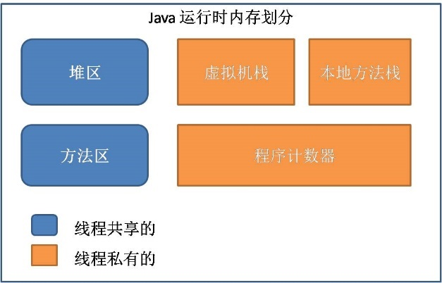

## 内存分区
>   在Java运行时的数据区里，由JVM管理的内存区域分为下图几个模块：

### 程序计数器

程序计数器（Program Counter Register）是一个比较小的内存区域，用于指示当前线程所执行的字节码执行到了第几行，可以理解为是当前线程的行号指示器。字节码解释器在工作时，会通过改变这个计数器的值来取下一条语句指令。

每个程序计数器只用来记录一个线程的行号，所以它是线程私有（一个线程就有一个程序计数器）的。

如果程序执行的是一个Java方法，则计数器记录的是正在执行的虚拟机字节码指令地址；如果正在执行的是一个本地（native，由C语言编写完成）方法，则计数器的值为Undefined，由于程序计数器只是记录当前指令地址，所以不存在内存溢出的情况，因此，程序计数器也是所有JVM内存区域中唯一一个没有定义OutOfMemoryError的区域。

### 虚拟机栈
虚拟机栈是一个线程的每个方法在执行的同时，都会创建一个栈帧（Statck
Frame），栈帧中存储的有局部变量表、操作站、动态链接、方法出口等，当方法被调用时，栈帧在JVM栈中入栈，当方法执行完成时，栈帧出栈。

局部变量表中存储着方法的相关局部变量，包括各种基本数据类型，对象的引用，返回地址等。在局部变量表中，只有long和double类型会占用2个局部变量空间（Slot，对于32位机器，一个Slot就是32个bit），其它都是1个Slot。需要注意的是，**局部变量表是在编译时就已经确定好的，方法运行所需要分配的空间在栈帧中是完全确定的,在方法的生命周期内都不会改变**。

虚拟机栈中定义了两种异常，如果线程调用的栈深度大于虚拟机允许的最大深度，则抛出StatckOverFlowError（栈溢出）。不过多数Java虚拟机都允许动态扩展虚拟机栈的大小(有少部分是固定长度的)，所以线程可以一直申请栈，直到内存不足，此时，会抛出OutOfMemoryError（内存溢出）。

每个线程对应着一个虚拟机栈，因此虚拟机栈也是线程私有的。

### 本地方法栈
本地方法栈在作用，运行机制，异常类型等方面都与虚拟机栈相同，唯一的区别是：虚拟机栈是执行Java方法的，而本地方法栈是用来执行native方法的，在很多虚拟机中（如Sun的JDK默认的HotSpot虚拟机），会将本地方法栈与虚拟机栈放在一起使用。本地方法栈也是线程私有的。

### 堆

堆区（Heap）是理解JavaGC机制最重要的区域。**在JVM所管理的内存中，堆区是最大的一块**，堆区也是JavaGC机制所管理的主要内存区域，堆区由所有线程共享，在虚拟机启动时创建。堆区的存在是为了存储对象实例，原则上讲，所有的对象都在堆区上分配内存（不过现代技术里，也不是这么绝对的，也有栈上直接分配的）。

一般的，根据Java虚拟机规范规定，堆内存需要在逻辑上是连续的（在物理上不需要），在实现时，可以是固定大小的，也可以是可扩展的，目前主流的虚拟机都是可扩展的。如果在执行垃圾回收之后，仍没有足够的内存分配，也不能再扩展，将会抛出OutOfMemoryError:Java heap space异常。

### 方法区

方法区（Method Area）：在Java虚拟机规范中，将方法区作为堆的一个逻辑部分来对待，但事实上，方法区并不是堆（Non-Heap）。在HotSpot Java虚拟机的实现方式中，**将分代收集的思想扩展到了方法区，并将方法区设计成了永久代。不过，除HotSpot之外的多数虚拟机，并不将方法区当做永久代，HotSpot本身，也计划取消永久代**。

方法区是各个线程共享的区域，用于存储已经被虚拟机加载的类信息（即加载类时需要加载的信息，包括版本、field、方法、接口等信息）、final常量、静态变量、编译器即时编译的代码等。

方法区在物理上也不需要是连续的，可以选择固定大小或可扩展大小，并且方法区比堆还多了一个限制：可以选择是否执行垃圾收集。一般的，方法区上执行的垃圾收集是很少的，这也是方法区被称为永久代的原因之一（HotSpot），但这也不代表着在方法区上完全没有垃圾收集，其上的垃圾收集主要是针对常量池的内存回收和对已加载类的卸载。

在方法区上定义了OutOfMemoryError:PermGen space异常，在内存不足时抛出。

### 运行时常量池
运行时常量池（Runtime Constant Pool）是方法区的一部分，用于存储编译期就生成的字面常量、符号引用、翻译出来的直接引用（符号引用就是编码是用字符串表示某个变量、接口的位置，直接引用就是根据符号引用翻译出来的地址，将在类链接阶段完成翻译）。

运行时常量池除了存储编译期常量外，也可以存储在运行时间产生的常量（比如String类的intern()方法，作用是String维护了一个常量池，如果调用的字符“abc”已经在常量池中，则返回池中的字符串地址，否则，新建一个常量加入池中，并返回地址）。

### 直接内存

直接内存（Direct Memory）并不是JVM管理的内存，可以这样理解，直接内存，就是JVM以外的机器内存，比如有4G的内存，JVM占用了1G，则其余的3G就是直接内存。JDK中有一种基于通道（Channel）和缓冲区（Buffer）的内存分配方式，将由C语言实现的native函数库分配在直接内存中，用存储在JVM堆中的DirectByteBuffer来引用。由于直接内存收到本机器内存的限制，所以也可能出现OutOfMemoryError的异常。

## 对象在内存中的初始化过程

下面详细介绍Java程序中new一个普通对象时，HotSpot虚拟机是怎么样创建这个对象的，包括5个步骤：相应类加载检查过程、在Java堆中为对象分配内存、分配后内存初始化为零、对对象进行必要的设置、以及执行对象实例方法\<init\>。

**1、相应类加载检查过程**

Java程序中的“new”操作会转换为Class文件中方法的“new”字节码指令。遇到new指令时，先检查指令参数是否能在常量池中定位到一个类的符号引用：

A）如果能定位到，检查这个符号引用代表的类是否已被加载、解析和初始化过。

B）如果不能定位到，或没有检查到，就先执行相应的类加载过程。

**2、为对象分配内存**

对象所需内存的大小在类加载完成后便完全确定（JVM可以通过普通Java对象的类元数据信息确定对象大小），为对象分配内存相当于把一块确定大小的内存从Java堆里划分出来。

**分配方式有两种：**

I）指针碰撞：如果Java堆是绝对规整的：一边是用过的内存，一边是空闲的内存，中间一个指针作为边界指示器，分配内存只需向空闲那边移动指针，这种分配方式称为"指针碰撞"（Bump
the Pointer）。

II）空闲列表：如果Java堆不是规整的：用过的和空闲的内存相互交错。需要维护一个列表，记录哪些内存可用，分配内存时查表找到一个足够大的内存，并更新列表，这种分配方式称为"空闲列表"（Free
List）；

**Java堆是否规整由JVM采用的垃圾收集器是否带有压缩功能决定的。**所以，使用Serial、ParNew等带Compact过程的收集器时，JVM采用指针碰撞方式分配内存；而使用CMS这

种基于标记-清除（Mark-Sweep）算法的收集器时，采用空闲列表方式；

**线程安全问题**：并发时，上面两种方式分配内存的操作都不是线程安全的，有两种解决方案：

I）同步处理:对分配内存的动作进行同步处理。JVM采用CAS（Compare and
Swap）机制加上失败重试的方式，保证更新操作的原子性；

II）本地线程分配缓冲区：把分配内存的动作按照线程划分在不同的空间中进行。在每个线程在Java堆预先分配一小块内存，称为本地线程分配缓冲区（Thread
Local Allocation
Buffer,TLAB），哪个线程需要分配内存就从哪个线程的TLAB上分配，只有TLAB用完需要分配新的TLAB时，才需要同步处理。

**3、对象内存初始化为零**

>   对象内存初始化为零，但不包括对象头。

>   如果使用TLAB，提前至分配TLAB时。

>   这保证了程序中对象（及实例变量）不显式初始赋零值，程序也能访问到零值。

**4、对象内存初始化为零**

主要设置对象头信息，包括类元数据引用、对象的哈希码、对象的GC分代年龄等。

**5、执行对象实例方法\<init\>**

该方法把对象（实例变量）按照程序中定义的初始赋值进行初始化。

>   **以Student s = new Student()为例**：  
>   1.首先查看类的符号引用，看是否已经在常量池中，在说明已经加载过了，不在的话需要进行类的加载，验证，准备，解析，初始化的过程。

2．上诉过程执行完毕以后，又将Student加载进内存，也就是存储Student.class的字段信息和方法信息，存储到方法区中。

字段信息：存放类中声明的每一个字段的信息，包括字段的名、类型、修饰符。

方法信息：类中声明的每一个方法的信息，包括方法名、返回值类型、参数类型、修饰符、异常、方法的字节码。

3．然后在自己的线程私有的虚拟机栈中，存储该引用，然后在每个线程的私有空间里面去分配空间存储new
Student(),如果空间不足在eden区域进行分配空间。

4．对类中的成员变量进行默认初始化。

5．对类中的成员变量进行显示初始化。

6．有构造代码块就先执行构造代码块，如果没有，则省略。

7．执行构造方法，通过构造方法对对对象数据进行初始化。

8．堆内存中的数据初始化完毕，把内存值复制给 s 变量

## 对象的内存布局
在HotSpot虚拟机中，对象在内存中存储的布局可以分为3块区域：对象头（Header）、实例数据（Instance Data）、和对齐填充（Padding）。

HotSpot 虚拟机的对象头包括两部分信息，第一部分用于存储对象自身的运行时数据，如哈希吗，GC分代年龄标志、锁状态年龄标志、线程持有的锁、偏向线程ID、偏向时间戳等，这部分数据的长度在32位和64位的虚拟机（未开启压缩指针）中分别为32bit和64bit，官方称它为“Mark Word”。对象需要存储的运行时数据很多,其实已经超出了32位、64位 BitMap结构所能记录的限度，但是对象头信息时与对象自身定义无关的额外存储成本，考虑到虚拟机的空间效率，Mark Work被设计成一个非固定的数据结构以便在极小的空间内存储更多的信息。它会根据对象的状态复用自己的空间。例如，在32位的HotSpot虚拟机中，如果对象处于未被锁定的状态下，那么 Mark Word 的32bit 空间中的25bit用于存储对象Hash码，4比特用于存储对象分代年龄，2bit用于存储锁标志位，1bit固定为0，而在其他状态（轻量级锁定，重量级锁定，GC标记，可偏向）见下表：
| 存储内容                             | 标志位 | 状态               |
| ------------------------------------ | ------ | ------------------ |
| 对象哈希码、对象分代年龄             | 01     | 未锁定             |
| 指向锁记录的指针                     | 00     | 轻量级锁定         |
| 指向重量级记录的指针                 | 10     | 膨胀（重量级锁定） |
| 空，不需要记录信息                   | 11     | GC标记             |
| 偏向线程ID、偏向时间戳、对象分代年龄 | 01     | 可偏向             |

对象头的另外一部分是类型指针，即对象指向他的类元数据的指针，虚拟机通过这个指针来确定这个对象是哪一个类的实例。并不是所有的虚拟机实现都必须在对象数据上保留类型指针，换句话说，查找对象的元数据信息不一定要经过对象本身。另外如果对象是一个java数组，那在对象头中还必须有一块用于记录数组长度的数据，因为虚拟机可以通过普通java 对象的元数据信息确定java 对象的大小，但是从java 数组中的元数据中确无法确定数组的大小。

接下来的实例数据部分是对象真正存储的有效信息，也是是在程序代码中所定义的各种字段内容。无论是从父类继承下来的还是从子类定义的，都需要记录下来。这部分的存储顺序会受到虚拟机分配参数策略（FieldAllocationStyle）和字段在java源码中定义顺序的影响。HotSpot虚拟机默认的分配策略为 longs/doubles 、ints、shorts/chars、bytes/booleans、oops（Ordinary Object Pointers），从分配策略中可以看出，相同宽度的字段总是被分配到一起。在满足这个前提条件的情况下，父类中定义的变量会出现在子类之前。如果CompactFields参数值为true，那么子类中较窄的变量也可能会插入到父类变量的空隙只中。

第三部分对齐填充不是必然存在的，也没有特别的含义，它仅仅起着占位符的作用。由于HotSpot VM的自动内存管理系统要求起始对象的起始地址必须是8字节的整数倍，换句话说，就是对象的大小必须是8字节的整数倍。而对象头部分正好是8字节的倍数，因此，当对象实例数据部分没有对齐时，就需要通过对齐填充来补全。

## 对象的强、软、弱和虚引用

**强引用（StrongReference）:**强引用是使用最普遍的引用。如果一个对象具有强引用，那垃圾回收器绝不会回收它。当内存空间不足，Java虚拟机宁愿抛出OutOfMemoryError错误，使程序异常终止，也不会靠随意回收具有强引用的对象来解决内存不足问题。

**软引用（SoftReference）:**如果一个对象只具有软引用，则内存空间足够，垃圾回收器

就不会回收它；如果内存空间不足了，就会回收这些对象的内存。

**弱引用（WeakReference）：**弱引用与软引用的区别在于：只具有弱引用的对象拥有更短暂的生命周期。在垃圾回收器线程扫描它所管辖的内存区域的过程中，一旦发现了只具有弱引用的对象，不管当前内存空间足够与否，都会回收它的内存。

**虚引用（PhantomReference）：**虚引用顾名思义，就是形同虚设，与其他几种引用都不同，虚引用并不会决定对象的生命周期。如果一个对象仅持有虚引用，那么它就和没有任何引用一样，在任何时候都可能被垃圾回收器回收。

## 内存溢出原因

对于Java运行时数据区来说，都会因为申请内存失败而抛出OutOfMemoryError

* Java堆溢出：只要不断的创建对象，并保证GC Roots到对象之间有可达路径来避免垃圾收集器回收这些对象，那么在对象数量达到最大堆的容量限制之后就会抛出OutOfMemoryError。
* 虚拟机栈和本地方法栈溢出：一般情况下在线程过多的时候，每个线程分配的栈深度不够的时候有可能抛出OutOfMemoryError。
* 方法区和运行时常量池溢出:运行时生成大量类。
* 对于CMS收集器来说：如果在垃圾收集中花费了太多时间，CMS收集器会抛出OutOfMemoryError：如果超过98％的总时间花在垃圾收集上，并且回收的堆少于2％，那么抛出OutOfMemoryError 。

