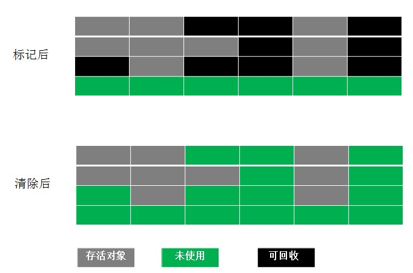
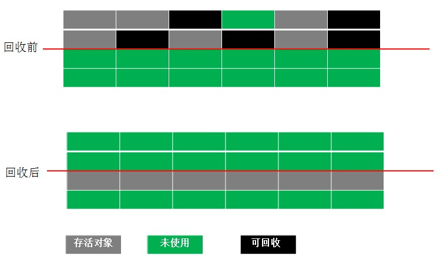
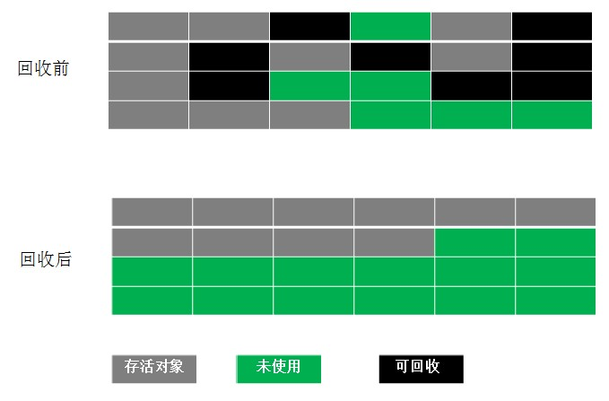
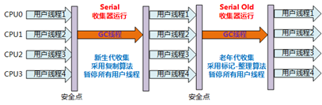
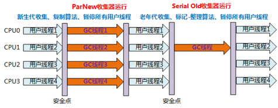
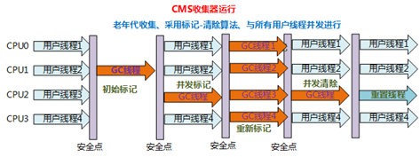
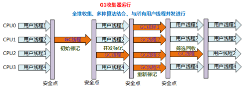

  * [为什么要进行垃圾回收](#%E4%B8%BA%E4%BB%80%E4%B9%88%E8%A6%81%E8%BF%9B%E8%A1%8C%E5%9E%83%E5%9C%BE%E5%9B%9E%E6%94%B6)
  * [什么样的对象需要回收](#%E4%BB%80%E4%B9%88%E6%A0%B7%E7%9A%84%E5%AF%B9%E8%B1%A1%E9%9C%80%E8%A6%81%E5%9B%9E%E6%94%B6)
* [典型的垃圾回收算法。](#%E5%85%B8%E5%9E%8B%E7%9A%84%E5%9E%83%E5%9C%BE%E5%9B%9E%E6%94%B6%E7%AE%97%E6%B3%95)
  * [Mark\-Sweep（标记\-清除）算法](#mark-sweep%E6%A0%87%E8%AE%B0-%E6%B8%85%E9%99%A4%E7%AE%97%E6%B3%95)
  * [复制算法](#%E5%A4%8D%E5%88%B6%E7%AE%97%E6%B3%95)
  * [Mark\-Compact（标记\-整理）算法](#mark-compact%E6%A0%87%E8%AE%B0-%E6%95%B4%E7%90%86%E7%AE%97%E6%B3%95)
  * [Generational Collection（分代收集）算法](#generational-collection%E5%88%86%E4%BB%A3%E6%94%B6%E9%9B%86%E7%AE%97%E6%B3%95)
* [垃圾收集器](#%E5%9E%83%E5%9C%BE%E6%94%B6%E9%9B%86%E5%99%A8)
  * [Serial/Serial Old](#serialserial-old)
  * [ParNew](#parnew)
  * [Parallel Scavenge](#parallel-scavenge)
  * [Parallel Old](#644-parallel-old)
  * [CMS](#645-cms)
  * [G1收集器](#g1%E6%94%B6%E9%9B%86%E5%99%A8)
  * [如何减少GC的次数](#%E5%A6%82%E4%BD%95%E5%87%8F%E5%B0%91gc%E7%9A%84%E6%AC%A1%E6%95%B0)
  * [触发GC（Garbage Collector）的条件](#%E8%A7%A6%E5%8F%91gcgarbage-collector%E7%9A%84%E6%9D%A1%E4%BB%B6)

GC是垃圾收集的意思（Gabage Collection），Java提供的GC功能可以自动也只能自动地回收堆内存中不再使用的对象，释放资源，但是Java语言没有提供释放已分配内存的显式操作方法（GC方法只是通知，不是立即执行）。

垃圾回收是一种动态存储管理技术，它自动地释放不再被程序引用的对象，当一个对象不再被引用的时候,按照特定的垃圾收集算法来实现资源自动回收的功能。

### 为什么要进行垃圾回收

在Java中，当没有对象引用指向原先分配给 某个对象的内存时，该内存便成为垃圾。
垃圾回收能自动释放内存空间，减轻编程的负担，JVM的一个系统级线程会自动释放该内存块。垃圾回收意味着程序不再需要的对象是"无用信息"，这些信息将被丢弃。当一个对象不再被引用的时候，内存回收它占领的空间，以便空间被后来的新对象使用。
事实上，除了释放没用的对象，垃圾回收也可以清除内存记录碎片。由于创建对象和垃圾回收器释放丢弃对象所占的内存空间，内存会出现碎片。碎片是分配给对象的内存块之间的空闲内存洞。碎片整理将所占用的堆内存移到堆的一端，JVM将整理出的内存分配给新的对象。

### 什么样的对象需要回收

**引用计数法** ：每个对象上都有一个引用计数，对象每被引用一次，引用计数器就+1，对象引用被释放，引用计数器-1，直到对象的引用计数为0，对象就标识可以回收。但是这个算法有明显的缺陷，对于循环引用的情况下，循环引用的对象就不会被回收。

**可达性分析法** ：可达性算法是通过一个称为 GC Roots的对象向下搜索，整个搜索路径就称为引用链，当一个对象到 GC Roots 没有任何引用链JVM就认为该对象是可以被回收的。[可达性分析的问题](https://blog.csdn.net/tjiyu/article/details/53982412)主要在于消耗大量时间和GC停顿。

**可以作为GC Roots的对象：**

>   被启动类（bootstrap加载器）加载的类和创建的对象

>   JVM运行时方法区类静态变量(static)引用的对象

>   JVM运行时方法去常量池引用的对象

>   JVM当前运行线程中的虚拟机栈变量表引用的对象

>   本地方法栈中(JNI)引用的对象

## 典型的垃圾回收算法。

### Mark-Sweep（标记-清除）算法

Mark-Sweep（标记-清除）算法是最基础的垃圾回收算法，它分为两个阶段：标记阶段和清除阶段。标记阶段的任务是标记出所有需要被回收的对象，清除阶段就是回收被标记的对象所占用的空间。具体过程如下图所示：

从图中可以很容易看出标记-清除算法实现起来比较容易，但是有一个比较严重的问题就是容易产生**内存碎片**，碎片太多可能会导致后续过程中需要为大对象分配空间时无法找到足够的空间而提前触发新的一次垃圾收集动作。

### 复制算法

为了解决Mark-Sweep算法的缺陷，复制算法就被提了出来。它将可用内存按容量划分为大小相等的两块，每次只使用其中的一块。当这一块的内存用完了，就将还存活着的对象复制到另外一块上面，然后再把已使用的内存空间一次清理掉，这样一来就不容易出现内存碎片的问题。具体过程如下图所示：

这种算法虽然实现简单，运行高效且不容易产生内存碎片，但是却对内存空间的使用做出了高昂的代价，因为能够使用的内存缩减到原来的一半。很显然，复制算法的效率跟存活对象的数目多少有很大的关系，如果存活对象很多，那么复制算法的效率将会大大降低。

### Mark-Compact（标记-整理）算法

为了解决复制算法的缺陷，充分利用内存空间，提出了Mark-Compact算法。该算法标记阶段和Mark-Sweep一样，但是在完成标记之后，它不是直接清理可回收对象，而是将存活对象都向一端移动，然后清理掉端边界以外的内存。具体过程如下图所示：

### Generational Collection（分代收集）算法

分代收集算法是目前大部分JVM的垃圾收集器采用的算法。它的核心思想是根据对象存活的生命周期将内存划分为若干个不同的区域。一般情况下将堆区划分为老年代（Tenured Generation）和新生代（Young Generation），老年代的特点是每次垃圾收集时只有少量对象需要被回收，而新生代的特点是每次垃圾回收时都有大量的对象需要被回收，那么就可以根据不同代的特点采取最适合的收集算法。

在新生代中，使用“停止-复制”算法进行清理，将新生代内存分为2部分，1部分
Eden区较大，1部分Survivor比较小，并被划分为两个等量的部分。每次进行清理时，将Eden区和一个Survivor中仍然存活的对象拷贝到另一个Survivor中，然后清理掉Eden和刚才的Survivor。这里也可以发现，停止复制算法中，用来复制的两部分并不总是相等的（传统的停止复制算法两部分内存相等，但新生代中使用1个大的Eden区和2个小的Survivor区来避免这个问题）
由于绝大部分的对象都是短命的，甚至存活不到Survivor中，所以，Eden区与Survivor的比例较大，HotSpot默认是8:1，即分别占新生代的80%，10%，10%。如果一次回收中，Survivor+Eden中存活下来的内存超过了10%，则需要将一部分对象分配到老年代。用-XX:SurvivorRatio参数来配置Eden区域Survivor区的容量比值，默认是8，代表Eden：Survivor1：Survivor2=8:1:1。

老年代存储的对象比年轻代多得多，而且不乏大对象，对老年代进行内存清理时，如果使用停止-复制算法，则相当低效。一般，老年代用的算法是标记-整理算法，即：标记出仍然存活的对象（存在引用的），将所有存活的对象向一端移动，以保证内存的连续。

在发生MinorGC时，虚拟机会检查每次晋升进入老年代的大小是否大于老年代的剩余空间大小，如果大于，则直接触发一次FullGC，否则，就查看是否设置了-XX:+HandlePromotionFailure（允许担保失败），如果允许，则只会进行MinorGC，此时可以容忍内存分配失败；如果不允许，则仍然进行FullGC（这代表着如果设置-XX:+Handle PromotionFailure，则触发MinorGC就会同时触发FullGC，哪怕老年代还有很多内存，所以，最好不要这样做）。

注意，在堆区之外还有一个代就是永久代（PermanetGeneration），它用来存储class类、常量、方法描述等。永久代的回收并不是必须的，可以通过参数来设置是否对类进行回收。对永久代的回收主要回收两部分内容：废弃常量和无用的类。常量的回收很简单，没有引用了就可以被回收。对于无用的类进行回收，必须保证3点：

> 类的所有实例都已经被回收
> 加载类的ClassLoader已经被回收
> 类对象的Class对象没有被引用（即没有通过反射引用该类的地方）

垃圾收集器
--------------

在GC机制中，起重要作用的是垃圾收集器，垃圾收集器是GC算法的具体实现，Java虚拟机规范中对于垃圾收集器没有任何规定，所以不同厂商实现的垃圾收集器各不相同，这里需要明确一点，就是在新生代采用的停止复制算法中，“停止（Stop-the-world）”的意义是在回收内存时，需要暂停其他所有线程的执行。这个是很低效的，现在的各种新生代收集器越来越优化这一点，但仍然只是将停止的时间变短，并未彻底取消停止。

JDK7/8后，HotSpot虚拟机所有收集器及组合（连线），如下图：

**并发垃圾收集和并行垃圾收集的区别**：

**并行（Parallel）收集**指多条垃圾收集线程并行工作，但此时用户线程仍然处于等待状态。如ParNew、Parallel Scavenge、Parallel Old。

**并发（Concurrent）收集**指用户线程与GC线程同时执行（不一定是并行，可能交替，但总体上是在同时执行的），不需要停顿用户线程（其实在CMS中用户线程还是需要停顿的，只是非常短，GC线程在另一个CPU上执行）。

垃圾收集器期望的目标：**停顿时间：**停顿时间越短就适合需要与用户交互的程序，良好的响应速度能提升用户体验。**吞吐量**：高吞吐量则可以高效率地利用CPU时间，尽快完成运算的任务，主要适合在后台计算而不需要太多交互的任务。

### Serial/Serial Old

Serial/SerialOld收集器是最基本最古老的收集器，是HotSpot在Client模式下默认的新生代收集器，它是一个单线程收集器，并且在它进行垃圾收集时，必须暂停所有用户线程。Serial收集器是针对新生代的收集器，采用的是Copying算法。

SerialOld收集器是针对老年代的收集器，采用的是Mark-Compact算法。它的优点是现简单高效，但是缺点是会给用户带来停顿（Stop The World：JVM在后台自动发起和自动完成的，在用户不可见的情况下，把用户正常的工作线程全部停掉）。

### ParNew

ParNew垃圾收集器是Serial收集器的多线程版本。ParNew/Serial Old组合收集器运行示意图如下：

在**Server模式下**，ParNew收集器是一个非常重要的收集器，因为除Serial外，目前只有它能与CMS收集器配合工作。但在单个CPU环境中，不会比Serail收集器有更好的效果，因为存在线程交互开销。

### Parallel Scavenge

Parallel Scavenge收集器是一个新生代的多线程收集器（并行收集器），它在回收期间不需要暂停其他用户线程，其采用的是Copying算法。

Parallel Scavenge收集器的目标是达一个可控制的吞吐量（Throughput），即减少垃圾收集时间，让用户代码获得更长的运行时间；，而CMS等收集器的关注点是尽可能地缩短垃圾收集时用户线程的停顿时间。

Parallel Scavenge关注CPU吞吐量，即CPU用于运行用户代码的时间与CPU总消耗时间的比值，比如：JVM运行100分钟，其中运行用户代码99分钟，垃圾收集1分钟，则吞吐量是99%，这种收集器能最高效率的利用CPU，适合运行后台运算。

### Parallel Old

Parallel Old是Parallel Scavenge收集器的老年代版本（并行收集器），使用多线程和Mark-Compact算法（与Serial Old不同，这里的整理是Summary（汇总）和Compact（压缩），汇总的意思就是将幸存的对象复制到预先准备好的区域，而不是像Sweep（清理）那样清理废弃的对象）算法，在Parallel Old执行时，仍然需要暂停其它线程。

Parallel Old在多核计算中很有用。Parallel Old出现后（JDK 1.6），与Parallel Scavenge配合有很好的效果，充分体现Parallel Scavenge收集器吞吐量优先的效果。

### CMS

CMS（Concurrent Mark Sweep）收集器：老年代收集器，致力于**获取最短回收停顿时间（即缩短垃圾回收的时间）**，使用标记清除算法，多线程，优点是并发收集（用户线程可以和GC线程同时工作），停顿小。

**CMS收集器运作过程分为四步：**

>1.初始标记（CMS initial mark）：仅标记一下GC Roots能直接关联到的对象，速度很快，但需要"Stop The World"。

>2.并发标记（CMS concurrent mark）：进行GC Roots Tracing的过程，刚才产生的集合中标记出存活对象，应用程序也在运行，并不能保证可以标记出所有的存活对象

>3.重新标记（CMS remark）：为了修正并发标记期间因用户程序继续运作而导致标记变动的那一部分对象的标记记录，需要"Stop The World"，且停顿时间比初始标记稍长，但远比并发标记短，采用多线程并行执行来提升效率

> 4.并发清除（CMS concurrent sweep）：回收所有的垃圾对象

整个过程中耗时最长的并发标记和并发清除都可以与用户线程一起工作，所以总体上说，CMS收集器的内存回收过程与用户线程一起并发执行.CMS收集器运行示意图如下：

**CMS收集器3个明显的缺点**

>   **对CPU资源非常敏感**：并发收集虽然不会暂停用户线程，但因为占用一部分CPU资源，还是会导致应用程序变慢，总吞吐量降低。CMS的默认收集线程数量是=(CPU数量+3)/4，当CPU数量多于4个，收集线程占用的CPU资源多于25%，对用户程序影响可能较大；不足4个时，影响更大，可能无法接受。

>  **无法处理浮动垃圾**：浮动垃圾（Floating Garbage）是指在并发清除时，用户线程新产生的垃圾，称为浮动垃圾。这使得并发清除时需要预留一定的内存空间，不能像其他收集器在老年代几乎填满再进行收集，也要可以认为CMS所需要的空间比其他垃圾收集器大

>**可能出现"Concurrent Mode Failure"失败** : "ConcurrentModeFailure"失败是指如果CMS预留内存空间无法满足程序需要，就会出现一次"ConcurrentModeFailure"失败，这时JVM启用后备预案：临时启用SerailOld收集器，而导致另一次Full GC的产生

>   **产生大量内存碎片**：由于CMS基于"标记-清除"算法，清除后不进行压缩操作，产生大量不连续的内存碎片会导致分配大内存对象时，无法找到足够的连续内存，从而需要提前触发另一次Full GC动作

使得CMS出现上面这种情况时不进行FullGC，而开启内存碎片的合并整理过程，但合并整理过程无法并发，停顿时间会变长。默认开启（但不会进行，结合下面的CMSFullGsBeforeCompaction）。

>   **"-XX:+CMSFullGCsBeforeCompaction"**

设置执行多少次不压缩的FullGC后，来一次压缩整理；为减少合并整理过程的停顿时间，默认为0，也就是说每次都执行FullGC，不会进行压缩整理；

总体来看，与ParallelOld垃圾收集器相比，CMS减少了执行老年代垃圾收集时应用暂停的时间，但却增加了新生代垃圾收集时应用暂停的时间、降低了吞吐量而且需要占用更大的堆空间。

### G1收集器

G1（Garbagefirst）收集器是最先进的收集器之一，是面向服务端的垃圾收集器针对具有大内存、多处理器的机器，最主要的应用是为需要低GC延迟，并具有大堆的应用程序提供解决方案。与其他收集器相比，G1收集器有如下优点：

**并行与并发**：有些收集器需要停顿的过程G1仍然可以通过并发的方式让用户程序继续执行

**分代收集**：可以不使用其他收集器配合管理整个Java堆

**空间整合**：结合多种垃圾收集算法，空间整合，不产生碎片。从整体看，是基于标记-整理算法，从局部（两个Region间）看，是基于复制算法，这是一种类似火车算法的实现

**可预测的停顿**：低停顿的同时实现高吞吐量，G1除了降低停顿外，还能建立可预测的停顿时间模型，可以明确指定M毫秒时间片内，垃圾收集消耗的时间不超过N毫秒。

G1中也有分代的概念，不过使用G1收集器时，Java堆的内存布局与其他收集器有很大的差别，它将整个Java堆划分为多个大小相等的独立区域（Region），G1收集器之所以能建立可预测的停顿时间模型，是因为它可以有计划的避免在整个Java堆中进行全区域的垃圾收集。G1跟踪各个Region里垃圾堆积的价值大小（回收所获得的空间大小以及回收所需要的时间的经验值），在后台维护一个优先列表，每次优先收集价值最大的那个Region。这样就保证了在有限的时间内尽可能提高效率。

G1收集器运行示意图如下：

**G1可以建立可预测的停顿时间模型，是因为**以下几点：

>   可以有计划地避免在Java堆的进行全区域的垃圾收集。

>   G1跟踪各个Region获得其收集价值大小，在后台维护一个优先列表。

>   每次根据允许的收集时间，优先回收价值最大的Region（名称Garbage-First的由来）。

**一个对象被不同区域引用的问题**：一个Region不可能是孤立的，一个Region中的对象可能被其他任意Region中对象引用，判断对象存活时，是否需要扫描整个Java堆才能保证准确。在其他的分代收集器，也存在这样的问题（而G1更突出）：回收新生代也不得不同时扫描老年代？这样的话会降低MinorGC的效率；
解决方法：无论G1还是其他分代收集器，JVM都是使用Remembered Set来避免全局扫描：每个Region都有一个对应的Remembered Set。每次Reference类型数据写操作时，都会产生一个Write Barrier暂时中断操作。然后检查将要写入的引用指向的对象是否和该Reference类型数据在不同的Region（其他收集器：检查老年代对象是否引用了新生代对象）。如果不同，通过CardTable把相关引用信息记录到引用指向对象的所在Region对应的RememberedSet中。当进行垃圾收集时，在GC根节点的枚举范围加入RememberedSet，就可以保证不进行全局扫描，也不会有遗漏。

详情参考：https://blog.csdn.net/tjiyu/article/details/53983650

### 如何减少GC的次数

**对象不用时最好显示置为NULL**：一般而言，为NULL的对象都会被作为垃圾处理，所以将不用的对象置为NULL，有利于GC收集器判定垃圾，从而提高了GC的效率

**尽量少使用System.gc()**:此函数建议JVM进行主GC，会增加主GC的频率，增加了间接性停顿的次数

**尽量少使用静态变量**:静态变量属于全局变量，不会被GC回收，会一直占用内存

**尽量使用StringBuffer,而不使用String来累加字符串**

**分散对象创建或删除的时间**:集中在短时间内大量创建新对象，特别是大对象，会导致突然需要大量内存，JVM在这种情况下只能进行主GC以回收内存，从而增加主GC的频率

**能用基本类型入int就不用对象Intege**

### 触发GC（Garbage Collector）的条件

1．当应用程序空闲时,即没有应用线程在运行时,GC会被调用。因为GC在优先级最低的线程中进行,所以当应用忙时,GC线程就不会被调用,但以下条件除外。

2．Java堆内存不足时,GC会被调用。当应用线程在运行,并在运行过程中创建新对象,若这时内存空间不足,JVM就会强制地调用GC线程,以便回收内存用于新的分配。若GC一次之后仍不能满足内存分配的要求,JVM会再进行两次GC作进一步的尝试,若仍无法满足要求,则 JVM将报“out of memory”的错误,Java应用将停止。

注意：GC的回收时间是不确定的，即使你显示的调用的System.gc()。因为和线程优先级有关。使用了finalize（）方法之后，GC是在这个方法执行之后的下一次进行垃圾的回收。
