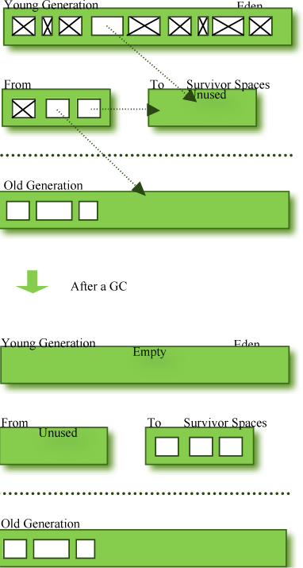
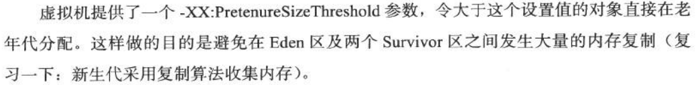
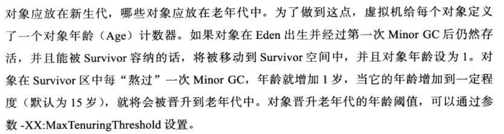
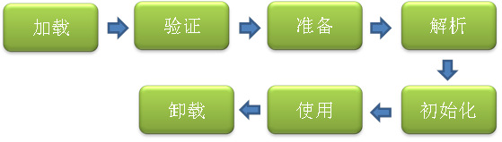
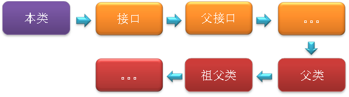

* [Java内存分配机制](#java%E5%86%85%E5%AD%98%E5%88%86%E9%85%8D%E6%9C%BA%E5%88%B6)
  * [年轻代](#%E5%B9%B4%E8%BD%BB%E4%BB%A3)
  * [年老代](#%E5%B9%B4%E8%80%81%E4%BB%A3)
  * [内存分配与回收策略](#%E5%86%85%E5%AD%98%E5%88%86%E9%85%8D%E4%B8%8E%E5%9B%9E%E6%94%B6%E7%AD%96%E7%95%A5)
* [Java类加载机制](#java%E7%B1%BB%E5%8A%A0%E8%BD%BD%E6%9C%BA%E5%88%B6)
  * [类加载过程](#%E7%B1%BB%E5%8A%A0%E8%BD%BD%E8%BF%87%E7%A8%8B)
  * [加载](#%E5%8A%A0%E8%BD%BD)
  * [验证](#%E9%AA%8C%E8%AF%81)
  * [准备](#%E5%87%86%E5%A4%87)
  * [解析阶段](#%E8%A7%A3%E6%9E%90%E9%98%B6%E6%AE%B5)
* [双亲委派机制](#%E5%8F%8C%E4%BA%B2%E5%A7%94%E6%B4%BE%E6%9C%BA%E5%88%B6)

Java内存分配机制
--------------------
这里所说的内存分配，主要指的是在堆上的分配。Java内存分配和回收的机制概括的说，就是：分代分配，分代回收。对象将根据存活的时间被分为：年轻代（Young Generation）、年老代（Old Generation）、永久代（Permanent Generation，也就是方法区）。这样分配的依据主要有两点：**大多数对象会很快变得不可达以及只有很少的由老对象（创建时间较长的对象）指向新生对象的引用**

### 年轻代

**年轻代（Young Generation）**：对象被创建时，内存的分配首先发生在年轻代（大对象可以直接被创建在年老代），大部分的对象在创建后很快就不再使用，因此很快变得不可达，于是被年轻代的GC机制清理掉（IBM的研究表明，98%的对象都是很快消亡的），这个GC机制被称为MinorGC或叫Young GC。注意，MinorGC并不代表年轻代内存不足，它事实上只表示在Eden区上的GC。

年轻代上的内存分配是这样的，年轻代可以分为3个区域：Eden区（用来表示内存首次分配的区域）和两个存活区（Survivor0 、Survivor1）。内存分配过程如下：

绝大多数刚创建的对象会被分配在Eden区，其中的大多数对象很快就会消亡。Eden区是连续的内存空间。

最初一次，当Eden区满的时候，执行MinorGC，将消亡的对象清理掉，并将剩余的对象复制到一个存活区Survivor0（此时，Survivor1是空白的，两个Survivor总有一个是空白的。

紧接着等到下次Eden区满了，再执行一次MinorGC，将消亡的对象清理掉，将存活的对象复制到Survivor1中，然后清空Eden区。同时将Survivor0中消亡的对象清理掉，将其中可以晋级的对象晋级到Old区，将存活的对象也复制到Survivor1区，然后清空Survivor0区。

当两个存活区切换了几次（**HotSpot虚拟机默认15次**，用-XX:MaxTenuringThreshold控制，大于该值进入老年代，但这只是个最大值，并不代表一定是这个值）之后，仍然存活的对象（一小部分），将被复制到老年代。

从上面的过程可以看出，Eden区是连续的空间，且Survivor总有一个为空。经过一次GC和复制，一个Survivor中保存着当前还活着的对象，而Eden区和另一个Survivor区的内容都不再需要了，可以直接清空，到下一次GC时，两个Survivor的角色再互换。因此，这种方式分配内存和清理内存的效率都极高。

在Eden区，HotSpot虚拟机使用了两种技术来加快内存分配。分别是bump-the-pointer和TLAB（Thread-LocalAllocationBuffers），这两种技术的做法分别是：由于Eden区是连续的，因此bump-the-pointer技术的核心就是跟踪最后创建的一个对象，在

对象创建时，只需要检查最后一个对象后面是否有足够的内存即可，从而大大加快内存分配速度。而对于TLAB技术是对于多线程而言的，将Eden区分为若干段，每个线程使用独立的一段，避免相互影响。TLAB结合bump-the-pointer技术，将保证每个线程都使用Eden区的一段，并快速的分配内存。

### 年老代

**年老代（OldGeneration）**：对象如果在年轻代存活了足够长的时间而没有被清理掉（即在几次YoungGC后存活了下来），则会被复制到年老代，年老代的空间一般比年轻代大，能存放更多的对象，在年老代上发生的GC次数也比年轻代少。当年老代内存不足时，将执行MajorGC，也叫 FullGC。可以使用-XX:+UseAdaptiveSizePolicy开关来控制是否采用动态控制策略，如果动态控制，则动态调整Java堆中各个区域的大小以及进入老年代的年龄。

如果对象比较大（比如长字符串或大数组），Young空间不足，则大对象会直接分配到老年代上（大对象可能触发提前GC，应少用，更应避免使用短命的大对象）。用-XX:PretenureSizeThreshold来控制直接升入老年代的对象大小，大于这个值的对象会直接分配在老年代上。

可能存在年老代对象引用新生代对象的情况，如果需要执行YoungGC，则可能需要查询整个老年代以确定是否可以清理回收，这显然是低效的。解决的方法是，年老代中维护一个512byte的块（cardtable），所有老年代对象引用新生代对象的记录都记录在这里。YoungGC时，只要查这里即可，不用再去查全部老年代，因此性能大大提高。

### 内存分配与回收策略

1.对象优先在Eden分配

2.大对象直接进入老年代。

3.长期存活的对象将进入老年代

4.动态对象年龄判定
如果在Survivor空间中相同年龄所有对象大小总和大于Survivor空间的一半，（比如说Survivor空间大小为1M，而有两个年龄为1的对象大小和是大于512K的），那么年龄大于等于该年龄的对象都可以直接进入到老年代。

5.空间分配担保
在进行MinorGC前，虚拟机会查看HandlePromotionFailure设置值是否为True,那么说明允许担保失败（会检查虚拟机老年代剩余空间的大小与平均晋升到老年代空间的大小，如果大于说明“可能”是安全的），为True那么进行一次MinorGC，如果此时刻发现进入到老年代的新对象的大小是大于老年代的剩余空间，说明担保失败了，只能进行一次FullGC清除老年代的剩余空间。

Java类加载机制
------------------

### 类加载过程

**类从被加载到虚拟机内存中开始，到卸载出内存为止，它的整个生命周期包括：加载、验证、准备、解析、初始化、使用和卸载七个阶段。它们开始的顺序如下图所示**：

其中**类加载的过程包括了加载、验证、准备、解析、初始化五个**阶段。在这五个阶段中，加载、验证、准备和初始化这四个阶段发生的顺序是确定的，而解析阶段则不一定，它在某些情况下可以在初始化阶段之后开始，这是为了支持Java语言的**运行时绑定**（也成为动态绑定或晚期绑定）。另外注意这里的几个阶段是按顺序开始，而不是按顺序进行或完成，因为这些阶段通常都是互相交叉地混合进行的，通常在一个阶段执行的过程中调用或激活另一个阶段。

Java中的绑定：绑定指的是把一个方法的调用与方法所在的类(方法主体)关联起来，对java来说，绑定分为静态绑定和动态绑定。

**静态绑定**：即前期绑定。在程序执行前方法已经被绑定，此时由编译器或其它连接程序实现。针对java，简单的可以理解为程序编译期的绑定。java当中的方法只有final，static，private和构造方法是前期绑定的。

**动态绑定**：即晚期绑定，也叫运行时绑定。在运行时根据具体对象的类型进行绑定。在java中，几乎所有的方法都是后期绑定的。

### 加载
加载时类加载过程的第一个阶段，在加载阶段，虚拟机需要完成以下三件事情：

* 通过一个类的全限名来获取定义此类的二进制节流。
* 将这个字节流所代表的静态存储结构转化为方法区的运行时数据结构。
* 在内存中生成一个代表这个类的java.lang.Class对象,作为方法区这个类的各种数据的访问入口。

加载阶段完成后，**虚拟机外部的二进制字节流**就按照虚拟机所需的格式存储在方法区之中，而且在Java堆中也创建一个java.lang.Class类的对象，这样便可以通过该对象访问方法区中的这些数据。

### 验证
验证的目的是为了确保Class文件中的字节流包含的信息符合当前虚拟机的要求，而且不会危害虚拟机自身的安全。不同的虚拟机对类验证的实现可能会有所不同，但大致都会完成以下四个阶段的验证：文件格式的验证、元数据的验证、字节码验证和符号引用验证。

**文件格式的验证**：验证字节流是否符合Class文件格式的规范，并且能被当前版本的虚拟机处理，该验证的主要目的是保证输入的字节流能正确地解析并存储于方法区之内。经过该阶段的验证后，字节流才会进入内存的方法区中进行存储，后面的三个验证都是基于方法区的存储结构进行的。

– [x] 是否以魔数0xCAFEBABE开头  
– [x] 主次版本号是否在当前虚拟机处理范围之内  
– [x] 常量池中的常量是否有不被支持的常量类型  
– [x] 指向常量的各种索引值中是否有指向不存在的常量或不符合类型的常量  
– [x] CONSTANT*Utf8*info型的常量中是否有不符合UTF8编码的数据  
– [x] Class文件中各个部分及文件本身是否有被删除的或附加的其他信息

**元数据验证**：对类的元数据信息进行语义校验（其实就是对类中的各数据类型进行语法校验），保证不存在不符合Java语法规范的元数据信息。

– [x] 这个类是否有父类
– [x] 这个类的父类是否继承了不准许被继承的类
– [x] 如果这个类不是抽象类,是否实现了其父类或者接口之中要求实现的所有方法
– [x] 类中的字段方法是否与父类产生矛盾

**字节码验证**：该阶段验证的主要工作是进行数据流和控制流分析，对类的方法体进行校验分析，以保证被校验的类的方法在运行时不会做出危害虚拟机安全的行为。

– [x] 保证任意时刻操作数栈的数据类型与指令代码序列都能配合工作
– [x] 保证跳转指令不会跳转到方法体以外的字节码指令上
– [x] 保证方法体重的类型转换是有效的

**符号引用验证**：这是最后一个阶段的验证，它发生在虚拟机将符号引用转化为直接引用的时候（解析阶段中发生该转化，后面会有讲解），主要是对类自身以外的信息（常量池中的各种符号引用）进行匹配性的校验。

– [x] 符号引用中通过字符串描述的全限定名是否找到相应的类
– [x] 在指定的类中是否存在符合方法的字段描述符以及简单名称说描述的方法和字段
– [x] 符号引用中的类、字段、方法的访问性是否被当前类访问

### 准备
准备阶段是正式为类变量分配内存并设置类变量初始值(被static修饰的变量)的阶段,这些变量所使用的内存都将在方法区中进行分配。

这时候进行内存分配的仅包括类变量（static），而不包括实例变量，实例变量会在对象实例化时随着对象一块分配在Java堆中。这里所设置的初始值通常情况下是数据类型默认的零值（如0、0L、null、false等），而不是被在Java代码中被显式地赋予的值。

这里还需要注意如下几点：

* 对基本数据类型来说，对于类变量（static）和全局变量，如果不显式地对其赋值而直接使用，则系统会为其赋予默认的零值，而对于局部变量来说，在使用前必须显式地为其赋值，否则编译时不通过。

* 对于同时被static和final修饰的常量，必须在声明的时候就为其显式地赋值，否则编译时不通过；而只被final修饰的常量则既可以在声明时显式地为其赋值，也可以在类初始化时显式地为其赋值，总之，在使用前必须为其显式地赋值，系统不会为其赋予默认零值。

* 对于引用数据类型reference来说，如数组引用、对象引用等，如果没有对其进行显式地赋值而直接使用，系统都会为其赋予默认的零值，即null。

* 如果在数组初始化时没有对数组中的各元素赋值，那么其中的元素将根据对应的数据类型而被赋予默认的零值。

### 解析阶段
解析阶段是虚拟机将常量池中的符号引用转化为直接引用的过程。在Class类文件结构一文中已经比较过了符号引用和直接引用的区别和关联，这里不再赘述。前面说解析阶段可能开始于初始化之前，也可能在初始化之后开始，虚拟机会根据需要来判断，到底是在类被加载器加载时就对常量池中的符号引用进行解析（初始化之前），还是等到一个符号引用将要被使用前才去解析它（初始化之后）。

对同一个符号引用进行多次解析请求时很常见的事情，虚拟机实现可能会对第一次解析的结果进行缓存（在运行时常量池中记录直接引用，并把常量标示为已解析状态），从而避免解析动作重复进行。

解析动作主要针对类或接口、字段、类方法、接口方法四类符号引用进行：

**类或接口的解析**：判断所要转化成的直接引用是对数组类型，还是普通的对象类型的引用，从而进行不同的解析。

**字段解析**：对字段进行解析时，会先在本类中查找是否包含有简单名称和字段描述符都与目标相匹配的字段，如果有，则查找结束；如果没有，则会按照继承关系从上往下递归搜索该类所实现的各个接口和它们的父接口，还没有，则按照继承关系从上往下递归搜索其父类，直至查找结束。

**类方法解析**：对类方法的解析与对字段解析的搜索步骤差不多，只是多了判断该方法所处的是类还是接口的步骤，而且对类方法的匹配搜索，是先搜索父类，再搜索接口。

**接口方法解析**：与类方法解析步骤类似，只是接口不会有父类，因此，只递归向上搜索父接口就行了。

**总结** ：整个类加载过程中，除了在加载阶段用户应用程序可以自定义类加载器参与之外，其余所有的动作完全由虚拟机主导和控制。到了初始化才开始执行类中定义的Java程序代码（亦及字节码），但这里的执行代码只是个开端，它仅限于\<clinit\>（）方法。类加载过程中主要是将Class文件（准确地讲，应该是类的二进制字节流）加载到虚拟机内存中，真正执行字节码的操作，在加载完成后才真正开始。

双亲委派机制
------------------

双亲委派模型的工作流程是：如果一个类加载器收到了类加载的请求，它首先不会自己去尝试加载这个类，而是把请求委托给父加载器去完成，依次向上，因此，所有的类加载请求最终都应该被传递到顶层的启动类加载器中，只有当父加载器在它的搜索范围中没有找到所需的类时，即无法完成该加载，子加载器才会尝试自己去加载该类。

类加载器虽然只用于实现类的加载动作，但它在Java程序中起到的作用却远远不限于类的加载阶段。对于任意一个类，都需要由它的类加载器和这个类本身一同确定其在就Java虚拟机中的唯一性，也就是说，即使两个类来源于同一个Class文件，只要加载它们的类加载器不同，那这两个类就必定不相等。

站在Java虚拟机的角度来讲，只存在两种不同的类加载器：

**启动类加载器**：它使用C++实现（这里仅限于Hotspot，也就是JDK1.5之后默认的虚拟机，有很多其他的虚拟机是用Java语言实现的），是虚拟机自身的一部分。

**所有其他的类加载器**：这些类加载器都由Java语言实现，独立于虚拟机之外，并且全部继承自抽象类java.lang.ClassLoader，这些类加载器需要由启动类加载器加载到内存中之后才能去加载其他的类。

站在Java开发人员的角度来看，类加载器可以大致划分为以下三类：

**启动类加载器**：Bootstrap
ClassLoader，跟上面相同。它负责加载存放在JDK\\jre\\lib(JDK代表JDK的安装目录，下同)下，或被-Xbootclasspath参数指定的路径中的，并且能被虚拟机识别的类库（如rt.jar，所有的java.\*开头的类均被Bootstrap
ClassLoader加载）。启动类加载器是无法被Java程序直接引用的。

**扩展类加载器**：Extension
ClassLoader，该加载器由sun.misc.Launcher\$ExtClassLoader实现，它负责加载JDK\\jre\\lib\\ext目录中，或者由java.ext.dirs系统变量指定的路径中的所有

类库（如javax.\*开头的类），开发者可以直接使用扩展类加载器。

**应用程序类加载器**：Application
ClassLoader，该类加载器由sun.misc.Launcher\$AppClassLoader来实现，它负责加载用户类路径（ClassPath）所指定的类，开发者可以直接使用该类加载器，如果应用程序中没有自定义过自己的类加载器（继承ClassLoader类并复写findClass方法），一般情况下这个就是程序中默认的类加载器。

> 
**用户定制自己的ClassLoader可以实现以下的一些应用：**
1.自定义路径下查找自定义的class类文件，也许我们需要的class文件并不总是在已经设置好的Classpath下面，那么我们必须想办法来找到这个类，在这种清理下我们需要自己实现一个ClassLoader。
2.确保安全性：Java字节码很容易被反编译，对我们自己的要加载的类做特殊处理，如保证通过网络传输的类的安全性，可以将类经过加密后再传输，在加密到JVM之前需要对类的字节码在解密，这个过程就可以在自定义的ClassLoader中实现。
3.实现类的热部署：可以定义类的实现机制，如果我们可以检查已经加载的class文件是否被修改，如果修改了，可以重新加载这个类。

使用双亲委派模型来组织类加载器之间的关系，有一个很明显的好处，就是Java类随着它的类加载器（说白了，就是它所在的目录）一起具备了一种带有优先级的层次关系，这对于保证Java程序的稳定运作很重要。例如，类java.lang.Object类存放在JDK\\jre\\lib下的rt.jar之中，因此无论是哪个类加载器要加载此类，最终都会委派给启动类加载器进行加载，这边保证了Object类在程序中的各种类加载器中都是同一个类。

