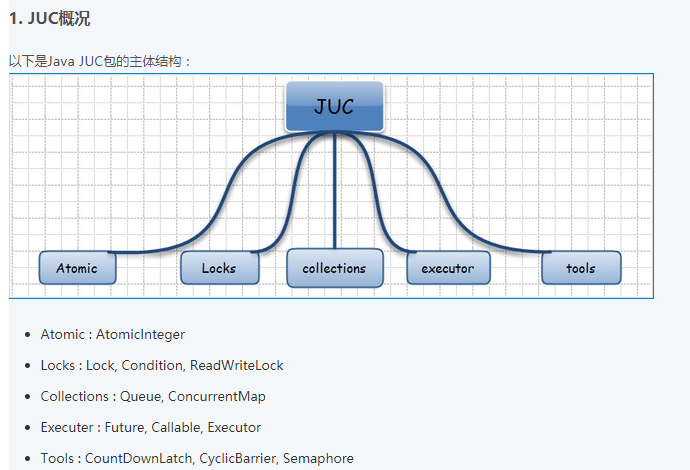
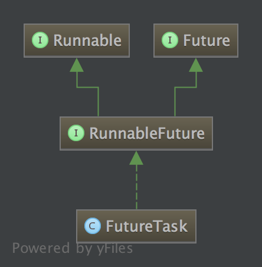
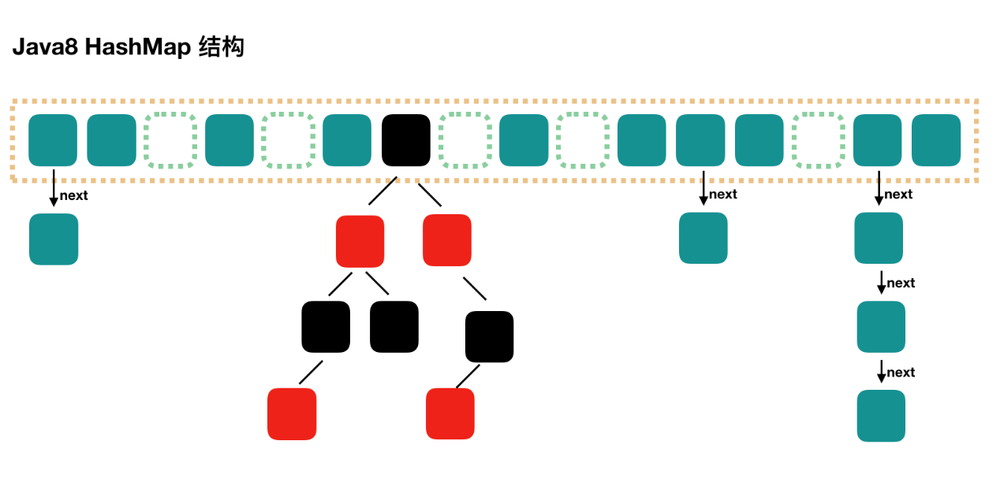
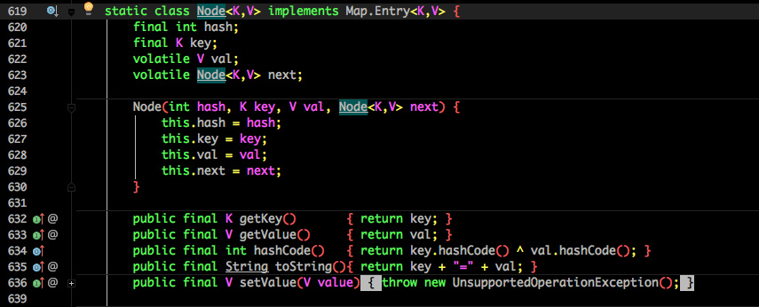
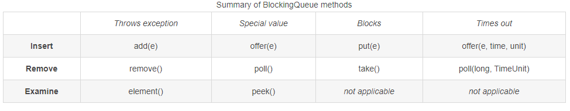
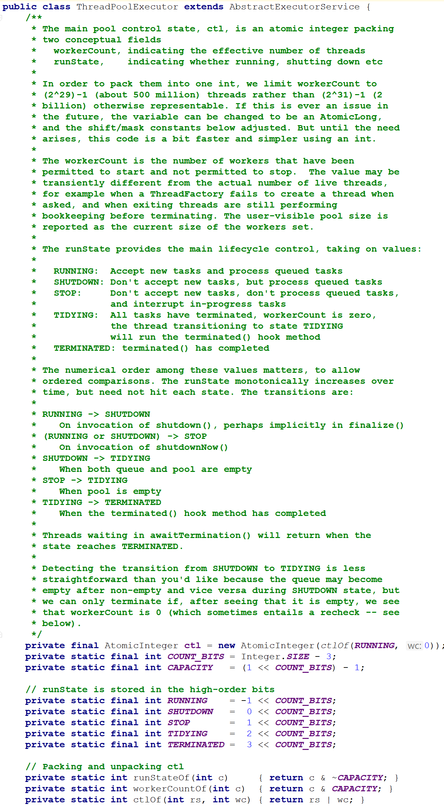
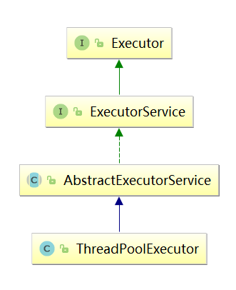

* [同步工具类](#%E5%90%8C%E6%AD%A5%E5%B7%A5%E5%85%B7%E7%B1%BB)
  * [CountDownLatch](#countdownlatch)
  * [CyclicBarrier](#cyclicbarrier)
  * [Semaphore](#semaphore)
  * [FutureTask](#futuretask)
  * [Fork/Join框架](#forkjoin%E6%A1%86%E6%9E%B6)
* [同步List](#%E5%90%8C%E6%AD%A5list)
  * [CopyOnWriteArrayList](#copyonwritearraylist)
  * [CopyOnWriteArraySet](#copyonwritearrayset)
* [同步Map](#%E5%90%8C%E6%AD%A5map)
  * [ConcurrentHashMap](#concurrenthashmap)
    * [JDK1\.7下的ConcurrentHashMap](#jdk17%E4%B8%8B%E7%9A%84concurrenthashmap)
    * [JDK1\.8下的ConcurrentHashMap](#jdk18%E4%B8%8B%E7%9A%84concurrenthashmap)
* [Queue](#queue)
  * [BlockingQueue](#blockingqueue)
    * [ArrayBlockingQueue](#arrayblockingqueue)
    * [LinkedBlockingQueue](#linkedblockingqueue)
    * [LinkedBlockingQueue 和ArrayBlockingQueue比较](#linkedblockingqueue-%E5%92%8Carrayblockingqueue%E6%AF%94%E8%BE%83)
  * [ConcurrentLinkedDeque](#concurrentlinkeddeque)
* [线程池](#%E7%BA%BF%E7%A8%8B%E6%B1%A0)
  * [线程池工作过程](#%E7%BA%BF%E7%A8%8B%E6%B1%A0%E5%B7%A5%E4%BD%9C%E8%BF%87%E7%A8%8B)
  * [线程池分类](#%E7%BA%BF%E7%A8%8B%E6%B1%A0%E5%88%86%E7%B1%BB)
  * [线程池的状态](#%E7%BA%BF%E7%A8%8B%E6%B1%A0%E7%9A%84%E7%8A%B6%E6%80%81)
  * [任务缓存队列及排队策略](#%E4%BB%BB%E5%8A%A1%E7%BC%93%E5%AD%98%E9%98%9F%E5%88%97%E5%8F%8A%E6%8E%92%E9%98%9F%E7%AD%96%E7%95%A5)
  * [任务拒绝策略](#%E4%BB%BB%E5%8A%A1%E6%8B%92%E7%BB%9D%E7%AD%96%E7%95%A5)
  * [ThreadPoolExecutor类](#threadpoolexecutor%E7%B1%BB)
  * [线程池使用的设计模式](#%E7%BA%BF%E7%A8%8B%E6%B1%A0%E4%BD%BF%E7%94%A8%E7%9A%84%E8%AE%BE%E8%AE%A1%E6%A8%A1%E5%BC%8F)
* [Atomic包](#atomic%E5%8C%85)
  * [基本概念](#%E5%9F%BA%E6%9C%AC%E6%A6%82%E5%BF%B5)
    * [原子更新基本类型类](#%E5%8E%9F%E5%AD%90%E6%9B%B4%E6%96%B0%E5%9F%BA%E6%9C%AC%E7%B1%BB%E5%9E%8B%E7%B1%BB)
    * [原子更新数组类](#%E5%8E%9F%E5%AD%90%E6%9B%B4%E6%96%B0%E6%95%B0%E7%BB%84%E7%B1%BB)
    * [原子更新引用类型](#%E5%8E%9F%E5%AD%90%E6%9B%B4%E6%96%B0%E5%BC%95%E7%94%A8%E7%B1%BB%E5%9E%8B)
    * [原子更新字段类](#%E5%8E%9F%E5%AD%90%E6%9B%B4%E6%96%B0%E5%AD%97%E6%AE%B5%E7%B1%BB)
  * [AtomicInteger](#atomicinteger)


JUC包即java.util.concurrent包，是Java提供的一个同步类包。



## 同步工具类

###  CountDownLatch

CountDownLatch又称**闭锁**，是一个同步辅助类，允许一个或者多个线程等待某个事件的发生。CountDownLatch有一个正数计数器，countDown方法对计数器做减操作，await方法等待计数器达到0，所有await的线程都会阻塞直到计数器为0或者等待线程中断或者超时。

CountDownLatch的内部仍然是实现了一个继承自AQS的Sync类，通过这个类实现了countDown()
和 await() 方法。

源码分析可看这篇：https://blog.csdn.net/u010412719/article/details/52121919

### CyclicBarrier

CyclicBarrier字面意思回环栅栏，通过它可以实现让一组线程等待至某个状态之后再全部同时执行。叫做回环是因为当所有等待线程都被释放以后，CyclicBarrier可以被重用。

CyclicBarrier的用途是让一组线程互相等待，直到到达某个公共屏障点才开始继续工作。

CyclicBarrier是可以重复利用的，CountDownLatch不可以重复利用

在等待的只要有一个线程发生中断，则其它线程就会被唤醒继续正常运行。

CyclicBarrier调用CyclicBarrier自带的Runnable里面的run方法是进行barrier处最后一个线程来调用的，如果在执行这个任务发生异常时，则会传播到此线程，其它线程不受影响继续正常运行。

**CyclicBarrier的await()/await(time,TimeUnit)方法分析：**

```
public int await() throws InterruptedException, BrokenBarrierException {
        try {
            return dowait(false, 0L);
        } catch (TimeoutException toe) {
            throw new Error(toe); // cannot happen
        }
    }
    
    public int await(long timeout, TimeUnit unit)
        throws InterruptedException,
               BrokenBarrierException,
               TimeoutException {
        return dowait(true, unit.toNanos(timeout));
    }

    //await(long timeout, TimeUnit unit)与awit()方法都是调用了dowait方法来完成
    private int dowait(boolean timed, long nanos)
        throws InterruptedException, BrokenBarrierException,
               TimeoutException {
        final ReentrantLock lock = this.lock;
        lock.lock();
        try {
            final Generation g = generation;

            if (g.broken)//检查状态，如果为true，则说明已经broken了
                throw new BrokenBarrierException();
            //检查当前线程是否被中断，如果被中断先调用breakBarrier方法然后抛中断异常
            if (Thread.interrupted()) {
                breakBarrier();//设置generation并且唤醒所有正在等待的线程
                throw new InterruptedException();
            }

            int index = --count;//先减一然后再赋值
            if (index == 0) {  // tripped，打开barrier
                boolean ranAction = false;
                try {
                    final Runnable command = barrierCommand;
                    if (command != null)
                        command.run();//当前线程调用command的run方法
                    //从这里可以看出，调用barrier的command的run方法在唤醒其他所有正在等待的线程在前。
                    ranAction = true;
                    nextGeneration();//唤醒所有的正在等待的线程并且设置状态为下一次重复利用做准备
                    return 0;
                } finally {
                    if (!ranAction)//如果command中的run方法抛异常，则就运行这里的breakBarrier()方法来唤醒所有其他正在等待的线程。
                        breakBarrier();
                }
            }

            // loop until tripped, broken, interrupted, or timed out
            //如果当前线程不是最后一个到达的线程，则一直循环检测等待，
            for (;;) {
                try {
                    if (!timed) //如果没有设置等待时间，则一直等待，直到其它线程唤醒  https://blog.csdn.net/luonanqin/article/details/41894755
                        trip.await();
                    else if (nanos > 0L)//如果设置了等待时间，则等待指定的时间。
                        nanos = trip.awaitNanos(nanos);
                } catch (InterruptedException ie) {
                    //如果再等待的期间发生了中断异常，如果其它线程还没有开始唤醒工作，则当前线程就开始唤醒
                    if (g == generation && ! g.broken) {
                        breakBarrier();
                        throw ie;
                    } else {
                        Thread.currentThread().interrupt();
                    }
                }

                if (g.broken)
                    throw new BrokenBarrierException();

                if (g != generation)
                    return index;

                if (timed && nanos <= 0L) {
                    breakBarrier();
                    throw new TimeoutException();
                }
            }
        } finally {
            lock.unlock();
        }
    }

    //  设置当前的generation状态为broken且唤醒所有正在等待的线程。
    private void breakBarrier() {
        generation.broken = true;
        count = parties;
        trip.signalAll();
    }


    // 更新barrier的状态为重复利用做准备并且唤醒所有正在等待的线程
    private void nextGeneration() {
        // signal completion of last generation
        trip.signalAll();
        // set up next generation
        count = parties;
        generation = new Generation();
    }

```

**从dowait方法的代码出发，可以明确的知道以下几点内容：**

1、CyclicBarrier是可以重用的。

2、栅栏任务是由最后一个进行barrier的线程来执行的。

3、当一个线程调用了CyclicBarrier的await方法，则会在发生了如下情况之后就会被唤醒。

* 所有线程都来到了barrier，则barrier正常打开，所有线程继续正常运行
* 当前线程被中断。
* 和当前线程一样正在等待的线程被其它线程中断。
* 当前线程或其它正在等待的线程超时。
* 外部线程调用了reset方法。


### Semaphore

Semaphore是一个计数信号量。从概念上讲，信号量维护了一个许可集。如有必要，在许可可用前会阻塞每一个
acquire()，然后再获取该许可。每个 release()
添加一个许可，从而可能释放一个正在阻塞的获取者。但是，不使用实际的许可对象，Semaphore
只对可用许可的号码进行计数，并采取相应的行动。也就是说，**Semaphore是一个计数器**，在计数器不为0的时候对线程就放行，一旦达到0，那么所有请求资源的新线程都会被阻塞，包

括增加请求到许可的线程，也就是说Semaphore不是可重入的。每一次请求一个许可都会导致计数器减少1，同样每次释放一个许可都会导致计数器增加1，一旦达到了0，新的许可请求线程将被挂起。

Semaphore默认实现一个非公平的NonfairSync类，也就是对于任何申请许可的线程来说，**都是第一时间看是否有多余的许可，如果有则给此线程，**如果没有则进队列排队等待，而不是此线程直接进AQS队列排队等待按顺序来拿到许可，利用此间隙来分配许可可以提高并发量。但是会引发一个问题：越活跃的线程越能够拿到许可，造成“饥渴死”现象。

Semaphore类是委托给实现了**AQS类**的Sync类的两个子类FairSync、NonFairSync来实现的。

源码分析可看这篇：<https://blog.csdn.net/u010412719/article/details/52104409>

### FutureTask

在Java中一般通过继承Thread类或者实现Runnable接口这两种方式来创建多线程，但是这两种方式都有个缺陷，就是不能在执行完成后获取执行的结果，因此Java
1.5之后提供了Callable和Future接口，通过它们就可以在任务执行完毕之后得到任务的执行结果。

**Future接口**代表异步计算的结果，通过Future接口提供的方法可以查看异步计算是否执行完成，或者等待执行结果并获取执行结果，同时还可以取消执行。Future接口的定义如下:

```
public interface Future<V> {
    boolean cancel(boolean mayInterruptIfRunning);
    boolean isCancelled();
    boolean isDone();
    V get() throws InterruptedException, ExecutionException;
    V get(long timeout, TimeUnit unit)
        throws InterruptedException, ExecutionException, TimeoutException;
}

```
**cancel()**:cancel方法用来取消异步任务的执行。如果异步任务已经完成或者已经被取消，或者由于某些原因不能取消，则会返回false。如果任务还没有被执行，则会返回true并且异步任务不会被执行。如果任务已经开始执行了但是还没有执行完成，若mayInterruptIfRunning为true，则会立即中断执行任务的线程并返回true，若mayInterruptIfRunning为false，则会返回true且不会中断任务执行线程。总得来说，**即使cancel()返回为true并不一定能够停止正在执行的异步任务**。

**isCanceled()**:判断任务是否被取消，如果任务在结束(正常执行结束或者执行异常结束)前被取消则返回true，否则返回false。

**isDone()**:判断任务是否已经完成，如果完成则返回true，否则返回false。需要注意的是：任务执行过程中发生异常、任务被取消也属于任务已完成，也会返回true。

**get()**:获取任务执行结果，如果任务还没完成则会阻塞等待直到任务执行完成。如果任务被取消则会抛出CancellationException异常，如果任务执行过程发生异常则会抛出ExecutionException异常，如果阻塞等待过程中被中断则会抛出InterruptedException异常。

**get(long timeout,Timeunit unit)**:带超时时间的get()版本，如果阻塞等待过程中超时则会抛出TimeoutException异常。

Future只是一个接口，不能直接用来创建对象，FutureTask是Future的实现类，FutureTask用于执行一个可返回结果的长任务，任务在单独的线程中执行，其他线程可以用 get方法取任务结果，如果任务尚未完成，线程在 get 上阻塞。

FutureTask的继承图如下:



**源码分析可看这篇**：<http://www.importnew.com/25286.html>

### Fork/Join框架

Fork/Join框架是Java
7提供的一个用于并行执行任务的框架，是一个把大任务分割成若干个小任务，最终汇总每个小任务结果后得到大任务结果的框架。Fork/Join框架要完成两件事情（具体过程类似于递归）：

**1.任务分割**：首先Fork/Join框架需要把大的任务分割成足够小的子任务，如果子任务比较大的话还要对子任务进行继续分割

**2.执行任务并合并结果**：分割的子任务分别放到双端队列里，然后几个启动线程分别从双端队列里获取任务执行。子任务执行完的结果都放在另外一个队列里，启动一个线程从队列里取数据，然后合并这些数据。


任务分割出的子任务会添加到当前工作线程所维护的双端队列中，进入队列的头部。当一个工作线程的队列里暂时没有任务时，它会随机从其他工作线程的队列的尾部获取一个任务([工作窃取算法](http://ifeve.com/talk-concurrency-forkjoin/#more-8436))。

**源码分析可看这篇：**<https://www.cnblogs.com/senlinyang/p/7885964.html>

同步List
------------

### CopyOnWriteArrayList

CopyOnWriteArrayList/CopyOnWriteArraySet的基本思想是一旦对容器有修改，那么就“复制”一份新的集合，在新的集合上修改，然后将新集合复制给旧的引用。当然了这部分少不了要加锁。显然对于CopyOnWriteArrayList/CopyOnWriteArraySet来说最大的好处就是“读”操作不需要锁了。

CopyOnWriteArrayList是ArrayList 的一个线程安全的变体，其中所有可变操作（add、set
等等）都是通过对底层数组进行一次新的复制来实现的。**这一般需要很大的开销，但是当遍历操作的数量大大超过可变操作的数量时，这种方法可能比其他替代方法更有效。**在不能或不想进行同步遍历，但又需要从并发线程中排除冲突时，它也很有用。“快照”风格的迭代器方法在创建迭代器时使用了对数组状态的引用。此数组在迭代器的生存期内不会更改，因此不可能发生冲突，并且迭代器保证不会抛出
ConcurrentModificationException。创建迭代器以后，迭代器就不会反映列表的添加、移除或者更改。在迭代器上进行的元素更改操作（remove、set
和 add）不受支持。这些方法将抛出 UnsupportedOperationException。

底层的数组：private transient volatile Object[] array。

底层的数组采用Volatile来声明的，对于可变操作采用加锁并对底层的数组进行拷贝一份，在新数组上进行修改，最后将旧引用指向这个新数组即可，对于不可变的操作，利用的数组的不可变性来完成的。

**get方法**
```
    public E get(int index) {
        return get(getArray(), index);
    }
    final Object[] getArray() {
        return array;
    }

    private E get(Object[] a, int index) {
        return (E) a[index];
}

```
在读数据的时候不会锁住list，如果对容器拷贝修改的过程中又有新的读线程进来，那么读到的还是旧的数据。

**add方法**

```
    public boolean add(E e) {
        final ReentrantLock lock = this.lock;
        lock.lock();  // 加锁
        try {
            Object[] elements = getArray();
            int len = elements.length;
            //将原来的数组copy一份到新数组中，然后修改
            Object[] newElements = Arrays.copyOf(elements, len + 1);
            newElements[len] = e;
            setArray(newElements);//将新数组给原来的引用
            return true;
        } finally {
            lock.unlock(); //释放锁
        }
    }

```

**其中这个类的几乎所有的可变方法的流程都和上面类似。**

**CopyOnWriteArrayList小结**

1.CopyOnWriteArrayList适用于读多写少的场景

2.在并发操作容器对象时不会抛出ConcurrentModificationException，并且返回的元素与迭代器创建时的元素是一致的

3.容器对象的复制需要一定的开销，如果对象占用内存过大，可能造成频繁的YoungGC和FullGC

4.CopyOnWriteArrayList不能保证数据实时一致性，只能保证最终一致性

### CopyOnWriteArraySet

CopyOnWriteArraySet里面有一个CopyOnWriteArrayList的引用，即CopyOnWriteArraySet类里面的内部实现全部是委托给CopyOnWriteArrayList来实现的，只是额外的封装了下。其唯一的不同是在add时调用的是CopyOnWriteArrayList的addIfAbsent方法，其遍历当前Object数组，如Object数组中已有了当前元素，则直接返回，如果没有则放入Object数组的尾部，并返回。

```
    public class CopyOnWriteArraySet<E> extends AbstractSet<E>
            implements java.io.Serializable {
        private static final long serialVersionUID =  …;
        private final CopyOnWriteArrayList<E> al;

        /**
         * Creates an empty set.
         */
        public CopyOnWriteArraySet() {
            al = new CopyOnWriteArrayList<E>();
        }
```

同步Map
-----------

### ConcurrentHashMap

#### JDK1.7下的ConcurrentHashMap

如图所示，ConcurrentHashMap是由Segment 数组、HashEntry 组成，和 HashMap
一样，仍然是数组加链表。


Segment 是 ConcurrentHashMap 的一个内部类：

**static final class Segment\<K,V\> extends ReentrantLock implements
Serializable**

原理上来说：ConcurrentHashMap 采用了分段锁技术，其中 Segment 继承于
ReentrantLock。不会像 HashTable 那样不管是put 还是 get
操作都需要做同步处理，理论上 ConcurrentHashMap 支持 CurrencyLevel (Segment
数组数量)的线程并发。每当一个线程占用锁访问一个 Segment 时，不会影响到其他的
Segment。

**get 过程分析：**

```
public V get(Object key) {
    Segment<K,V> s; // manually integrate access methods to reduce overhead
    HashEntry<K,V>[] tab;
    // 1. hash 值
    int h = hash(key);
    long u = (((h >>> segmentShift) & segmentMask) << SSHIFT) + SBASE;
    // 2. 根据 hash 找到对应的 segment
    if ((s = (Segment<K,V>)UNSAFE.getObjectVolatile(segments, u)) != null &&
        (tab = s.table) != null) {
        // 3. 找到segment 内部数组相应位置的链表，遍历
        for (HashEntry<K,V> e = (HashEntry<K,V>) UNSAFE.getObjectVolatile
                 (tab, ((long)(((tab.length - 1) & h)) << TSHIFT) + TBASE);
             e != null; e = e.next) {
            K k;
            if ((k = e.key) == key || (e.hash == h && key.equals(k)))
                return e.value;
        }
    }
    return null;
}

```

这里要注意的是get方法没有加锁。主要是是通过cas（插入头）和volatline关键字（中间）来保持get的正确性。

**put方法**

**首先调用的是**ConcurrentHashMap的put方法：
```
public V put(K key, V value) {
    Segment<K,V> s;
    if (value == null)
        throw new NullPointerException();
    // 1. 计算 key 的 hash 值
    int hash = hash(key);
    // 2. 根据 hash 值找到 Segment 数组中的位置 j
    //    hash 是 32 位，无符号右移 segmentShift(28) 位，剩下低 4 位，
    //    然后和 segmentMask(15) 做一次与操作，也就是说 j 是 hash 值的最后 4 位，也就是槽的数组下标
    int j = (hash >>> segmentShift) & segmentMask;
    // 刚刚说了，初始化的时候初始化了 segment[0]，但是其他位置还是 null，
    // ensureSegment(j) 对 segment[j] 进行初始化
    if ((s = (Segment<K,V>)UNSAFE.getObject          // nonvolatile; recheck
         (segments, (j << SSHIFT) + SBASE)) == null) //  in ensureSegment
        s = ensureSegment(j);
    // 3. 插入新值到 槽 s 中
    return s.put(key, hash, value, false);
}
接着调用内部类Segment实现的put方法：
final V put(K key, int hash, V value, boolean onlyIfAbsent) {
    // 在往该 segment 写入前，需要先获取该 segment 的独占锁
    // scanAndLockForPut尝试获取该 segment 的独占锁（阻塞），如果需要的话顺便实例化了一下 node。
    HashEntry<K,V> node = tryLock() ? null :
        scanAndLockForPut(key, hash, value);
    V oldValue;
    try {
        // 这个是 segment 内部的数组
        HashEntry<K,V>[] tab = table;
        // 再利用 hash 值，求应该放置的数组下标
        int index = (tab.length - 1) & hash;
        // first 是数组该位置处的链表的表头
        HashEntry<K,V> first = entryAt(tab, index);
         
        for (HashEntry<K,V> e = first;;) {
            if (e != null) {
                K k;
                if ((k = e.key) == key ||
                    (e.hash == hash && key.equals(k))) {
                    oldValue = e.value;
                    if (!onlyIfAbsent) {
                        // 覆盖旧值
                        e.value = value;
                        ++modCount;
                    }
                    break;
                }
                // 继续顺着链表走
                e = e.next;
            }
            else {
                // node 到底是不是 null，这个要看获取锁的过程，不过和这里都没有关系。
                // 如果不为 null，那就直接将它设置为链表表头；如果是null，初始化并设置为链表表头。
                if (node != null)
                    node.setNext(first);
                else
                    node = new HashEntry<K,V>(hash, key, value, first);
 
                int c = count + 1;
                // 如果超过了该 segment 的阈值，这个 segment 需要扩容
                if (c > threshold && tab.length < MAXIMUM_CAPACITY)
                    rehash(node); // 扩容后面也会具体分析
                else
                    // 没有达到阈值，将 node 放到数组 tab 的 index 位置，
                    // 其实就是将新的节点设置成原链表的表头
                    setEntryAt(tab, index, node);
                ++modCount;
                count = c;
                oldValue = null;
                break;
            }
        }
    } finally {
        // 解锁
        unlock();
    }
    return oldValue;
}
```

put 的时候，如果判断该值的插入会导致该 segment的元素个数超过阈值，那么先进行扩容，再插值。

**扩容: rehash**
```
// 方法参数上的 node 是这次扩容后，需要添加到新的数组中的数据。
private void rehash(HashEntry<K,V> node) {
    HashEntry<K,V>[] oldTable = table;
    int oldCapacity = oldTable.length;
    // 2 倍
    int newCapacity = oldCapacity << 1;
    threshold = (int)(newCapacity * loadFactor);
    // 创建新数组
    HashEntry<K,V>[] newTable =
        (HashEntry<K,V>[]) new HashEntry[newCapacity];
    // 新的掩码，如从 16 扩容到 32，那么 sizeMask 为 31，对应二进制 ‘000...00011111’
    int sizeMask = newCapacity - 1;
 
    // 遍历原数组，老套路，将原数组位置 i 处的链表拆分到 新数组位置 i 和 i+oldCap 两个位置
    for (int i = 0; i < oldCapacity ; i++) {
        // e 是链表的第一个元素
        HashEntry<K,V> e = oldTable[i];
        if (e != null) {
            HashEntry<K,V> next = e.next;
            // 计算应该放置在新数组中的位置，
            // 假设原数组长度为 16，e 在 oldTable[3] 处，那么 idx 只可能是 3 或者是 3 + 16 = 19
            int idx = e.hash & sizeMask;
            if (next == null)   // 该位置处只有一个元素，那比较好办
                newTable[idx] = e;
            else { // Reuse consecutive sequence at same slot
                // e 是链表表头
                HashEntry<K,V> lastRun = e;
                // idx 是当前链表的头结点 e 的新位置
                int lastIdx = idx;
 
                // 下面这个 for 循环会找到一个 lastRun 节点，这个节点之后的所有元素是将要放到一起的
                for (HashEntry<K,V> last = next;
                     last != null;
                     last = last.next) {
                    int k = last.hash & sizeMask;
                    if (k != lastIdx) {
                        lastIdx = k;
                        lastRun = last;
                    }
                }
                // 将 lastRun 及其之后的所有节点组成的这个链表放到 lastIdx 这个位置
                newTable[lastIdx] = lastRun;
                // 下面的操作是处理 lastRun 之前的节点，
                //    这些节点可能分配在另一个链表中，也可能分配到上面的那个链表中
                for (HashEntry<K,V> p = e; p != lastRun; p = p.next) {
                    V v = p.value;
                    int h = p.hash;
                    int k = h & sizeMask;
                    HashEntry<K,V> n = newTable[k];
                    newTable[k] = new HashEntry<K,V>(h, p.key, v, n);
                }
            }
        }
    }
    // 将新来的 node 放到新数组中刚刚的 两个链表之一 的 头部
    int nodeIndex = node.hash & sizeMask; // add the new node
    node.setNext(newTable[nodeIndex]);
    newTable[nodeIndex] = node;
    table = newTable;
}

```


#### JDK1.8下的ConcurrentHashMap

1.7 已经解决了并发问题，并且能支持 N 个 Segment 这么多次数的并发，但依然存在HashMap 在 1.7 版本中的问题：**那就是查询遍历链表效率太低**。



其中抛弃了原有的 Segment 分段锁，而采用了CAS +
synchronized 来保证并发安全性，也将 1.7 中存放数据的 HashEntry 改为
Node，但作用都是相同的。其中的 val next 都用了 volatile 修饰，保证了可见性。



**put 方法**

```
public V put(K key, V value) {
    return putVal(key, value, false);
}
final V putVal(K key, V value, boolean onlyIfAbsent) {
    if (key == null || value == null) throw new NullPointerException();
    // 得到 hash 值
    int hash = spread(key.hashCode());
    // 用于记录相应链表的长度
    int binCount = 0;
    for (Node<K,V>[] tab = table;;) {
        Node<K,V> f; int n, i, fh;
        // 如果数组"空"，进行数组初始化
        if (tab == null || (n = tab.length) == 0)
            tab = initTable();
 
        // 找该 hash 值对应的数组下标，得到第一个节点 f
        else if ((f = tabAt(tab, i = (n - 1) & hash)) == null) {
            // 如果数组该位置为空，
            // 用一次 CAS 操作将这个新值放入其中即可，这个 put 操作差不多就结束了，可以拉到最后面了
            // 如果 CAS 失败，那就是有并发操作，进到下一个循环就好了
            if (casTabAt(tab, i, null,
                         new Node<K,V>(hash, key, value, null)))
                break;                   // no lock when adding to empty bin
        }
        // 扩容
        else if ((fh = f.hash) == MOVED)
            tab = helpTransfer(tab, f);
 
        else { // f 是该位置的头结点，而且不为空
 
            V oldVal = null;
            // 获取数组该位置的头结点的监视器锁
            synchronized (f) {
                if (tabAt(tab, i) == f) {
                    if (fh >= 0) { // 头结点的 hash 值大于 0，说明是链表
                        // 用于累加，记录链表的长度
                        binCount = 1;
                        // 遍历链表
                        for (Node<K,V> e = f;; ++binCount) {
                            K ek;
                            // 如果发现了"相等"的 key，判断是否要进行值覆盖，然后也就可以 break 了
                            if (e.hash == hash &&
                                ((ek = e.key) == key ||
                                 (ek != null && key.equals(ek)))) {
                                oldVal = e.val;
                                if (!onlyIfAbsent)
                                    e.val = value;
                                break;
                            }
                            // 到了链表的最末端，将这个新值放到链表的最后面
                            Node<K,V> pred = e;
                            if ((e = e.next) == null) {
                                pred.next = new Node<K,V>(hash, key,
                                                          value, null);
                                break;
                            }
                        }
                    }
                    else if (f instanceof TreeBin) { // 红黑树
                        Node<K,V> p;
                        binCount = 2;
                        // 调用红黑树的插值方法插入新节点
                        if ((p = ((TreeBin<K,V>)f).putTreeVal(hash, key,
                                                       value)) != null) {
                            oldVal = p.val;
                            if (!onlyIfAbsent)
                                p.val = value;
                        }
                    }
                }
            }
            // binCount != 0 说明上面在做链表操作
            if (binCount != 0) {
                // 判断是否要将链表转换为红黑树，临界值和 HashMap 一样，也是 8
                if (binCount >= TREEIFY_THRESHOLD)
                    // 这个方法和 HashMap 中稍微有一点点不同，那就是它不是一定会进行红黑树转换，
                    // 如果当前数组的长度小于 64，那么会选择进行数组扩容，而不是转换为红黑树
                    treeifyBin(tab, i);
                if (oldVal != null)
                    return oldVal;
                break;
            }
        }
    }

    addCount(1L, binCount);
    return null;
}

```

**流程总结：**

1.  根据 key 计算出 hashcode

2、判断是否需要进行初始化

>   3、如果当前位置（头）为空可以写入数据，利用CAS尝试写入，失败则自旋保证成功。

4、如果当前位置的 hashcode == MOVED == -1,则需要进行扩容。

5、如果都不满足，则利用 synchronized 锁写入数据。

6、如果数量大于 TREEIFY_THRESHOLD 则要转换为红黑树。

**get方法**
```
public V get(Object key) {
    Node<K,V>[] tab; Node<K,V> e, p; int n, eh; K ek;
    int h = spread(key.hashCode());
    if ((tab = table) != null && (n = tab.length) > 0 &&
        (e = tabAt(tab, (n - 1) & h)) != null) {
        // 判断头结点是否就是我们需要的节点
        if ((eh = e.hash) == h) {
            if ((ek = e.key) == key || (ek != null && key.equals(ek)))
                return e.val;
        }
        // 如果头结点的 hash 小于 0，说明 正在扩容，或者该位置是红黑树
        else if (eh < 0)
            return (p = e.find(h, key)) != null ? p.val : null;
 
        // 遍历链表
        while ((e = e.next) != null) {
            if (e.hash == h &&
                ((ek = e.key) == key || (ek != null && key.equals(ek))))
                return e.val;
        }
    }
    return null;
}

```

[详解](http://www.importnew.com/28263.html#comment-707228)


Queue
---------

### BlockingQueue

BlockingQueue是一个队列，还额外支持如下的操作：当获取元素时，如果队列为空，则一直等待直到队列非空。当存储元素时，如果队列中没有空间进行存储，则一直等待直到有空间进行存储。BlockingQueue定义的常用方法如下:



上面就是BlockingQueue接口中提供的方法列表。

1、往队列中添加元素的方法有4钟，分别为：add(e)/offer(e)/put(e)/offer(e,time,unit)

2、往队列中取元素的方法有4种，分别为：remove()/poll()/take()/poll(long,TimeUnit).

3、检查队列中的元素有2种，分别为：element()/peek().

#### ArrayBlockingQueue

ArrayBlockingQueue基于数组实现，保证并发的安全性是基于ReetrantLock和Condition实现的。其中有两个重要的成员变量putindex和takeindex,这两个需要搞懂，putindex就是指向数组中上一个添加完元素的位置的下一个地方，比如刚在index=1的位置添加完，那么putindex就是2，其中有一点特别注意的就是当index=数组的长度减一的时候，意味着数组已经到了满了，那么需要将putindex置位0，原因是数组在被消费的也就是取出操作的时候，是从数组的开始位置取得，所以最开始的位置容易是空的，所以把要添加的位置置位0；takeindex也是一样的，当takeindex到了数组的长度减一的时候，也需要将takeindex置为0。  
**add/offer/put**  
add调用了offer方法,当添加失败时抛出异常。

**offer方法：**
```
     public boolean offer(E e) {
        checkNotNull(e); // 插入的元素不能为null
        final ReentrantLock lock = this.lock; 
        lock.lock();
        try {
            // 数组满了则返回false
            if (count == items.length)
                return false;
            else {
                enqueue(e); // putindex为添加的位置
                return true;
            }
        } finally {
            lock.unlock();
        }
    }
    
    private void enqueue(E x) {

        final Object[] items = this.items;
        items[putIndex] = x;
        //putindex到达末尾则从头开始
        if (++putIndex == items.length)
            putIndex = 0;
        count++;
        //数组不空，唤醒正在等待take的线程
        notEmpty.signal();  
    }
```


**put方法:**
```
 public void put(E e) throws InterruptedException {
        checkNotNull(e);
        final ReentrantLock lock = this.lock;
        lock.lockInterruptibly();  //获取到锁或者被中断
        try {
            // 没有可以插入的位置时阻塞
            while (count == items.length)
                notFull.await(); //阻塞直到通过signal来唤醒或被中断
            enqueue(e);
        } finally {
            lock.unlock();
        }
    }
```

**poll/take**
```

    public E poll() {
      final ReentrantLock lock = this.lock;
       lock.lock();
       try {
           //判断队列是否为null，不为null执行dequeue()方法，否则返回null
           return (count == 0) ? null : dequeue();
       } finally {
           lock.unlock();
       }
    }
    
        
    //从队列头部删除，队列没有元素就阻塞，可中断
    public E take() throws InterruptedException {
        final ReentrantLock lock = this.lock;
          lock.lockInterruptibly();//获取到锁或者被中断
          try {
              //如果队列没有元素
              while (count == 0)
                  //执行阻塞操作
                  notEmpty.await();
              return dequeue();//如果队列有元素执行删除操作
          } finally {
              lock.unlock();
          }
    }
    
    //删除队列头元素并返回
    private E dequeue() {
         final Object[] items = this.items;

          //获取要删除的对象
          E x = (E) items[takeIndex];
          将数组中takeIndex索引位置设置为null
          items[takeIndex] = null;
          //如果相等说明已到尽头，恢复为0
          if (++takeIndex == items.length)
              takeIndex = 0;
          count--;//队列个数减1
          if (itrs != null)
              itrs.elementDequeued();//同时更新迭代器中的元素数据
          //删除了元素说明队列有空位，唤醒notFull条件对象添加线程，执行添加操作
          notFull.signal();
          return x;
    }
```


####  LinkedBlockingQueue

LinkedBlockingQueue基于链表实现，有takelock和putlock，也就是说可以同时在首尾两端进行操作，因此吞吐量比ArrayBlockingQueue大，同时由于首尾两端都可以进行操作，所以当在进行添加的操作的过程可以一直去添加，直到没有被阻塞的添加线程为止，然后才去执行消费的线程。

**put方法：**

```
 public void put(E e) throws InterruptedException {
        //检查是否为null，如果为null，则抛异常
        if (e == null) throw new NullPointerException();

        int c = -1;
        Node<E> node = new Node<E>(e);//根据当前的值构造一个节点
        final ReentrantLock putLock = this.putLock;
        final AtomicInteger count = this.count;
        putLock.lockInterruptibly();//加锁
        try {

            //如果已到达最大容量，则等待直到有空间来进行存储才会被唤醒
            while (count.get() == capacity) {
                notFull.await();
            }
            enqueue(node);//将节点加入到链表的末尾
            c = count.getAndIncrement();//利用原子性加一
            //如果当前存储的元素个数小于容量，则唤醒正在等待的生产者的线程/
            // 也就是可以一直添加      
            if (c + 1 < capacity)
                notFull.signal();
        } finally {
            putLock.unlock();//释放锁
        }
        // 刚刚添加了一个元素，因此需要唤醒一个消费者线程
        if (c == 0)
            signalNotEmpty();
    }

    // 将节点加入到链表的末尾
    private void enqueue(Node<E> node) {
        
        last = last.next = node;
    }

    //唤醒一个消费者线程
    private void signalNotEmpty() {
        final ReentrantLock takeLock = this.takeLock;
        takeLock.lock();
        try {
            notEmpty.signal();
        } finally {
            takeLock.unlock();
        }
    }

```

**take方法**
```
public E take() throws InterruptedException {
        E x;
        int c = -1;
        final AtomicInteger count = this.count;
        final ReentrantLock takeLock = this.takeLock;
        takeLock.lockInterruptibly();//加take锁
        try {
            //如果当前队列为空，则一直等待直到队列非空
            while (count.get() == 0) {
                notEmpty.await();
            }
            x = dequeue();//将头结点取出来
            c = count.getAndDecrement();//利用原子性进行进行减一操作
            //如果此时的容量是大于1的，唤醒其他消费者线程
            if (c > 1)
                notEmpty.signal();
        } finally {
            takeLock.unlock();//释放锁
        }
        //被消费了一个，因此可以通知生产者线程来进行生产
        if (c == capacity)
            signalNotFull();
        return x;
    }

    private E dequeue() {

        Node<E> h = head;
        Node<E> first = h.next;
        h.next = h; // help GC
        // 头结点指向下一个节点
        head = first;
        E x = first.item;
        // 头结点的item始终为null
        first.item = null;
        return x;
    }
    // 唤醒一个生产者线程
    private void signalNotFull() {
        final ReentrantLock putLock = this.putLock;
        putLock.lock();
        try {
            notFull.signal();
        } finally {
            putLock.unlock();
        }
    }

```


#### LinkedBlockingQueue 和ArrayBlockingQueue比较

**1.队列大小有所不同**，ArrayBlockingQueue是有界的初始化必须指定大小，而LinkedBlockingQueue可以是有界的也可以是无界的(Integer.MAX_VALUE)，对于后者而言，当添加速度大于移除速度时，在无界的情况下，可能会造成内存溢出等问题。

**2.数据存储容器不同，**ArrayBlockingQueue采用的是数组作为数据存储容器，而LinkedBlockingQueue采用的则是以Node节点作为连接对象的链表。

3.由于ArrayBlockingQueue采用的是数组的存储容器，因此在插入或删除元素时不会产生或销毁任何额外的对象实例，而LinkedBlockingQueue则会生成一个额外的Node对象。这可能在长时间内需要高效并发地处理大批量数据的时，对于**GC**可能存在较大影响。

4.**两者的实现队列添加或移除的锁不一样**，ArrayBlockingQueue实现的队列中的锁是没有分离的，即添加操作和移除操作采用的同一个ReenterLock锁，而LinkedBlockingQueue实现的队列中的锁是分离的，其添加采用的是putLock，移除采用的则是takeLock，这样能大大提高队列的吞吐量，也意味着在高并发的情况下生产者和消费者可以并行地操作队列中的数据，以此来提高整个队列的并发性能。

### ConcurrentLinkedDeque

ConcurrentLinkedQueue是一个**无锁化、非阻塞、线程安全**的单向队列，JDK1.5提供，这个类的实现原理来自Michael
& Scott设计的算法。

先来看下Node节点的定义：
```
private static class Node<E> {
       volatile E item;
       volatile Node<E> next;
       
       /*为什么要使用UNSAFE.putObject而不直接赋值呢？刚看到“relaxed write”这个注释时一脸懵逼，
       后来才搞明白，因为item是volatile修饰的，如果直接赋值，会触发volatile的内存同步语义，
       在初始化阶段不需要如此，所以使用UNSAFE.putObject能提高一些性能。*/

       Node(E item) {
           UNSAFE.putObject(this, itemOffset, item);
       }

       // cas操作设置数据字段，这个操作在出队列操作时，保证并发安全。
       boolean casItem(E cmp, E val) {
           return UNSAFE.compareAndSwapObject(this, itemOffset, cmp, val);
       }
       

       // 用于节点出队列后断开链接
       void lazySetNext(Node<E> val) {
           UNSAFE.putOrderedObject(this, nextOffset, val);
       }
       
        //  给节点设置next字段，入队列的关键操作，cas操作保证并发安全
       boolean casNext(Node<E> cmp, Node<E> val) {
           return UNSAFE.compareAndSwapObject(this, nextOffset, cmp, val);
       }
 
       // Unsafe mechanics
        ....
 }

```

在整个生命周期内，ConcurrentLinkedQueue实现的Michael &
Scott设计的算法保持以下属性：

1. 链表里面至少会有一个节点，数据字段为null的节点是空节点；

2. 顺着HEAD指针肯定能找到的真正的头节点，并能访问到所有节点；

3.
TAIL指针不一定指向有效节点，更不能保证指向真正的尾节点，但是它大部分情况下指向尾节点或接近尾节点，因此可以提高效率

4. 和队列断开的节点，next字段指向自身；

5. 对于入了队列的节点(哪怕又出了队列)，**只有尾节点的next字段才等于null**

在ConcurrentLinkedQueue内部链表上，可能有一个或多个数据字段为null的空节点，空节点虽然没有数据，但是对高效地保持链表的连接状态至关重要。另一方面，节点的数据字段和next字段值的变化有很强的规律性：数据字段在节点入队列是不为null，出队列时变为null；next字段入队列时是null，出队列时先保持不变，再指向自身。这种规律性可以有效规避掉cas操作的ABA问题。

**出队列：poll方法**

poll的目标是安全地取出第一个有效节点的数据，如果没有返回null。

```
public E poll() {
        restartFromHead:
        for (;;) {
           // 初始化h,p为head节点，p是当前检查的节点，q是下一个节点。
        for (Node<E> h = head, p = h, q;;) {
                E item = p.item;
                // 如果p节点的数据不为空，那么p肯定就是真正的第一个节点
                // 只要能将节点的数据字段(item）置为null，出队列就算成功
                // 如果有其他线程抢先一步执行成功，那么casItem操作会失败
                if (item != null && p.casItem(item, null)) {
                    // 此时出队已完成，将head往后移
                    // 如果p.next==null，说明p是尾节点，链表空了，head也指向p；否则head指向p.next
                    if (p != h) // hop two nodes at a time
                       updateHead(h, ((q = p.next) != null) ? q : p);
                    return item;
                }
                // 链表空了，结束，更新Head节点
                else if ((q = p.next) == null) {
                    updateHead(h, p);
                    return null;
                }
                // p节点已经和链表断开了，只能重新开始poll。
                else if (p == q)
                    continue restartFromHead;
                else
                    p = q; // 下一个
            }
        }
    }

```

**入队列：offer方法**

offer的目标是将新节点插入到尾节点的后面，即使在并发情况下也不丢失数据。
```
public boolean offer(E e) {
            checkNotNull(e);
            final Node<E> newNode = new Node<E>(e);

            for (Node<E> t = tail, p = t;;) {
                Node<E> q = p.next;
                if (q == null) {
                    // 如果q==null，说明此刻p确实是尾节点，新节点应该插到后面
                   if (p.casNext(null, newNode)) { // casNext执行安全的插入操作
                       // 更新tail节点
                       if (p != t) // hop two nodes at a time
                            casTail(t, newNode);  // Failure is OK.
                        return true;
                    }
                    // Lost CAS race to another thread; re-read next
                }
                else if (p == q)
                // p的next字段指向自身，说明p是一个脱离了链表的节点
                // 只能重新开始
                // 从head重新开始肯定正确，但是如果tail指针有更新过，那么从tail开始大概率可能效率更高
                   p = (t != (t = tail)) ? t : head;
                else
                    // Check for tail updates after two hops.
                    p = (p != t && t != (t = tail)) ? t : q;
            }
    }

public boolean remove(Object o) {
    if (o != null) {
        Node<E> next, pred = null;
        for (Node<E> p = first(); p != null; pred = p, p = next) {
            boolean removed = false;
            E item = p.item;
            // 判断当前是不是空节点。
             if (item != null) {
                if (!o.equals(item)) {
                    // 节点数据不相等，取出当前节点p的下一个节点，然后重新开始循环
                    next = succ(p);
                    continue;
                }
                // 节点数据相等，尝试清空数据
                // 如果别的线程并发执行remove或poll，这一步操作可能失败；
                removed = p.casItem(item, null);
            }
            // 执行到这一行说明，p是空节点(本来就是空，或在L5被清空),取出next节点；
            next = succ(p);
            if (pred != null && next != null) // unlink
                // 由于p是空节点，尝试将p的前继和后继相连；
                pred.casNext(p, next);
            if (removed)
                return true;
        }
    }
    return false;
}
   // 如果p的next指向自己，说明p已经脱离链表，此时返回head指向的节点
   final Node<E> succ(Node<E> p) {
        Node<E> next = p.next;
        return (p == next) ? head : next;
    }

ConcurrentLinkedQueue的size方法是很没效率的的，实际是把队列遍历了一遍来计算长度。所以应该使用isEmpty来判断队列是否为空，而不要使用size()==0。
    public boolean isEmpty() {
        return first() == null;
    }

     public int size() {
        int count = 0;
        for (Node<E> p = first(); p != null; p = succ(p))
            if (p.item != null)
                // Collection.size() spec says to max out
                if (++count == Integer.MAX_VALUE)
                    break;
        return count;
    }

```


线程池
----------

### 线程池工作过程

如果当前线程池中的线程数目小于corePoolSize，则每来一个任务，就会创建一个线程去执行这个任务。

如果当前线程池中的线程数目\>=corePoolSize，则每来一个任务，会尝试将其添加到任务缓存队列当中，若添加成功，则该任务会等待空闲线程将其取出去执行；若添加失败（一般来说是任务缓存队列已满），则会尝试创建新的线程去执行这个任务。

如果当前线程池中的线程数目达到maximumPoolSize，则会采取任务拒绝策略进行处理。

如果线程池中的线程数量大于corePoolSize时，如果某线程空闲时间超过keepAliveTime，线程将被终止，直至线程池中的线程数目不大于corePoolSize；如果允许为核心池中的线程设置存活时间，那么核心池中的线程空闲时间超过keepAliveTime，线程也会被终止。

### 线程池分类

**Executors类中创建线程池的静态方法如下：**

**newFixedThreadPool**：创建一个可重用的、具有固定线程数的线程池，其中corePoolSize = maxiPoolSize，使用LinkedBlockingQuene作为阻塞队列。特点：即使当线程池没有可执行任务时，也不会释放线程。

**newCachedThreadPool**：初始化一个可以缓存线程的线程池，默认缓存60s，线程池的线程数可达到Integer.MAX_VALUE，即2147483647，内部使用SynchronousQueue作为阻塞队列。特点：在没有任务执行时，当线程的空闲时间超过keepAliveTime，会自动释放线程资源；当提交新任务时，如果没有空闲线程，则创建新线程执行任务，会导致一定的系统开销。因此，使用时要注意控制并发的任务数，防止因创建大量的线程导致而降低性能。它比较适合处理执行时间比较小的任务。

**newSingleThreadExecutor**：初始化只有一个线程的线程池，内部使用LinkedBlockingQueue作为阻塞队列。特点：如果该线程异常结束，会重新创建一个新的线程继续执行任务，唯一的线程可以保证所提交任务的顺序执行

**newScheduledThreadPool**：初始化的线程池可以在指定的时间内周期性的执行所提交的任务，在实际的业务场景中可以使用该线程池定期的同步数据。

**newWorkStealingPool**：创建持有足够的线程的线程池来支持给定的并行级别，该方法还会使用多个队列来减少竞争。

总结：除了newScheduledThreadPool的内部实现特殊一点之外，其它线程池内部都是基于ThreadPoolExecutor类（Executor的子类）实现的。

### 线程池的状态

线程池的状态如下表示：



状态的表示用ctl关键字表示，高三未表示线程池的状态(runState),低29位表示有效的

线程数量(workerCount)。

runState的值有这样几种：

**RUNNING**：自然是运行状态，指可以接受任务执行队列里的任务  
**SHUTDOWN**： 指调用了 shutdown()方法，不再接受新任务了，但是队列里的任务得执行完毕。

**STOP**：指调用了 shutdownNow()方法，不再接受新任务，同时抛弃阻塞队列里的所有任务并中断所有正在执行任务。

**TIDYING**： 所有任务都执行完毕，在调用 shutdown()/shutdownNow()
中都会尝试更新为这个状态。

**TERMINATED** ：终止状态，当执行 terminated() 后会更新为这个状态。


### 任务缓存队列及排队策略

任务缓存队列，即workQueue，它用来存放等待执行的任务。workQueue的类型为BlockingQueue\<Runnable\>，通常可以取下面几种类型：

**ArrayBlockingQueue**：基于数组的先进先出队列，此队列创建时必须指定大小；

**LinkedBlockingQueue**：基于链表的先进先出队列，如果创建时没有指定此队列大小，则默认为Integer.MAX_VALUE，吞吐量通常要高于ArrayBlockingQuene。

**synchronousQueue**：一个不存储元素的阻塞队列，每个插入操作必须等到另一个线程调用移除操作，否则插入操作一直处于阻塞状态，吞吐量通常要高于LinkedBlockingQuene。

**priorityBlockingQuene**：具有优先级的无界阻塞队列

### 任务拒绝策略

当线程池的任务缓存队列已满并且线程池中的线程数目达到maximumPoolSize，如果还有任务到来就会采取任务拒绝策略，通常有以下四种策略：

**AbortPolicy**:丢弃任务并抛出RejectedExecutionException异常，默认策略。

**DiscardPolicy**：也是丢弃任务，但是不抛出异常。

**DiscardOldestPolicy**：丢弃队列最前面的任务，然后重新尝试执行任务，并重复此过程。

**CallerRunsPolicy**：由调用线程处理该任务。

当然也可以根据应用场景实现RejectedExecutionHandler接口，自定义饱和策略，如记录日志或持久化存储不能处理的任务。

### ThreadPoolExecutor类

ThreadPoolExecutor是比较核心的一个线程池类，它的继承关系如下：



Executor是一个顶层接口，在它里面只声明了一个方法execute(Runnable)，返回值为void，参数为Runnable类型，从字面意思可以理解，就是用来执行传进去的任务的。

然后ExecutorService接口继承了Executor接口，并声明了一些方法：submit、invokeAll、invokeAny以及shutDown等。

抽象类AbstractExecutorService实现了ExecutorService接口，基本实现了ExecutorService中声明的所有方法。

然后ThreadPoolExecutor继承了类AbstractExecutorService。

在ThreadPoolExecutor类中是通过execute和submit来提交一个任务的。

execute()方法实际上是Executor中声明的方法，在ThreadPoolExecutor进行了具体的实现，这个方法是ThreadPoolExecutor的核心方法，通过这个方法可以向线程池提交一个任务，交由线程池去执行。

submit()方法是在ExecutorService中声明的方法，在AbstractExecutorService就已经有了具体的实现，在ThreadPoolExecutor中并没有对其进行重写，这个方法也是用来向线程池提交任务的，但是它和execute()方法不同，它能够返回任务执行的结果，去看submit()方法的实现，会**发现它实际上还是调用的execute()方法，只不过它利用了Future来获取任务执行结果。**


### 线程池使用的设计模式

**命令模式：**

Executor解藕了任务的执行策略和任务的执行过程：
只要提交给Executor一个Runnable，Exector根据自身的执行策略（如使用线程池，定时执行，或单线程等等），去调用runnable的run方法。Executor只是指定执行的策略，只知道Runnable有个run方法，不需要知道run
what；而
Runnable只需要知道自己到底做什么，不需要知道到底按什么顺序做，什么时刻做。

**享元模式：**

享元模式的主要目的是实现对象的共享，即共享池，当系统中对象多的时候可以减少内存的开销，通常与工厂模式一起使用。

FlyWeightFactory负责创建和管理享元单元，当一个客户端请求时，工厂需要检查当前对象池中是否有符合条件的对象，如果有，就返回已经存在的对象，如果没有，则创建一个新对象，FlyWeight是超类。

**工厂模式：Executors类中提供了创建线程池的五种静态方法。**

**线程池模式：**

由于在Thread-Per-MessagePattern中对于每一个请求都会生成启动一个线程，而线程的启动是很花费时间的工作，所以鉴于此，提出了Worker Thread，重复利用已经启动的线程。

Worker Thread，一般都称为线程池。该模式事先启动一定数目的工作线程。当没有请求工作的时候，所有的工人线程都会等待新的请求过来，一旦有工作到达，就马上从线程池中唤醒某个线程来执行任务，执行完毕后继续在线程池中等待任务池的工作请求的到达。

任务池：主要是存储接受请求的集合，利用它可以缓冲接受到的请求，可以设置大小来表示同时能够接受最大请求数目。这个任务池主要是供线程池来访问。

线程池：这个是工作线程所在的集合，可以通过设置它的大小来提供并发处理的工作量。对于线程池的大小，可以事先生成一定数目的线程，根据实际情况来动态增加或者减少线程数目。线程池的大小不是越大越好，线程的切换也会耗时的。


 Atomic包
------------

在多线程环境下，使用Atomic包中的类，可以进行无锁的进行原子操作。Atomic包里的类基本都是使用Unsafe实现的包装类，核心操作是CAS原子操作。在Atomic包里一共有12个类，四种原子更新方式，分别是原子更新基本类型，原子更新数组，原子更新引用和原子更新字段。

### 基本概念

#### 原子更新基本类型类

用于通过原子的方式更新基本类型，Atomic包提供了以下三个类：

AtomicBoolean：原子更新布尔类型。

AtomicInteger：原子更新整型。

AtomicLong：原子更新长整型。

AtomicInteger的常用方法如下：

int addAndGet(int delta)
：以原子方式将输入的数值与实例中的值（AtomicInteger里的value）相加，并返回结果

boolean compareAndSet(int expect, int update)
：如果输入的数值等于预期值，则以原子方式将该值设置为输入的值。

int getAndIncrement()：以原子方式将当前值加1，注意：这里返回的是自增前的值。

void lazySet(int
newValue)：最终会设置成newValue，使用lazySet设置值后，可能导致其他线程在之后的一小段时间内还是可以读到旧的值。

int getAndSet(int newValue)：以原子方式设置为newValue的值，并返回旧值。

Atomic包提供了三种基本类型的原子更新，但是Java的基本类型里还有char，float和double等。那么问题来了，如何原子的更新其他的基本类型呢？Atomic包里的类基本都

是使用Unsafe实现的，Unsafe只提供了三种CAS方法，compareAndSwapObject，compareAndSwapInt和compareAndSwapLong，再看AtomicBoolean源码，发现其是先把Boolean转换成整型，再使用compareAndSwapInt进行CAS，所以原子更新double也可以用类似的思路来实现。

#### 原子更新数组类

通过原子的方式更新数组里的某个元素，Atomic包提供了以下三个类：

AtomicIntegerArray：原子更新整型数组里的元素。

AtomicLongArray：原子更新长整型数组里的元素。

AtomicReferenceArray：原子更新引用类型数组里的元素。

AtomicIntegerArray类主要是提供原子的方式更新数组里的整型，其常用方法如下

int addAndGet(int i, int delta)：以原子方式将输入值与数组中索引i的元素相加。

boolean compareAndSet(int i, int expect, int
update)：如果当前值等于预期值，则以原子方式将数组位置i的元素设置成update值。

AtomicIntegerArray类需要注意的是，数组value通过构造方法传递进去，然后AtomicIntegerArray会将当前数组复制一份，所以当AtomicIntegerArray对内部的数组元素进行修改时，不会影响到传入的数组。

#### 原子更新引用类型

原子更新基本类型的AtomicInteger，只能更新一个变量，如果要原子的更新多个变量，就需要使用这个原子更新引用类型提供的类。Atomic包提供了以下三个类：

AtomicReference：原子更新引用类型。

AtomicReferenceFieldUpdater：原子更新引用类型里的字段。

AtomicMarkableReference：原子更新带有标记位的引用类型。可以原子的更新一个布尔类型的标记位和引用类型。构造方法是AtomicMarkableReference(V
initialRef, boolean initialMark)

#### 原子更新字段类

如果只需要更新某个类里的某个字段，那么就需要使用原子更新字段类，Atomic包提供了以下三个类：

AtomicIntegerFieldUpdater：原子更新整型的字段的更新器。

AtomicLongFieldUpdater：原子更新长整型字段的更新器。

AtomicStampedReference：原子更新带有版本号的引用类型。该类将整数值与引用关联起来，可用于原子的更数据和数据的版本号，可以解决使用CAS进行原子更新时，可能出

现的ABA问题。

**原子更新字段类都是抽象类，每次使用都时候必须使用静态方法newUpdater创建一个更新器。原子更新类的字段的必须使用public
volatile修饰符。**

### AtomicInteger

以AtomicInteger为例分析下CAS操作。AtomicInteger
本身是个整型，所以最重要的属性就是value：

private volatile int value;

value使用了volatile修饰符，确保对value字段的更新以可预见的方式告知其他的线程。

JDK1.8的实现如下（直接使用了Unsafe提供的方法）：
```
    public final int getAndSet(int newValue) {
        return unsafe.getAndSetInt(this, valueOffset, newValue);
    }
    
    public final int getAndIncrement() {
        return unsafe.getAndAddInt(this, valueOffset, 1);
    }

```


存在问题：

1. ABA问题。因为 CAS
需要在操作值的时候检查下值有没有发生变化，如果没有发生变化则更新，但是如果一个值原来是A，变成了B，又变成了A，那么使用CAS进行检查时会发现它的值没有发生变化，但是实际上却变化了。ABA问题的解决思路就是使用版本号。在变量前面追加上版本号，每次变量更新的时候把版本号加一，那么A－B－A
就会变成1A-2B－3A。

2. CAS重试的开销。
