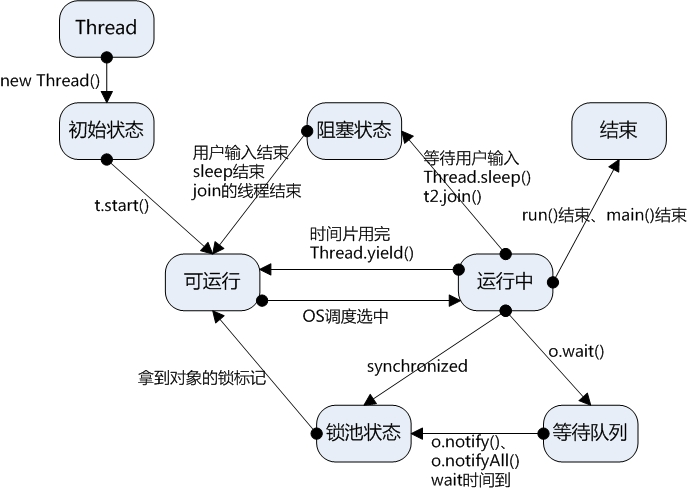
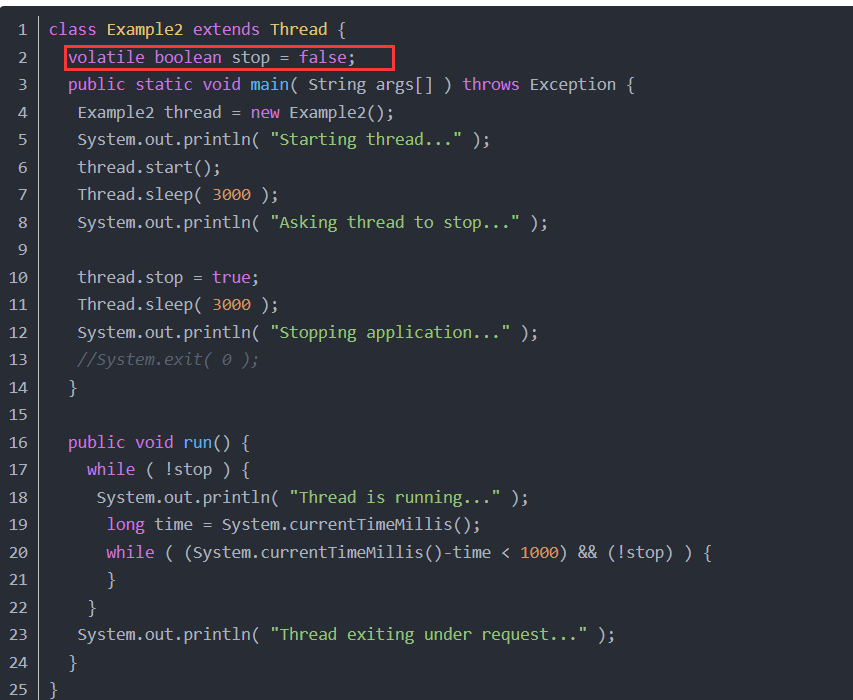
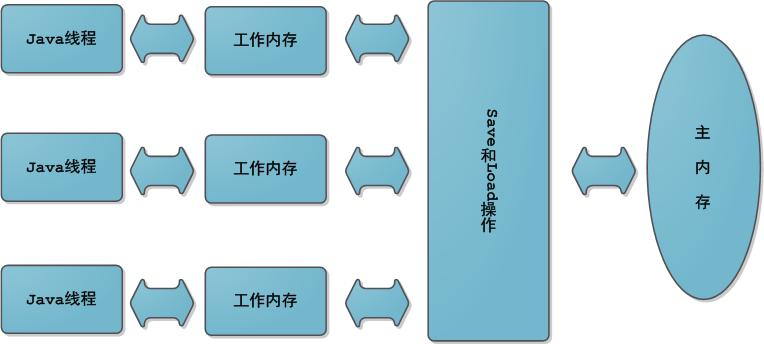

从进程到线程
----------------

**进程**：每个进程都有独立的代码和数据空间（进程上下文），进程间的切换会有较大的开销，一个进程包含1--n个线程。**（进程是资源分配的最小单位）**

**线程**：同一类线程共享代码和数据空间，每个线程有独立的运行栈和程序计数器(PC)，线程切换开销小。**（线程是cpu调度的最小单位）**

在Java中有4种方式可以用来创建线程：

>   1.继承Thread类，重写run方法

>   2.实现Runnable接口，重写run方法

>   3.应用程序可以使用Executor框架来创建线程池

>   4.实现Callable接口

实现Runnable接口比继承Thread类所具有的优势：

>   1.适合多个相同的程序代码的线程去处理同一个资源

>   2.可以避免java中的单继承的限制

>   3.增加程序的健壮性，代码可以被多个线程共享，代码和数据独立

>   4.线程池只能放入实现Runable或callable类线程，不能直接放入继承Thread的类

>   5.runnable实现线程可以对线程进行复用，因为runnable是轻量级的对象，重复new不会耗费太大资源，而Thread则不然，它是重量级对象，而且线程执行完就完了，无法再次利用。

线程的状态
--------------

**新建状态（New）**：新创建了一个线程对象。

**就绪状态（Runnable）**：线程对象创建后，其他线程调用了该对象的start()方法。该状态的线程位于可运行线程池中，变得可运行，等待获取CPU的使用权。

**运行状态（Running）**：就绪状态的线程获取了CPU，执行程序代码。

**阻塞状态（Blocked）**：阻塞状态是线程因为某种原因放弃CPU使用权，暂时停止运行。直到线程进入就绪状态，才有机会转到运行状态。阻塞的情况分三种：

1.**等待阻塞**：运行的线程执行wait()方法，JVM会把该线程放入等待池中。(wait会释放持有的锁)

2.**同步阻塞**：运行的线程在获取对象的同步锁时，若该同步锁被别的线程占用，则JVM会把该线程放入锁池中。

**3.其他阻塞**：运行的线程执行sleep()或join()方法，或者发出了I/O请求时，JVM会把该线程置为阻塞状态。当sleep()状态超时、join()等待线程终止或者超时、或者I/O处理完毕时，线程重新转入就绪状态。（注意,sleep是不会释放持有的锁）。

**死亡状态（Dead）**：线程执行完了或者因异常退出了run()方法，该线程结束生命周期。

 线程调度
------------

###  sleep与wait区别

**sleep方**法属于Thread类中的静态方法，表示让一个线程进入睡眠状态，等待一定的时间之后，自动醒来进入到可运行状态，但是不会马上进入运行状态，因为线程调度机制恢复线程的运行也需要时间，一个线程对象调用了sleep方法之后，并不会释放他所持有的所有对象锁，所以也就不会影响其他进程对象的运行。**但在sleep的过程中过程中有可能被其他对象调用它的interrupt(),产生InterruptedException异常**，所以**sleep必须捕获异常。**

**注意**sleep是静态方法，也就是说它只对当前对象有效。通过 对象名.sleep()
想让该对象线程进入休眠是无效的，它只会让当前线程进入休眠。

**wait方法**是Object类里的方法，当一个线程执行到wait()方法时，它就进入到一个和该对象相关的等待池中，同时释放了锁对象，等待期间可以调用里面的同步方法，其他线程可以访问，等待时不拥有CPU的执行权，否则其他线程无法获取执行权。当一个线程执行了wait方法后，必须调用notify或者notifyAll方法才能唤醒，而且是随机唤醒，若是被其他线程抢到了CPU执行权，该线程会继续进入等待状态。由于锁对象可以时任意对象，所以wait方法必须定义在Object类中，因为Obeject类是所有类的基类。

**区别比较：**

1．这两个方法来自不同的类分别是Thread和Object。

2．最主要的区别是sleep方法没有释放锁，而wait方法释放了锁，使得其他线程可以使用同步控制块或者方法。

3．wait，notify和notifyAll只能在**同步控制方法或者同步控制块里**面使用，而sleep可以在任何地方使用(使用范围)。

4．**wait()和sleep()都可以通过interrupt()方法 打断线程的暂停状态
，从而使线程立刻抛出InterruptedException。**

**为什么wait、notify和notifyAll方法要和synchronized关键字一起使用？**

因为wait和notify、notifyAll方法是由确定的对象即锁对象来调用的，这一过程是线程通信。wait方法是使一个线程进入等待状态，并且释放其所持有的锁对象，notify方法是通知等待该锁对象的线程重新获得锁对象，然而如果没有获得锁对象，wait方法和notify方法都是没有意义的，因此必须先获得锁对象再对锁对象进行进一步操作于是才要把wait方法和notify方法写到同步方法和同步代码块中了。

sleep方法是让某个线程暂停运行一段时间，其控制范围是由当前线程决定，运行的主动权是由当前线程来控制（拥有CPU的执行权）。本质上是对线程的运行状态控制。

###  yield/join

yield方法是停止当前线程，让出CPU占有权，让同等优先权的线程或更高优先级的线程有执行的机会。yield()只是使当前线程重新回到可执行状态，所以执行yield()的线程有可能在进入到可执行状态后马上又被执行。

join方法是用于在某一个线程的执行过程中调用另一个线程执行，等到被调用的线程执行结束后，再继续执行当前线程。如：在main方法中调用t.join()，此时只有当t线程运行结束，main方法才会继续执行。

### 守护线程与非守护线程

所谓守护线程是指在程序运行的时候在后台提供一种通用服务的线程，比如垃圾回收线程，并且这种线程并不属于程序中不可或缺的部分。因此，当所有的非守护线程结束时，程序也就终止了，同时会杀死进程中的所有守护线程。反过来说，只要任何非守护线程还在运行，程序就不会终止。

**在使用守护线程时需要注意一下几点：**

1.thread.setDaemon(true)必须在thread.start()之前设置，否则会跑出一个IllegalThreadStateException异常，即不能把正在运行的常规线程设置为守护线程。

2.在Daemon线程中产生的新线程也是Daemon的。

3.守护线程应该永远不去访问固有资源，如文件、数据库，因为它会在任何时候甚至在一个操作的中间发生中断。

### 中断线程

中断线程有很多方法：

>   1.使用退出标志，使线程正常退出，也就是当run方法完成后线程终止。

>   2.通过return退出run方法

>   3.通过对有些状态中断抛异常退出。

Thread.interrupt()并不能使得线程被中断，线程还是会执行。最靠谱的方法就是设置一个全局的标记位，然后再Thread中去检查这个标记位，发现标记位改变则中断线程。

### 从线程中抛出异常

首先明确线程代码的边界。其实很简单，Runnable接口的run方法所界定的边界就可以看作是线程代码的边界。Runnable接口中run方法原型如下：

**public void run();**

而所有的具体线程都实现这个方法，所以这里就明确了一点，**线程代码不能抛出任何checked异常**。所有的线程中的checked异常都只能被线程本身消化掉。

但是，线程代码中是可以抛出错误(Error)和运行级别异常(RuntimeException)的。Error通常Error应该留给JVM处理，而RuntimeException确是比较正常的，如果在运行过程中满足了某种条件导致线程必须中断，可以选择使用抛出运行级别异常来处理，当线程代码抛出运行级别异常之后，线程会中断。但是对开启子线程的主线程来说，并不受影响。正常情况下，如果不做特殊的处理，在主线程中是不能够捕获到子线程中的异常的。

**但是，给某个thread设置一个UncaughtExceptionHandler，**可以确保在该线程出现异常时能通过**回调UncaughtExceptionHandler接口的uncaughtException(…)
方法**来处理异常，这样的好处或者说目的是可以在线程代码边界之外（Thread的run()方法之外），有一个地方能处理未捕获异常。但是要特别明确的是：**虽然是在回调方法中处理异常，但**

**这个回调方法在执行时依然还在抛出异常的这个线程中**！另外还要特别说明一点：如果线程是通过线程池创建，线程异常发生时UncaughtExceptionHandler接口不一定会立即回调。

线程的活跃性问题
--------------------

### 多线程中的死锁

**所谓死锁是指多个线程因竞争资源而造成的一种僵局（互相等待，两个线程都处于阻塞状态，在等待获取锁），若无外力作用，这些进程都将无法向前推进。**

避**免死锁的三种方式：**

> 1. **加锁顺序**：所有的线程按照一定的顺序加锁。

> 2. **加锁时限**：在尝试获取锁的时候加一个超时时间，这也就意味着在尝试获取锁的过程中若超过了这个时限该线程则放弃对该锁请求。若一个线程没有在给定的时限内成功获得所有需要的锁，则会进行回退并释放所有已经获得的锁，然后**等待一段随机的时间再重试。**这段随机的等待时间让其它线程有机会尝试获取相同的这些锁，并且让该应用在没有获得锁的时候可以继续运行。

> 3.**死锁检测：**死锁检测是一个更好的死锁预防机制，它主要是针对那些不可能实现按序加锁并且锁超时也不可行的场景。每当一个线程获得了锁，会在线程和锁相关的数据结构中将其记下。除此之外，每当有线程请求锁，也需要记录在这个数据结构中。当一个线程请求锁失败时，这个线程可以遍历**锁的关系图看看是否有死锁发生**。那么当检测出死锁时，**一个可行的做法是释放所有锁，回退，并且等待一段随机的时间后重试**。这个和简单的加锁超时类似，不一样的是只有死锁已经发生了才回退，而不会是因为加锁的请求超时了。虽然有回退和等待，但是如果有大量的线程竞争同一批锁，它们还是会重复地死锁。 **一个更好的方案是给这些线程设置优先级**，让一个（或几个）线程回退，剩下的线程就像没发生死锁一样继续保持着它们需要的锁。如果赋予这些线程的优先级是固定不变的，同一批线程总是会拥有更高的优先级。为避免这个问题，可以在死锁发生的时候设置随机的优先级。

### 多线程中的活锁

**活锁是指线程一直处于运行状态，但却是在做无用功，而这个线程本身要完成的任务却一直无法进展**。生活中的典型例子：
两个人在窄路相遇，同时向一个方向避让，然后又向另一个方向避让，如此反复。

**解决协同活锁的一种方案是调整重试机制**。

比如引入一些随机性。例如如果检测到冲突，那么就暂停随机的一定时间进行重试。这回大大减少碰撞的可能性。典型的例子是以太网的CSMA/CD检测机制。另外为了避免可能的死锁，适当加入一定的重试次数也是有效的解决办法。尽管这在业务上会引起一些复杂的逻辑处理。

### 多线程中的饥饿

当线程长时间得不到所需资源，使线程难以推进时，**就发生饥饿**。若是长时间的处于饥饿状态导致后续已没有完成该线程任务的必要时，就称这个进程饿死了。饿死的线程是等待可以被释放，但不会分配给自己的资源。

比如如果线程T1占用了资源R，线程T2又请求封锁R，于是T2等待。T3也请求资源R，当T1释放了R上的封锁后，系统首先批准了T3的请求，T2仍然等待。然后T4又请求封锁R，当T3释放了R上的封锁之后，系统又批准了T4的请求......，T2可能永远等待。

**一般情况下，想要解决饥饿问题，就会需要对线程竞争资源的竞争力（优先级）进行评估，竞争力强（优先级高）的线程优先分配资源，然后才是竞争力弱的。**

线程安全
------------

当多个线程访问某个类时，不管运行时环境采用何种调度方式或者这些线程将如何交替执行，并且在主调代码中不需要任何额外的同步或协同，这个类都能表现出正确的行为，那么这个类就是线程安全的。

###  三个基本概念

在并发编程中，通常会遇到以下三个问题：原子性问题，可见性问题，有序性问题。

**原子性**：一个操作或者多个操作
要么全部执行并且执行的过程不会被任何因素打断，要么就都不执行。

**可见性**：当多个线程访问同一个变量时，一个线程修改了这个变量的值，其他线程能够立即看得到修改的值。

**有序性**：程序执行的顺序按照代码的先后顺序（逻辑顺序，可能会出现指令优化重排）执行。

要想并发程序正确地执行，必须要保证原子性、可见性以及有序性。只要有一个没有被保证，就有可能会导致程序运行不正确。

###Java内存模型

Java内存模型（Java Memory
Model，JMM）的主要目标是定义程序中各个变量的访问规则，**即在虚拟机中将变量存储到内存和从内存中取出变量这样底层细节，同时**屏蔽各个硬件平台和操作系统的内存访问差异，以实现让Java程序在各种平台下都能达到一致的内存访问效果。此处的变量与Java编程时所说的变量不一样，指包括了实例字段、静态字段和构成数组对象的元素，但是不包括局部变量与方法参数，后者是线程私有的，不会被共享。

Java内存模型中规定了所有的变量都存储在主内存中，每条线程还有自己的工作内存，线程的工作内存中保存了该线程使用到的变量到主内存副本拷贝，线程对变量的所有操作（读取、赋值）都必须在工作内存中进行，而不能直接读写主内存中的变量。不同线程之间无法直接访问对方工作内存中的变量，线程间变量值的传递均需要在主内存来完成，线程、主内存和工作内存的交互关系如下图所示：

为了获得较好的执行性能，Java内存模型并没有限制执行引擎使用处理器的寄存器或者高速缓存来提升指令执行速度，也没有限制编译器对指令进行重排序。也就是说，在java内存模型中，也会存在缓存一致性问题和指令重排序的问题。

在执行程序时为了提高性能，编译器和处理器经常会对指令进行重排序。

### Java对线程安全的保证

**原子性**

在Java中，对基本数据类型（除了long和double）的变量的**读取**和**赋值**操作是原子性操作，即这些操作是不可被中断的，要么执行，要么不执行。也就是说，只有简单的读取、赋值（而且必须是将数字赋值给某个变量，变量之间的相互赋值不是原子操作）才是原子操作。

如果要实现更大范围操作的原子性，可以通过synchronized和Lock来实现。由于synchronized和Lock能够保证任一时刻只有一个线程执行该代码块，那么自然就不存在原子性问题了，从而保证了原子性。

**可见性**

对于可见性，Java提供了volatile关键字来保证可见性。当一个共享变量被volatile修饰时，它会保证修改的值会立即被更新到主存，当有其他线程需要读取时，它会去内存中读取新值。

而普通的共享变量不能保证可见性，因为普通共享变量被修改之后，什么时候被写入主存是不确定的，当其他线程去读取时，此时内存中可能还是原来的旧值，因此无法保证可见性。

另外，通过synchronized和Lock也能够保证可见性，synchronized和Lock能保证同一时刻只有一个线程获取锁然后执行同步代码，并且在释放锁之前会将对变量的修改刷新到主存当中。因此可以保证可见性。

**有序性**

在Java内存模型中，允许编译器和处理器对指令进行重排序，但是重排序过程不会影响到单线程程序的执行，却会影响到多线程并发执行的正确性。在Java里面，可以通过volatile关键字来保证一定的“有序性”。另外可以通过synchronized和Lock来保证有序性，同样，synchronized和Lock保证每个时刻是有一个线程执行同步代码，相当于是让线程顺序执行同步代码，自然就保证了有序性。

另外，Java内存模型具备一些先天的“有序性”，即不需要通过任何手段就能够得到保证的有序性，这个通常也称为
**happens-before原则**:如果两个操作的执行次序无法从happens-before原则推导出来，那么它们就不能保证它们的有序性，虚拟机可以随意地对它们进行重排序。

下面就来具体介绍下happens-before原则（先行发生原则）：

**程序次序规则**：一个线程内，按照代码顺序，书写在前面的操作先行发生于书写在后面的操作。注意，虽然这条规则中提到“书写在前面的操作先行发生于书写在后面的操作”，这个应该是程序看起来执行的顺序是按照代码顺序执行的，**但是虚拟机可能会对程序代码进行指令重排序。虽然进行重排序，但是最终执行的结果是与程序顺序执行的结果一致的，它只会对不存在数据依赖性的指令进行重排序**。但是这个规则无法保证程序在多线程中执行的正确性。

**锁定规则**：一个unLock操作先行发生于后面对同一个锁额lock操作。也就是说无论在单线程中还是多线程中，同一个锁如果出于被锁定的状态，那么必须先对锁进行了释放操作，后面才能继续进行lock操作。

**volatile变量规则**：对一个变量的写操作先行发生于后面对这个变量的读操作。直观地解释就是，如果一个线程先去写一个变量，然后一个线程去进行读取，那么写入操作肯定会先行发生于读操作。

**传递规则**：如果操作A先行发生于操作B，而操作B又先行发生于操作C，则可以得出操作A先行发生于操作C。这个规则实际上就是体现happens-before原则具备传递性。

**线程启动规则**：Thread对象的start()方法先行发生于此线程的每个一个动作。

**线程中断规则**：对线程interrupt()方法的调用先行发生于被中断线程的代码检测到中断事件的发生。

**线程终结规则**：线程中所有的操作都先行发生于线程的终止检测，我们可以通过Thread.join()方法结束、Thread.isAlive()的返回值手段检测到线程已经终止执行。

**对象终结规则**：一个对象的初始化完成先行发生于它的finalize()方法的开始。

### 线程同步的方法

在多线程中线程的执行顺序是依靠哪个线程先获得到CUP的执行权谁就先执行，虽然说可以通过线程的优先权进行设置，但也只是获取CUP执行权的概率高点，也不一定必须先执行。

**同步方法**

即有synchronized关键字修饰的方法。由于Java的每个对象都有一个内置锁，当用此关键字修饰方法时，内置锁会保护整个方法。在调用该方法前，需要获得内置锁，否则就处于阻塞状态。

注：synchronized关键字也可以修饰静态方法，此时如果调用该静态方法，将会锁住整个类。这个方法可以是静态方法和非静态方法，但是不能是抽象类的抽象方法，也不能是接口中的接口方法。

线程在执行同步方法时是具有排它性的。当任意一个线程进入到一个对象的任意一个同步方法时，这个对象的所有同步方法都被锁定了，在此期间，其他任何线程都不能访问这个对象的任意一个同步方法，直到这个线程执行完它所调用的同步方法并从中退出，从而导致它释放了该对象的同步锁之后。在一个对象被某个线程锁定之后，其他线程是可以访问这个

对象的所有非同步方法的。

**同步代码块**

即有synchronized关键字修饰的语句块。被该关键字修饰的语句块会自动被加上内置锁，从而实现同步。

同步块是通过锁定一个指定的对象，来对同步块中包含的代码进行同步；而同步方法是对这个方法块里的代码进行同步，而这种情况下锁定的对象就是同步方法所属的主体对象自身。如果这个方法是静态同步方法呢？那么线程锁定的就不是这个类的对象了，也不是这个类自身，而是这个类对应的java.lang.Class类型的对象。同步方法和同步块之间的相互制约只限于同一个对象之间，所以静态同步方法只受它所属类的其它静态同步方法的制约，而跟这个类的实例（对象）没有关系。

如果一个对象既有同步方法，又有同步块，那么当其中任意一个同步方法或者同步块被某个线程执行时，这个对象就被锁定了，其他线程无法在此时访问这个对象的同步方法，也不能执行同步块。

synchronized的目的是使同一个对象的多个线程，在某个时刻只有其中的一个线程可以访问这个对象的synchronized
数据。每个对象都有一个“锁标志”，当这个对象的一个线程访问这个对象的某个synchronized
数据时，这个对象的所有被synchronized
修饰的数据将被上锁（因为“锁标志”被当前线程拿走了），只有当前线程访问完它要访问的synchronized
数据时，当前线程才会释放“锁标志”，这样同一个对象的其它线程才有机会访问synchronized
数据。

**wait与notify**

wait方法使一个线程处于等待状态，并且释放所持有的对象的lock。

sleep方法使一个正在运行的线程处于睡眠状态，是一个静态方法，调用此方法要捕捉InterruptedException异常。

notify():唤醒一个处于等待状态的线程，注意的是在调用此方法的时候，并不能确切的唤醒某一个等待状态的线程，而是由JVM确定唤醒哪个线程，而且不是按优先级。

allnotity():唤醒所有处入等待状态的线程，注意并不是给所有唤醒线程一个对象的锁，而是让它们竞争。

类似的还有**Condition的awiat和signal。**

**使用特殊域变量(volatile)实现线程同步**

volatile关键字为域变量的访问提供了一种免锁机制，使用volatile修饰域相当于告诉虚拟机该域可能会被其他线程更新，因此每次使用该域就要重新计算，而不是使用寄存器中的值。volatile不会提供任何原子操作，它也不能用来修饰final类型的变量

注：多线程中的非同步问题主要出现在对域的读写上，如果让域自身避免这个问题，则就不需要修改操作该域的方法。用final域，有锁保护的域和volatile域可以避免非同步的问题。

**使用重入锁实现线程同步**

在JavaSE5.0中新增了一个java.util.concurrent包来支持同步。

ReentrantLock类是可重入、互斥、实现了Lock接口的锁，它与使用synchronized方法和快具有相同的基本行为和语义，并且扩展了其能力。

**使用局部变量实现线程同步**

当使用ThreadLocal维护变量时，ThreadLocal为每个使用该变量的线程提供独立的变量副本，所以每一个线程都可以独立地改变自己的副本，而不会影响其它线程所对应的副本。

注：ThreadLocal与同步机制

>   a.ThreadLocal与同步机制都是为了解决多线程中相同变量的访问冲突问题。

>   b.前者采用以"空间换时间"的方法，后者采用以"时间换空间"的方式

**使用阻塞队列实现线程同步**

**ArrayBlockingQueue**：基于数组实现的一个阻塞队列，在创建ArrayBlockingQueue对象时必须制定容量大小。并且可以指定公平性与非公平性，默认情况下为非公平的，即不保证等待时间最长的队列最优先能够访问队列。

**LinkedBlockingQueue**：基于链表实现的一个阻塞队列，在创建LinkedBlockingQueue对象时如果不指定容量大小，则默认大小为Integer.MAX_VALUE。

**PriorityBlockingQueue**：以上2种队列都是先进先出队列，而PriorityBlockingQueue却不是，它会按照元素的优先级对元素进行排序，按照优先级顺序出队，每次出队的元素都是优先级最高的元素。注意，此阻塞队列为无界阻塞队列，即容量没有上限（通过源码就可以知道，它没有容器满的信号标志），前面2种都是有界队列。

**DelayQueue**：基于PriorityQueue，一种延时阻塞队列，DelayQueue中的元素只有当其指定的延迟时间到了，才能够从队列中获取到该元素。DelayQueue也是一个无界队列，因此往队列中插入数据的操作（生产者）永远不会被阻塞，而只有获取数据的操作（消费者）才会被阻塞。

使用上述介绍的队列可以实现一个类似于生产者-消费者模型。

**使用原子变量实现线程同步**

需要使用线程同步的根本原因在于对普通变量的操作不是原子的。

原子操作是指将**读取变量值、修改变量值、保存变量值看成一个整体来操作**，即这几种行为要么同时完成，要么都不完成。在java.util.concurrent.atomic包中提供了创建了原子类型变量的工具类，使用该类可以简化线程同步。比如AtomicInteger表可以用原子方式更新int的值，可用在应用程序中(如以原子方式增加的计数器)。

此外也可以通过通过同步辅助类CountDownLatch、CyclicBarrier和Semaphore等实现线程的同步。

线程间通信
----------

**等待通知机制**

等待通知模式是 Java 中比较经典的线程通信方式。两个线程通过对同一对象调用等待
wait() 和通知 notify() 方法来进行通讯。有一些需要注意:

wait()、notify()、notifyAll() 调用的前提都是获得了对象的锁(也可称为对象监视器)。

调用 wait() 方法后线程会释放锁，进入 WAITING
状态，该线程也会被移动到等待队列中。

调用notify()方法会将等待队列中的线程移动到同步队列中，线程状态也会更新为 BLOCKED

从wait()方法返回的前提是调用 notify() 方法的线程释放锁，wait()
方法的线程获得锁。

等待通知有着一个经典范式：

**线程 A 作为消费者：**

>   获取对象的锁。

>   进入while(判断条件)，并调用 wait() 方法。

>   当条件满足跳出循环执行具体处理逻辑。

**线程 B 作为生产者:**

>   获取对象锁。

>   更改与线程 A 共用的判断条件。

>   调用 notify() 方法。

**volatile 共享内存**

因为Java是采用共享内存的方式进行线程通信的，采用volatile修饰的变量可以保证线程间的可见性。

**CountDownLatch**

CountDownLatch 可以实现 join 相同的功能，但是更加的灵活。

**CyclicBarrier**

中文名叫做屏障或者是栅栏，也可以用于线程间通信。它可以等待 N
个线程都达到某个状态后继续运行的效果。

该工具可以实现 CountDownLatch 同样的功能，但是要更加灵活。甚至可以调用 reset()
方法重置 CyclicBarrier (需要自行捕获 BrokenBarrierException 处理) 然后重新执行。

**线程响应中断**

可以采用中断线程的方式来通信，调用了 thread.interrupt() 方法其实就是将 Thread
中的一个标志属性置为了true。并不是说调用了该方法就可以中断线程，如果不对这个标志进行响应其实是没有什么作用。

**对于正在运行的非阻塞线程来说,
只是改变了中断状态,不会对它的运行状态产生影响。**

对于可取消的阻塞状态（调用了 Thread.sleep(), Object.wait(),
Thread.join()方法）中的线程来说，这个线程收到中断信号后,
会抛出InterruptedException, 同时会把中断状态置回为false。

在Core
Java中有这样一句话：”没有任何语言方面的需求要求一个被中断的程序应该终止。中断一个线程只是为了引起该线程的注意，被中断线程可以决定如何应对中断
“。interrupt中断的是线程的某一部分业务逻辑，**前提是线程需要检查自己的中断状态(isInterrupted())**。但是当线程被阻塞的时候，调用它的interrput()方法。

