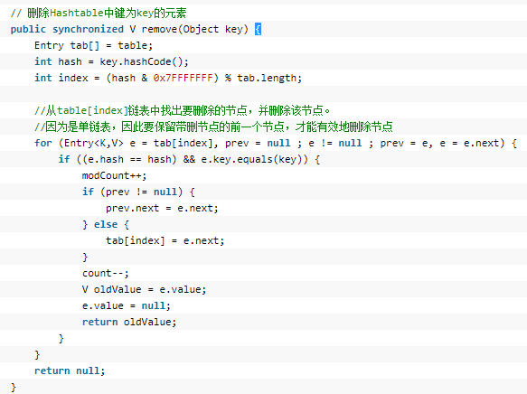
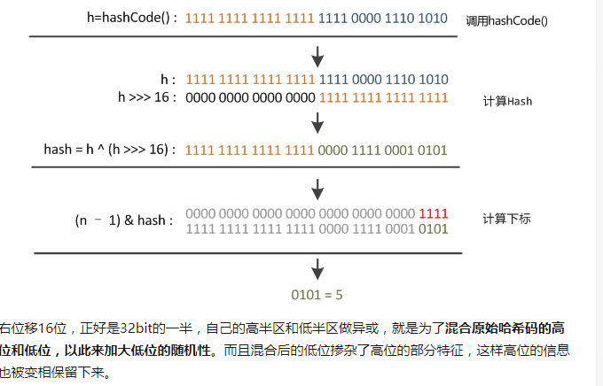

二．Java的集合类
================

2.1 Hashtable
-------------

public class Hashtable\<K,V\> extends Dictionary\<K,V\>

implements Map\<K,V\>, Cloneable, java.io.Serializable

### 2.1.1 参数

// table是一个Entry[]数组类型，而Entry实际上就是一个单向链表

// 哈希表的"key-value键值对"都是存储在Entry数组中的

private transient Entry**\<?,?\>[]** table**;**

// count是Hashtable的中保存的键值对的数量

private transient int count**;**

// threshold是Hashtable的阈值，用于判断是否需要调整Hashtable的容量

// threshold的值=count \* loadFactor

private int threshold**;**

// 加载因子

private float loadFactor**;**

// Hashtable被改变的次数，用于fail-fast机制的实现

private transient int modCount **=** 0**;**

### 2.1.2 get方法

public **synchronized** V get**(**Object key**) {**

Entry**\<?,?\>** tab**[] =** table**;**

int hash **=** key**.**hashCode**();**

int index **= (**hash **&** 0x7FFFFFFF**) %** tab**.**length**;**

**for (**Entry**\<?,?\>** e **=** tab**[**index**] ;** e **!= null ;** e **=**
e**.**next**) {**

**if ((**e**.**hash **==** hash**) &&** e**.**key**.**equals**(**key**)) {**

**return (**V**)**e**.**value**;**

**}**

**}**

**return null;**

**}**

从上述代码可以看出，首先是计算key的hash值，然后计算出所在的桶，接着遍历，如果找到，返回对应的值，否则返回null。

### 2.1.3 put方法

public synchronized V put**(**K key**,** V value**) {**

// value 不能为空

**if (**value **== null) {**

**throw new** NullPointerException**();**

**}**

// 如果key已经存在，则用新值替换旧值

Entry**\<?,?\>** tab**[] =** table**;**

int hash **=** key**.**hashCode**();**

int index **= (**hash **&** 0x7FFFFFFF**) %** tab**.**length**;**

\@SuppressWarnings**(**"unchecked"**)**

Entry**\<**K**,**V**\>** entry **=
(**Entry**\<**K**,**V**\>)**tab**[**index**];**

**for(;** entry **!= null ;** entry **=** entry**.**next**) {**

**if ((**entry**.**hash **==** hash**) &&** entry**.**key**.**equals**(**key**))
{**

V old **=** entry**.**value**;**

entry**.**value **=** value**;**

**return** old**;**

**}**

**}**

addEntry**(**hash**,** key**,** value**,** index**);**

**return null;**

**}**

接下来是addEntry方法，注意这个方法没用synchronized修饰，原因是put方法已经获取到了锁。

private void addEntry**(**int hash**,** K key**,** V value**,** int index**) {**

modCount**++;**

Entry**\<?,?\>** tab**[] =** table**;**

**if (**count **\>=** threshold**) {**

// rehash

rehash**();**

tab **=** table**;**

hash **=** key**.**hashCode**();**

index **= (**hash **&** 0x7FFFFFFF**) %** tab**.**length**;**

**}**

// Creates the new entry.

\@SuppressWarnings**(**"unchecked"**)**

Entry**\<**K**,**V**\>** e **= (**Entry**\<**K**,**V**\>)** tab**[**index**];**

//运用内部类的Entry的构造函数在头部插入

tab**[**index**] = new** Entry**\<\>(**hash**,** key**,** value**,** e**);**

count**++;**

**}**

从上面的代码中可以看出，Hashtable中的key和value是不允许为空的，当在Hashtable中添加元素的时候，首先计算key的hash值，然后通过hash值确定在table数组中的索引位置，最后将value值替换或者插入新的元素，如果容器的数量达到阈值，就会进行扩充。

### 2.1.4 remove方法

在下面代码中，如果prev为null了，那么说明第一个元素就是要删除的元素，那么就直接指向第一个元素的下一个即可。

### 2.1.5 扩容机制

>   默认初始容量为11，加载因子为0.75。元素个数 超过 容量长度的0.75倍
>   时，进行扩容。

protected void rehash**() {**

int oldCapacity **=** table**.**length**;**

Entry**\<?,?\>[]** oldMap **=** table**;**

// 扩容增量：2\*原数组长度+1

int newCapacity **= (**oldCapacity **\<\<** 1**) +** 1**;**

**if (**newCapacity **-** MAX_ARRAY_SIZE **\>** 0**) {**

**if (**oldCapacity **==** MAX_ARRAY_SIZE**)**

// Keep running with MAX_ARRAY_SIZE buckets

**return;**

newCapacity **=** MAX_ARRAY_SIZE**;**

**}**

Entry**\<?,?\>[]** newMap **= new** Entry**\<?,?\>[**newCapacity**];**

modCount**++;**

threshold **= (**int**)**Math**.**min**(**newCapacity **\*** loadFactor**,**
MAX_ARRAY_SIZE **+** 1**);**

table **=** newMap**;**

**for (**int i **=** oldCapacity **;** i**-- \>** 0 **;) {**

**for (**Entry**\<**K**,**V**\>** old **=
(**Entry**\<**K**,**V**\>)**oldMap**[**i**] ;** old **!= null ; ) {**

Entry**\<**K**,**V**\>** e **=** old**;**

old **=** old**.**next**;**

//头部插入

int index **= (**e**.**hash **&** 0x7FFFFFFF**) %** newCapacity**;**

e**.**next **= (**Entry**\<**K**,**V**\>)**newMap**[**index**];**

newMap**[**index**] =** e**;**

**}**

**}**

**}**

2.2 HashMap
-----------

### 2.2.1 JDK1.7下的HashMap

JDK1.7下HashMap的底层实现是通过数组和链表实现的，基本操作和HashTable类似，但是HashMap不是线程安全的。HashMap的初始容量为16，且保证每次每次扩容以后HashMap的数组长度一定是2的次幂。

public V put**(**K key**,** V value**) {**

//如果table数组为空数组{}，进行数组填充（为table分配实际内存空间），入参为threshold，此时threshold为initialCapacity
默认是1\<\<4(24=16)

**if (**table **==** EMPTY_TABLE**) {**

inflateTable**(**threshold**);**

**}**

//如果key为null，存储位置为table[0]或table[0]的冲突链上

**if (**key **== null)**

**return** putForNullKey**(**value**);**

int hash **=** hash**(**key**);**//对key的hashcode进重新计算，确保散列均匀

int i **=** indexFor**(**hash**,**
table**.**length**);**//获取在table中的实际位置

**for (**Entry**\<**K**,**V**\>** e **=** table**[**i**];** e **!= null;** e
**=** e**.**next**) {**

//如果该对应数据已存在，执行覆盖操作。用新value替换旧value，并返回旧value

Object k**;**

**if (**e**.**hash **==** hash **&& ((**k **=** e**.**key**) ==** key **\|\|**
key**.**equals**(**k**))) {**

V oldValue **=** e**.**value**;**

e**.**value **=** value**;**

e**.**recordAccess**(this);**

**return** oldValue**;**

**}**

**}**

modCount**++;**//保证并发访问时，若HashMap内部结构发生变化，快速响应失败

addEntry**(**hash**,** key**,** value**,** i**);**//新增一个entry

**return null;**

**}**

### 2.2.2 JDK1.8下的HashMap

JDK1.8下HashMap的底层实现是通过**数组和链表以及红黑树**实现的。当 hash
碰撞之后写入链表的长度超过了阈值(默认为8)，链表将会转换为红黑树。这样做的原因是假设
hash 冲突非常严重，一个数组后面接了很长的链表，此时查询的时间复杂度就 是 O(n)
。但如果是红黑树，时间复杂度就是 O(logn) 。

**一些默认的参数：**

// 默认的最大容量

static final int MAXIMUM_CAPACITY **=** 1 **\<\<** 30**;**

// 默认的加载因子

static final float DEFAULT_LOAD_FACTOR **=** 0.75f**;**

// 添加一个元素时默认的从链表转换为红黑树的大小

static final int TREEIFY_THRESHOLD **=** 8**;**

// resize时默认的从链表转换为红黑树的大小

static final int UNTREEIFY_THRESHOLD **=** 6**;**

// 可以树化的最小表的容量

static final int MIN_TREEIFY_CAPACITY **=** 64**;**

**get过程：**

public V get**(**Object key**) {**

Node**\<**K**,**V**\>** e**;**

return **(**e **=** getNode**(**hash**(**key**),** key**)) == null ? null :**
e**.**value**;**

**}**

final Node**\<**K**,**V**\>** getNode**(**int hash**,** Object key**) {**

Node**\<**K**,**V**\>[]** tab**;** Node**\<**K**,**V**\>** first**,** e**;** int
n**;** K k**;**

**if ((**tab **=** table**) != null && (**n **=** tab**.**length**) \>** 0
**&&**

**(**first **=** tab**[(**n **-** 1**) &** hash**]) != null) {**

// 判断第一个节点是不是就是需要的

**if (**first**.**hash **==** hash **&&** // always check first node

**((**k **=** first**.**key**) ==** key **\|\| (**key **!= null &&**
key**.**equals**(**k**))))**

**return** first**;**

**if ((**e **=** first**.**next**) != null) {**

// 判断是否是红黑树

**if (**first **instanceof** TreeNode**)**

**return ((**TreeNode**\<**K**,**V**\>)**first**).**getTreeNode**(**hash**,**
key**);**

// 链表遍历

**do {**

**if (**e**.**hash **==** hash **&&**

**((**k **=** e**.**key**) ==** key **\|\| (**key **!= null &&**
key**.**equals**(**k**))))**

**return** e**;**

**} while ((**e **=** e**.**next**) != null);**

**}**

**}**

**return null;**

**}**

**put过程**

public V put**(**K key**,** V value**) {**

**return** putVal**(**hash**(**key**),** key**,** value**, false, true);**

**}**

// 第三个参数 onlyIfAbsent 如果是 true，那么只有在不存在该 key 时才会进行 put
操作

final V putVal**(**int hash**,** K key**,** V value**,** boolean
onlyIfAbsent**,**

boolean evict**) {**

Node**\<**K**,**V**\>[]** tab**;** Node**\<**K**,**V**\>** p**;** int n**,**
i**;**

// 第一次 put 值的时候，会触发下面的 resize()，初始化数组长度

**if ((**tab **=** table**) == null \|\| (**n **=** tab**.**length**) ==**
0**)**

n **= (**tab **=** resize**()).**length**;**

// 找到具体的数组下标，如果此位置没有值，那么直接初始化一下 Node
并放置在这个位置

**if ((**p **=** tab**[**i **= (**n **-** 1**) &** hash**]) == null)**

tab**[**i**] =** newNode**(**hash**,** key**,** value**, null);**

**else {**// 数组该位置有数据

Node**\<**K**,**V**\>** e**;** K k**;**

// 判断该位置的第一个数据和要插入的数据，如果是，取出这个节点

**if (**p**.**hash **==** hash **&&**

**((**k **=** p**.**key**) ==** key **\|\| (**key **!= null &&**
key**.**equals**(**k**))))**

e **=** p**;**

// 如果该节点是代表红黑树的节点，调用红黑树的插值方法

**else if (**p **instanceof** TreeNode**)**

e **= ((**TreeNode**\<**K**,**V**\>)**p**).**putTreeVal**(this,** tab**,**
hash**,** key**,** value**);**

**else {**

// 到这里，说明数组该位置上是一个链表

**for (**int binCount **=** 0**; ; ++**binCount**) {**

// 插入到链表的最后面

**if ((**e **=** p**.**next**) == null) {**

p**.**next **=** newNode**(**hash**,** key**,** value**, null);**

// TREEIFY_THRESHOLD 为 8，所以，如果新插入的值是链表中的第 9 个

// 会触发下面的 treeifyBin，也就是将链表转换为红黑树

**if (**binCount **\>=** TREEIFY_THRESHOLD **-** 1**)** // -1 for 1st

treeifyBin**(**tab**,** hash**);**

**break;**

**}**

// 如果在该链表中找到了"相等"的 key(== 或 equals)

**if (**e**.**hash **==** hash **&&**

**((**k **=** e**.**key**) ==** key **\|\| (**key **!= null &&**
key**.**equals**(**k**))))**

// 此时 break，那么 e 为链表中[与要插入的新值的 key "相等"]的 node

**break;**

p **=** e**;**

**}**

**}**

// e!=null 说明存在旧值的key与要插入的key"相等"

// 下面这个 if 其实就是进行 "值覆盖"，然后返回旧值

**if (**e **!= null) {**

V oldValue **=** e**.**value**;**

**if (!**onlyIfAbsent **\|\|** oldValue **== null)**

e**.**value **=** value**;**

afterNodeAccess**(**e**);**

**return** oldValue**;**

**}**

**}**

**++**modCount**;**

// 如果 HashMap 由于新插入这个值导致 size 已经超过了阈值，需要进行扩容

**if (++**size **\>** threshold**)**

resize**();**

afterNodeInsertion**(**evict**);**

**return null;**

**}**

**JDK1.8中是在链表的尾部插入元素，且可能会将链表转换为红黑树。**

**扩容过程：**

final Node**\<**K**,**V**\>[]** resize**() {**

Node**\<**K**,**V**\>[]** oldTab **=** table**;**

int oldCap **= (**oldTab **== null) ?** 0 **:** oldTab**.**length**;**

int oldThr **=** threshold**;**

int newCap**,** newThr **=** 0**;**

**if (**oldCap **\>** 0**) {** // 对应数组扩容

**if (**oldCap **\>=** MAXIMUM_CAPACITY**) {**

threshold **=** Integer**.**MAX_VALUE**;**

**return** oldTab**;**

**}**

// 将数组大小扩大一倍

**else if ((**newCap **=** oldCap **\<\<** 1**) \<** MAXIMUM_CAPACITY **&&**

oldCap **\>=** DEFAULT_INITIAL_CAPACITY**)**

// 将阈值扩大一倍

newThr **=** oldThr **\<\<** 1**;** // double threshold

**}**

**else if (**oldThr **\>** 0**)** // 对应使用 new HashMap(int initialCapacity)
初始化后，第一次 put 的时候

newCap **=** oldThr**;**

**else {**// 对应使用 new HashMap() 初始化后，第一次 put 的时候

newCap **=** DEFAULT_INITIAL_CAPACITY**;**

newThr **= (**int**)(**DEFAULT_LOAD_FACTOR **\*** DEFAULT_INITIAL_CAPACITY**);**

**}**

**if (**newThr **==** 0**) {**

float ft **= (**float**)**newCap **\*** loadFactor**;**

newThr **= (**newCap **\<** MAXIMUM_CAPACITY **&&** ft **\<
(**float**)**MAXIMUM_CAPACITY **?**

**(**int**)**ft **:** Integer**.**MAX_VALUE**);**

**}**

threshold **=** newThr**;**

// 用新的数组大小初始化新的数组

Node**\<**K**,**V**\>[]** newTab **= (**Node**\<**K**,**V**\>[])new**
Node**[**newCap**];**

table **=** newTab**;** // 如果是初始化数组，到这里就结束了，返回 newTab 即可

**if (**oldTab **!= null) {**

// 开始遍历原数组，进行数据迁移。

**for (**int j **=** 0**;** j **\<** oldCap**; ++**j**) {**

Node**\<**K**,**V**\>** e**;**

**if ((**e **=** oldTab**[**j**]) != null) {**

oldTab**[**j**] = null;**

// 如果该数组位置上只有单个元素，那就简单了，简单迁移这个元素就可以了

**if (**e**.**next **== null)**

newTab**[**e**.**hash **& (**newCap **-** 1**)] =** e**;**

// 如果是红黑树，具体我们就不展开了

**else if (**e **instanceof** TreeNode**)**

**((**TreeNode**\<**K**,**V**\>)**e**).**split**(this,** newTab**,** j**,**
oldCap**);**

**else {**

// 这块是处理链表的情况，

// 需要将此链表拆成两个链表，放到新的数组中，并且保留原来的先后顺序

// loHead、loTail 对应一条链表，hiHead、hiTail
对应另一条链表，代码还是比较简单的

Node**\<**K**,**V**\>** loHead **= null,** loTail **= null;**

Node**\<**K**,**V**\>** hiHead **= null,** hiTail **= null;**

Node**\<**K**,**V**\>** next**;**

**do {**

next **=** e**.**next**;**

**if ((**e**.**hash **&** oldCap**) ==** 0**) {**

**if (**loTail **== null)**

loHead **=** e**;**

**else**

loTail**.**next **=** e**;**

loTail **=** e**;**

**}**

**else {**

**if (**hiTail **== null)**

hiHead **=** e**;**

**else**

hiTail**.**next **=** e**;**

hiTail **=** e**;**

**}**

**} while ((**e **=** next**) != null);**

**if (**loTail **!= null) {**

loTail**.**next **= null;**

// 第一条链表

newTab**[**j**] =** loHead**;**

**}**

**if (**hiTail **!= null) {**

hiTail**.**next **= null;**

// 第二条链表的新的位置是 j + oldCap

newTab**[**j **+** oldCap**] =** hiHead**;**

**}**

**}**

**}**

**}**

**}**

**return** newTab**;**

**}**

扩充HashMap的时候，不需要像JDK1.7的实现那样重新计算hash，只需要看看原来的hash值新增的那个bit是1还是0就好了，是0的话索引没变，是1的话索引变成“原索引+oldCap”。

这个设计确实非常的巧妙，既省去了重新计算hash值的时间，而且同时，由于新增的1bit是0还是1可以认为是随机的，因此resize的过程，均匀的把之前的冲突的节点分散到新的bucket了。这一块就是JDK1.8新增的优化点。有一点注意区别，JDK1.7中rehash的时候，旧链表迁移新链表的时候，如果在新表的数组索引位置相同，则链表元素会倒置，JDK1.8不会倒置。

### 2.2.3 hash值的重新计算

**JDK1.7中重新计算hash值的函数：**相当于做了四次扰动。

>   static int hash**(**int h**) {**

>   h **\^= (**h **\>\>\>** 20**) \^ (**h **\>\>\>** 12**);**

>   **return** h **\^ (**h **\>\>\>** 7**) \^ (**h **\>\>\>** 4**);**

>   **}**

>   **JDK1.8中重新计算hash值的函数：**

>   static final int hash**(**Object key**) {**

>   int h**;**

>   **return (**key **== null) ?** 0 **: (**h **=** key**.**hashCode**()) \^
>   (**h **\>\>\>** 16**);**

>   **}**

上面代码里的key.hashCode()函数调用的是key键值类型自带的哈希函数，返回int型散列值。理论上散列值是一个int型，如果直接拿散列值作为下标访问HashMap主数组的话，考虑到2进制32位带符号的int表值范围从-2147483648到2147483648。前后加起来大概40亿的映射空间。只要哈希函数映射得比较均匀松散，一般应用是很难出现碰撞的。

但问题是一个40亿长度的数组，内存是放不下的，所以这个散列值是不能直接拿来用的。用之前还要先做对数组的长度取模运算，得到的余数才能用来访问数组下标。源码中模运算是在这个indexFor(
)函数里完成的。具体如下：

**bucketIndex = indexFor(hash, table.length);**

从这个函数中也可以看出为什么HashMap的数组长度要取2的整数幂。因为这样（数组长度-1）正好相当于一个“低位掩码”（15
0xF）。“与”操作的结果就是散列值的高位全部归零，只保留低位值，用来做数组下标访问。

但这时候问题就来了，这样就算散列值分布再松散，要是只取最后几位的话，碰撞也会很严重。更要命的是如果散列本身做得不好，分布上成等差数列的漏洞，恰好使最后几个低位呈现规律性重复。**这时候“扰动函数”的价值就体现出来了。**

JDK1.7中的实现对key的hashcode值做了四次扰动，但明显Java
8觉得扰动做一次就够了，做4次的话，多了可能边际效用也不大，所谓为了效率考虑就改成一次了。**总而言之，上述的hash()方法和indexFor()方法的作用只有一个：保证元素均匀分布到table的每个桶中以便充分利用空间。**

### 2.2.4 并发下的死循环问题

在多线程使用场景中，应该尽量避免使用线程不安全的HashMap，而使用线程安全的ConcurrentHashMap。在并发的多线程使用场景中使用HashMap可能造成死循环（JDK1.7）。

JDK1.7之所以会出现这个问题是因为扩容的原因：

void transfer**(**Entry**[]** newTable**) {**

Entry**[]** src **=** table**;**

int newCapacity **=** newTable**.**length**;**

**for (**int j **=** 0**;** j **\<** src**.**length**;** j**++) {**

Entry**\<**K**,**V**\>** e **=** src**[**j**];** //(1)

**if (**e **!= null) {**

src**[**j**] = null;**

**do {**

Entry**\<**K**,**V**\>** next **=** e**.**next**;** //(2)

int i **=** indexFor**(**e**.**hash**,** newCapacity**);**

e**.**next **=** newTable**[**i**];** //(3)

newTable**[**i**] =** e**;**

e **=** next**;**

**} while (**e **!= null);**

**}**

**}**

**}**

下面分析可能出现的情况，假设原来oldTable里存放a1,a2的hash值是一样的，那么entry链表顺序是：

**P1:oldTable[i]-\>a1-\>a2-\>null**

**P2:oldTable[i]-\>a1-\>a2-\>null**

线程P1运行到(1)这行时，e=a1(a1.next=a2),继续运行（2）时，next=a2。这个时候切换到线程P2，线程P2执行完这个链表的循环。**如果恰a1,a2在新的table中的hash值又是一样的，那么此时的链表顺序是：**

**主存:newTable[i]-\>a2-\>a1-\>null**

注意这个时候，a1,a2连接顺序已经反了。现在cpu重新切回P1，在（3）这行以后：e.next
= newTable[i];即：

**a1.next=newTable[i];**

**newTable[i]=a1;**

**e=a2;**

>   开始第二次while循环(e=a2,next=a1)：

**a2.next=newTable[i];//也就是a2.next=a1**

**newTable[i]=a2**

**e=a1**

开始第三次while循环（e=a1,next=null）

**a1.next=newTable[i];//也就是a1.next=a2**

**这个时候a1.next=a2,a2.next=a1,形成回环了，这样就造成了死循环，在get操作的时候next永远不为null，造成死循环。**可以看到很偶然的情况下会出现死循环，不过一旦出现后果是非常严重的，多线程的环境还是应该用ConcurrentHashMap。

在JDK1.8中修正了这个问题，原因在于是在末端添加两个元素，且只是用一个高位来区分，所以无非时依次在末端添加新的元素。但是又会出现数据丢失的问题：当多线程put的时候，当index相同而又同时达到链表的末尾时，另一个线程put的数据会把之前线程put的数据覆盖掉，就会产生数据丢失

### 2.2.5 HashSet

对于HashSet而言，它是基于HashMap实现的，HashSet底层使用HashMap来保存所有元素，因此HashSet
的实现比较简单，相关HashSet的操作，基本上都是直接调用底层HashMap的相关方法来完成，

[参见](https://zhangshixi.iteye.com/blog/673143)

2.3 TreeMap
-----------

### 2.3.1 TreeMap实现原理

TreeMap的底层是用红黑树来实现的，红黑树的最大高度为2 \* log
n。内部定义的节点的类如下：

static final class Entry**\<**K**,**V**\> implements**
Map**.**Entry**\<**K**,**V**\> {**

K key**;**

V value**;**

Entry**\<**K**,**V**\>** left**;**

Entry**\<**K**,**V**\>** right**;**

Entry**\<**K**,**V**\>** parent**;**

boolean color **=** BLACK**;**

/\*\*

\* Make a new cell with given key, value, and parent, and with

\* {\@code null} child links, and BLACK color.

\*/

Entry**(**K key**,** V value**,** Entry**\<**K**,**V**\>** parent**) {**

**this.**key **=** key**;**

**this.**value **=** value**;**

**this.**parent **=** parent**;**

**}**

**// 省略树的其他操作**

**}**

**put方法：**

// TreeMap put 方法

public V put**(**K key**,** V value**) {**

Entry**\<**K**,**V**\>** t **=** root**;**

**if (**t **== null) {**

compare**(**key**,** key**);** //检查key是否为null

root **= new** Entry**\<\>(**key**,** value**, null);**

size **=** 1**;**

modCount**++;**

**return null;**

**}**

int cmp**;**

Entry**\<**K**,**V**\>** parent**;**

//插值的方法就是普通的二叉搜索树

Comparator**\<? super** K**\>** cpr **=** comparator**;**

**if (**cpr **!= null) {** //传入的 comparator 排序

**do {**

parent **=** t**;**

cmp **=** cpr**.**compare**(**key**,** t**.**key**);**

**if (**cmp **\<** 0**)**

t **=** t**.**left**;**

**else if (**cmp **\>** 0**)**

t **=** t**.**right**;**

**else**

**return** t**.**setValue**(**value**);**

**} while (**t **!= null);**

**}**

**else {** // 自然排序 comparable

**if (**key **== null)**

**throw new** NullPointerException**();**

\@SuppressWarnings**(**"unchecked"**)**

Comparable**\<? super** K**\>** k **= (**Comparable**\<? super** K**\>)**
key**;**

**do {**

parent **=** t**;**

cmp **=** k**.**compareTo**(**t**.**key**);**

**if (**cmp **\<** 0**)**

t **=** t**.**left**;**

**else if (**cmp **\>** 0**)**

t **=** t**.**right**;**

**else**

**return** t**.**setValue**(**value**);**

**} while (**t **!= null);**

**}**

//插入的值在叶子节点

Entry**\<**K**,**V**\>** e **= new** Entry**\<\>(**key**,** value**,**
parent**);**

**if (**cmp **\<** 0**)**

parent**.**left **=** e**;**

**else**

parent**.**right **=** e**;**

fixAfterInsertion**(**e**);** //平衡红黑树

size**++;**

modCount**++;**

**return null;**

**}**

// comparator 为null 自然排序 否则就是按照传入的comparator实现类排序

final int compare**(**Object k1**,** Object k2**) {**

**return** comparator**==null ? ((**Comparable**\<? super**
K**\>)**k1**).**compareTo**((**K**)**k2**)**

**:** comparator**.**compare**((**K**)**k1**, (**K**)**k2**);**

**}**

**get方法：**

public V get**(**Object key**) {**

Entry**\<**K**,**V**\>** p **=** getEntry**(**key**);**

**return (**p**==null ? null :** p**.**value**);**

**}**

final Entry**\<**K**,**V**\>** getEntry**(**Object key**) {**

**if (**comparator **!= null)**

**return** getEntryUsingComparator**(**key**);**

**if (**key **== null)**

**throw new** NullPointerException**();**

\@SuppressWarnings**(**"unchecked"**)**

//根据自然排序查找

Comparable**\<? super** K**\>** k **= (**Comparable**\<? super** K**\>)**
key**;**

Entry**\<**K**,**V**\>** p **=** root**;**

**while (**p **!= null) {**

int cmp **=** k**.**compareTo**(**p**.**key**);**

**if (**cmp **\<** 0**)**

p **=** p**.**left**;**

**else if (**cmp **\>** 0**)**

p **=** p**.**right**;**

**else**

**return** p**;**

**}**

**return null;**

**}**

// 根据传入的排序方式查找

final Entry**\<**K**,**V**\>** getEntryUsingComparator**(**Object key**) {**

\@SuppressWarnings**(**"unchecked"**)**

K k **= (**K**)** key**;**

Comparator**\<? super** K**\>** cpr **=** comparator**;**

**if (**cpr **!= null) {**

Entry**\<**K**,**V**\>** p **=** root**;**

**while (**p **!= null) {**

int cmp **=** cpr**.**compare**(**k**,** p**.**key**);**

**if (**cmp **\<** 0**)**

p **=** p**.**left**;**

**else if (**cmp **\>** 0**)**

p **=** p**.**right**;**

**else**

**return** p**;**

**}**

**}**

**return null;**

**}**

### 2.3.2 TreeSet

对于TreeSet而言，它是基于HashMap实现的，TreeSet底层使用TreeMap来保存所有元素，因此TreeSet
的实现比较简单，相关TreeSet的操作，基本上都是直接调用底层TreeMap的相关方法来完成。

### 2.4.3 Map的四种遍历方式

第一种：通过Map的keySet()方法遍历。

第二种：通过Map的values()方法遍历。

第三种：通过Map的entrySet()方法的Iterator方法将转换成Iterator。通过迭代器遍历。

第四种：通过Map的entrySet()方法，将其转换成Map.Entry对象，在通过foreach遍历,通过Map.Entry对象的getValue()获取值。

2.4 LinkedHashMap
-----------------

### 2.4.1 LinkedHashMap的实现

LinkedHashMap 继承自 HashMap，在 HashMap 基础上，通过维护一条双向链表，解决了
HashMap 不能随时保持遍历顺序和插入顺序一致的问题。除此之外，LinkedHashMap
对访问顺序(LRU)也提供了相关支持。

LinkedHashMap的底层实现和HashMap完全一致，只是增加了两个头尾节点来维护一个双向链表:

通过查看源码可知，LinkedHashMap的get、put、resize、remove方法基本过程和HashMap基本一致。一些小细节是通过在LinkedHashMap重写来实现的。主要有以下几点：

插入一个新节点时：

// LinkedHashMap 中覆写

Node**\<**K**,**V**\>** newNode**(**int hash**,** K key**,** V value**,**
Node**\<**K**,**V**\>** e**) {**

LinkedHashMap**.**Entry**\<**K**,**V**\>** p **=**

**new** LinkedHashMap**.**Entry**\<**K**,**V**\>(**hash**,** key**,** value**,**
e**);**

// 将 Entry 接在双向链表的尾部

linkNodeLast**(**p**);**

**return** p**;**

**}**

// LinkedHashMap 中实现

private void linkNodeLast**(**LinkedHashMap**.**Entry**\<**K**,**V**\>** p**)
{**

LinkedHashMap**.**Entry**\<**K**,**V**\>** last **=** tail**;**

tail **=** p**;**

// last 为 null，表明链表还未建立

**if (**last **== null)**

head **=** p**;**

**else {**

// 将新节点 p 接在链表尾部

p**.**before **=** last**;**

last**.**after **=** p**;**

**}**

**}**

**在put一个已有的映射或者get时，如果设置了访问顺序，会调用下面的方法：**

void afterNodeAccess**(**Node**\<**K**,**V**\>** e**) {** //
把当前节点e放到双向链表尾部

LinkedHashMap**.**Entry**\<**K**,**V**\>** last**;**

//accessOrder就是我们前面说的LRU控制，当它为true，同时e对象不是尾节点（如果访问尾节点就不需要设置，该方法就是把节点放置到尾节点）

**if (**accessOrder **&& (**last **=** tail**) !=** e**) {**

//用a和b分别记录该节点前面和后面的节点

LinkedHashMap**.**Entry**\<**K**,**V**\>** p **=**

**(**LinkedHashMap**.**Entry**\<**K**,**V**\>)**e**,** b **=** p**.**before**,**
a **=** p**.**after**;**

//释放当前节点与后节点的关系

p**.**after **= null;**

//如果当前节点的前节点是空，

**if (**b **== null)**

//那么头节点就设置为a

head **=** a**;**

**else**

//如果b不为null，那么b的后节点指向a

b**.**after **=** a**;**

//如果a节点不为空

**if (**a **!= null)**

//a的后节点指向b

a**.**before **=** b**;**

**else**

//如果a为空，那么b就是尾节点

last **=** b**;**

//如果尾节点为空

**if (**last **== null)**

//那么p为头节点

head **=** p**;**

**else {**

//否则就把p放到双向链表最尾处

p**.**before **=** last**;**

last**.**after **=** p**;**

**}**

//设置尾节点为P

tail **=** p**;**

//LinkedHashMap对象操作次数+1

**++**modCount**;**

**}**

**}**

**在删除一个节点后，会将其在链表中移除：**

//在移除一个元素后，去除链表中的这个元素

void afterNodeRemoval**(**Node**\<**K**,**V**\>** e**) {**

LinkedHashMap**.**Entry**\<**K**,**V**\>** p **=**

**(**LinkedHashMap**.**Entry**\<**K**,**V**\>)**e**,** b **=** p**.**before**,**
a **=** p**.**after**;**

p**.**before **=** p**.**after **= null;**

**if (**b **== null)**

head **=** a**;**

**else**

b**.**after **=** a**;**

**if (**a **== null)**

tail **=** b**;**

**else**

a**.**before **=** b**;**

**}**

**get方法可以增加了访问控制**

public V get**(**Object key**) {**

Node**\<**K**,**V**\>** e**;**

**if ((**e **=** getNode**(**hash**(**key**),** key**)) == null)**

**return null;**

**if (**accessOrder**)**

afterNodeAccess**(**e**);**

**return** e**.**value**;**

**}**

### 2.4.2 基于 LinkedHashMap 实现缓存

链表的建立过程中还有一个方法：afterNodeInsertion，这个方法可以用来实现一个自定义的缓存策略，源码如下：

void afterNodeInsertion**(**boolean evict**) {** // possibly remove eldest

LinkedHashMap**.**Entry**\<**K**,**V**\>** first**;**

// 根据条件判断是否移除最近最少被访问的节点

**if (**evict **&& (**first **=** head**) != null &&**
removeEldestEntry**(**first**)) {**

K key **=** first**.**key**;**

removeNode**(**hash**(**key**),** key**, null, false, true);**

**}**

**}**

// 移除最近最少被访问条件之一，通过覆盖此方法可实现不同策略的缓存

protected boolean removeEldestEntry**(**Map**.**Entry**\<**K**,**V**\>**
eldest**) {**

**return false;**

**}**

在这里可以看到，**LinkedHashMap中并没有实现，因此，可以通过继承这个方法来实现一个LRU缓存。一般**可以根据节点数量判断是否移除最近最少被访问的节点，或者根据节点的存活时间判断是否移除该节点等。

下面所实现的缓存是基于判断节点数量是否超限的策略。在构造缓存对象时，传入最大节点数。当插入的节点数超过最大节点数时，移除最近最少被访问的节点。实现代码如下**：**

public class SimpleCache**\<**K**,** V**\> extends** LinkedHashMap**\<**K**,**
V**\> {**

private static final int MAX_NODE_NUM **=** 100**;**

private int limit**;**

public SimpleCache**() {**

**this(**MAX_NODE_NUM**);**

**}**

public SimpleCache**(**int limit**) {**

**super(**limit**,** 0.75f**, true);**

**this.**limit **=** limit**;**

**}**

public V save**(**K key**,** V val**) {**

**return** put**(**key**,** val**);**

**}**

public V getOne**(**K key**) {**

**return** get**(**key**);**

**}**

public boolean exists**(**K key**) {**

**return** containsKey**(**key**);**

**}**

/\*\*

\* 判断节点数是否超限

\* **\@param** eldest

\* **\@return** 超限返回 true，否则返回 false

\*/

\@Override

protected boolean removeEldestEntry**(**Map**.**Entry**\<**K**,** V**\>**
eldest**) {**

**return** size**() \>** limit**;**

**}**

**}**

HashMap + LinedList的一个实现：

class LRUCache **{**

private HashMap**\<**Integer**,** Integer**\>** map**;**

private final int CAP**;**

private LinkedList**\<**Integer**\>** cQueue**;**

public LRUCache**(**int capacity**) {**

map **= new** HashMap**\<\>();**

CAP **=** capacity**;**

cQueue **= new** LinkedList**\<\>();**

**}**

public int get**(**int key**) {**

**if(!**cQueue**.**removeLastOccurrence**(**key**))**

**return -**1**;**

cQueue**.**addLast**(**key**);**

**return** map**.**get**(**key**);**

**}**

public void put**(**int key**,** int value**) {**

**if(**map**.**containsKey**(**key**))**

cQueue**.**removeLastOccurrence**(**key**);**

**else if(**cQueue**.**size**() \>=** CAP**)**

map**.**remove**(**cQueue**.**poll**());**

cQueue**.**addLast**(**key**);**

map**.**put**(**key**,** value**);**

**}**

**}**

### 2.4.3 Linkedashmap与 Hashmap的比较

1.LinkedHashMap是HashMap的子类

2.LinkedHashMap中的Entry增加了两个指针 before 和
after，它们分别用于维护双向链接列表。

3.在put操作上，虽然LinkedHashMap完全继承了HashMap的put操作，但是在细节上还是做了一定的调整，比如，在LinkedHashMap中向哈希表中插入新Entry的同时，还会通过Entry的addBefore方法将其链入到双向链表中。

4.在扩容操作上，虽然LinkedHashMap完全继承了HashMap的resize操作，但是鉴于性能和LinkedHashMap自身特点的考量，LinkedHashMap对其中的重哈希过程**(**transfer方法**)**进行了重写

2.5 Arrays.sort和Collections.sort实现原理
-----------------------------------------

Arrays.sort和Collections.sort分别有两种排序方式：

自然排序：

**public static void sort(Object[] a) { … }**

**public static \<T extends Comparable\<? super T\>\> void sort(List\<T\> list)
{ … }**

自定义排序

**public static \<T\> void sort(T[] a, Comparator\<? super T\> c) { … }**

**public static \<T\> void sort(List\<T\> list, Comparator\<? super T\> c) { …
}**

**查看源码可以发现，**Collections.sort底层调用的是Arrays.sort。而Arrays.sort底层调用的是ComparableTimSort.sort(自然排序)和TimSort.sort(自定义排序)。这两种底层的实现并没有什么不同（Timsort算法
JDK1.7引入，之前就是归并排序），只是比较的准则发生了变化。

Timsort是结合了合并排序（merge sort）和插入排序（insertion
sort）而得出的具有自适应性的MergeSort算法，它基于一个简单的事实，实际中大部分数据都是部分有序（升序或降序）的。**与其他合并排序一样，Timesrot是稳定的排序算法，最坏时间复杂度是O（n
log
n）**。在最坏情况下，Timsort算法需要的临时空间是n/2，在最好情况下，它只需要一个很小的临时存储空间。

**基本工作过程是**：

1.扫描数组，确定其中的单调上升段和严格单调下降段，将严格下降段反转

2.定义最小基本片段长度，短于此的单调片段通过插入排序集中为长于此的段

3.反复归并一些相邻片段，过程中避免归并长度相差很大的片段，直至整个排序完成，所用分段选择策略可以保证O(n
log n)时间复杂性。

[参见](https://mp.weixin.qq.com/s?__biz=MzI2MTY0OTg2Nw==&mid=2247483816&idx=1&sn=079af3d70efcb68efa7400f09decb59c&chksm=ea56650cdd21ec1ace7c8fd168d62feb636e4b32f9a4d90329fe479489d8e7a70e612df8920b&token=2074049324&lang=zh_CN#rd)**：https://www.cnblogs.com/brucecloud/p/6086009.html**

2.6 List类
----------

### 2.6.1 ArrayList 

ArrayList是一个不安全的类，它的底层就是一个数组，当数组容量不够时，会触发扩容操作。ArrayList中定义了两个空数组：

// 空数组：但是初始化的数组容量不为0

private static final Object**[]** EMPTY_ELEMENTDATA **= {};**

// 空数组：但是初始化的数组容量不为0

private static final Object**[]** DEFAULTCAPACITY_EMPTY_ELEMENTDATA **= {};**

但是它们的作用不一样，从源码可知，当**EMPTY_ELEMENTDATA**第一次插入元素时就会触发扩容操作。

由于ArrayList的底层是数组，所以get操作的复杂度是O(1)的，在确认要取的位置有效后（rangeCheck），直接返回就行。add方法在将元素放在数组尾部前，会确认数组是否放的下，如果放不下就触发扩容操作。

ArrayList
就是动态数组，是Array的复杂版本，动态的增加和减少元素.当更多的元素加入到ArrayList中时,其大小将会动态地增长。它的元素可以通过get/set方法直接访问，因为ArrayList本质上是一个数组。初始容量为10。**1.插入元素的时候可能扩容，删除元素时不会缩小容量。2.扩容增长为Arraylist增长原来的0.5倍
3.线程不同步**

### 2.6.2 ArrayList循环删除元素

//方法1： 通过迭代器删除

Iterator**\<**Integer**\>** iterator **=** list**.**iterator**();**

**while (**iterator**.**hasNext**()){**

iterator**.**next**();**

iterator**.**remove**();**

**}**

//方法2：只删第一个

**for (**int i **=** 0**;** i **\<** list**.**size**(); ) {**

list**.**remove**(**0**);**

**}**

//方法3：倒着删

**for (**int i **=** list**.**size**() -**1**;** i **\>=** 0**;** i**-- ) {**

list**.**remove**(**i**);**

**}**

**几种常见的错误：**

//\#1 ConcurrentModificationException

**for (**Integer integer **:** list**) {**

list**.**remove**(**integer**);**

**}**

//\#2 ConcurrentModificationException

Iterator**\<**Integer**\>** iterator **=** list**.**iterator**();**

**while(**iterator**.**hasNext**()) {**

Integer integer **=** iterator**.**next**();**

list**.**remove**(**integer**);**

**}**

//\#3 最后数组的长度不为0

**for (**int i **=** 0**;** i **\<** list**.**size**();** i**++) {**

list**.**remove**(**i**);**

**}**

System**.**out**.**println**(**list**.**size**());**

\#1中**foreach**会在编译期被优化为**Iterator**调用，所以这两个方法出现ConcurrentModificationException的原因一致，ArrayList中有一个modCount变量，当调用add/get/remove方法时，这个变量的值会增加，而迭代器中初始化时用expectedModCount保存了最新的modCount值，每次进行迭代取值前都会判断两者的值是否相等，不相等就会抛出ConcurrentModificationException。**这是fail-fast机制**

**决定的。**\#3中是因为size越删越小，但是要删除元素的index越来越大，两者不匹配。

### 2.6.3 LinkedList

LinkedList也实现了List接口，是一个双向链表，内部定义的链表节点结构如下：

private static class Node**\<**E**\> {**

E item**;**

Node**\<**E**\>** next**;**

Node**\<**E**\>** prev**;**

Node**(**Node**\<**E**\>** prev**,** E element**,** Node**\<**E**\>** next**)
{**

**this.**item **=** element**;**

**this.**next **=** next**;**

**this.**prev **=** prev**;**

**}**

**}**

LinkedList的get和插入方法最多遍历一般链表的长度。

LinkedList
是一个双链表,在添加和删除元素时具有比ArrayList更好的性能.但在get与set方面弱于ArrayList.当然,这些对比都是指数据量很大或者操作很频繁的情况下的对比。它还实现了Queue
接口,该接口比List提供了更多的方法,包括 offer(),peek(),poll()等。

>   **ArrayList和LinkedList都实现了List接口，有以下的不同点：**

>   ArrayList是基于索引的数据接口，它的底层是数组。它可以以O(1)时间复杂度对元素进行随机访问。与此对应，LinkedList是以元素链表的形式存储它的数据，每一个元素都和它的前一个和后一个元素链接在一起，在这种情况下，查找某个元素的时间复杂度是O(n/2)。

>   相对于ArrayList，LinkedList的插入，添加，删除操作速度更快，因为当元素被添加到集合任意位置的时候，不需要像数组那样重新计算大小或者是更新索引。

>   LinkedList比ArrayList更占内存，因为LinkedList为每一个节点存储了两个引用，一个指向前一个元素，一个指向下一个元素。

### 2.6.4 Vector

Vector也实现了List接口，继承了AbstractList类。它的底层和ArrayList一样，也是一个数组。基本的操作过程也一致，最大的区别是Vector是安全的。

Vector和ArrayList类似,
区别在于Vector是同步类(synchronized).因此,开销就比ArrayList要大。初始容量为10。实现了随机访问接口，可以随机访问。Vector是内部是

以动态数组的形式来存储数据的。

1.Vector还可以设置增长的空间大小，默认是一倍，

2.及Vector增长原来的1倍

3.vector 线程同步

**ArrayList和Vector**相同点：

1．两者都是基于索引的，都是基于数组的。

2．两者都维护插入顺序，我们可以根据插入顺序来获取元素。

3．ArrayList和Vector的迭代器实现都是fail-fast的。

4．ArrayList和Vector两者允许null值，也可以使用索引值对元素进行随机访问。

2.7 迭代器 
-----------

### 2.7.1 Iterator和ListIterator的区别

答：Iterator可用来遍历Set和List集合，但是ListIterator只能用来遍历List。Iterator对集合只能是前向遍历，ListIterator既可以前向也可以后向。

ListIterator实现了Iterator接口，并包含其他的功能，比如：增加元素，替换元素，获取前一个和后一个元素的索引等等

### 2.7.2 快速失败(fail-fast)和安全失败(fail-safe)的区别

**快速失败和安全失败是对迭代器而言的。**

**快速失败（fail—fast）**

在用迭代器遍历一个集合对象时，如果遍历过程中对集合对象的内容进行了修改（增加、删除、修改），则会抛出Concurrent
Modification Exception。

原理：迭代器在遍历时直接访问集合中的内容，并且在遍历过程中使用一个 modCount
变量。集合在被遍历期间如果内容发生变化，就会改变modCount的值。每当迭代器使用hashNext()/next()遍历下一个元素之前，都会检测modCount变量是否为expectedmodCount值，是的话就返回遍历；否则抛出异常，终止遍历。

注意：这里异常的抛出条件是检测到 modCount！=expectedmodCount
这个条件。如果集合发生变化时修改modCount值刚好又设置为了expectedmodCount值，则异常不会抛出。因此，不能依赖于这个异常是否抛出而进行并发操作的编程，这个异常只建议用于检测并发修改的bug。

场景：java.util包下的集合类都是快速失败的，不能在多线程下发生并发修改（迭代过程中被修改）。

**安全失败（fail—safe）**

采用安全失败机制的集合容器，在遍历时不是直接在集合内容上访问的，而是先复制原有集合内容，在拷贝的集合上进行遍历。

原理：由于迭代时是对原集合的拷贝进行遍历，所以在遍历过程中对原集合所作的修改

并不能被迭代器检测到，所以不会触发Concurrent Modification Exception。

缺点：基于拷贝内容的优点是避免了Concurrent Modification
Exception，但同样地，迭代器并不能访问到修改后的内容，即：迭代器遍历的是开始遍历那一刻拿到的集合拷贝，在遍历期间原集合发生的修改迭代器是不知道的。

场景：java.util.concurrent包下的容器都是安全失败，可以在多线程下并发使用，并发修改。
