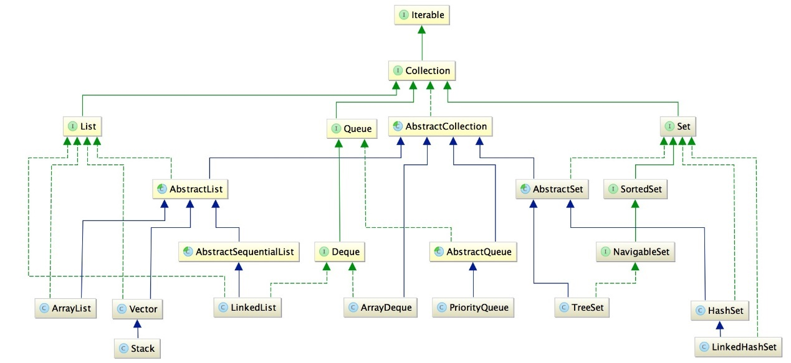
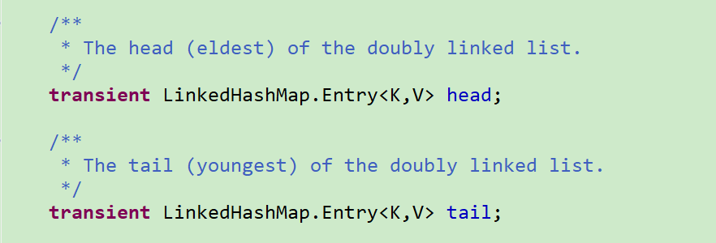

Java的集合类
================




  * [Hashtable](#hashtable)
  * [HashMap](#hashmap)
    * [JDK1\.7下的HashMap](#jdk17%E4%B8%8B%E7%9A%84hashmap)
      * [put方法](#put%E6%96%B9%E6%B3%95)
    * [JDK1\.8下的HashMap](#jdk18%E4%B8%8B%E7%9A%84hashmap)
      * [默认的参数](#%E9%BB%98%E8%AE%A4%E7%9A%84%E5%8F%82%E6%95%B0)
      * [get过程](#get%E8%BF%87%E7%A8%8B)
      * [put过程](#put%E8%BF%87%E7%A8%8B)
      * [扩容过程](#%E6%89%A9%E5%AE%B9%E8%BF%87%E7%A8%8B)
    * [HashSet](#hashset)
  * [TreeMap](#treemap)
    * [TreeMap实现原理](#treemap%E5%AE%9E%E7%8E%B0%E5%8E%9F%E7%90%86)
    * [put方法](#put%E6%96%B9%E6%B3%95-1)
    * [get方法](#get%E6%96%B9%E6%B3%95)
    * [TreeSet](#treeset)
  * [LinkedHashMap](#linkedhashmap)
  * [List类](#list%E7%B1%BB)
    * [ArrayList](#arraylist)
    * [LinkedList](#linkedlist)
    * [Vector](#vector)
  * [迭代器](#%E8%BF%AD%E4%BB%A3%E5%99%A8)
    * [Iterator和ListIterator的区别](#iterator%E5%92%8Clistiterator%E7%9A%84%E5%8C%BA%E5%88%AB)
    * [快速失败(fail\-fast)和安全失败(fail\-safe)的区别](#%E5%BF%AB%E9%80%9F%E5%A4%B1%E8%B4%A5fail-fast%E5%92%8C%E5%AE%89%E5%85%A8%E5%A4%B1%E8%B4%A5fail-safe%E7%9A%84%E5%8C%BA%E5%88%AB)


Hashtable
-------------

> public class Hashtable<K,V> extends Dictionary<K,V> implements Map<K,V>, Cloneable, java.io.Serializable

Hashtable实现了一个哈希表，它将键映射到值。**任何非null对象**都可以用作键或值。Hashtable 的一个实例有两个影响其性能的参数：**初始容量和负载因子**。容量是哈希表中的桶数，初始容量只是创建哈希表时的容量。请注意，哈希表是打开的：在“哈希冲突”的情况下，单个存储桶存储多个条目，必须按顺序搜索。加载因子是在自动增加容量之前允许哈希表获取的完整程度的度量。通常，默认负载系数（.75）在时间和空间成本之间提供了良好的折衷。较高的值会减少空间开销，但会增加查找条目的时间成本（这反映在大多数Hashtable操作中，包括get和put）。

初始容量控制了浪费空间和重新运算操作的需要之间的权衡，这是非常耗时的。如果初始容量大于Hashtable将包含的最大条目数除以其加载因子，则不会发生重复操作。但是，将初始容量设置得太高会浪费空间。

如果要将多个条目设置为Hashtable，则以足够大的容量创建条目可以允许更有效地插入条目，而不是根据需要执行自动重新分组来扩展表。默认初始容量为11,扩容方式为旧值*2+1

**put方法**
```leaf
public synchronized V put(K key, V value) {
    // Make sure the value is not null
    if (value == null) {
        throw new NullPointerException();
    }

    // Makes sure the key is not already in the hashtable.
    Entry<?,?> tab[] = table;
    int hash = key.hashCode();
    int index = (hash & 0x7FFFFFFF) % tab.length;
    @SuppressWarnings("unchecked")
    Entry<K,V> entry = (Entry<K,V>)tab[index];
    for(; entry != null ; entry = entry.next) {
        if ((entry.hash == hash) && entry.key.equals(key)) {
            V old = entry.value;
            entry.value = value;
            return old;
        }
    }

    addEntry(hash, key, value, index);
    return null;
}
```

**解决hash冲突**
```leaf
protected void rehash() {
    int oldCapacity = table.length;
    Entry<?,?>[] oldMap = table;

    // overflow-conscious code
    int newCapacity = (oldCapacity << 1) + 1;
    if (newCapacity - MAX_ARRAY_SIZE > 0) {
        if (oldCapacity == MAX_ARRAY_SIZE)
            // Keep running with MAX_ARRAY_SIZE buckets
            return;
        newCapacity = MAX_ARRAY_SIZE;
            //省略
     
    }
}
```


HashMap
-----------

### JDK1.7下的HashMap

JDK1.7下HashMap的底层实现是通过数组和链表实现的，基本操作和HashTable类似，但是HashMap不是线程安全的。HashMap的初始容量为16，且保证每次每次扩容以后HashMap的数组长度一定是2的次幂。

#### put方法
```leaf
public V put(K key, V value) {
    //如果table数组为空数组{}，进行数组填充（为table分配实际内存空间），入参为threshold，此时threshold为initialCapacity 默认是1<<4(24=16)
    if (table == EMPTY_TABLE) {
        inflateTable(threshold);
    }
   //如果key为null，存储位置为table[0]或table[0]的冲突链上
    if (key == null)
        return putForNullKey(value);
    int hash = hash(key);//对key的hashcode进重新计算，确保散列均匀
    int i = indexFor(hash, table.length);//获取在table中的实际位置
    for (Entry<K,V> e = table[i]; e != null; e = e.next) {
    //如果该对应数据已存在，执行覆盖操作。用新value替换旧value，并返回旧value
        Object k;
        if (e.hash == hash && ((k = e.key) == key || key.equals(k))) {
            V oldValue = e.value;
            e.value = value;
            e.recordAccess(this);
            return oldValue;
        }
    }
    modCount++;//保证并发访问时，若HashMap内部结构发生变化，快速响应失败
    addEntry(hash, key, value, i);//新增一个entry
    return null;
}
```


### JDK1.8下的HashMap

JDK1.8下HashMap的底层实现是通过**数组和链表以及红黑树**实现的。当 hash碰撞之后写入链表的长度超过了阈值(默认为8)，链表将会转换为红黑树。这样做的原因是假设hash 冲突非常严重，一个数组后面接了很长的链表，此时查询的时间复杂度就 是 O(n)。但如果是红黑树，时间复杂度就是 O(logn) 。

#### 默认的参数
```leaf
//  默认的最大容量
static final int MAXIMUM_CAPACITY = 1 << 30;
//  默认的加载因子
static final float DEFAULT_LOAD_FACTOR = 0.75f;
//  添加一个元素时默认的从链表转换为红黑树的大小
static final int TREEIFY_THRESHOLD = 8;
//  resize时默认的从链表转换为红黑树的大小
static final int UNTREEIFY_THRESHOLD = 6;
//  可以树化的最小表的容量
static final int MIN_TREEIFY_CAPACITY = 64;
```


#### get过程
```leaf
public V get(Object key) {
    Node<K,V> e;
    return (e = getNode(hash(key), key)) == null ? null : e.value;
}

final Node<K,V> getNode(int hash, Object key) {
    Node<K,V>[] tab; Node<K,V> first, e; int n; K k;
    if ((tab = table) != null && (n = tab.length) > 0 &&
        (first = tab[(n - 1) & hash]) != null) {
        // 判断第一个节点是不是就是需要的
        if (first.hash == hash && // always check first node
            ((k = first.key) == key || (key != null && key.equals(k))))
            return first;
        if ((e = first.next) != null) {
            // 判断是否是红黑树
            if (first instanceof TreeNode)
                return ((TreeNode<K,V>)first).getTreeNode(hash, key);
 
            // 链表遍历
            do {
                if (e.hash == hash &&
                    ((k = e.key) == key || (key != null && key.equals(k))))
                    return e;
            } while ((e = e.next) != null);
        }
    }
    return null;
}
```

#### put过程
```leaf
public V put(K key, V value) {
    return putVal(hash(key), key, value, false, true);
}
 
// 第三个参数 onlyIfAbsent 如果是 true，那么只有在不存在该 key 时才会进行 put 操作
final V putVal(int hash, K key, V value, boolean onlyIfAbsent,
               boolean evict) {
    Node<K,V>[] tab; Node<K,V> p; int n, i;
    
    // 第一次 put 值的时候，会触发下面的 resize()，初始化数组长度
    if ((tab = table) == null || (n = tab.length) == 0)
        n = (tab = resize()).length;
    
    // 找到具体的数组下标，如果此位置没有值，那么直接初始化一下 Node并放置在这个位置
    if ((p = tab[i = (n - 1) & hash]) == null)
        tab[i] = newNode(hash, key, value, null);
 
    else {// 数组该位置有数据
        Node<K,V> e; K k;
        // 判断该位置的第一个数据和要插入的数据，如果是，取出这个节点
        if (p.hash == hash &&
            ((k = p.key) == key || (key != null && key.equals(k))))
            e = p;
        // 如果该节点是代表红黑树的节点，调用红黑树的插值方法
        else if (p instanceof TreeNode)
            e = ((TreeNode<K,V>)p).putTreeVal(this, tab, hash, key, value);
        else {
            // 到这里，说明数组该位置上是一个链表
            for (int binCount = 0; ; ++binCount) {
                // 插入到链表的最后面
                if ((e = p.next) == null) {
                    p.next = newNode(hash, key, value, null);
                    // TREEIFY_THRESHOLD 为 8，所以，如果新插入的值是链表中的第 9 个
                    // 会触发下面的 treeifyBin，也就是将链表转换为红黑树
                    if (binCount >= TREEIFY_THRESHOLD - 1) // -1 for 1st
                        treeifyBin(tab, hash);
                    break;
                }
                // 如果在该链表中找到了"相等"的 key(== 或 equals)
                if (e.hash == hash &&
                    ((k = e.key) == key || (key != null && key.equals(k))))
                    // 此时 break，那么 e 为链表中[与要插入的新值的 key "相等"]的 node
                    break;
                p = e;
            }
        }
        // e!=null 说明存在旧值的key与要插入的key"相等"
        // 下面这个 if 其实就是进行 "值覆盖"，然后返回旧值
        if (e != null) {
            V oldValue = e.value;
            if (!onlyIfAbsent || oldValue == null)
                e.value = value;
            afterNodeAccess(e);
            return oldValue;
        }
    }
    ++modCount;
    // 如果 HashMap 由于新插入这个值导致 size 已经超过了阈值，需要进行扩容
    if (++size > threshold)
        resize();
    afterNodeInsertion(evict);
    return null;
}
```
JDK1.8中是在**链表的尾部插入元素**，且可能会将链表转换为红黑树。
#### 扩容过程
```leaf
final Node<K,V>[] resize() {
    Node<K,V>[] oldTab = table;
    int oldCap = (oldTab == null) ? 0 : oldTab.length;
    int oldThr = threshold;
    int newCap, newThr = 0;
    if (oldCap > 0) { // 对应数组扩容
        if (oldCap >= MAXIMUM_CAPACITY) {
            threshold = Integer.MAX_VALUE;
            return oldTab;
        }
        // 将数组大小扩大一倍
        else if ((newCap = oldCap << 1) < MAXIMUM_CAPACITY &&
                 oldCap >= DEFAULT_INITIAL_CAPACITY)
            // 将阈值扩大一倍
            newThr = oldThr << 1; // double threshold
    }
    else if (oldThr > 0) // 对应使用 new HashMap(int initialCapacity) 初始化后，第一次 put 的时候
        newCap = oldThr;
    else {// 对应使用 new HashMap() 初始化后，第一次 put 的时候
        newCap = DEFAULT_INITIAL_CAPACITY;
        newThr = (int)(DEFAULT_LOAD_FACTOR * DEFAULT_INITIAL_CAPACITY);
    }
 
    if (newThr == 0) {
        float ft = (float)newCap * loadFactor;
        newThr = (newCap < MAXIMUM_CAPACITY && ft < (float)MAXIMUM_CAPACITY ?
                  (int)ft : Integer.MAX_VALUE);
    }
    threshold = newThr;
 
    // 用新的数组大小初始化新的数组
    Node<K,V>[] newTab = (Node<K,V>[])new Node[newCap];
    table = newTab; // 如果是初始化数组，到这里就结束了，返回 newTab 即可
 
    if (oldTab != null) {
        // 开始遍历原数组，进行数据迁移。
        for (int j = 0; j < oldCap; ++j) {
            Node<K,V> e;
            if ((e = oldTab[j]) != null) {
                oldTab[j] = null;
                // 如果该数组位置上只有单个元素，那就简单了，简单迁移这个元素就可以了
                if (e.next == null)
                    newTab[e.hash & (newCap - 1)] = e;
                // 如果是红黑树，具体我们就不展开了
                else if (e instanceof TreeNode)
                    ((TreeNode<K,V>)e).split(this, newTab, j, oldCap);
                else { 
                    // 这块是处理链表的情况，
                    // 需要将此链表拆成两个链表，放到新的数组中，并且保留原来的先后顺序
                    // loHead、loTail 对应一条链表，hiHead、hiTail 对应另一条链表，代码还是比较简单的
                    Node<K,V> loHead = null, loTail = null;
                    Node<K,V> hiHead = null, hiTail = null;
                    Node<K,V> next;
                    do {
                        next = e.next;
                        if ((e.hash & oldCap) == 0) {
                            if (loTail == null)
                                loHead = e;
                            else
                                loTail.next = e;
                            loTail = e;
                        }
                        else {
                            if (hiTail == null)
                                hiHead = e;
                            else
                                hiTail.next = e;
                            hiTail = e;
                        }
                    } while ((e = next) != null);
                    if (loTail != null) {
                        loTail.next = null;
                        // 第一条链表
                        newTab[j] = loHead;
                    }
                    if (hiTail != null) {
                        hiTail.next = null;
                        // 第二条链表的新的位置是 j + oldCap 
                        newTab[j + oldCap] = hiHead;
                    }
                }
            }
        }
    }
    return newTab;
}
```
扩充HashMap的时候，不需要像JDK1.7的实现那样重新计算hash，只需要看看原来的hash值新增的那个bit是1还是0就好了，是0的话索引没变，是1的话索引变成“原索引+oldCap”。
这个设计确实非常的巧妙，既省去了重新计算hash值的时间，而且同时，由于新增的1bit是0还是1可以认为是随机的，因此resize的过程，均匀的把之前的冲突的节点分散到新的bucket了。这一块就是JDK1.8新增的优化点。有一点注意区别，JDK1.7中rehash的时候，旧链表迁移新链表的时候，如果在新表的数组索引位置相同，则链表元素会倒置，JDK1.8不会倒置。


### HashSet

对于HashSet而言，它是基于HashMap实现的，HashSet底层使用HashMap来保存所有元素，因此HashSet的实现比较简单，相关HashSet的操作，基本上都是直接调用底层HashMap的相关方法来完成，

[参见](https://zhangshixi.iteye.com/blog/673143)

TreeMap
-----------

### TreeMap实现原理

TreeMap的底层是用红黑树来实现的，红黑树的最大高度为2 \* log
n。内部定义的节点的类如下：

```leaf
static final class Entry<K,V> implements Map.Entry<K,V> {
    K key;
    V value;
    Entry<K,V> left;
    Entry<K,V> right;
    Entry<K,V> parent;
    boolean color = BLACK;

    Entry(K key, V value, Entry<K,V> parent) {
        this.key = key;
        this.value = value;
        this.parent = parent;
    }
    
    // 省略树的其他操作
}
```

### put方法
```leaf
public V put(K key, V value) {
    Entry<K,V> t = root;
    if (t == null) {
        compare(key, key); //检查key是否为null

        root = new Entry<>(key, value, null);
        size = 1;
        modCount++;
        return null;
    }
    int cmp;
    Entry<K,V> parent;
    //插值的方法就是普通的二叉搜索树
    Comparator<? super K> cpr = comparator;
    if (cpr != null) {    //传入的 comparator 排序
        do {
            parent = t;
            cmp = cpr.compare(key, t.key);
            if (cmp < 0)
                t = t.left;
            else if (cmp > 0)
                t = t.right;
            else
                return t.setValue(value);
        } while (t != null);
    }
    else {   // 自然排序 comparable
        if (key == null)
            throw new NullPointerException();
        @SuppressWarnings("unchecked")
            Comparable<? super K> k = (Comparable<? super K>) key;
        do {
            parent = t;
            cmp = k.compareTo(t.key);
            if (cmp < 0)
                t = t.left;
            else if (cmp > 0)
                t = t.right;
            else
                return t.setValue(value);
        } while (t != null);
    }
    //插入的值在叶子节点
    Entry<K,V> e = new Entry<>(key, value, parent);
    if (cmp < 0)
        parent.left = e;
    else
        parent.right = e;
    fixAfterInsertion(e);  //平衡红黑树
    size++;
    modCount++;
    return null;
}


// comparator 为null  自然排序  否则就是按照传入的comparator实现类排序
final int compare(Object k1, Object k2) {
    return comparator==null ? ((Comparable<? super K>)k1).compareTo((K)k2)
        : comparator.compare((K)k1, (K)k2);
}
```
### get方法

```
public V get(Object key) {
    Entry<K,V> p = getEntry(key);
    return (p==null ? null : p.value);
}


final Entry<K,V> getEntry(Object key) {
    
    if (comparator != null)
        return getEntryUsingComparator(key);
    if (key == null)
        throw new NullPointerException();
    @SuppressWarnings("unchecked")
    //根据自然排序查找
        Comparable<? super K> k = (Comparable<? super K>) key;
    Entry<K,V> p = root;
    while (p != null) {
        int cmp = k.compareTo(p.key);
        if (cmp < 0)
            p = p.left;
        else if (cmp > 0)
            p = p.right;
        else
            return p;
    }
    return null;
}

// 根据传入的排序方式查找
final Entry<K,V> getEntryUsingComparator(Object key) {
    @SuppressWarnings("unchecked")
        K k = (K) key;
    Comparator<? super K> cpr = comparator;
    if (cpr != null) {
        Entry<K,V> p = root;
        while (p != null) {
            int cmp = cpr.compare(k, p.key);
            if (cmp < 0)
                p = p.left;
            else if (cmp > 0)
                p = p.right;
            else
                return p;
        }
    }
    return null;
}

```

###  TreeSet

对于TreeSet而言，它是基于HashMap实现的，TreeSet底层使用TreeMap来保存所有元素，因此TreeSet
的实现比较简单，相关TreeSet的操作，基本上都是直接调用底层TreeMap的相关方法来完成。


 LinkedHashMap
-----------------

LinkedHashMap 继承自 HashMap，在 HashMap 基础上，通过维护一条双向链表，解决了
HashMap 不能随时保持遍历顺序和插入顺序一致的问题。除此之外，LinkedHashMap
对访问顺序(LRU)也提供了相关支持。

LinkedHashMap的底层实现和HashMap完全一致，只是增加了两个头尾节点来维护一个双向链表:



通过查看源码可知，LinkedHashMap的get、put、resize、remove方法基本过程和HashMap基本一致。一些小细节是通过在LinkedHashMap重写来实现的


 List类
----------

### ArrayList 

ArrayList是一个不安全的类，它的底层就是一个数组，当数组容量不够时，会触发扩容操作。

由于ArrayList的底层是数组，所以get操作的复杂度是O(1)的，在确认要取的位置有效后（rangeCheck），直接返回就行。add方法在将元素放在数组尾部前，会确认数组是否放的下，如果放不下就触发扩容操作。

ArrayList就是动态数组，是Array的复杂版本，动态的增加和减少元素.当更多的元素加入到ArrayList中时,其大小将会动态地增长。它的元素可以通过get/set方法直接访问，因为ArrayList本质上是一个数组。初始容量为10,插入元素的时候可能扩容，删除元素时不会缩小容量,扩容增长为Arraylist增长原来的0.5倍


### LinkedList

LinkedList也实现了List接口，是一个双向链表，内部定义的链表节点结构如下：

```leaf
    private static class Node<E> {
        E item;
        Node<E> next;
        Node<E> prev;

        Node(Node<E> prev, E element, Node<E> next) {
            this.item = element;
            this.next = next;
            this.prev = prev;
        }
    }
```

LinkedList的get和插入方法最多遍历一般链表的长度。LinkedList是一个双链表,在添加和删除元素时具有比ArrayList更好的性能.但在get与set方面弱于ArrayList.当然,这些对比都是指数据量很大或者操作很频繁的情况下的对比。它还实现了Queue
接口,该接口比List提供了更多的方法,包括 offer(),peek(),poll()等。

>   **ArrayList和LinkedList都实现了List接口，有以下的不同点：**

>   ArrayList是基于索引的数据接口，它的底层是数组。它可以以O(1)时间复杂度对元素进行随机访问。与此对应，LinkedList是以元素链表的形式存储它的数据，每一个元素都和它的前一个和后一个元素链接在一起，在这种情况下，查找某个元素的时间复杂度是O(n/2)。

>   相对于ArrayList，LinkedList的插入，添加，删除操作速度更快，因为当元素被添加到集合任意位置的时候，不需要像数组那样重新计算大小或者是更新索引。

>   LinkedList比ArrayList更占内存，因为LinkedList为每一个节点存储了两个引用，一个指向前一个元素，一个指向下一个元素。

### Vector

Vector也实现了List接口，继承了AbstractList类。它的底层和ArrayList一样，也是一个数组。基本的操作过程也一致，最大的区别是Vector是安全的。

Vector和ArrayList类似,区别在于Vector是同步类(synchronized).因此,开销就比ArrayList要大。初始容量为10。实现了随机访问接口，可以随机访问。Vector是内部是
以动态数组的形式来存储数据的。Vector还可以设置增长的空间大小，默认是一倍，


迭代器 
-----------

### Iterator和ListIterator的区别

Iterator可用来遍历Set和List集合，但是ListIterator只能用来遍历List。Iterator对集合只能是前向遍历，ListIterator既可以前向也可以后向。

ListIterator实现了Iterator接口，并包含其他的功能，比如：增加元素，替换元素，获取前一个和后一个元素的索引等等

### 快速失败(fail-fast)和安全失败(fail-safe)的区别

**快速失败和安全失败是对迭代器而言的。**

**快速失败（fail—fast）**
在用迭代器遍历一个集合对象时，如果遍历过程中对集合对象的内容进行了修改（增加、删除、修改），则会抛出Concurrent
Modification Exception。

原理：迭代器在遍历时直接访问集合中的内容，并且在遍历过程中使用一个 modCount
变量。集合在被遍历期间如果内容发生变化，就会改变modCount的值。每当迭代器使用hashNext()/next()遍历下一个元素之前，都会检测modCount变量是否为expectedmodCount值，是的话就返回遍历；否则抛出异常，终止遍历。

注意：这里异常的抛出条件是检测到 modCount！=expectedmodCount
这个条件。如果集合发生变化时修改modCount值刚好又设置为了expectedmodCount值，则异常不会抛出。因此，不能依赖于这个异常是否抛出而进行并发操作的编程，这个异常只建议用于检测并发修改的bug。

场景：java.util包下的集合类都是快速失败的，不能在多线程下发生并发修改（迭代过程中被修改）。

**安全失败（fail—safe）**

采用安全失败机制的集合容器，在遍历时不是直接在集合内容上访问的，而是先复制原有集合内容，在拷贝的集合上进行遍历。

原理：由于迭代时是对原集合的拷贝进行遍历，所以在遍历过程中对原集合所作的修改

并不能被迭代器检测到，所以不会触发Concurrent Modification Exception。

缺点：基于拷贝内容的优点是避免了Concurrent Modification
Exception，但同样地，迭代器并不能访问到修改后的内容，即：迭代器遍历的是开始遍历那一刻拿到的集合拷贝，在遍历期间原集合发生的修改迭代器是不知道的。

场景：java.util.concurrent包下的容器都是安全失败，可以在多线程下并发使用，并发修改。
