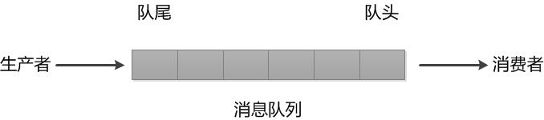
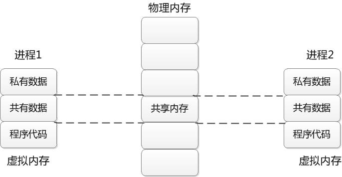
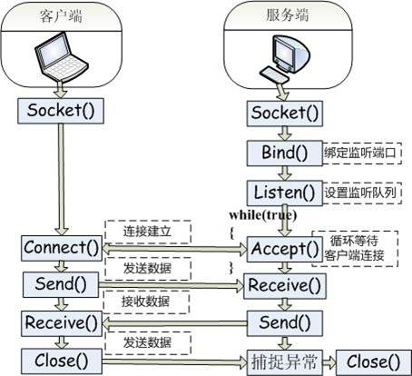
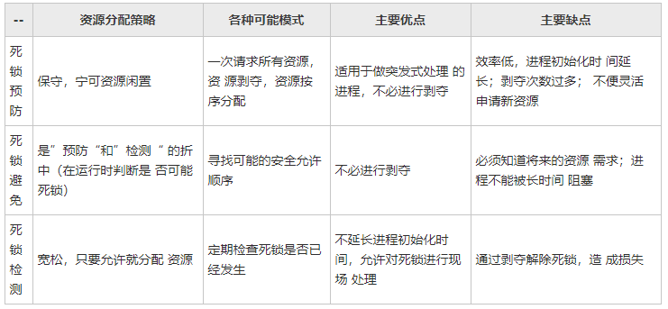
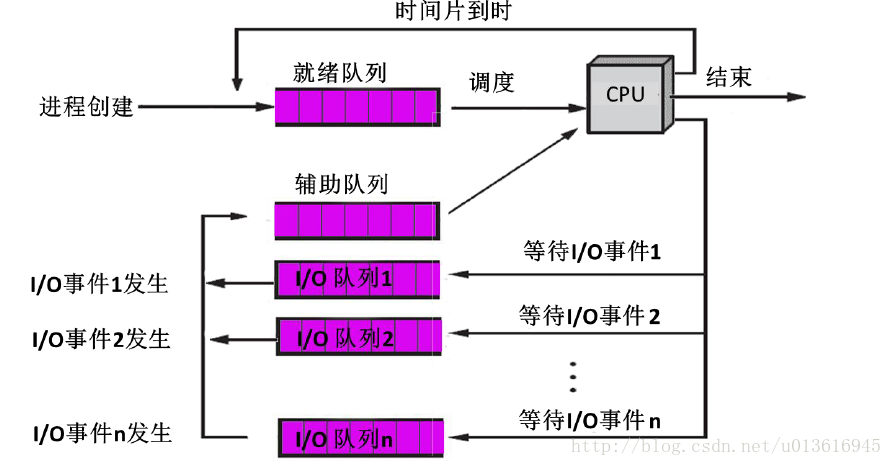
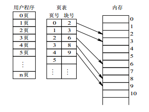
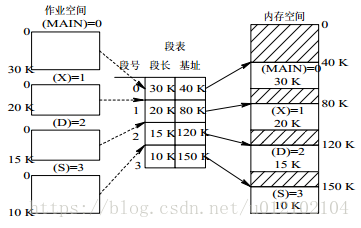
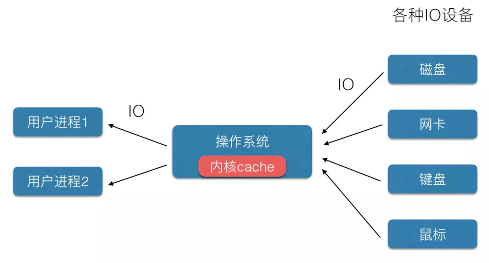
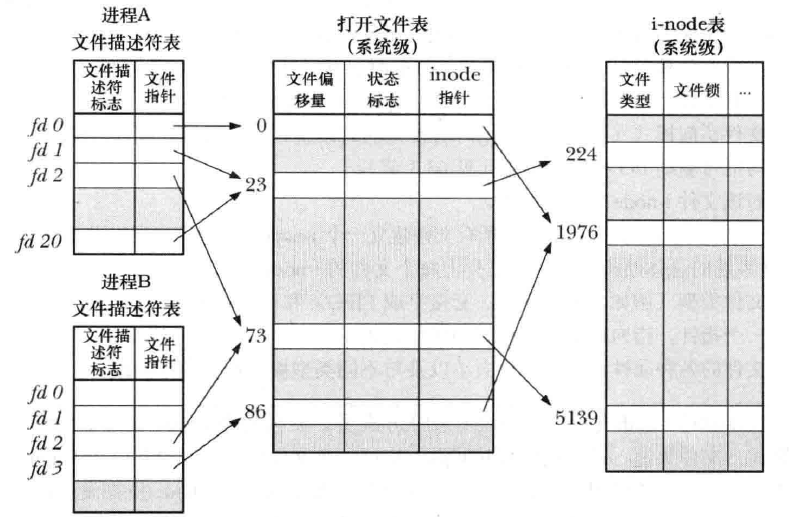

* [进程与线程](#%E8%BF%9B%E7%A8%8B%E4%B8%8E%E7%BA%BF%E7%A8%8B)
  * [进程与线程的区别](#%E8%BF%9B%E7%A8%8B%E4%B8%8E%E7%BA%BF%E7%A8%8B%E7%9A%84%E5%8C%BA%E5%88%AB)
  * [进程通信方式](#%E8%BF%9B%E7%A8%8B%E9%80%9A%E4%BF%A1%E6%96%B9%E5%BC%8F)
  * [僵尸进程与孤儿进程](#%E5%83%B5%E5%B0%B8%E8%BF%9B%E7%A8%8B%E4%B8%8E%E5%AD%A4%E5%84%BF%E8%BF%9B%E7%A8%8B)
  * [PV操作](#pv%E6%93%8D%E4%BD%9C)
* [死锁](#%E6%AD%BB%E9%94%81)
  * [死锁的定义](#%E6%AD%BB%E9%94%81%E7%9A%84%E5%AE%9A%E4%B9%89)
  * [死锁产生的原因](#%E6%AD%BB%E9%94%81%E4%BA%A7%E7%94%9F%E7%9A%84%E5%8E%9F%E5%9B%A0)
  * [死锁的处理策略](#%E6%AD%BB%E9%94%81%E7%9A%84%E5%A4%84%E7%90%86%E7%AD%96%E7%95%A5)
  * [死锁避免\-\-银行家算法](#%E6%AD%BB%E9%94%81%E9%81%BF%E5%85%8D--%E9%93%B6%E8%A1%8C%E5%AE%B6%E7%AE%97%E6%B3%95)
* [阻塞和非阻塞，同步和异步](#%E9%98%BB%E5%A1%9E%E5%92%8C%E9%9D%9E%E9%98%BB%E5%A1%9E%E5%90%8C%E6%AD%A5%E5%92%8C%E5%BC%82%E6%AD%A5)
  * [例子](#%E4%BE%8B%E5%AD%90)
  * [详细介绍](#%E8%AF%A6%E7%BB%86%E4%BB%8B%E7%BB%8D)
* [操作系统CPU调度算法](#%E6%93%8D%E4%BD%9C%E7%B3%BB%E7%BB%9Fcpu%E8%B0%83%E5%BA%A6%E7%AE%97%E6%B3%95)
  * [先来先服务调度算法（FCFS）](#%E5%85%88%E6%9D%A5%E5%85%88%E6%9C%8D%E5%8A%A1%E8%B0%83%E5%BA%A6%E7%AE%97%E6%B3%95fcfs)
  * [短作业优先调度算法(SPF)](#%E7%9F%AD%E4%BD%9C%E4%B8%9A%E4%BC%98%E5%85%88%E8%B0%83%E5%BA%A6%E7%AE%97%E6%B3%95spf)
  * [最高响应比优先算法(HRRN)](#%E6%9C%80%E9%AB%98%E5%93%8D%E5%BA%94%E6%AF%94%E4%BC%98%E5%85%88%E7%AE%97%E6%B3%95hrrn)
  * [基于优先数调度算法(HPF)](#%E5%9F%BA%E4%BA%8E%E4%BC%98%E5%85%88%E6%95%B0%E8%B0%83%E5%BA%A6%E7%AE%97%E6%B3%95hpf)
  * [时间片轮转调度算法](#%E6%97%B6%E9%97%B4%E7%89%87%E8%BD%AE%E8%BD%AC%E8%B0%83%E5%BA%A6%E7%AE%97%E6%B3%95)
  * [虚拟轮转法](#%E8%99%9A%E6%8B%9F%E8%BD%AE%E8%BD%AC%E6%B3%95)
* [内存存储管理方式](#%E5%86%85%E5%AD%98%E5%AD%98%E5%82%A8%E7%AE%A1%E7%90%86%E6%96%B9%E5%BC%8F)
  * [页存储](#%E9%A1%B5%E5%AD%98%E5%82%A8)
  * [段存储](#%E6%AE%B5%E5%AD%98%E5%82%A8)
  * [段页存储](#%E6%AE%B5%E9%A1%B5%E5%AD%98%E5%82%A8)
* [页面置换算法](#%E9%A1%B5%E9%9D%A2%E7%BD%AE%E6%8D%A2%E7%AE%97%E6%B3%95)
  * [最佳页面置换算法（OPT）](#%E6%9C%80%E4%BD%B3%E9%A1%B5%E9%9D%A2%E7%BD%AE%E6%8D%A2%E7%AE%97%E6%B3%95opt)
  * [先进先出置换算法（FIFO）](#%E5%85%88%E8%BF%9B%E5%85%88%E5%87%BA%E7%BD%AE%E6%8D%A2%E7%AE%97%E6%B3%95fifo)
  * [最近最久未使用（LRU）算法](#%E6%9C%80%E8%BF%91%E6%9C%80%E4%B9%85%E6%9C%AA%E4%BD%BF%E7%94%A8lru%E7%AE%97%E6%B3%95)
  * [时钟(CLOCK)置换算法](#%E6%97%B6%E9%92%9Fclock%E7%BD%AE%E6%8D%A2%E7%AE%97%E6%B3%95)
* [IO](#io)
  * [操作系统与设备间的IO](#%E6%93%8D%E4%BD%9C%E7%B3%BB%E7%BB%9F%E4%B8%8E%E8%AE%BE%E5%A4%87%E9%97%B4%E7%9A%84io)
  * [操作系统与用户进程间的IO](#%E6%93%8D%E4%BD%9C%E7%B3%BB%E7%BB%9F%E4%B8%8E%E7%94%A8%E6%88%B7%E8%BF%9B%E7%A8%8B%E9%97%B4%E7%9A%84io)
  * [IO管理](#io%E7%AE%A1%E7%90%86)
* [其他问题](#%E5%85%B6%E4%BB%96%E9%97%AE%E9%A2%98)
  * [名词解释](#%E5%90%8D%E8%AF%8D%E8%A7%A3%E9%87%8A)
  * [文件描述符](#%E6%96%87%E4%BB%B6%E6%8F%8F%E8%BF%B0%E7%AC%A6)
  * [Linux常用命令](#linux%E5%B8%B8%E7%94%A8%E5%91%BD%E4%BB%A4)
  * [Direct IO和Buffer IO](#direct-io%E5%92%8Cbuffer-io)

[操作系统(Operating System,
OS)](http://c.biancheng.net/cpp/html/2611.html)是指控制和**管理**整个计算机系统的**硬件和软件资源**，并合理地组织**调度**计算机的工作和资源的分配，以提供给用户和其他软件方便的接口和环境的程序集合。

进程与线程
---------------

### 进程与线程的区别

进程是并发执行的程序在执行过程中**分配和管理资源**的基本单位，是一个动态概念，竞争计算机系统资源的基本单位。线程是进程的一个实体，是CPU调度和分派的基本单位，

它是比进程更小的能独立运行的基本单位，最小的CPU执行单元。

**为什么会有线程：**

每个进程都有自己的地址空间，即进程空间，在网络或多用户换机下，一个服务器通常需要接收大量不确定数量用户的并发请求，为每一个请求都创建一个进程显然行不通（系统开销大响应用户请求效率低），因此操作系统中线程概念被引进。

线程的执行过程是线性的，尽管中间会发生中断或者暂停，但是进程所拥有的资源只为改线状执行过程服务，一旦发生线程切换，这些资源需要被保护起来。

进程分为单线程和多线程，单线程宏观来看也是线性执行过程，微观上只有单一的执行过程。多线程宏观是线性的，微观上多个执行操作。

**线程的改变只代表CPU的执行过程的改变，而没有发生进程所拥有的资源的变化。**

**进程线程的区别**：

**地址空间**：同一进程的线程共享本进程的地址空间，而进程之间则是独立的地址空间。

**资源拥有**：同一进程内的线程共享本进程的资源如内存、I/O、CPU等，但是进程之间的资源是独立的。

一个进程崩溃后，在保护模式下不会对其他进程产生影响，但是一个线程崩溃整个进程都死掉。所以多进程要比多线程健壮。进程切换时，消耗的资源大，效率高。所以涉及到频繁的切换时，使用线程要好于进程。同样如果要求同时进行并且又要共享某些变量的并发操作，只能用线程不能用进程

**执行过程**：每个独立的进程有一个程序运行的入口、顺序执行序列和程序入口。但是线程不能独立执行，必须依存在应用程序中，由应用程序提供多个线程执行控制。

线程是处理器调度的基本单位，但是进程不是。

两者均可并发执行。

**优缺点：**

线程执行开销小，但是不利于资源的管理和保护。

进程执行开销大，但是能够很好的进行资源管理和保护。

何时使用多进程：对资源的管理和保护要求高，不限制开销和效率时，使用多进程。

何时使用多线程：要求效率高，频繁切换时，资源的保护管理要求不是很高时，使用多线程。

### 进程通信方式

进程间通信（IPC，InterProcess
Communication）是指在不同进程之间传播或交换信息。IPC的方式通常有管道（包括无名管道和命名管道）、消息队列、信号量、共享存储、Socket、Streams等。

#### 管道

管道类似于一种**特殊的文件(并不是)**，它存在于内存中，进程可以对它进行读写，它提供流控制，保证进程的正确读写，即管道为空时读进程会阻塞，管道为满时写进程会阻塞，以此实现进程之间的通信。

**管道有三种：**

>   **1.普通管道（无名管道、也常直接称管道）**：半双工的，即只能单向传输。有进程关系限制的，只能在父子进程之间使用。

>   **2.流管道**：相对于普通管道而言，它不止是单向传输，可以双向传输。

>   **3.命名管道(FIFO)**：相对于普通管道而言，它没有进程关系限制，可以在无关进程之间进行数据交换。

####  消息队列

消息队列是一列具有头和尾的消息排列，新来的消息放在队列尾部，而读取消息则从队列头部开始，如下图所示：

这样看来，它和管道十分类似，一头读，一头写.的确，看起来很像管道，但又不是管道：

（1）消息队列无固定的读写进程，任何进程都可以读写；而管道需要指定谁读和谁写

（2）消息队列可以同时支持多个进程，多个进程可以读写消息队列；即所谓的多对多，而管道是点对点

（3）消息队列只在内存中实现，而管道还可以在磁盘上实现

#### 共享内存

**共享内存即多个进程共享某块内存**，共享内存是通信方式中**最快**的一种。操作系统建立一块共享内存，并将其映射到参与通信的每个进程的地址空间上，进程就可以直接对这块共享内存进行读写。

那么，共享内存这种方式为什么是最快的呢？这是因为共享内存的整个通信过程对消息的复制只有两次。

1.从数据来源复制到共享内存 

2.从共享内存复制到数据目的地

而管道、消息队列等方式对消息的复制需要四次，因为有缓冲区的存在，读写都要经过缓冲区。

#### 信号量

在计算机中，信号量实际上就是一个简单整数。一个进程在信号变为0或1的情况下推进，并将信号变为1或0来防止别的进程同时推进。当该进程完成任务后，则将信号再改为0或1，从而允许其他进程执行。从而我们也可以看出，信号量已经不只是一种通信机制，更是一种同步机制。

**信号量用于实现进程间的互斥与同步，而不是用于存储进程间通信数据。它是一个计数器，用来控制多个进程对共享资源的访问，常作为一种锁机制，实现进程间的同步和互斥。**

#### 套接字(socket)

套接字（Socket）的功能非常强大，**可以支持不同层面、不同应用、跨网络的通信**。使用套接字进行通信需要双方均创建一个套接字，其中一方作为服务器方，另外一方作为客户方。服务器方必须首先创建一个服务区套接字，然后在该套接字上进行监听，等待远方的连接请求。客户方也要创建一个套接字，然后向服务器方发送连接请求。服务器套接字在受到连接请求之后，将在服务器方机器上新建一个客户套接字，与远方的客户方套接字形成点到点的通信通道。之后，客户方和服务器方便可以直接通过类似于send和recv的命令在这个创建的套接字管道上进行交流了。

### 僵尸进程与孤儿进程

* 孤儿进程：一个父进程退出，而它的一个或多个子进程还在运行，那么那些子进程将成为孤儿进程。孤儿进程将被init进程(进程号为1)所收养，并由init进程对它们完成状态收集工作。
* 僵尸进程：一个进程使用fork创建子进程，如果子进程退出，而父进程并没有调用wait或waitpid获取子进程的状态信息，那么子进程的进程描述符仍然保存在系统中。这种进程称之为僵死进程。

#### 问题及危害
Unix提供了一种机制可以保证只要父进程想知道子进程结束时的状态信息， 就可以得到。这种机制就是: 在每个进程退出的时候,内核释放该进程所有的资源,包括打开的文件,占用的内存等。 但是仍然为其保留一定的信息(包括进程号the process ID,退出状态the termination status of the process,运行时间the amount of CPU time taken by the process等)。直到父进程通过wait / waitpid来取时才释放。 但这样就导致了问题，如果进程不调用wait / waitpid的话， 那么保留的那段信息就不会释放，其进程号就会一直被占用，但是系统所能使用的进程号是有限的，如果大量的产生僵死进程，将因为没有可用的进程号而导致系统不能产生新的进程. 此即为僵尸进程的危害，应当避免。

孤儿进程是没有父进程的进程，每当出现一个孤儿进程的时候，内核就把孤儿进程的父进程设置为init，而init进程会循环地wait()它的已经退出的子进程。这样，当一个孤儿进程结束了其生命周期的时候，init进程就会处理它的一切善后工作，因此孤儿进程并不会有什么危害。

任何一个子进程(init除外)在exit()之后，并非马上就消失掉，而是留下一个称为僵尸进程(Zombie)的数据结构，等待父进程处理。如果父进程不进行处理，则系统运行上一段时间之后，系统中就会存在很多的僵死进程。

#### 怎样来清除僵尸进程： 

**1.改写父进程**：子进程退出时向父进程发送SIGCHILD信号，父进程处理SIGCHILD信号。在信号处理函数中调用wait进行处理僵尸进程。

**2.把父进程杀掉**：父进程死后，僵尸进程成为”孤儿进程”，过继给1号进程init，init始终会负责清理僵尸进程．它产生的所有僵尸进程也跟着消失。

### PV操作

<https://blog.csdn.net/leves1989/article/details/3305609>

PV操作由P操作原语和V操作原语组成（原语是不可中断的过程），对信号量进行操作，具体定义如下：

**P（S）**：将信号量S的值减1。如果S**大于等于**0，则该进程继续执行；否则该进程置为等待状态，排入等待队列。

**V（S）**：将信号量S的值加1。如果S**大于**0，则该进程继续执行；否则释放队列中第一个等待信号量的进程。

**PV操作的意义**：用信号量及PV操作来实现进程的同步和互斥。PV操作属于进程的低级通信。信号量（semaphore）的数据结构为一个值和一个指针，指针指向等待该信号量的下一个进程。信号量的值与相应资源的使用情况有关。当它的值大于0时，表示当前可用资源的数量；当它的值小于0时，其绝对值表示等待使用该资源的进程个数。注意，信号量的值仅能由PV操作来改变。

--------------------------

死锁
---------

### 死锁的定义

在多道程序系统中，由于多个进程的并发执行，改善了系统资源的利用率并提高了系统的处理能力。然而，多个进程的并发执行也带来了新的问题——死锁。所谓死锁是指多个进程因竞争资源而造成的一种僵局（互相等待），若无外力作用，这些进程都将无法向前推进。

### 死锁产生的原因

**1)系统资源的竞争**

通常系统中拥有的不可剥夺资源，其数量不足以满足多个进程运行的需要，使得进程在
运行过程中，会因争夺资源而陷入僵局，如磁带机、打印机等。只有对不可剥夺资源的竞争
才可能产生死锁，对可剥夺资源的竞争是不会引起死锁的。

**2)进程推进顺序非法**

进程在运行过程中，请求和释放资源的顺序不当，也同样会导致死锁。例如，并发进程
P1、P2分别保持了资源R1、R2，而进程P1申请资源R2，进程P2申请资源R1时，两者都
会因为所需资源被占用而阻塞。

信号量使用不当也会造成死锁。进程间彼此相互等待对方发来的消息，结果也会使得这
些进程间无法继续向前推进。例如，进程A等待进程B发的消息，进程B又在等待进程A
发的消息，可以看出进程A和B不是因为竞争同一资源，而是在等待对方的资源导致死锁。

**3)死锁产生的必要条件**

**产生死锁必须同时满足以下四个条件，只要其中任一条件不成立，死锁就不会发生。**

**互斥条件**：进程要求对所分配的资源进行排他性控制，即在一段时间内某资源仅为一个进程所占有。此时若有其他进程请求该资源，则请求进程只能等待。

**不剥夺条件**：进程所获得的资源在未使用完毕之前，不能被其他进程强行夺走，即只能
由获得该资源的进程自己来释放（只能是主动释放)。

**请求和保持条件**：进程已经保持了至少一个资源，但又提出了新的资源请求，而该资源
已被其他进程占有，此时请求进程被阻塞，但对自己已获得的资源保持不放。

**循环等待条件**：存在一种进程资源的循环等待链，链中每一个进程已获得的资源同时被
链中下一个进程所请求。

### 死锁的处理策略

为使系统不发生死锁，必须设法破坏产生死锁的四个必要条件之一，或者允许死锁产生，
但当死锁发生时能检测出死锁，并有能力实现恢复。

**预防死锁**：设置某些限制条件，破坏产生死锁的四个必要条件中的一个或几个，以防止发生死锁。

**避免死锁**：在资源的动态分配过程中，用某种方法防止系统进入不安全状态，从而避免死锁。

**死锁的检测及解除**：无需釆取任何限制性措施，允许进程在运行过程中发生死锁。通过系统的检测机构及时
地检测出死锁的发生，然后釆取某种措施解除死锁。

预防死锁和避免死锁都属于事先预防策略，但预防死锁的限制条件比较严格，实现起来较为简单，但往往导致系统的效率低，资源利用率低；避免死锁的限制条件相对宽松，资源分配后需要通过算法来判断是否进入不安全状态，实现起来较为复杂。

### 死锁避免--银行家算法

把操作系统看作是银行家，操作系统管理的资源相当于银行家管理的资金，进程向操作系统请求分配资源相当于用户向银行家贷款。为保证资金的安全，银行家规定：

(1)当一个顾客对资金的最大需求量不超过银行家现有的资金时就可接纳该顾客

(2)顾客可以分期贷款，但贷款的总数不能超过最大需求量

(3)当银行家现有的资金不能满足顾客尚需的贷款数额时，对顾客的贷款可推迟支付，但总能使顾客在有限的时间里得到贷款

(4)当顾客得到所需的全部资金后，一定能在有限的时间里归还所有的资金.

[操作系统](https://baike.baidu.com/item/%E6%93%8D%E4%BD%9C%E7%B3%BB%E7%BB%9F)按照银行家制定的规则为进程分配资源，当进程首次申请资源时，要测试该进程对资源的最大需求量，如果系统现存的资源可以满足它的最大需求量则按当前的申请量分配资源，否则就推迟分配。当进程在执行中继续申请资源时，先测试该进程本次申请的资源数是否超过了该资源所剩余的总量。若超过则拒绝分配资源，若能满足则按当前的申请量分配资源，否则也要推迟分配。

**银行家算法的主要思想是避免系统进入不安全状态**。在每次进行资源分配时，它首先检查系统是否有足够的资源满足要求，如果有，则先进行分配，并对分配后的新状态进行安全性检查。如果新状态安全，则正式分配上述资源，否则就拒绝分配上述资源。这样，它保证系统始终处于安全状态，从而避免死锁现象的发生。

---------------------------------

阻塞和非阻塞，同步和异步
-----------------------------

### 例子

**故事：老王烧开水。**

出场人物：老张，水壶两把（普通水壶，简称水壶；会响的水壶，简称响水壶）。

老王想了想，有好几种等待方式

1.老王用水壶煮水，并且站在那里，不管水开没开，每隔一定时间看看水开了没。**－同步阻塞**

2.老王还是用水壶煮水，不再傻傻的站在那里看水开，跑去寝室上网，但是还是会每隔一段时间过来看看水开了没有，水没有开就走人。－**同步非阻塞**

3.老王这次使用高大上的响水壶来煮水，站在那里，但是不会再每隔一段时间去看水开，而是等水开了，水壶会自动的通知他。**－异步阻塞**

4.老王还是使用响水壶煮水，跑到客厅上网去，等着响水壶自己把水煮熟了以后通知他。**－异步非阻塞**

### 详细介绍

**同步和异步**：同步就是烧开水，需要自己去轮询（每隔一段时间去看看水开了没），异步就是水开了，然后水壶会通知你水已经开了，你可以回来处理这些开水了。同步和异步是相对于操作结果来说，会不会等待结果返回。

**阻塞和非阻塞**：阻塞就是说在煮水的过程中，你不可以去干其他的事情，非阻塞就是在同样的情况下，可以同时去干其他的事情。阻塞和非阻塞是相对于进程是否被阻塞。

其实，这两者存在本质的区别，它们的修饰对象是不同的。**阻塞和非阻塞是指进程访问的数据如果尚未就绪，进程是否需要等待**，简单说这相当于函数内部的实现区别，也就是未就绪时是直接返回还是等待就绪。而同步和异步是指消息通信机制,同步一般指主动请求并等待I/O操作完毕的方式,当数据就绪后在读写的时候必须阻塞,异步则指主动请求数据后便可以继续处理其它任务,随后等待I/O,操作完毕的通知,这可以使进程在数据读写时也不阻塞。

---------------------

操作系统CPU调度算法
------------------------

**由于要执行的进程的数目是多于处理器的数目，所以需要处理器去决定下一次运行哪个进程。**

### 先来先服务调度算法（FCFS）

FCFS就是**按照各个作业进入系统的自然次序来调度作业**。这种调度算法的优点是实现简单，公平。其缺点是没有考虑到系统中各种资源的综合使用情况，往往使短作业的用户不满意，因为短作业等待处理的时间可能比实际运行时间长得多。

### 短作业优先调度算法(SPF)

SPF就是优先调度并处理短作业，所谓短是指作业的运行时间短。而在作业未投入运行时，并不能知道它实际的运行时间的长短，因此需要用户在提交作业时同时提交作业运行时间的估计值。其缺点是可以改善短作业的周转时间，但如果源源不断有短任务到来，可能使长的任务长时间得不到运行，产生饥饿现象。

### 最高响应比优先算法(HRRN)

FCFS可能造成短作业用户不满，SPF可能使得长作业用户不满，于是提出HRRN，选择响应比最高的作业运行。响应比=1+作业等待时间/作业处理时间。

### 基于优先数调度算法(HPF)

HPF每一个作业规定一个表示该作业优先级别的整数，当需要将新的作业由输入井调入内存处理时，优先选择优先数最高的作业。

### 时间片轮转调度算法

时间片轮转调度算法主要适用于分时系统。在这种算法中，系统将所有就绪进程按到达时间的先后次序排成一个队列，进程调度程序总是选择就绪队列中第一个进程执行，即先来先服务的原则，但仅能运行一个时间片，如100ms。在使用完一个时间片后，即使进程并未完成其运行，它也必须释放出（被剥夺）处理机给下一个就绪的进程，而被剥夺的进程返回到就绪队列的末尾重新排队，等候再次运行。

**当时间片选择太长，其降级为先来先服务算法，引起对短的交互请求响应时间长**

**当时间片选择太短，会导致频繁的进程切换，浪费CPU时间。**

### 虚拟轮转法

主要基于时间片轮转法进行改进，解决在CPU调度中对于I/O密集型进程的不友好。其设置了一个辅助队列，对于I/O型进程执行完一个时间片之后，则进入辅助队列，CPU调度时总是先检查辅助队列是否为空，如果不为空总是优先调度辅助队列里的进程，直到为空，才调度就绪队列的进程。

--------------------------------

内存存储管理方式
---------------------

### 页存储

为了便于在内存中找到进程的每个页面所对应的物理块，系统为每个进程建立一张页表，记录页面在内存中对应的物理块号，页表一般存放在内存中。在配置了页表后，进程执行时，通过查找该表，即可找到每页在内存中的物理块号。可见页表作用是实现从页号到物理块号的地址映射，这种是页存储管理方式。如下图所示：

### 段存储

将用户程序地址空间分成若干个大小不等的段，每段可以定义一组相对完整的逻辑信息。存储分配时，以段为单位，段与段在内存中可以不相邻接，也实现了离散分配，这种是**段存储**管理方式。如下图所示：

###  段页存储

作业的地址空间首先被分成若干个逻辑分段，每段都有自己的段号，然后再将每段分成若干个大小相等的页。对于主存空间也分成大小相等的页，主存的分配以页为单位，这种是**段页存储**管理方式。如下图所示：

页面置换算法
-----------------

在地址映射过程中，若在页面中发现所要访问的页面不在内存中，则产生缺页中断。当发生缺页中断时，如果操作系统内存中没有空闲页面，则操作系统必须在内存选择一个页面将其移出内存，以便为即将调入的页面让出空间。而用来选择淘汰哪一页的规则叫做页面置换算法。

### 最佳页面置换算法（OPT）

从主存中移出永远不再需要的页面；如无这样的页面存在，则选择最长时间不需要访问的页面。于所选择的被淘汰页面将是以后永不使用的，或者是在最长时间内不再被访问的页面，这样可以保证获得最低的缺页率。

最佳置换算法可以用来评价其他算法。假定系统为某进程分配了三个物理块，并考虑有以下页面号引用串：  
7, 0, 1, 2, 0, 3, 0, 4, 2, 3, 0, 3, 2, 1, 2, 0, 1, 7, 0, 1  
进程运行时，先将7, 0,
1三个页面依次装入内存。进程要访问页面2时，产生缺页中断，根据最佳置换算法，选择第18次访问才需调入的页面7予以淘汰。然后，访问页面0时，因为已在内存中所以不必产生缺页中断。访问页面3时又会根据最佳置换算法将页面1淘汰……依此类推。

### 先进先出置换算法（FIFO）

最简单的页面置换算法是先入先出（FIFO）法。这种算法的基本思想是：当需要淘汰一个页面时，总是选择驻留主存时间最长的页面进行淘汰，即先进入主存的页面先淘汰。其理由是：

最早调入主存的页面不再被使用的可能性最大。

这里仍用上面的实例，釆用FIFO算法进行页面置换。进程访问页面2时，把最早进入内存的页面7换出。然后访问页面3时，再把2,
0, 1中最先进入内存的页换出。

### 最近最久未使用（LRU）算法

这种算法的基本思想是：利用局部性原理，根据一个作业在执行过程中过去的页面访问历史来推测未来的行为。它认为过去一段时间里不曾被访问过的页面，在最近的将来可能也不会再被访问。所以，这种算法的实质是：当需要淘汰一个页面时，总是选择在最近一段时间内最久不用的页面予以淘汰。

LRU算法是经常采用的页面置换算法，并被认为是相当好的，但是存在如何实现它的问题。LRU算法需要实际硬件的支持。其问题是怎么确定最后使用时间的顺序，对此有两种可行的办法：

**1.计数器**：最简单的情况是使每个页表项对应一个使用时间字段，并给CPU增加一个逻辑时钟或计数器。每次存储访问，该时钟都加1。每当访问一个页面时，时钟寄存器的内容就被复制到相应页表项的使用时间字段中。这样我们就可以始终保留着每个页面最后访问的“时间”。在置换页面时，选择该时间值最小的页面。这样做，不仅要查页表，而且当页表改变时（因CPU调度）要维护这个页表中的时间，还要考虑到时钟值溢出的问题。

**2.栈**：用一个栈保留页号。每当访问一个页面时，就把它从栈中取出放在栈顶上。这样一来，栈顶总是放有目前使用最多的页，而栈底放着目前最少使用的页。由于要从栈的中间移走一项，所以要用具有头尾指针的双向链连起来。在最坏的情况下，移走一页并把它放在栈顶上需要改动6个指针。每次修改都要有开销，但需要置换哪个页面却可直接得到，用不着查找，因为尾指针指向栈底，其中有被置换页。

### 时钟(CLOCK)置换算法

简单的CLOCK算法是给每一帧关联一个附加位，称为使用位。当某一页首次装入主存时，该帧的使用位设置为1;当该页随后再被访问到时，它的使用位也被置为1。对于页替换算法，用于替换的候选帧集合看做一个循环缓冲区，并且有一个指针与之相关联。当某一页被替换时，该指针被设置成指向缓冲区中的下一帧。当需要替换一页时，操作系统扫描缓冲区，以查找使用位被置为0的一帧。每当遇到一个使用位为1的帧时，操作系统就将该位重新置为0；如果在这个过程开始时，缓冲区中所有帧的使用位均为0，则选择遇到的第一个帧替换；如果所有帧的使用位均为1,则指针在缓冲区中完整地循环一周，把所有使用位都置为0，并且停留在最初的位置上，替换该帧中的页。由于该算法循环地检查各页面的情况，故称为CLOCK算法，又称为最近未用(Not
Recently Used, NRU)算法。

CLOCK算法的性能比较接近LRU，而通过增加使用的位数目，可以使得CLOCK算法更加高效。在使用位的基础上再增加一个修改位，则得到改进型的CLOCK置换算法。这样，每一帧都处于以下四种情况之一：

最近未被访问，也未被修改(u=0, m=0)。

最近被访问，但未被修改(u=1, m=0)。

最近未被访问，但被修改(u=0, m=1)。

最近被访问，被修改(u=1, m=1)。

**算法执行如下操作步骤：**

1.从指针的当前位置开始，扫描帧缓冲区。在这次扫描过程中，对使用位不做任何修改。选择遇到的第一个帧(u=0,
m=0)用于替换。

2.如果第1步失败，则重新扫描，查找(u=0,
m=1)的帧。选择遇到的第一个这样的帧用于替换。在这个扫描过程中，对每个跳过的帧，把它的使用位设置成0。

3.如果第2步失败，指针将回到它的最初位置，并且集合中所有帧的使用位均为0。重复第1步，并且如果有必要，重复第2步。这样将可以找到供替换的帧。

**具体例子请看：https://www.cnblogs.com/fkissx/p/4712959.html**

-----------------------

IO
-------

<https://www.jianshu.com/p/5cf67fab6d61>

I/O（Input/Output）输入输出，总体图:

### 操作系统与设备间的IO 

**作系统通过设备驱动程序访问IO设备。方式有：**

（1）**轮询方式:**计算机从外部设备读取数据到存储器，每次读一个字的数据。对读入的每个字，CPU需要对外设状态进行**循环检查**，直到确定该字已经在I/O控制器的数据寄存器中。

**（2）中断方式**：设备有数据的时候，发出中断，由CPU决定要不要响应中断，然后中断，去处理设备的IO。CPU不用经常轮询设备状态。被动接收中断就行。中断驱动方式的思想是，允许I/O设备主动打断CPU的运行并请求服务，从而“解放”CPU，使得其向I/O控制器发送读命令后可以继续做其他有用的工作。

**（3）DMA直接存储器访问方式**：在中断驱动方式中，I/O设备与内存之间的数据交换必须要经过CPU中的寄存器，所以速度还是受限，而DMA（直接存储器存取）方式的基本思想是在I/O设备和内存之间开辟直接的数据交换通路，彻底“解放”
CPU。

通道控制方式

**（4）通道控制方式**：DMA方式只能控制一个设备的一块数据，多块数据还是要CPU干预多次。于是有了通道来控制IO，它比DMA更强大，能控制多块数据，多个设备的IO，更加解放了CPU参与IO过程。

I/O通道是指专门负责输入/输出的处理机。I/O通道方式是DMA方式的发展，它可以进一步减少CPU的干预，即把对一个数据块的读（或写）为单位的干预，减少为对一组数据块的读（或写）及有关的控制和管理为单位的干预。

I/O通道与DMA方式的区别是：DMA方式需要CPU来控制传输的数据块大小、传输的内存位置，而通道方式中这些信息是由通道控制的。另外，每个DMA控制器对应一台设备与内存传递数据，而一个通道可以控制多台设备与内存的数据交换。

### 操作系统与用户进程间的IO

进程中的线程才是CPU基本的执行/调度单元，下面用线程举例。设备来的数据放在内核cache中，需要用户线程去内核cache中取数据，复制到自己进程的cache中。有5中读取数据方式：

**（1）阻塞**：用户线程调用某些系统函数去内核取数据，直到数据到达内核cache前，该线程处于阻塞状态，等待数据到达。

**（2）非阻塞**：用户线程去取数据，不管内核cache有没有数据，都直接返回，可能拿到数据，也可能拿不到，不会使线程进入阻塞态。

**（3）IO多路复用**：多路就是一个线程管理多路IO，线程还是被阻塞调用，其中一路或几路IO有数据了就返回。需要线程遍历全部IO，判断是哪个IO有数据。

**（4）信号驱动IO**：给一个IO注册一个信号和信号触发的回调函数，一旦信号被触发，回调函数里读取数据。例如给
socket
注册一个“可读”的信号，当数据来了，可读的时候，信号被触发，执行回调函数从内核cache复制数据到用户空间。

**（5）异步IO**：异步IO中，操作系统完成了数据从内核到用户空间的拷贝后，以信号的方式通知用户线程可以下一步操作。省去了用户线程阻塞下来拷贝数据的过程。

### IO管理

假设一台服务器需要被1万个客户端连接。方法有：

**（1）单路**：最简单的一个线程管理一个客户端的socket
IO，那么需要1万的线程，假设每个线程占内存3MB，需要300G内存，单台服务器没那么大的内存，并且操作系统最大线程数有限制，unix下一个进程好像是最多只能开
4096 个线程。

**（2）IO多路复用**：socket一旦多起来，单路IO就扛不住了，需要一个线程管理多个
socket
IO。I/O多路复用就通过一种机制，可以监视多个描述符，一旦某个描述符就绪（一般是读就绪或者写就绪），能够通知程序进行相应的读写操作。

#### select原理概述

**调用select时，会发生以下事情：**

1.从用户空间拷贝fd_set到内核空间

2.注册回调函数__pollwait

3.遍历所有fd，对全部指定设备做一次poll（这里的poll是一个文件操作，它有两个参数，一个是文件fd本身，一个是当设备尚未就绪时调用的回调函数__pollwait，这个函数把设备自己特有的等待队列传给内核，让内核把当前的进程挂载到其中）；

4.当设备就绪时，设备就会唤醒在自己特有等待队列中的【所有】节点，于是当前进程就获取到了完成的信号。poll文件操作返回的是一组标准的掩码，其中的各个位指示当前的不同的就绪状态（全0为没有任何事件触发），根据mask可对fd_set赋值；

5.如果所有设备返回的掩码都没有显示任何的事件触发，就去掉回调函数的函数指针，进入有限时的睡眠状态，再恢复和不断做poll，再作有限时的睡眠，直到其中一个设备有事件触发为止。

6.只要有事件触发，系统调用返回，将fd_set从内核空间拷贝到用户空间，回到用户态，用户就可以对相关的fd作进一步的读或者写操作了。

####  epoll原理概述

**调用epoll_create时，做了以下事情：**

1.内核在epoll文件系统里建了个file结点；

2.在内核cache里建了个红黑树用于存储以后epoll_ctl传来的socket；

3.建立一个list链表，用于存储准备就绪的事件。

**调用epoll_ctl时，做了以下事情：**

1.把socket放到epoll文件系统里file对象对应的红黑树上；

2.给内核中断处理程序注册一个回调函数，告诉内核，如果这个句柄的中断到了，就把它放到准备就绪list链表里。

**调用epoll_wait时，做了以下事情**：

观察list链表里有没有数据。有数据就返回，没有数据就sleep，等到timeout时间到后即使链表没数据也返回。而且，通常情况下即使我们要监控百万计的句柄，大多一次也只返回很少量的准备就绪句柄而已，所以，epoll_wait仅需要从内核态copy少量的句柄到用户态而已。

比较：https://www.cnblogs.com/aspirant/p/9166944.html

#### 两者的对比

**select缺点:**

1.最大并发数限制：使用32个整数的32位，即32\*32=1024来标识fd，虽然可修改，但是有以下第二点的瓶颈；

2.效率低：每次都会线性扫描整个fd_set，集合越大速度越慢；

3.内核/用户空间内存拷贝问题。

**epoll的提升：**

1.本身没有最大并发连接的限制，仅受系统中进程能打开的最大文件数目限制；

2.效率提升：只有活跃的socket才会主动的去调用callback函数；

3.省去不必要的内存拷贝：epoll通过内核与用户空间mmap同一块内存实现。

IO概述:https://blog.csdn.net/qq_38499859/article/details/81085689

--------------------------------

其他问题
-------------

### 名词解释

**虚拟存储器**的基本思想是程序、数据和堆栈的总的大小可以超过物理存储器的大小，操作系统把当前使用的部分保留在内存中，而把其他未被使用的部分保存在磁盘等存储设备上。

**虚拟地址空间：**任何时候，计算机上都存在一个程序能够产生的地址集合，称之为地址范围。这个范围的大小由CPU的位数决定，例如一个32位的CPU，它的地址范围是0\~0xFFFFFFFF
(4G)，而对于一个64位的CPU，它的地址范围为0\~0xFFFFFFFFFFFFFFFF
(64T)，这个范围就是程序能够产生的地址范围，这个地址范围称为虚拟地址空间，该空间中的某一个地址我们称之为虚拟地址。

与虚拟地址空间和虚拟地址相对应的则是物理地址空间和物理地址，大多数时候我们的系统所具备的物理地址空间只是虚拟地址空间的一个子集。

**物理地址**：CPU地址总线传来的地址，由硬件电路控制其具体含义。物理地址中很大一部分是留给内存条中的内存的，但也常被映射到其他存储器上（如显存、BIOS等）。在没有使用虚拟存储器的机器上，虚拟地址被直接送到内存总线上，使具有相同地址的物理存储器被读写；而在使用了虚拟存储器的情况下，虚拟地址不是被直接送到内存地址总线上，而是送到存储器管理单元MMU，把虚拟地址映射为物理地址。

**逻辑地址**：是在有地址变换功能的计算机中，访内指令给出的地址 (操作数)
叫逻辑地址，也叫相对地址，也就是机器语言指令中，用来指定一个操作数或是一条指令的地址。要经过寻址方式的计算或变换才得到内存储器中的实际有效地址即物理地址。一个逻辑地址由两部份组成，段标识符:段内偏移量。段标识符是由一个16位长的字段组成，称为段选择符。其中前13位是个索引号，后面3位包含一些硬件细节
。

**线性地址**：是逻辑地址到物理地址变换之间的中间层。在分段部件中逻辑地址是段中的偏移地址，然后加上基地址就是线性地址。是一个32位无符号整数，可以用来表示高达4GB的地址，也就是，高达4294967296个内存单元。线性地址通常用十六进制数字表示，值得范围从0x00000000到0xfffffff）程序代码会产生逻辑地址，通过逻辑地址变换就可以生成一个线性地址。如果启用了分页机制，那么线性地址可以再经过变换以产生一个物理地址。如果没有启用分页机制，那么线性地址直接就是物理地址。

**地址映射：逻辑地址 -\> 物理地址**

CPU将一个逻辑地址转换为物理地址，需要进行两步：首先将给定一个逻辑地址（其实是段内偏移量），CPU要利用其段式内存管理单元，先将为个逻辑地址转换成一个线程地址，再利用其页式内存管理单元，转换为最终物理地址。这样做两次转换，的确是非常麻烦而且没有必要的，因为直接可以把线性地址抽像给进程。之所以这样冗余，Intel完全是为了兼容而已（Intel为了兼容，将远古时代的段式内存管理方式保留了下来，x86体系的处理器

刚开始时只有20根地址线，寻址寄存器是16位。我们知道16位的寄存器可以访问64K的地址空间，如果程序要想访问大于64K的内存，就需要把内存分段，每段64K，用段地址+偏移量的方式来访问，这样使20根地址线全用上，最大的寻址空间就可以到1M字节，这在当时已经是非常大的内存空间了）。

### 文件描述符

**右侧的表称为i节点表**，在整个系统中只有1张。该表可以视为结构体数组，该数组的一个元素对应于一个物理文件。

**中间的表称为文件表**，在整个系统中只有1张。该表可以视为结构体数组，一个结构体中有很多字段，其中有3个字段比较重要：

>   file status flags：用于记录文件被打开来读的，还是写的。

>   current file
>   offset：用于记录文件的当前读写位置（指针）。正是由于此字段的存在，使得一个文件被打开并读取后，下一次读取将从上一次读取的字符后开始读取

>   v-node ptr：该字段是指针，指向右侧表的一个元素，从而关联了物理文件。

**左侧的表称为文件描述符表**，每个进程有且仅有1张。该表可以视为指针数组，数组的元素指向文件表的一个元素。**最重要的是：数组元素的下标就是文件描述符。**

open系统调用执行的操作：新建一个i节点表元素，让其对应打开的物理文件（如果对应于该物理文件的i节点元素已经建立，就不做任何操作）；新建一个文件表的元素，根据open的第2个参数设置file
status flags字段，将current file offset字段置0，将v-node
ptr指向刚建立的i节点表元素；在文件描述符表中，寻找1个尚未使用的元素，在该元素中填入一个指针值，让其指向刚建立的文件表元素。最重要的是：将该元素的下标作为open的返回值（文件描述符）返回。这样一来，当调用read（write）时，根据传入的文件描述符，OS就可以找到对应的文件描述符表元素，进而找到文件表的元素，进而找到i节点表元素，从而完成对物理文件的读写。

fork会导致子进程继承父进程打开的文件描述符，其本质是将父进程的整个文件描述符表复制一份，放到子进程的PCB中。因此父、子进程中相同文件描述符（文件描述符为整数）指向的是同一个文件表元素，这将导致父（子）进程读取文件后，子（父）进程将读取同一文件的后续内容。

相对应的，如果是两个进程独立调用open去打开同一个物理文件，就会有2个文件表元素被创建，并且他们都指向同一个i节点表元素。两个文件表元素都有自己独立的current
file
offset字段，这将导致2个进程独立的对同一个物理文件进行读写，因此第1个进程读取到文件的第1个字符后，第2个进程再去读取该文件时，仍然是读到的是文件的第1个字符，而不是第1个字符的后续字符。

###  Linux常用命令

cd命令：切换目录

ls命令：查看文件与目录

cp命令：复制文件

mv命令：移动文件或文件夹

rm命令：删除文件或文件夹

mkdir命令：创建文件夹

grep命令：用于查找文件里符合条件的字符串

chmod命令：改变文件权限

ps命令：进程运行情况

kill命令：停止进程

atop / htop命令：查看CPU、内存、磁盘、网络等信息 / 查看CPU、内存、进程等实时信息

tar命令：文件压缩 / 解压

vim命令：文本编辑

gcc命令：编译

### Direct IO和Buffer IO

#### 缓存 IO (Buffered IO)

缓存IO又被称作标准IO，大多数文件系统的默认IO操作都是缓存IO。在Linux的缓存IO机制中，操作系统会将IO的数据缓存在文件系统的页缓存（page
cache）中，也就是说，数据会先被拷贝到操作系统内核的缓冲区中，然后才会从操作系统内核的缓冲区拷贝到应用程序的地址空间。

* **读取**：硬盘-\>内核缓冲区-\>用户缓冲区;

* **写回**：数据会从用户地址空间拷贝到操作系统内核地址空间的页缓存中去，这是write就会直接返回，操作系统会在恰当的时机写入磁盘，

**缓存IO有以下这些优点：**

缓存IO使用了操作系统内核缓冲区，在一定程度上分离了应用程序空间和实际的物理设备。

缓存IO可以减少读盘的次数，从而提高性能。

当应用程序尝试读取某块数据的时候，如果这块数据已经存放在了页缓存中，那么这块

数据就可以立即返回给应用程序，而不需要经过实际的物理读盘操作。当然，如果数据在应用程序读取之前并未被存放在页缓存中，那么就需要先将数据从磁盘读到页缓存中去。对于写操作来说，应用程序也会将数据先写到页缓存中去，数据是否被立即写到磁盘上去取决于应用程序所采用的写操作机制：如果用户采用的是同步写机制（synchronous
writes）,那么数据会立即被写回到磁盘上，应用程序会一直等到数据被写完为止；如果用户采用的是延迟写机制（deferred
writes），那么应用程序就完全不需要等到数据全部被写回到磁盘，数据只要被写到页缓存中去就可以了。在延迟写机制的情况下，操作系统会定期地将放在页缓存中的数据刷到磁盘上。与异步写机制（asynchronous
writes）不同的是，延迟写机制在数据完全写到磁盘上的时候不会通知应用程序，而异步写机制在数据完全写到磁盘上的时候是会返回给应用程序的。所以延迟写机制本身是存在数据丢失的风险的，而异步写机制则不会有这方面的担心。

**缓存IO的缺点:**

在缓存IO机制中，DMA方式可以将数据直接从磁盘读到页缓存中，或者将数据从页缓存直接写回到磁盘上，而不能直接在应用程序地址空间和磁盘之间进行数据传输，这样的话，数据在传输过程中需要在应用程序地址空间和页缓存之间进行多次数据拷贝操作，这些数据拷贝操作所带来的CPU以及内存开销是非常大的。对于某些特殊的应用程序来说，避开操作系统内核缓冲区而直接在应用程序地址空间和磁盘之间传输数据会比使用操作系统内核缓冲区获取更好的性能。

#### 直接IO (Direct IO)

**自缓存应用程序（self-caching
applications）**：对于某些应用程序来说，它会有它自己的数据缓存机制，比如，它会将数据缓存在应用程序地址空间，这类应用程序完全不需要使用操作系统内核中的高速缓冲存储器，这类应用程序就被称作是自缓存应用程序。数据库管理系统是这类应用程序的一个代表。

自缓存应用程序倾向于使用数据的逻辑表达方式，而非物理表达方式；当系统内存较低的时候，自缓存应用程序会让这种数据的逻辑缓存被换出，而并非是磁盘上实际的数据被换出。自缓存应用程序对要操作的数据的语义了如指掌，所以它可以采用更加高效的缓存替换算法。自缓存应用程序有可能会在多台主机之间共享一块内存，那么自缓存应用程序就需要提供一种能够有效地将用户地址空间的缓存数据置为无效的机制，从而确保应用程序地址空间缓存数据的一致性。

对于自缓存应用程序来说，缓存IO明显不是一个好的选择。由此引出直IO 技术。直
IO技术非常适用于自缓存这类应用程序，该技术省略掉缓存I
技术中操作系统内核缓冲区的使用，数据直接在应用程序地址空间和磁盘之间进行传输，从而使得自缓存应用程序可以省略掉复杂的系统级别的缓存结构，而执行程序自己定义的数据读写管理，从而降低系统级别的管理对应用程序访问数据的影响。

**直接IO的优点**

直接IO最主要的优点就是通过减少操作系统内核缓冲区和应用程序地址空间的数据拷贝次数，降低了对文件读取和写入时所带来的CPU的使用以及内存带宽的占用。这对于某些特殊的应用程序，比如自缓存应用程序来说，不失为一种好的选择。如果要传输的数据量很大，使用直接IO的方式进行数据传输，而不需要操作系统内核地址空间拷贝数据操作的

参与，这将会大大提高性能。

**直接IO潜在可能存在的问题**

直接IO并不一定总能提供令人满意的性能上的飞跃。设置直接IO的开销非常大，而直接IO又不能提供缓存IO的优势。缓存IO的读操作可以从高速缓冲存储器中获取数据，而直接IO的读数据操作会造成磁盘的同步读，这会带来性能上的差异,并且导致进程需要较长的时间才能执行完；对于写数据操作来说，使用直接IO需要write()系统调用同步执行，否则应用程序将会不知道什么时候才能够再次使用它的IO缓冲区。与直接IO读操作类似的是，直接IO写操作也会导致应用程序关闭缓慢。所以，应用程序使用直IO进行数据传输的时候通常会和使用异步IO结合使用。

