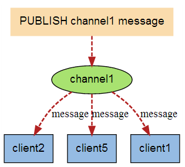

* [Redis常用的数据类型](#redis%E5%B8%B8%E7%94%A8%E7%9A%84%E6%95%B0%E6%8D%AE%E7%B1%BB%E5%9E%8B)
* [发布与订阅](#%E5%8F%91%E5%B8%83%E4%B8%8E%E8%AE%A2%E9%98%85)
* [持久化机制](#%E6%8C%81%E4%B9%85%E5%8C%96%E6%9C%BA%E5%88%B6)
* [Redis使用场景](#redis%E4%BD%BF%E7%94%A8%E5%9C%BA%E6%99%AF)
* [面试题](https://github.com/LLLRS/RunJava/blob/master/notes/%E6%95%B0%E6%8D%AE%E5%BA%93/Redis%E9%9D%A2%E8%AF%95%E9%A2%98.md)


Redis是一种支持Key-Value等多种数据结构的存储系统(NoSQL)。可用于缓存，事件发布或订阅，高速队列等场景。该数据库使用ANSI
C语言编写，支持网络，提供字符串，哈希，列表，队列，集合结构直接存取，基于内存，可持久化。

Redis不支持事务，但是通过提供了打包执行的功能，即这个包里面的所有命令必须要一起执行，此外还可以锁定某个Key，在打包执行命令时如果检测到这个Key发生了变化，则直接回滚。

Redis使用单线程的IO复用模型。

### Redis常用的数据类型

Redis一共支持五种数据类型：string（字符串），hash（哈希），list（列表），set（集合）和zset（sorted
set有序集合）。

#### String
String就是一个最最简单的Key-Value形式存储的变量。其中Value既可以是数字也可以是字符串，其实现方式是在Redis内部默认存储一个字符串，被redisObject引用，当检测到数字操作如自增自减incr、decr等等命令时，自动转化为数字进行计算，计算完毕后再转化为String存储起来。

Redis的字符串叫着「SDS」，也就是Simple Dynamic String。它的结构是一个带长度信息的字节数组。

```
struct sdshdr {
    int len;       //len表示buf已使用的长度
    int free;      //free表示buf未使用的长度
    char buf[];   //buf表示字节数组，用来存储字符串
};
```

SDS结构的优点：
* 保存了字符串的长度
* 减少了修改字符串带来的内存重分配次数：空间预分配（字符串在长度小于 1M 之前，扩容空间采用加倍策略。当长度超过 1M 之后，为了避免加倍后的冗余空间过大而导致浪费，每次扩容只会多分配 1M 大小的冗余空间）和惰性空间释放（需要缩减空间时并不马上内存重分配，而是把可用空间纪录下来）
* 可以保存二进制数据

字符串对象的内部编码有两种形式：在长度特别短时，使用 emb 形式存储 (embeded)，否则使用 raw 形式存储。embstr 存储形式是这样一种存储形式，它将 RedisObject 对象头和 SDS 对象连续存在一起，使用 malloc 方法一次分配。而 raw 存储形式不一样，它需要两次 malloc，两个对象头在内存地址上一般是不连续的。


#### 字典
字典（dict）是 Redis 服务器中出现最为频繁的复合型数据结构，除了 hash 结构的数据会用到字典外，整个 Redis 数据库的所有 key 和 value 也组成了一个全局字典，还有带过期时间的 key 集合也是一个字典。zset 集合中存储 value 和 score 值的映射关系也是通过 dict 结构实现的。

dict结构内部包含两个 hashtable，通常情况下只有一个 hashtable 是有值的。但是在 dict 扩容缩容时，需要分配新的 hashtable，然后进行渐进式搬迁，这时候两个 hashtable 存储的分别是旧的 hashtable 和新的 hashtable。待搬迁结束后，旧的 hashtable 被删除，新的 hashtable 取而代之。

dict是通过哈希表来实现的，它的结构和 Java 的 HashMap 几乎是一样的，都是通过分桶的方式解决 hash 冲突。第一维是数组，第二维是链表。数组中存储的是第二维链表的第一个元素的指针。
```
struct dictEntry {
    void* key;
    void* val;
    dictEntry* next; // 链接下一个 entry
}
struct dictht {
    dictEntry** table; // 二维
    long size; // 第一维数组的长度
    long used; // hash 表中的元素个数
    ...
}
```

**渐进式rehash** : 大字典的扩容是比较耗时间的，需要重新申请新的数组，然后将旧字典所有链表中的元素重新挂接到新的数组下面，这是一个O(n)级别的操作，作为单线程的Redis表示很难承受这样耗时的过程，所以Redis使用渐进式rehash小步搬迁。虽然慢一点，但是肯定可以搬完。搬迁操作埋伏在当前字典的后续指令中(来自客户端的hset/hdel指令等)，但是有可能客户端闲下来了，没有了后续指令来触发这个搬迁，Redis还会在定时任务中对字典进行主动搬迁。


**扩容条件** 
: 正常情况下，当 hash 表中元素的个数等于第一维数组的长度时，就会开始扩容，扩容的新数组是原数组大小的 2 倍。不过如果 Redis 正在做 bgsave，为了减少内存页的过多分离 (Copy On Write)，Redis 尽量不去扩容 (dict_can_resize)，但是如果 hash 表已经非常满了，元素的个数已经达到了第一维数组长度的 5 倍 (dict_force_resize_ratio)，说明 hash 表已经过于拥挤了，这个时候就会强制扩容。


**缩容条件** 
:当 hash 表因为元素的逐渐删除变得越来越稀疏时，Redis 会对 hash 表进行缩容来减少 hash 表的第一维数组空间占用。缩容的条件是元素个数低于数组长度的 10%。缩容不会考虑 Redis 是否正在做 bgsave。

**对象的内部编码有两种形式**
：压缩列表(ziplist)和 哈希表。只有同时满足下面两个条件时，才会使用压缩列表：哈希中元素数量小于512个以及哈希中所有键值对的键和值字符串长度都小于64字节。如果有一个条件不满足，则使用哈希表，且编码只可能由压缩列表转化为哈希表，反方向则不可能。

压缩列表是一块连续的内存空间，元素之间紧挨着存储，没有任何冗余空隙。压缩列表可以节省内存空间，但是进行修改或增删操作时，复杂度较高。


#### List
列表（list）用来存储多个有序的字符串，每个字符串称为元素；一个列表可以存储2^32-1个元素。Redis中的列表支持两端插入和弹出，并可以获得指定位置（或范围）的元素，可以充当数组、队列、栈等。

列表的内部编码可以是压缩列表（ziplist）或双端链表（linkedlist）。虑到链表的附加空间相对太高，另外每个节点的内存都是单独分配，会加剧内存的碎片化，影响内存管理效率，后续版本对列表数据结构进行了改造，使用 quicklist 代替了 ziplist 和 linkedlist。quicklist 是 ziplist 和 linkedlist 的混合体，它将 linkedlist 按段切分，每一段使用 ziplist 来紧凑存储，多个 ziplist 之间使用双向指针串接起来。


#### Set
Redis 的集合相当于 Java 语言里面的 HashSet，它内部的键值对是无序的唯一的。它的内部实现相当于一个特殊的字典，字典中所有的 value 都是一个值NULL。
当集合中最后一个元素移除之后，数据结构自动删除，内存被回收。

#### Zset
zset 可能是 Redis 提供的最为特色的数据结构。它类似于 Java 的 SortedSet 和 HashMap 的结合体，一方面它是一个 set，保证了内部 value 的唯一性，另一方面它可以给每个 value 赋予一个 score，代表这个 value 的排序权重。它的内部实现用的是一种叫做「跳跃列表」的数据结构。zset 中最后一个 value 被移除后，数据结构自动删除，内存被回收.

跳跃表是一种有序数据结构，通过在每个节点中维持多个指向其他节点的指针，从而达到快速访问节点的目的。除了跳跃表，实现有序数据结构的另一种典型实现是平衡树；大多数情况下，跳跃表的效率可以和平衡树媲美，且跳跃表实现比平衡树简单很多，因此redis中选用跳跃表代替平衡树。跳跃表支持平均O(logN)、最坏O(N)的复杂点进行节点查找，并支持顺序操作。Redis的跳跃表实现由zskiplist和zskiplistNode两个结构组成：前者用于保存跳跃表信息（如头结点、尾节点、长度等），后者用于表示跳跃表节点。具体结构相对比较复杂，略。


### 发布与订阅

>   Redis的发布与订阅（发布/订阅）是它的一种消息通信模式，一方发送信息，一方接收信息。下图是三个客户端同时订阅同一个频道。


下图是有新信息发送给频道1时，就会将消息发送给订阅它的三个客户端：



### 持久化机制

两种持久化机制是RDB和AOF机制。

**RDB持久化是**指用数据集快照的方式记录redis数据库的所有键值对。

两个命令：SAVE命令会阻塞主进程来完成写文件，BGSAVE命令会创建子进程来完成写文件，主进程会继续处理命令。

**优点**：

1.只有一个文件dump.rdb，方便持久化。

2.容灾性好，一个文件可以保存到安全的磁盘。

3.性能最大化，fork子进程来完成写操作，让主进程继续处理命令，所以是IO最大化。

4.相对于数据集大时，比AOF的启动效率更高。

**缺点：**

1.数据安全性低，通过配置save参数来达到定时的写快照，比如 每900
秒有1个键被修改就进行一次快照，每600秒至少有10个键被修改进行快照，每30秒有至少10000个键被修改进行记录。所以如果当服务器还在等待写快照时出现了宕机，那么将会丢失数据。

2.fork子进程时可能导致服务器停机1秒，数据集太大。

**AOF持久化**是指所有的命令行记录以redis命令请求协议的格式保存为aof文件。

**优点：**

1.数据安全，aof持久化可以配置appendfsync属性，有always，每进行一次命令操作就记录到aof文件中一次；everySec，就是每秒内进行一次文件的写操作；no就是不进行aof文件的写操作。

2.通过append模式写文件，即使中途服务器宕机，可以通过redis-check-aof工具解决数据一致性问题。

3.AOF机制的rewrite模式，用来将过大的aof文件缩小，实现原理是将所有的set通过一句set命令总结，所有的SADD命令用总结为一句，这样每种命令都概括为一句来执行，就可以减少aof文件的大小了。（注意，在重写的过程中，是创建子进程来完成重写操作，主进程每个命令都会在AOF缓冲区和AOF重写缓冲区进行保存，这样旧版aof文件可以实现数据最新，当更新完后将重写缓冲区中的数据写入新的aof文件中然后就可以将新的文件替换掉旧版的文件）。

**缺点：**

1.文件会比RDB形式的文件大。

2.数据集大的时候，比rdb启动效率低。


主从复制：《[Redis设计与实现》](https://www.cnblogs.com/lukexwang/p/4711977.html)


###  Redis使用场景

Redis使用内存提供存储，通过持久化功能保存数据。且针对request是单线程操作。https://blog.csdn.net/hguisu/article/details/8836819

1、查找最新的回复。

如果在传统的关系型数据库，这就需要使用select \* from table where name="" order
by time desc limit
100；这十分消耗数据库性能，但是通过Redis，就可以直接在Redis里面通过Id创建一个List，指定长度1w，当需要查找时，直接输出该list的后100条记录。

2、排行问题

常见的排行问题，例如最热话题、游戏排名等等，这些都可以通过Redis来轻松实现，直接使用ZRank即可得到。

3、删除过期数据

Redis不是真正意义上的可持久化数据库，可以给数据加上一个有效时间，在有效时间超过时，Redis会自动删除对应数据。

**更多应用场景：https://blog.csdn.net/hguisu/article/details/8836819**

其他：*Redis实现摇一摇与附近的人功能*

