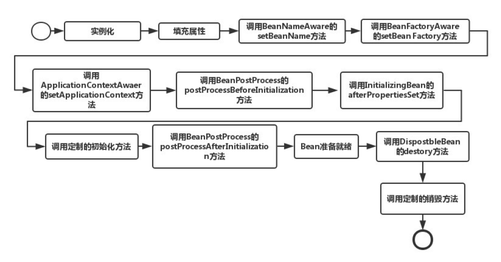
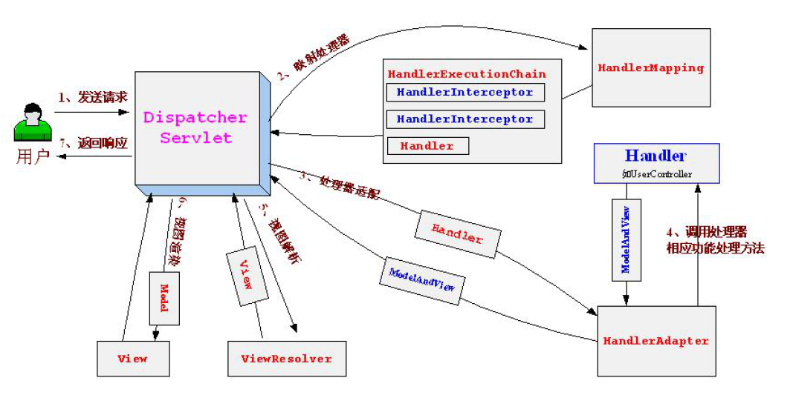
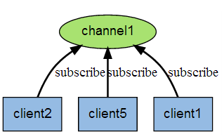
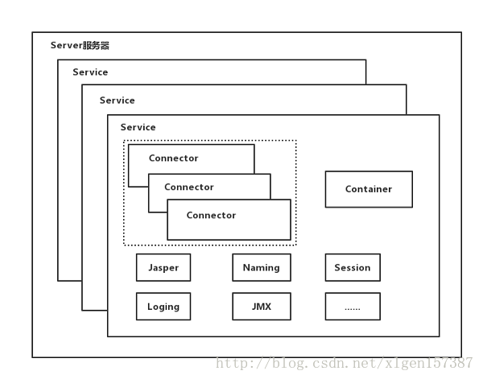

十．Java中的框架
================

10.1 Spring 
------------

### 10.1.1 什么是Spring 以及优点

Spring是个轻量ava企业级应用的开源开发框架。Spring主要用来开发Java应用，但是有些扩展是针对构建J2EE平台的web应用。Spring框架目标是简化Java企业级应用开发，并通过POJO为基础的编程模型促进良好的编程习惯。

**优点:**

**控制反转：**Spring通过控制反转实现了松散耦合，对象们给出它们的依赖，而不是创建或查找依赖的对象们。

**面向切面的编程(AOP)：**Spring支持面向切面的编程，并且把应用业务逻辑和系统服务分开。

**容器：**Spring包含并管理应用中对象的生命周期和配置。

**MVC框架**：Spring的WEB框架是个精心设计的框架，是Web框架的一个很好的替代品。

**事务管理：**Spring提供一个持续的事务管理接口，可以扩展到上至本地事务下至全局事务。

**异常处理：**Spring提供方便的API把具体技术相关的异常转化为一致的unchecked异常。

### 10.1.2 Spring Bean生命周期

Spring 只帮我们管理单例模式 Bean 的完整生命周期，对于 prototype 的 bean ，Spring
在创建好交给使用者之后则不会再管理后续的生命周期。流程如下所示：

Spring的加载流程：https://www.cnblogs.com/xrq730/p/6285358.html

### 10.1.3 [Spring中bean的作用域](https://www.cnblogs.com/plan123/p/5609833.html)

**默认是单例**

| **作用域** | **字符**  | **描述**                 |
|------------|-----------|--------------------------|
| 单例       | singleton | 整个应用中只创建一个实例 |
| 原型       | prototype | 每次注入时都新建一个实例 |
| 会话       | session   | 为每个会话创建一个实例   |
| 请求       | request   | 为每个请求创建一个实例   |

### 10.1.4 Spring IOC

**IOC**:IOC利用Java反射机制，AOP利用代理模式。

即“控制反转”，不是什么技术，而是一种设计思想。在Java开发中，Ioc意味着将你设计好的对象交给容器控制，而不是传统的在你的对象内部直接控制。

**谁控制谁，控制什么：**传统Java
SE程序设计，直接在对象内部通过new进行创建对象，是程序主动去创建依赖对象；而IoC是有专门一个容器来创建这些对象，即由Ioc容器来控制对

象的创建；谁控制谁？当然是IoC
容器控制了对象；控制什么？那就是主要控制了外部资源获取（不只是对象包括比如文件等）。

**为何是反转，哪些方面反转了：**有反转就有正转，传统应用程序是由自己在对象中主动控制去直接获取依赖对象，也就是正转；而反转则是由容器来帮忙创建及注入依赖对象。为何是反转？因为由容器帮我们查找及注入依赖对象，对象只是被动的接受依赖对象，所以是反转；哪些方面反转了？**依赖对象的获取被反转了。**

**DI—Dependency
Injection，即“依赖注入”：**组件之间依赖关系由容器在运行期决定，形象的说，即由容器动态的将某个依赖关系注入到组件之中。通过依赖注入机制，只需要通过简单的配置，而无需任何代码就可指定目标需要的资源，就能完成自身的业务逻辑，而**不需要关心具体的资源来自何处，由谁实现。**

谁依赖于谁：当然是应用程序依赖于IoC容器；

为什么需要依赖：应用程序需要IoC容器来提供对象需要的外部资源；

谁注入谁：很明显是IoC容器注入应用程序某个对象，应用程序依赖的对象；

注入了什么：就是注入某个对象所需要的外部资源（包括对象、资源、常量数据）。

**IoC和DI其实是同一个概念的不同角度描述，**由于控制反转概念比较含糊（可能只是理解为容器控制对象这一个层面，很难让人想到谁来维护对象关系），所以2004年大师级人物Martin
Fowler又给出了一个新的名字：“依赖注入”，相对IoC
而言，“依赖注入”明确描述了“被注入对象依赖IoC容器配置依赖对象”**。**

**解决循环依赖：***https://blog.csdn.net/u010853261/article/details/77940767*

>   <https://wely.iteye.com/blog/2398246>

### 10.1.5 Spring AOP

AOP技术利用一种称为“横切”的技术，剖解开封装的对象内部，并将那些影响了多个类的公共行为封装到一个可重用模块，**并将其名为“Aspect”，即切面。**所谓“切面”，简单地说，就是将那些与业务无关，却为业务模块所共同调用的逻辑或责任封装起来，便于减少系统的重复代码，降低模块间的耦合度，并有利于未来的可操作性和可维护性。使用“横切”技术，*AOP*把软件系统分为两个部分：核心关注点和横切关注点。业务处理的主要流程是核心关注点，与之关系不大的部分是横切关注点。横切关注点的一个特点是，他们经常发生在核心关注点的多处，而各处都基本相似。比如权限认证、日志、事务处理。

AOP的作用在于分离系统中的各种关注点，将核心关注点和横切关注点分离开来。

纵观AOP编程，程序员只需要**参与三个部分：**

定义普通业务组件

定义切入点，一个切入点可能横切多个业务组件

定义增强处理，增强处理就是在AOP框架为普通业务组件织入的处理动作

所以进行AOP编程的关键就是**定义切入点和定义增强处理**，一旦定义了合适的切入点和增强处理，

AOP框架将自动生成AOP代理，即：**代理对象的方法=增强处理+被代理对象的方法。**

AOP是通过动态代理来实现的，Spring创建代理的规则为：

>   **默认使用JDK动态代理**来创建AOP代理，这样就可以为任何**接口实例**创建代理了

>   当需要代理的类不是代理接口的时候，Spring会切换为使用CGLIB代理，也可强制使用CGLIB。

**动态代理**：http://www.importnew.com/27772.html

如果使用spring mvc，那post请求跟put请求有什么区别啊

### 10.1.6 Spring 常用注解

**\@Component：**标准一个普通的spring Bean类

**\@Repository：**标注一个DAO组件类。

**\@Service：**标注一个业务逻辑组件类。

**\@Controller：**标注一个控制器组件类。

**\@Autowired：**依赖注入，只按照Type 注入

**\@Qualifier：**当容器中存在同样类型的多个bean时，可以使用 \@Qualifier
注解指定注入Bean 的名称

\@Resource：\@Resource 的作用相当于 \@Autowired，只不过\@Resource
默认按byName自动注入

**\@PostConstruct \@PreDestroy**方法：实现初始化和销毁bean之前进行的操作
**\@RequestMapping
：这**个注解用于将url映射到整个处理类或者特定的处理请求的方法。如\@RequestMapping(value=”/haha”,method=RequestMethod.GET)

**\@RequestParam
：**将请求的参数绑定到方法中的参数上，有required参数，默认情况下，required=true，也就是改参数必须要传。如果改参数可以传可不传，可以配置

required=false。

**\@RequestBody** ： \@RequestBody是指方法参数应该被绑定到HTTP请求Body上。

\@ResponseBody在输出JSON格式的数据时，会经常用到。

**\@Transactional：**事务注解。

注解深入：*https://www.ibm.com/developerworks/cn/opensource/os-cn-spring-iocannt/index.html*

如何获取请求参数：https://www.cnblogs.com/bigdataZJ/p/springmvc2.html

### 10.1.7 Spring MVC

Spring
MVC是一个基于MVC架构的用来简化web应用程序开发的应用开发框架，它是Spring的一个模块,无需中间整合层来整合，属于表现层的框架。在web模型中，MVC是一种很流行的框架，通过把Model，View，Controller分离，把较为复杂的web应用分成逻辑清晰的几部分，简化开发，减少出错，方便组内开发人员之间的配合。SpringMVC的核心架构如下：

具体流程：

**（1）首先用户发送请求——\>DispatcherServlet，前端控制器收到请求后自己不进行处理，而是委托给其他的解析器进行处理，作为统一访问点，进行全局的流程控制。**

**（2）DispatcherServlet——\>HandlerMapping，映射处理器将会把请求映射为HandlerExecutionChain对象（包含一个Handler处理器（页面控制器）对象、多个HandlerInterceptor拦截器）对象。**

**（3）DispatcherServlet——\>HandlerAdapter，处理器适配器将会把处理器包装为适配器，从而支持多种类型的处理器，即适配器设计模式的应用，从而很容易支持很多类型的处理器。**

**（4）HandlerAdapter——\>调用处理器相应功能处理方法，并返回一个ModelAndView对象（包含模型数据、逻辑视图名）。**

**（5）ModelAndView对象（Model部分是业务对象返回的模型数据，View部分为逻辑视图名）—\>
ViewResolver， 视图解析器将把逻辑视图名解析为具体的View。**

**（6）View——\>渲染，View会根据传进来的Model模型数据进行渲染，此处的Model实际是一个Map数据结构。**

**（7）返回控制权给DispatcherServlet，由DispatcherServlet返回响应给用户，到此一个流程结束。**

### 10.1.8 Spring中设计模式

**第一种：简单工厂**

简单工厂模式的实质是由一个工厂类根据传入的参数，动态决定应该创建哪一个产品类。Spring中的BeanFactory就是简单工厂模式的体现，根据传入一个唯一的标识来获得bean对象，但是否是在传入参数后创建还是传入参数前创建这个要根据具体情况来定。、

**第二种：单例模式（Singleton）**

保证一个类仅有一个实例，并提供一个访问它的全局访问点。Spring中的单例模式完成了后半句话，即提供了全局的访问点BeanFactory。但没有从构造器级别去控制单例，这是因为spring管理的是是任意的Java对象。

**Spring下默认的bean均为singleton，可以通过singleton=“true\|false”来指定。**

**第三种：适配器（Adapter）**

在Spring的Aop中，使用的Advice（通知）来增强被代理类的功能。Spring实现这一AOP功能的原理就使用代理模式（1、JDK动态代理。2、CGLib字节码生成技术代理。）对类进行方法级别的切面增强，即生成被代理类的代理类，
并在代理类的方法前，设置拦截器，通过执行拦截器重的内容增强了代理方法的功能，实现的面向切面编程。

**第四种：代理（Proxy）**

为其他对象提供一种代理以控制对这个对象的访问。从结构上来看和Decorator模式类似，但Proxy是控制，更像是一种对功能的限制，而Decorator是增加职责。Spring的Proxy模式在aop中有体现，比如JdkDynamicAopProxy和Cglib2AopProxy。

**第五种：观察者（Observer）**

定义对象间的一种一对多的依赖关系，当一个对象的状态发生改变时，所有依赖于它的对象都得到通知并被自动更新。Spring中Observer模式常用的地方是listener的实现。如ApplicationListener。

具体内容：<https://www.cnblogs.com/jifeng/p/7398852.html>

10.2 Servlet
------------

### 10.2.1 Servlet是什么

Servlet是基于Java技术的Web组件，由容器管理并产生动态的内容。Servlet引擎作为WEB服务器的扩展提供支持Servlet的功能。Servlet与客户端通过Servlet容器实现的请

求/响应模型进行交互。

Servlet的确已经能够帮我们完成所有的工作了，但是现在web应用很少有直接将交互全部页面都用Servlet来实现，而是采用更加高效的MVC框架来实现。这些MVC框架基本的原理都是将所有的请求都映射到一个Servlet，然后去实现service方法，这个方法也就是MVC框架的入口。

### 10.2.2 Servlet生命周期

1.创建Servlet对象，通过服务器反射机制创建Servlet对象，第一次请求时才会创建。

2.调用Servlet对象的init()方法，初始化Servlet的信息，init()方法只会在创建后被调用一次。

3.响应请求，调用service()或者是doGet()，doPost()方法来处理请求，这些方法是运行的在多线程状态下的。

4.在长时间没有被调用或者是服务器关闭时，会调用destroy()方法来销毁Servlet对象。

### 10.2.3 Servlet线程安全问题

Servlet容器默认是采用**单实例多线程**的方式处理多个请求的。当web服务器启动的时候（或客户端发送请求到服务器时），Servlet就被加载并实例化(只存在一个Servlet实例)。

当多个客户端并发访问同一个Servlet时，web服务器会为每一个客户端的访问请求创建一个线程，并在这个线程上调用Servlet的service方法，因此service方法内如果访问了**同一个资源**的话，就有可能引发线程安全问题。

防止线程安全的问题就是避免使用实例变量，采用局部变量的形式。如果应用程序设计无法避免使用实例变量，那么使用同步来保护要使用的实例变量，但为保证系统的最佳性能，应该同步可用性最小的代码路径。

### 10.2.4 Servlet和Filter的区别

**从四个方面来区分：**

**1.概念**

servlet是一种运行在服务器端的Java应用程序，独立于平台和协议，可以动态的生成web页面，它工作于客户端请求和服务器的中间层

filter是一个可以复用的代码片段，可以用来转换请求，响应以及头信息，filter不能产生请求和响应，他只能在请求到达servlet之前对请求进行修改，或者在请求返回客户端之前对响应进行处理

**2.生命周期**

servlet是在系统启动或者请求到达servlet时，通过init（）方法进行初始化，一旦被装入了web服务器，一般不会从Web服务器删除，直到服务器关闭才会调用destroy（）方法进行销毁。每次请求，Request都会被初始化，响应请求后，请求被销毁。但是servlet

不会随着请求的销毁而销毁

filter是在系统启动的时候通过init（）初始化的，每次请求都只会调用dofiter方法进行处理，服务器停止的时候调用destroy()进行销毁

**注意：**服务器关闭时，servlet和filter依次销毁

**3.职责**

servlet可以动态创建基于客户请求的页面；可以读取客户端发来的隐藏数据和显示数据；可以和其他的服务器资源进行通讯；通过状态代码和响应头向客户端返回数据。

filter主要是对请求到达servlet之前对请求和请求头信息进行前处理，和对数据返回客户端之前进行后处理

**4.区别**

servlet的流程比较短，url来了之后就对其进行处理，处理完就返回数据或者转向另一个页面

filter的流程比较长，在一个filter处理之后还可以转向另一个filter进行处理，然后再交给servlet，但是servlet处理之后不能向下传递了。

filter可用来进行字符编码的过滤，检测用户是否登陆的过滤，禁止页面缓存等

### 10.2.5 Servlet和JSP区别

JSP(Java Server
Pages)是以Java语言为基础的动态网页开发技术，可以在html源码中嵌入Java代码。

**JSP的本质就是Servlet**，JVM只能识别Java的类，不能识别JSP的代码,Web容器将JSP的代码编译成JVM能够识别的Java类。

**JSP 工作原理：**

JSP页面在执行的时候都会被服务器端的JSP引擎转换为Servelet（.java），然后又由JSP引擎调用Java编译器，将Servelet（.java）编译为Class文件（.class），并由Java虚拟机（JVM）解释执行。

10.3 MyBatis
------------

MyBatis是一款优秀的持久层框架，它支持**定制化SQL**、存储过程以及高级映射。MyBatis避免了几乎所有的JDBC代码和手动设置参数以及获取结果集。MyBatis可以使用简单的XML或注解来配置和映射原生信息，将接口和Java的POJOs(Plain
Old Java Objects,普通的Java对象)映射成数据库中的记录。

MyBatis的强大特性之一便是**它的**[动态SQL](http://www.mybatis.org/mybatis-3/zh/dynamic-sql.html)**。**

1.  **\#{}和\${}的区别是：**

**\#{
}：占位符，**防止sql注入,使用\#{}格式的语法在mybatis中使用Preparement语句来安全的设置值

如：order by \#{user_id}

如果传入的值是111,那么解析成sql时的值为order by "111"

如果传入的值是id，则解析成的sql为order by "id"

**\${ }：sql拼接符号,**将传入的数据直接显示生成在sql中(order by)

如：order by \${user_id}

如果传入的值是111,那么解析成sql时的值为order by 111

如果传入的值是id，则解析成的sql为order by id

2.**最佳实践中，通常一个Xml映射文件，都会写一个Dao接口与之对应，请问，这个Dao接口的工作原理是什么？Dao接口里的方法，参数不同时，方法能重载吗？**

答：Dao接口，就是人们常说的Mapper接口，接口的全限名，就是映射文件中的namespace的值，接口的方法名，就是映射文件中MappedStatement的id值，接口方法内的参数，就是传递给sql的参数。Mapper接口是没有实现类的，当调用接口方法时，接口全限名+方法名拼接字符串作为key值，可唯一定位一个MappedStatement，举例：com.mybatis3.mappers.StudentDao.findStudentById，可以唯一找到namespace为com.mybatis3.mappers.StudentDao下面id
=
findStudentById的MappedStatement。在Mybatis中，每一个\<select\>、\<insert\>、\<update\>、\<delete\>标签，都会被解析为一个MappedStatement对象。

Dao接口里的方法，是不能重载的，因为是全限名+方法名的保存和寻找策略。Dao接口的工作原理是JDK动态代理，Mybatis运行时会使用JDK动态代理为Dao接口生成代理proxy对象，代理对象proxy会拦截接口方法，转而执行MappedStatement所代表的sql，然后将sql执行结果返回。

3. Mybatis动态sql是做什么的？都有哪些动态sql？能简述一下动态sql的执行原理不？

答：Mybatis动态sql可以让我们在Xml映射文件内，以标签的形式编写动态sql，完成逻辑判断和动态拼接sql的功能，Mybatis提供了9种动态sql标签**trim\|where\|set\|foreach\|if\|choose\|when\|otherwise\|bind**。

其执行原理为，使用OGNL从sql参数对象中计算表达式的值，根据表达式的值动态拼接sql，以此来完成动态sql的功能。

4. **Mybatis是否支持延迟加载？如果支持，它的实现原理是什么？**

答：Mybatis仅支持association关联对象和collection关联集合对象的延迟加载，association指的就是一对一，collection指的就是一对多查询。在Mybatis配置文件中，可以配置是否启用延迟加载lazyLoadingEnabled=true\|false。

它的原理是，使用CGLIB创建目标对象的代理对象，当调用目标方法时，进入拦截器方法，比如调用a.getB().getName()，拦截器invoke()方法发现a.getB()是null值，那么就会单独发送事先保存好的查询关联B对象的sql，把B查询上来，然后调用a.setB(b)，于是a的对象b属性就有值了，接着完成a.getB().getName()方法的调用。这就是延迟加载的基本原理。

**5.为什么说Mybatis是半自动ORM映射工具？它与全自动的区别在哪里？**

答：Hibernate属于全自动ORM映射工具，使用Hibernate查询关联对象或者关联集合对象时，可以根据对象关系模型直接获取，所以它是全自动的。而Mybatis在查询关联对象或关联集合对象时，需要手动编写sql来完成，所以，称之为半自动ORM映射工具。MyBatis需要程序员自己编写Sql语句。Mybatis可以通过XML或注解方式灵活配置要运行的sql语句，并将Java对象和sql语句映射生成最终执行的sql，最后将sql执行的结果再映射生成

Java对象。

快速入门：<https://blog.csdn.net/lj1314ailj/article/details/79712305>

更多内容：*https://baijiahao.baidu.com/s?id=1595741802791134948*

>   https://www.cnblogs.com/huajiezh/p/6415388.html

10.4 Redis
----------

Redis是一种支持Key-Value等多种数据结构的存储系统(NoSQL)。可用于缓存，事件发布或订阅，高速队列等场景。该数据库使用ANSI
C语言编写，支持网络，提供字符串，哈希，列表，队列，集合结构直接存取，基于内存，可持久化。

Redis不支持事务，但是通过提供了打包执行的功能，即这个包里面的所有命令必须要一起执行，此外还可以锁定某个Key，在打包执行命令时如果检测到这个Key发生了变化，则直接回滚。

Redis使用单线程的IO复用模型。

### 10.4.1 发布与订阅

>   Redis的发布与订阅（发布/订阅）是它的一种消息通信模式，一方发送信息，一方接收信息。下图是三个客户端同时订阅同一个频道。

下图是有新信息发送给频道1时，就会将消息发送给订阅它的三个客户端：

### 10.4.2 持久化机制

两种持久化机制是RDB和AOF机制。

**RDB持久化是**指用数据集快照的方式记录redis数据库的所有键值对。

两个命令：SAVE命令会阻塞主进程来完成写文件，BGSAVE命令会创建子进程来完成写文件，主进程会继续处理命令。

**优点**：

1.只有一个文件dump.rdb，方便持久化。

2.容灾性好，一个文件可以保存到安全的磁盘。

3.性能最大化，fork子进程来完成写操作，让主进程继续处理命令，所以是IO最大化。

4.相对于数据集大时，比AOF的启动效率更高。

**缺点：**

1.数据安全性低，通过配置save参数来达到定时的写快照，比如 每900
秒有1个键被修改就进行一次快照，每600秒至少有10个键被修改进行快照，每30秒有至少10000个键被修改进行记录。所以如果当服务器还在等待写快照时出现了宕机，那么将会丢失数据。

2.fork子进程时可能导致服务器停机1秒，数据集太大。

**AOF持久化**是指所有的命令行记录以redis命令请求协议的格式保存为aof文件。

**优点：**

1.数据安全，aof持久化可以配置appendfsync属性，有always，每进行一次命令操作就记录到aof文件中一次；everySec，就是每秒内进行一次文件的写操作；no就是不进行aof文件的写操作。

2.通过append模式写文件，即使中途服务器宕机，可以通过redis-check-aof工具解决数据一致性问题。

3.AOF机制的rewrite模式，用来将过大的aof文件缩小，实现原理是将所有的set通过一句set命令总结，所有的SADD命令用总结为一句，这样每种命令都概括为一句来执行，就可以减少aof文件的大小了。（注意，在重写的过程中，是创建子进程来完成重写操作，主进程每个命令都会在AOF缓冲区和AOF重写缓冲区进行保存，这样旧版aof文件可以实现数据最新，当更新完后将重写缓冲区中的数据写入新的aof文件中然后就可以将新的文件替换掉旧版的文件）。

**缺点：**

1.文件会比RDB形式的文件大。

2.数据集大的时候，比rdb启动效率低。

详细内容：<https://www.cnblogs.com/xingzc/p/5988080.html>

主从复制：《[Redis设计与实现》](https://www.cnblogs.com/lukexwang/p/4711977.html)

<https://www.cnblogs.com/kismetv/p/9236731.html>

### 10.4.3 Redis 解决键冲突

当有两个或以上数量的键被分配到了哈希表数组的同一个索引上面时，就称这些键发生了冲突（collision）。

Redis的哈希表使用链地址法（separate
chaining）来解决键冲突：每个哈希表节点都有一个next指针，多个哈希表节点可以用next指针构成一个单向链表，被分配到同一个索引上的多个节点可以用这个单向链表连接起来，这就解决了键冲突的问题。（每次都是在头部插入）

### 10.4.4 Redis常用的数据类型

Redis一共支持五种数据类型：string（字符串），hash（哈希），list（列表），set（集合）和zset（sorted
set有序集合）。

1、String：Strings就是一个最最简单的Key-Value形式存储的变量。其中Value既可以是数字也可以是字符串。其实现方式是在Redis内部默认存储一个字符串，被redisObject引用，当检测到数字操作如自增自减incr、decr等等命令时，自动转化为数字进行计算，计算完毕后再转化为String存储起来。

2、Hash:Hash存储是键值对的value。即Key-Hash，而Hash又是一个k-v的结构，如果使用的Memcached，则需要把整个Hash打包存储在内存中，如果需要查询其中某个值，还要全部取出整个Hash，再查找对应值。而Redis可以直接通过命令获取到Value，大大提高了性能。
其实现原理：当成员较少时，Redis为了节约内存会采用类似一维数组的紧凑存储，而当对象较多时，则直接转为HashMap存储。

3、Set：Set是一个无序的天然去重的集合，即Key-Set。此外还提供了交集、并集等一系列直接操作集合的方法，对于求共同好友、共同关注什么的功能实现特别方便。其底层是靠HashMap实现的，其中value为null；

4、List：List是一个有序可重复的集合，其遵循FIFO的原则，底层是依赖双向链表实现的，因此支持正向、反向双重查找。通过List，我们可以很方面的获得类似于最新回复这类的功能实现。

5、SortedSet：类似于java中的TreeSet，是Set的可排序版。此外还支持优先级排序，维护了一个score的参数来实现。其底层主要依赖HashMap来实现的，通过维持插入的数值和Score优先级的映射来进行排序。

### 10.4.5 Redis使用场景

Redis使用内存提供存储，通过持久化功能保存数据。且针对request是单线程操作。https://blog.csdn.net/hguisu/article/details/8836819

1、查找最新的回复。

如果在传统的关系型数据库，这就需要使用select \* from table where name="" order
by time desc limit
100；这十分消耗数据库性能，但是通过Redis，就可以直接在Redis里面通过Id创建一个List，指定长度1w，当需要查找时，直接输出该list的后100条记录。

2、排行问题

常见的排行问题，例如最热话题、游戏排名等等，这些都可以通过Redis来轻松实现，直接使用ZRank即可得到。

3、删除过期数据

Redis不是真正意义上的可持久化数据库，可以给数据加上一个有效时间，在有效时间超过时，Redis会自动删除对应数据。

**更多应用场景：https://blog.csdn.net/hguisu/article/details/8836819**

其他：*Redis实现摇一摇与附近的人功能*

### 10.4.6 面试题

#### 10.4.6.1 在项目中缓存是如何使用的？缓存如果使用不当会造成什么后果？

主要用来缓存一些用户的查询信息，比如联系人列表，就不用每次都去查询数据库，直接从缓存中获取

对数据库的访问压力反而变大

#### 10.4.6.2 redis的线程模型是什么？为什么单线程的redis效率要高得多？

redis是单线程模型

效率高的原因：单线程减少了线程间切换和锁的开销，基于内存实现，采用多路复用非阻塞IO实现

#### 10.4.6.3 redis都有哪些数据类型？分别在哪些场景下使用比较合适？

（1）string:最基本的类型了，用来做简单的kv缓存

（2）hash：类似map的一种结构，这个一般就是可以将结构化的数据

比如一个对象（前提是这个对象没嵌套其他的对象）给缓存在redis里，然后每次读写缓存的时候，可以就操作hash里的某个字段。

（3）list：有序列表

可以通过list存储一些列表型的数据结构，类似粉丝列表了、文章的评论列表

可以通过lrange命令，基于redis实现简单的高性能分页

（4）set：无序集合，自动去重

直接基于set将系统里需要去重的数据扔进去，自动就给去重了

可以基于set玩儿交集、并集、差集的操作，比如交集吧

（5）sorted set

排序的set，去重而且可以排序，

可以自定义排序，实现类似排行榜的功能

#### 10.4.6.5 redis的过期策略都有哪些？手写一下LRU代码实现？

首先如果为Key设置了过期时间后，当其失效时，会进行被动删除和，定时删除，主动删除（当前已用内存超过maxmemory限定时，触发主动清理策略，可配置数据淘汰策略）。

如果内存空间占用过多，一般有六种种策略：

volatile-lru：从已设置过期时间的数据集中挑选最近最少使用的数据淘汰；

volatile-ttl：从已设置过期时间的数据集中挑选将要过期的数据淘汰；

volatile-random：从已设置过期时间的数据集中任意选择数据淘汰 ；

allkeys-lru：从数据集中挑选最近最少使用的数据淘汰；

allkeys-random：从数据集中任意选择数据淘汰；

no-enviction（驱逐）：禁止驱逐数据。

LRU的实现可以通过继承LinkedHashMap并重写protected boolean
removeEldestEntry(Map.Entry eldest){}方法实现

#### 10.4.6.6 如何保证Redis高并发、高可用？

redis高并发：主从架构，一主多从，一般来说，很多项目其实就足够了，单主用来写入数据，单机几万QPS，多从用来查询数据，多个从实例可以提供每秒10万的QPS。

redis高可用：如果你做主从架构部署，其实就是加上哨兵就可以了，就可以实现，任何一个实例宕机，自动会进行主备切换。

redis高并发的同时，还需要容纳大量的数据就需要redis集群，而且用redis集群之后，可以提供可能每秒几十万的读写并发。

#### 10.4.6.7 redis的持久化有哪几种方式？不同的持久化机制都有什么优缺点？

redis的持久化是为了在重启后恢复数据

RDB是通过保存数据快照来实现的，优点是恢复速度快、占用带宽小，缺点是可能丢失数据

AOF是通过追加日志的形式来保存的，优缺点相反

#### 10.4.6.8 redis集群模式的工作原理能说一下么？在集群模式下，redis的key是如何寻址的？分布式寻址都有哪些算法？了解一致性hash算法吗？如何动态增加和删除一个节点？

redis集群主要是为了突破单机redis在海量数据面前的内存瓶颈。

redis的集群架构支撑N个redis master node，每个master node都可以挂载多个slave node

采用读写分离的架构，对于每个master来说，写就写到master，然后读就从mater对应的slave去读

实现了高可用，因为每个master都有salve节点，那么如果mater挂掉，就会自动将某个slave切换成master

在redis集群架构下，每个redis要放开两个端口号，比如一个端口用来进行节点间通信的，进行故障检测，配置更新，故障转移授权;
另一个端口用来客户端通信。

#### 10.4.6.9 了解什么是redis的雪崩和穿透？redis崩溃之后会怎么样？系统该如何应对这种情况？如何处理redis的穿透？

redis的雪崩：同时有大量缓存失效或者缓存机器宕机，请求全部转发到DB，DB瞬时压力过重雪崩。

解决方法：服务限流或者降级，尽量设置随机的缓存时间，设置redis持久化，快速恢复数据方案吗

缓存穿透：是指查询一个一定不存在的数据

解决方法：布隆过滤器，或者对不存在的数据进行缓存（过期时间较短）

#### 10.4.6.10 如何保证缓存与数据库的双写一致性？

Cache Aside Pattern

（1）读的时候，先读缓存，缓存没有的话，那么就读数据库，然后取出数据后放入缓存，同时返回响应

（2）更新的时候，先删除缓存，然后再更新数据库（再次删除）

#### 10.4.6.11 redis的并发竞争问题是什么？如何解决这个问题？了解Redis事务的CAS方案吗？

redis的并发竞争问题是多客户端同时并发写一个 key，解决方法：分布式锁，加时间戳

redis事务的CAS方案（乐观锁）工作机制：

watch指令在redis事务中提供了类似于CAS的行为。为了检测被watch的keys在是否有多个clients同时改变引起冲突，这些keys将会被监控。如果至少有一个被监控的key在执行exec命令前被修改，整个事物将会回滚，不执行任何动作，从而保证原子性操作，并且执行exec会得到null的回复。注意watch的key是对整个连接有效的，事务也一样。如果连接断开，监视和事务都会被自动清除。

10.5 Tomcat
-----------

Tomcat是Apache开发的一个Servlet容器，实现了对Servlet和JSP的支持，并提供了作为Web服务器的一些特有功能，如Tomcat管理和控制平台、安全域管理和Tomcat阀等。

Tomcat中最顶层的容器是Server，代表着整个服务器，从下图中可以看出，一个Server可以包含至少一个Service，用于具体提供服务。Service主要包含两个部分：Connector和Container。一个Tomcat中只有一个Server，一个Server可以包含多个Service，一个Service只有一个Container，但是可以有多个Connectors，这是因为一个服务可以有多个连接，如同时提供Http和Https链接，也可以提供向相同协议不同端口的连接。Connector用于接受请求并将请求封装成Request和Response来具体处理，Container用于封装和管理Servlet，以及具体处理request请求。

多个Connector和一个Container就形成了一个Service，有了Service就可以对外提供服务了，Service由Server控制，整个Tomcat
的生命周期由Server 控制。

**Tomcat的处理过程：**

一个请求发送到Tomcat之后，首先经过Service然后会交给我们的Connector，Connector用于接收请求并将接收的请求封装为Request和Response来具体处理，Request和Response封装完之后再交由Container进行处理，Container处理完请求之后再返回给Connector，最后在由Connector通过Socket将处理的结果返回给客户端，这样整个请求的就处理完了！

>   **Connector和Container的处理过程：https://blog.csdn.net/xlgen157387/article/details/79006434**

10.6 Netty
----------

### 10.6.1 Netty是什么

Netty是一款基于NIO开发的**高性能和异步事件驱动**的网络通信框架，支持高并发，传输速度快，封装好。

**高并发：**对比于BIO，并发性能得到了很大提高。

**传输快：**Netty的传输依赖于零拷贝特性，尽量减少不必要的内存拷贝，实现了更高效率的传输。

**封装好：**Netty封装了NIO操作的很多细节，提供了易于使用调用接口。

典型的应用有：阿里分布式服务框架Dubbo，默认使用Netty作为基础通信组件，还有
RocketMQ也是使用Netty作为通讯的基础。

### 10.6.2 Netty高性能的表现

**IO线程模型：**同步非阻塞，用最少的资源做更多的事。

**内存零拷贝：**尽量减少不必要的内存拷贝，实现了更高效率的传输。

**内存池设计：**申请的内存可以重用，主要指直接内存。内部实现是用一颗二叉查找树管理内存分配情况。

**串形化处理读写：**避免使用锁带来的性能开销。

**高性能序列化协议**：支持protobuf等高性能序列化协议。

### 10.6.3 Netty的零拷贝

**Netty的零拷贝主要包含三个方面：**

Netty的接收和发送ByteBuffer采用DIRECT
BUFFERS，使用堆外直接内存进行Socket读写，不需要进行字节缓冲区的二次拷贝。如果使用传统的堆内存（HEAP
BUFFERS）进行Socket读写，JVM会将堆内存Buffer拷贝一份到直接内存中，然后才写入Socket中。相比于堆外直接内存，消息在发送过程中多了一次缓冲区的内存拷贝。

Netty提供了组合Buffer对象，可以聚合多个ByteBuffer对象，用户可以像操作一个Buffer那样方便的对组合Buffer进行操作，避免了传统通过内存拷贝的方式将几个小Buffer合并成一个大的Buffer。

Netty的文件传输采用了transferTo方法，它可以直接将文件缓冲区的数据发送到目标

Channel，避免了传统通过循环write方式导致的内存拷贝问题。

### 10.6.4 TCP粘包/拆包的问题解决

TCP是一个“流”协议，所谓流，就是没有界限的一长串二进制数据。TCP作为传输层协议并不不了解上层业务数据的具体含义，它会根据TCP缓冲区的实际情况进行数据包的划分，所以在业务上认为是一个完整的包，可能会被TCP拆分成多个包进行发送，也有可能把多个小的包封装成一个大的数据包发送，这就是所谓的TCP粘包和拆包问题。

**粘包问题的解决策略：**由于底层的TCP无法理解上层的业务数据，所以在底层是无法保证数据包不被拆分和重组的，这个问题只能通过上层的应用协议栈设计来解决。业界的主流协议的解决方案，可以归纳如下：

1.消息定长，报文大小固定长度，例如每个报文的长度固定为200字节，如果不够空位补空格

2.包尾添加特殊分隔符，例如每条报文结束都添加回车换行符（例如FTP协议）或者指定特殊字符作为报文分隔符，接收方通过特殊分隔符切分报文区分；

3.将消息分为消息头和消息体，消息头中包含表示信息的总长度（或者消息体长度）的字段；

4.更复杂的自定义应用层协议。

**Netty粘包和拆包解决方案：**Netty提供了多个解码器，可以进行分包的操作，分别是：

LineBasedFrameDecoder（回车换行结尾）

DelimiterBasedFrameDecoder（添加特殊分隔符报文来分包）

FixedLengthFrameDecoder（使用定长的报文来分包）

LengthFieldBasedFrameDecoder（按照应用层数据包的大小，拆包）

详细解释：https://blog.csdn.net/crazymakercircle/article/details/83957259

### 10.6.5 Reactor模式

反应器设计模式(Reactor
pattern)是一种为处理并发服务请求，并将请求提交到一个或者多个服务处理程序的事件设计模式。当客户端请求抵达后，服务处理程序使用多路分配策略，由一个非阻塞的线程来接收所有的请求，然后派发这些请求至相关的工作线程进行处理。

https://blog.csdn.net/pistolove/article/details/53152708

**李林峰：Netty系列之Netty高性能之道**

10.7 Restful 
-------------

REST的全称是Representational State
Transfer，中文含义为**表现层状态变化**。符合REST规范的设计，都可以称为RESTful设计。

RESTful的设计哲学主要将服务器提供的内容实体看作一个资源，并表现在URL上。对这个资源的操作，主要体现在HTTP请求的方法上，不是体现在URL上。

**所谓"资源"**，就是网络上的一个实体，或者说是网络上的一个具体信息。它可以是一段文本、一张图片、一首歌曲、一种服务，总之就是一个具体的实在。你可以用一个URI（统一资源定位符）指向它，每种资源对应一个特定的URI。要获取这个资源，访问它的URI就可以，因此URI就成了每一个资源的地址或独一无二的识别符。**"资源"是一种信息实体**，它可以有多种外在表现形式,把"资源"具体呈现出来的形式，叫做它的"表现层"（Representation）。比如图片可以用JPG格式表现，也可以用PNG格式表现。**URI只代表资源的实体，不代表它的形式.**

访问一个网站，就代表了客户端和服务器的一个互动过程。在这个过程中，势必涉及到数据和状态的变化。

互联网通信协议HTTP协议，是一个无状态协议。这意味着，所有的状态都保存在服务器端。因此，如果客户端想要操作服务器，必须通过某种手段，让服务器端发生"状态转化"（State
Transfer）。而这种转化是建立在表现层之上的，所以就是"表现层状态转化"。

**客户端用到的手段，只能是HTTP协议。**具体来说，就是HTTP协议里面，四个表示操作方式的动词：GET、POST、PUT、DELETE。它们分别对应四种基本操作：GET用来获取资源，POST用来新建资源（也可以用于更新资源），PUT用来更新资源，DELETE用来删除资源。

综上来看：

（1）每一个URI代表一种资源

（2）客户端和服务器之间，传递这种资源的某种表现层

（3）客户端通过四个HTTP动词，对服务器端资源进行操作，实现表现层状态转化
