九. 计算机网络
==============

9.1. HTTP
---------

### 9.1.1 http请求报文 & http响应报文

**HTTP请求报文分为三个部分：**请求行（包括请求方法、URI、HTTP版本信息）、请求头、消息主体。

HTTP定义了与服务器交互的不同方法，最基本的方法有4种，分别是GET，POST，PUT，DELETE。一个URL地址，它用于描述一个网络上的资源，而
HTTP 中的GET，POST，PUT，DELETE就对应着对这个资源的查，增，改，删4个操作。

HTTP请求格式、状态码及常用请求方法：<https://blog.csdn.net/cs958903980/article/details/52837281>

**HTTP响应报文**分为三个部分：状态行（包括HTTP版本、状态码、状态码的原因短语）、响应头、消息主体。

状态码(Status
Code)：描述了响应的状态。可以用来检查是否成功的完成了请求。请求失败的情况下，状态码可用来找出失败的原因。

HTTP头部(HTTP
Header)：它们包含了更多关于响应的信息。比如：头部可以指定认为响应过期的过期日期，或者是指定用来给用户安全的传输实体内容的编码格式。

主体(Body)：它包含了响应的内容。它可以包含HTML代码，图片，等等。主体是由传输在HTTP消息中紧跟在头部后面的数据字节组成的。

### 9.1.2 http 请求方法

**GET：**
用于请求访问已经被URI（统一资源标识符）识别的资源，可以通过URL传参给服务器。

**POST：**用于传输信息给服务器，主要功能与GET方法类似，但一般推荐使用POST方式。

**PUT：** 传输文件，报文主体中包含文件内容，保存到对应URI位置。

**DELETE：**删除文件，与PUT方法相反，删除对应URI位置的文件。

**HEAD：**
获得报文首部，与GET方法类似，只是不返回报文主体，一般用于验证URI是否有效。

**OPTIONS：**查询相应URI支持的HTTP方法。

### 9.1.3 http请求过程

**1、客户端连接到Web服务器：**一个HTTP客户端，通常是浏览器，与Web服务器的HTTP端口（默认为80）建立一个TCP套接字连接。

**2、发送HTTP请求：**通过TCP套接字，客户端向Web服务器发送一个文本的请求报文。

**3、服务器接受请求并返回HTTP响应：**Web服务器解析请求，定位请求资源。服务器将资源复本写到TCP套接字，由客户端读取。

4、**释放连接**[TCP连接](http://www.jianshu.com/p/ef892323e68f)**：**若connection
模式为close，则服务器主动关闭TCP连接，客户端被动关闭连接，释放[TCP连接](http://www.jianshu.com/p/ef892323e68f);若connection
模式为keepalive，则该连接会保持一段时间，在该时间内可以继续接收请求。

5、**客户端浏览器解析HTML内容：**客户端浏览器首先解析状态行，查看表明请求是否成功的状态代码。然后解析每一个响应头，响应头告知以下为若干字节的HTML文档和文档的字符集。客户端浏览器读取响应数据HTML，根据HTML的语法对其进行格式化，并在浏览器窗口中显示。

### 9.1.4 Get 和 Post 区别

**作用：**GET 用于获取资源，而 POST 用于传输实体主体。

**参数：**GET 和 POST 的请求都能使用额外的参数，但是 GET
的参数是以查询字符串出现在 URL 中，而 POST 的参数存储在实体主体中。但是不能因为
POST
参数存储在实体主体中就认为它的安全性更高，因为照样可以通过一些抓包工具（Fiddler）查看。Get传输的数据量小，因为受URL长度限制，但效率较高；Post可以传输大量数据，所以上传文件时只能用Post方式

**安全：**安全的 HTTP 方法不会改变服务器状态，也就是说它只是可读的。GET
方法是安全的，而 POST 却不是，因为 POST
的目的是传送实体主体内容，这个内容可能是用户上传的表单数据，上传成功之后，服务器可能把这个数据存储到数据库中，因此状态也就发生了改变。安全的方法除了
GET 之外还有：HEAD、OPTIONS。不安全的方法除了 POST 之

外还有 PUT、DELETE。GET请求可以被浏览器缓存，POST不能

**幂等性：**幂等的 HTTP
方法，同样的请求被执行一次与连续执行多次的效果是一样的，服务器的状态也是一样的。换句话说就是，幂等方法不应该具有副作用。所有的安全方法也都是幂等的。在正确实现的条件下，GET，HEAD，PUT
和 DELETE 等方法都是幂等的，而 POST 方法不是。

POST所对应的URI并非创建的资源本身，而是资源的接收者。比如：POST
http://www.forum.com/articles的语义是在http://www.forum.com/articles下创建一篇帖子，HTTP响应中应包含帖子的创建状态以及帖子的URI。两次相同的POST请求会在服务器端创建两份资源，它们具有不同的URI，所以，POST方法不具备幂等性。而PUT所对应的URI是要创建或更新的资源本身。比如：PUT
http://www.forum/articles/4231的语义是创建或更新ID为4231的帖子。对同一URI进行多次PUT的副作用和一次PUT是相同的；因此，PUT方法具有幂等性。

### 9.1.5 http状态码

**常见的HTTP相应状态码**

**100** Continue
表明到目前为止都很正常，客户端可以继续发送请求或者忽略这个响应。

**200** OK 客户端请求成功

**301** Moved Permanently 请求永久重定向

**302** Moved Temporarily 请求临时重定向

**304** Not Modified 文件未修改，可以直接使用缓存的文件。

**400** Bad Request 由于客户端请求有语法错误，不能被服务器所理解。

**401** Unauthorized 请求未经授权。

**403** Forbidden 服务器收到请求，但是拒绝提供服务。

**404** Not Found 请求的资源不存在，例如，输入了错误的URL

**500** Internal Server Error
服务器发生不可预期的错误，导致无法完成客户端的请求。

**503** Service Unavailable
服务器当前不能够处理客户端的请求，在一段时间之后，服务器可能会恢复正常

### 9.1.6 长连接 短连接 无状态

**无状态：**HTTP协议是无状态的，指的是协议对于事务处理没有记忆能力，服务器不知道客户端是什么状态。也就是说，打开一个服务器上的网页和上一次打开这个服务器上的网页之间没有任何联系。HTTP是一个无状态的面向连接的协议，无状态不代表HTTP不能保持TCP连接，更不能代表HTTP使用的是UDP协议（无连接）。

HTTP 协议是无状态的，主要是为了让 HTTP
协议尽可能简单，使得它能够处理大量事务。**HTTP/1.1 引入 Cookie
来保存状态信息**。Cookie
是服务器发送到用户浏览器并保存在本地的一小块数据，它会在浏览器之后向同一服务器再次发起请求时被携带上，用于告知服务端两个请求是否来自同一浏览器。由于之后每次请求都会需要携带
Cookie 数据，因此会带来额外的性能开销。

除了可以将用户信息通过 Cookie 存储在用户浏览器中，也可以利用 Session
存储在服务器端，存储在服务器端的信息更加安全。Session
可以存储在服务器上的文件、数据库或者内存中，也可以将 Session 存储在 Redis
这种内存型数据库中，效率会更高。

**短连接：**在HTTP/1.0中默认使用短连接。也就是说，客户端和服务器每进行一次HTTP操作，就建立一次连接，任务结束就中断连接。当客户端浏览器访问的某个HTML或其他类型的Web页中包含有其他的Web资源（如JavaScript文件、图像文件、CSS文件等），每遇到这样一个Web资源，浏览器就会重新建立一个HTTP会话。

**长连接：**而从HTTP/1.1起，默认使用长连接，用以保持连接特性。使用长连接的HTTP协议，会在响应头加入这行代码：Connection:keep-alive。

在使用长连接的情况下，当一个网页打开完成后，客户端和服务器之间用于传输HTTP数据的TCP连接不会关闭，客户端再次访问这个服务器时，会继续使用这一条已经建立的连接。Keep-Alive不会永久保持连接，它有一个保持时间，可以在不同的服务器软件（如Apache）中设定这个时间。实现长连接需要客户端和服务端都支持长连接。

**HTTP协议的长连接和短连接，实质上是TCP协议的长连接和短连接。**

**长连接多用于操作频繁，点对点的通讯，而且连接数不能太多情况**。每个TCP连接都需要三步握手，这需要时间，如果每个操作都是先连接，再操作的话那么处理速度会降低很多，所以每个操作完后都不断开，次处理时直接发送数据包就OK了，不用建立TCP连接。例如：数据库的连接用长连接，如果用短连接频繁的通信会造成socket错误，而且频繁的socket创建也是对资源的浪费。

而像WEB网站的http服务一般都用**短链接**，因为长连接对于服务端来说会耗费一定的资源，而像WEB网站这么频繁的成千上万甚至上亿客户端的连接用短连接会更省一些资源，如果用长连接，而且同时有成千上万的用户，如果每个用户都占用一个连接的话，那可想而知吧。**所以并发量大，但每个用户无需频繁操作情况下需用短连好。**

9.1.7 http1.0与http1.1的区别

**长连接（PersistentConnection）**

HTTP 1.1支持长连接（PersistentConnection），HTTP
1.0规定浏览器与服务器只保持短暂的连接，浏览器的每次请求都需要与服务器建立一个TCP连接，服务器完成请求处理后立即断开TCP连接，服务器不跟踪每个客户也不记录过去的请求。

**流水线（Pipelining）**

请求的流水线（Pipelining）处理，在一个TCP连接上可以传送多个HTTP请求和响应，减少了建立和关闭连接的消耗和延迟。例如：一个包含有许多图像的网页文件的多个请求和应答可以在一个连接中传输，但每个单独的网页文件的请求和应答仍然需要使用各自的连接。

HTTP
1.1还允许客户端不用等待上一次请求结果返回，就可以发出下一次请求，但服务器端必须按照接收到客户端请求的先后顺序依次回送响应结果，以保证客户端能够区分出每次请求的响应内容。

**host字段**

在HTTP1.0中认为每台服务器都绑定一个唯一的IP地址，因此，请求消息中的URL并没有传递主机名（hostname）。但随着虚拟主机技术的发展，在一台物理服务器上可以存在多个虚拟主机（Multi-homed
Web Servers），并且它们共享一个IP地址。

HTTP1.1的请求消息和响应消息都应支持Host头域，且请求消息中如果没有Host头域会报告一个错误（400
Bad Request）。此外，服务器应该接受以绝对路径标记的资源请求。

**100(Continue) Status**

HTTP/1.1加入了一个新的状态码100（Continue）。客户端事先发送一个只带头域的请求，如果服务器因为权限拒绝了请求，就回送响应码401（Unauthorized）；如果服务器接收此请求就回送响应码100，客户端就可以继续发送带实体的完整请求了。100
(Continue) 状态代码的使用，允许客户端在发request消息body之前先用request
header试探一下server，看server要不要接收request body，再决定要不要发request
body。

**cache**

HTTP/1.1在1.0的基础上加入了一些cache的新特性，当缓存对象的Age超过Expire时变为stale对象，cache不需要直接抛弃stale对象，而是与源服务器进行重新激活（revalidation）。

9.1.8 http1.0 与 http2.0的区别

**新的二进制格式（Binary
Format）**：HTTP1.x的解析是基于文本。基于文本协议的格式解析存在天然缺陷，文本的表现形式有多样性，要做到健壮性考虑的场景必然很多，二进制则不同，只认0和1的组合。基于这种考虑HTTP2.0的协议解析决定采用二进制格式，实现方便且健壮。

**多路复用（MultiPlexing）**：即连接共享，建立起一个连接请求后，可以在这个链接上一直发送，不要等待上一次发送完并且受到回复后才能发送下一个（http1.0是这样），是可以同时发送多个请求，互相并不干扰。

**header压缩：**如上文中所言，对前面提到过HTTP1.x的header带有大量信息，而且每次都要重复发送，HTTP2.0利用HPACK对消息头进行压缩传输，客服端和服务器维护一个

动态链表（当一个头部没有出现的时候，就插入，已经出现了就用表中的索引值进行替代），将既避免了重复header的传输，又减小了需要传输的大小。

**服务端推送（server
push）**：就是客户端请求html的时候，服务器顺带把此html需要的css,js也一起发送给客服端，而不像http1.0中需要请求一次html，然后再请求一次css，然后再请求一次js。

### 9.1.9 转发与重定向的区别

一句话，转发是服务器行为，重定向是客户端行为。

**转发过程：**客户浏览器发送http请求web服务器接受此请求调用内部的一个方法在容器内部完成请求处理和转发动作将目标资源发送给客户。

在这里，转发的路径必须是同一个web容器下的url，其不能转向到其他的web路径上去，中间传递的是自己的容器内的request。在客户浏览器路径栏显示的仍然是其第一次访问的路径，也就是说客户是感觉不到服务器做了转发的。转发行为是浏览器只做了一次访问请求。

**重定向过程：**客户浏览器发送http请求web服务器接受后发送302状态码响应及对应新的location给客户浏览器客户浏览器发现是302响应，则**自动**再发送一个新的http请求，请求url是新的location地址服务器根据此请求寻找资源并发送给客户。

在这里location可以重定向到任意URL，既然是浏览器重新发出了请求，则就没有什么request传递的概念了。在客户浏览器路径栏显示的是其重定向的路径，客户可以观察到地址的变化的。重定向行为是浏览器做了至少两次的访问请求的。

### 9.1.10 Cookie 与 Session

Cookies是服务器在本地机器上存储的小段文本并随每一个请求发送至同一个服务器。

具体来说Cookie机制采用的是在客户端保持状态的方案。它是在用户端的会话状态的存贮机制，主要是为了解决了HTTP协议无状态的缺陷。

Cookie的内容主要包括：**名字，值，过期时间，路径和域**。路径与域一起构成cookie的作用范围。若不设置过期时间，则表示这个cookie的生命期为浏览器会话期间，关闭浏览器窗口，cookie就消失。这种生命期为浏览器会话期的cookie被称为会话cookie。若设置了过期时间，浏览器就会把cookie保存到硬盘上，关闭后再次打开浏览器，这些cookie仍然有效直到超过设定的过期时间。

Session机制是一种服务器端的机制，服务器使用一种类似于散列表的结构（也可能就是使用散列表）来保存信息。当程序需要为某个客户端的请求创建一个session时，服务器首先检查这个客户端的请求里是否已包含了一个session标识（称为session
id），如果已包含则说明以前已经为此客户端创建过session，服务器就按照session
id把这个session检索出来使用（检索不到，会新建一个），如果客户端请求不包含session
id，则为此客户端创建一个session并且生成一个与此session相关联的session id。

**客户端保存这个session
id**的方式可以采用cookie，这样在交互过程中浏览器可以自动的按照规则把这个标识发挥给服务器。Cookie与Session都能够进行会话跟踪，但是完成的原理不太一样。

**隐私策略的不同**

Cookie存储在客户端中，对客户端是可见的，客户端的一些程序可能会窥探、复制以至修正Cookie中的内容。而Session存储在服务器上，对客户端是透明的，不存在敏感信息泄露的风险。

假如选用Cookie，比较好的方法是，敏感的信息如账号密码等尽量不要写到Cookie中。最好将Cookie信息加密，提交到服务器后再进行解密，保证Cookie中的信息只要本人能读得懂(设置HttpOnly
= true，那此Cookie
只能通过服务器端修改，本地Js是操作不了的)。但选择Session就省事多了，反正是放在服务器上，Session里任何隐私都能够有效的保护。

**有效期上的不同**

Cookie的过期时间属性为一个很大很大的数字，但是Session不能完成信息长时间有效的效果。而且假如设置Session的超时时间过长，服务器累计的Session就会越多，越容易招致内存溢出。

**服务器压力的不同**

Session是保管在服务器端的，每个用户都会产生一个Session。假如并发访问的用户十分多，会产生十分多的Session，耗费大量的内存。而Cookie保管在客户端，不占用服务器资源。

**浏览器支持的不同**

Cookie是需要客户端浏览器支持的。假如客户端禁用了Cookie，或者不支持Cookie，则Cookie会失效。

#### 9.1.11 cookie和token都存放在header里面，为什么只劫持前者？

cookie是有状态的，意味着验证记录或者会话需要一直在服务端或者客户端保持。而token是无状态的，服务器不记录哪些用户登录了或者哪些
JWT
被发布了，只判断token是否有效，通常我们都会给token设置有效时间，来确保不被劫持。所有劫持cookie比劫持token，更有效，毕竟cookie在某种情况下可以一直使用下去，而token不行。

9.2 TCP UDP
-----------

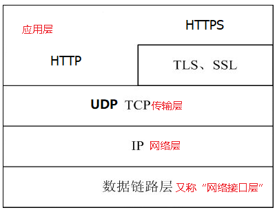

### 9.2.1 UDP

UDP是一种**属于传输层**的用户数据报**（User Datagram
Protocol）**协议，无连接，不保证传输的可靠性。对于来自应用层的数据包，直接加上**UDP报头**然后传送给IP。UDP头部中有一个校验和字段，可用于差错的检测，但是UDP是不提供差错纠正的。此外IPV4不强制这个校验和字段必须使用，但IPV6是强制要求使用的。

UDP报文没有可靠性保证、顺序保证和流量控制字段等，可靠性较差。但是正因为UDP协议的控制选项较少，在数据传输过程中延迟小、数据传输效率高，适合对可靠性要求不高的应用程序，或者可以保障可靠性的应用程序，如DNS、TFTP、SNMP等。

#### 9.2.1.1 UDP的报文结构

UDP在IP报文中的位置如下图所示：

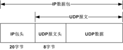

**UDP的报头结构如下**，其中：

1.源端口号如果不需要可以置0。

2.长度字段是UDP首部和UDP数据的总长度，这个字段是冗余的，因为IP中包含了数据报长度信息。

3.校验和字段是端到端的，它覆盖了UDP头部、UDP数据、一个伪头部、填充字节，由初始的发送方计算得到，由最终的目的方计算然后校验。

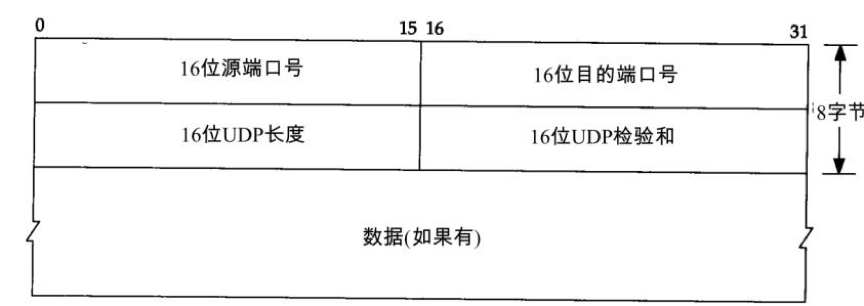

#### 9.2.1.2 UDP特性

UDP是一个无连接协议，传输数据之前源端和终端不建立连接，当UDP它想传送时就简单地去抓取来自应用程序的数据，并尽可能快地把它扔到网络上。在发送端，UDP传送数据的速度仅仅是受应用程序生成数据的速度、计算机的能力和传输带宽的限制;在接收端，UDP把每个消息段放在队列中，应用程序每次从队列中读一个消息段。

由于传输数据不建立连接，因此也就不需要维护连接状态，包括收发状态等，因此一台服务机可同时向多个客户机传输相同的消息。

UDP信息包的标题很短，只有8个字节，相对于TCP的20个字节信息包的额外开销很小。

吞吐量不受拥挤控制算法的调节，只受应用软件生成数据的速率、传输带宽、源端和终端主机性能的限制。

UDP使用尽最大努力交付，即不保证可靠交付，因此主机不需要维持复杂的链接状态表(这里面有许多参数)。

UDP是面向报文的。发送方的UDP对应用程序交下来的报文，在添加首部后就向下交付给IP层。既不拆分，也不合并，而是保留这些报文的边界，因此，应用程序需要选择合适的报文大小。

#### 9.2.1.3 UDP的缺陷

**UDP传输过程中存在的主要问题：**

>   **1.丢失和乱序：**因为UDP不提供ACK、序列号等机制，所以是没有办法知道是否有报文丢失以及接收方到达等报文顺序是否和发送方发送的报文数据一样。

>   **2.差错：**对于差错问题则是可以通过校验和等检测到，但是不提供差错纠正。

>   **3.数据完整性：**UDP协议头部虽然有16位的校验和，但是IPv4并不强制执行，也就是说UDP无法保证数据的完整性。

**UDP如何解决其传输过程中的问题：**

想要保证数据的可靠投递和正确排序，必须由**应用程序自己实现这些保护功能**，简单思路，既然原生UDP有那么多痛点，所以可以像应用层协议一样在UDP数据包头再加一段包头，从而定义为RUDP[（Reliable
UDP）](http://www.sohu.com/a/208825991_467759)。

>   **1.数据完整性：**加上一个16或者32位的CRC验证字段。

>   **2.乱序：**加上一个数据包序列号SEQ。

>   **3.丢包**：需要确认和重传机制，就是和Tcp类似的Ack机制（若中间包丢失可以通过序列号累计而检测到，但是一开始的包就丢失是没有办法通过序列号检测到的）

>   **4.协议字段**：protol字段，标识当前使用协议。

#### 9.2.1.4 UDP的可靠传输

简单的方式是在应用层模仿传输层TCP的可靠性传输（不考虑拥塞处理）。为每个UDP包添加额外的seq和crc校验字段。

实现一个应用层的超时重传机制，在**发送端**，建立了一个发送缓冲区队列，每个发送过的发送单元都将自动被添加到这个发送缓冲区中，然后由维护线程来管理。在维护线程中，定时遍历所有的发送缓冲区，检查那些没有被确认且还没达到发送最大值限制的发送单元，然后将它们发送出去，以此类推，直到所有的发送单元都被确认或者都达到发送最大值限制。

在数据到达**接收端**后，接收端放入缓存，并发送一个ack的包，表示对方已经收到了数据。发送端收到了ack包后，删除缓冲区对应的数据。

#### 9.2.1.5 对UDP一次发送多少bytes好

首先，TCP/IP通常被认为是一个四层协议系统，包括链路层、网络层、传输层、应用层。**UDP属于传输层,**下面由下至上一步一步来看:

以太网(Ethernet)数据帧的长度必须在46-1500字节之间,这是由以太网的物理特性决定

的。这个1500字节被称为链路层的**MTU(最大传输单元)**。
但这并不是指链路层的长度被限制在1500字节，其实这个MTU指的是链路层的数据区并不包括链路层的首部和尾部的18个字节。所以**事实上这个1500字节就是网络层IP数据报的长度限制。**因为IP数据报的首部为20字节，所以IP数据报的数据区长度最大为1480字节。而这个1480字节就是用来放TCP传来的TCP报文段或UDP传来的UDP数据报的。又因为UDP数据报的首部8字节，所以UDP数据报的数据区最大长度为1472字节。**这个1472字节就是可以使用的字节数。**

当发送的UDP数据大于1472，也就是说IP数据报大于1500字节，大于MTU。这个时候发送方IP层就需要分片(fragmentation)。把数据报分成若干片，使每一片都小于MTU。而接收方IP层则需要进行数据报的重组。这样就会多做许多事情，而更严重的是，由于UDP的特性，当某一片数据传送中丢失时，无法重组数据报，将导致丢弃整个UDP数据报。因此，在普通的局域网环境下，建议将UDP的数据控制在1472字节以下为好。

**UDP最大数据报长度：**有两个原因使得大小满额的数据报不能被端到端投递：一是系统的本地协议实现可能有一些限制；二是接收应用程序可能没准备好去接收这么大的数据。

**UDP数据报截断：**当UDP数据报长度超过接收端允许长度时，会发生数据报截断，之后会有几种处理：丢弃超过应用程序可接收字节的部分；将这些超出的数据存到后续的读操作；通知调用者被截断了多少数据；或者只通知被截断，但不通知具体截断数量。

### 9.2.2 TCP

**TCP（Transmission Control Protocol，传输控制协议）**是面向连接的协议，每一条
TCP连接只能有两个端点(endpoint),每一条TCP连接只能是点对点的（一对一），TCP提供可靠交付的服务，TCP提供全双工通信，面向字节流。TCP传送的数据单位协议是
TCP 报文段(segment)。

#### 9.2.2.1 TCP的报文格式

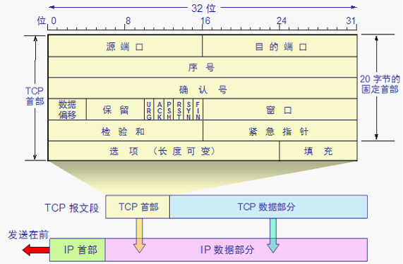

**各个段位说明:**

**源端口和目的端口**:各2
字节.端口是传输层与应用层的服务接口.传输层的复用和分用功能都要通过端口才能实现。

**序号:**占4字节.TCP
连接中传送的数据流中的每一个字节都编上一个序号.序号字段的值则指的是本报文段所发送的数据的第一个字节的序号。

**确认号**:占4字节,是期望收到对方的下一个报文段的数据的第一个字节的序号。

**数据偏移/首部长度**:占 4 位,它指出 TCP 报文段的数据起始处距离 TCP
报文段的起始处有多远。

**保留**:占 6 位,保留为今后使用,但目前应置为 0。

**紧急URG**:当URG=1时,表明紧急指针字段有效.它告诉系统此报文段中有紧急数据,应尽快传送(相当于高优先级的数据)。

**确认ACK:**只有当 ACK=1 时确认号字段才有效.当 ACK=0 时,确认号无效。

**PSH(PuSH):**接收 TCP 收到 PSH = 1
的报文段,就尽快地交付接收应用进程,而不再等到整个缓存都填满了后再向上交付。

**RST (ReSeT):**当 RST=1 时,表明 TCP
连接中出现严重差错（如由于主机崩溃或其他原因）,必须释放连接,然后再重新建立运输连接。

**同步SYN:**同步 SYN = 1 表示这是一个连接请求或连接接受报文。

**终止FIN:**用来释放一个连接.FIN=1表明此报文段的发送端的数据已发送完毕,并要求释放运输连接。

**检验和:**占 2
字节.检验和字段检验的范围包括首部和数据这两部分.在计算检验和时,要在 TCP
报文段的前面加上 12 字节的伪首部

紧急指针占 16 位,指出在本报文段中紧急数据共有多少个字节。

**选项:**长度可变.TCP 最初只规定了一种选项,即最大报文段长度 MSS.MSS 告诉对方
TCP：“我的缓存所能接收的报文段的数据字段的最大长度是 MSS 个字节.” [MSS(Maximum
Segment Size)是TCP报文段中的数据字段的最大长度.数据字段加上 TCP 首部才等于整个的
TCP 报文段]

**填充:**这是为了使整个首部长度是 4 字节的整数倍

**其他选项:**

>   **窗口扩大:**占3字节,其中有一个字节表示移位值 S.新的窗口值等于TCP
>   首部中的窗口位数增大到(16 + S),相当于把窗口值向左移动 S
>   位后获得实际的窗口大小

>   **时间戳:**占10字节,其中最主要的字段时间戳值字段(4字节)和时间戳回送回答字段(4字节)

>   **选择确认:**接收方收到了和前面的字节流不连续的两2字节.如果这些字节的序号都在接收窗口之内,那么接收方就先收下这些数据,但要把这些信息准确地告诉发送方,使发送方不要再重复发送这些已收到的数据

#### 9.2.2.2 TCP三次握手

三次握手发生在TCP连接的建立阶段：

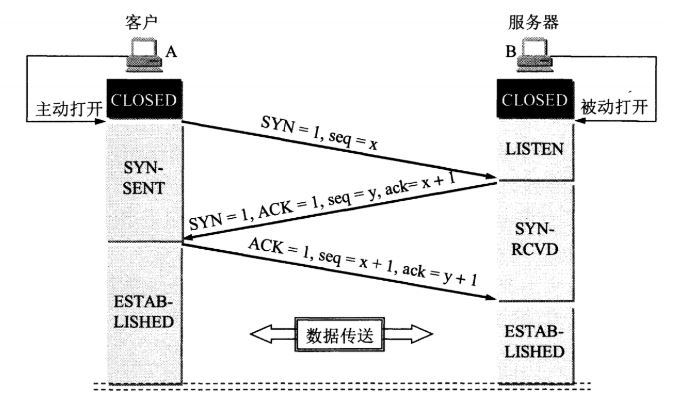

A的TCP向B发出连接请求报文段,其首部中的同步位SYN = 1,并选择序号 seq =
x,表明传送数据时的第一个数据字节的序号是 x

B的TCP收到连接请求报文段后,如同意,则发回确认(B在确认报文段中应使 SYN =
1,使ACK=1,其确认号ack =x﹢1,自己选择的序号 seq = y)

A收到此报文段后向 B 给出确认,其 ACK = 1,确认号 ack = y﹢1(A 的 TCP
通知上层应用进程,连接已经建立,B 的 TCP 收到主机 A
的确认后,也通知其上层应用进程：TCP 连接已经建立)。

**为什么是三次握手而不是采用两次握手？**

**第三次握手是为了防止失效的连接请求到达服务器，让服务器错误打开连接。**

**客户端发送的连接请求如果在网络中滞留，那么就会隔很长一段时间才能收到服务器端发回的连接确认。客户端等待一个超时重传时间之后，就会重新请求连接。但是这个滞留的连接请求最后还是会到达服务器，如果不进行三次握手，那么服务器就会打开两个连接。如果有第三次握手，客户端会忽略服务器之后发送的对滞留连接请求的连接确认，不进行第三次握手，因此就不会再次打开连接。**

#### 9.2.2.3 TCP四次挥手

四次握手发生在TCP连接的断开阶段：

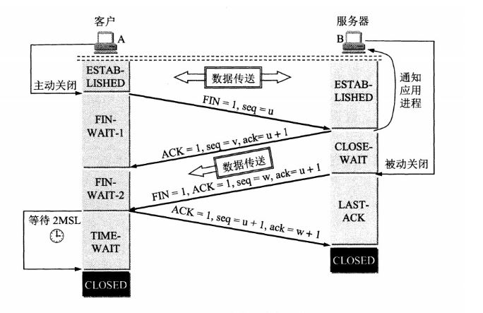

**数据传输结束后,**通信的双方都可释放连接.现在 A 的应用进程先向其 TCP
发出连接释放报文段,并停止再发送数据,主动关闭 TCP 连接(A 把连接释放报文段首部的
FIN = 1,其序号seq = u,等待 B 的确认)

B 发出确认,确认号 ack = u＋1,而这个报文段自己的序号 seq = v(TCP
服务器进程通知高层应用进程.从 A 到 B 这个方向的连接就释放了,**TCP
连接处于半关闭状态**.B 若发送数据,A 仍要接收)

若 B 已经没有要向 A 发送的数据,其应用进程就通知 TCP 释放连接

A 收到连接释放报文段后,必须发出确认,在确认报文段中 ACK = 1,确认号
ack=w﹢1,自己的序号 seq = u + 1

TIME_WAIT的原因：

客户端接收到服务器端的 FIN 报文后进入此状态，此时并不是直接进入 CLOSED
状态，还需要等待一个时间计时器设置的时间 2MSL。这么做有两个理由：

**确保最后一个确认报文能够到达。**如果 B 没收到 A
发送来的确认报文，那么就会重新发送连接释放请求报文，A
等待一段时间就是为了处理这种情况的发生。

**等待一段时间是为了让本连接持续时间内所产生的所有报文都从网络中消失**，使得下一个新的连接不会出现旧的连接请求报文。

**利用保活计数器可以判断客户端是否断开。**

#### 9.2.2.4 TCP粘包/拆包问题

Nagle算法

在TCP传输数据流中，存在两种类型的TCP报文段，一种包含成块数据（通常是满长度的，携带一个报文段最多容纳的字节数），另一种则包含交互数据（通常只有携带几个字节数据）。

对于成块数据的报文段，TCP采用正常的流程发送即可，因为数据利用率很高。而对于

交互数据的报文段，数据利用率就显得很低，在网络环境不好的情况下容易加重网络负担。所以TCP必须对交互数据单独处理。

Nagle算法用于处理小报文段（微小分组）的发送问题。算法的核心思想是允许网络中最多只能有一个小分组被发送，而待发送的其它小分组会被重新分组成一个”较大的”小分组，等收到上一个小分组的应答后再发送。

虽然Nagle算法可以减少网络中小分组的个数，但是对于那些需要实时预览的通讯程序而言，客户端可能需要不断发送更新数据并得到服务器的响应，这种情况下nagle算法会造成客户端明显的延迟，所以需要禁用nagle算法

粘包、拆包表现形式

现在假设客户端向服务端连续发送了两个数据包，用packet1和packet2来表示，那么服务端收到的数据可以分为三种，现列举如下：

第一种情况，接收端正常收到两个数据包，即没有发生拆包和粘包的现象。

第二种情况，接收端只收到一个数据包，由于TCP是不会出现丢包的，所以这一个数据包中包含了发送端发送的两个数据包的信息，这种现象即为粘包。这种情况由于接收端不知道这两个数据包的界限，所以对于接收端来说很难处理。

第三种情况，这种情况有两种表现形式，如下图。接收端收到了两个数据包，但是这两个数据包要么是不完整的，要么就是多出来一块，这种情况即发生了拆包和粘包。这两种情况如果不加特殊处理，对于接收端同样是不好处理的。

**粘包、拆包发生原因**

发生TCP粘包或拆包有很多原因，现列出常见的几点，

1、要发送的数据大于TCP发送缓冲区剩余空间大小，将会发生拆包。

2、待发送数据大于MSS（最大报文长度），TCP在传输前将进行拆包。

3、要发送的数据小于TCP发送缓冲区的大小，TCP将多次写入缓冲区的数据一次发送出去，将会发生粘包。

4、接收数据端的应用层没有及时读取接收缓冲区中的数据，将发生粘包。

**粘包、拆包解决办法**

常用的方法有如下几个：

1、发送端给每个数据包添加包首部，首部中应该至少包含数据包的长度，这样接收端在接收到数据后，通过读取包首部的长度字段，便知道每一个数据包的实际长度了。

2、发送端将每个数据包封装为固定长度（不够的可以通过补0填充），这样接收端每次从接收缓冲区中读取固定长度的数据就自然而然的把每个数据包拆分开来。

3、可以在数据包之间设置边界，如添加特殊符号，这样，接收端通过这个边界就可以将不同的数据包拆分开。

**UDP为什么不会**

UDP是基于报文发送的，从UDP的帧结构可以看出，在UDP首部采用了16bit来指示UDP数据报文的长度，因此在应用层能很好的将不同的数据报文区分开，从而避免粘包和拆包的问题。而TCP是基于字节流的，虽然应用层和TCP传输层之间的数据交互是大小不等的数据块，但是TCP把这些数据块仅仅看成一连串无结构的字节流，没有边界；另外从TCP的帧结构也可以看出，在TCP的首部没有表示数据长度的字段。基于上面两点，在使用TCP传输数据时，才有粘包或者拆包现象发生的可能。

#### 9.2.2.5 TCP如何保证可靠性传输

**1.数据包校验：**目的是检测数据在传输过程中的任何变化，若校验出包有错，则丢弃报文段并且不给出响应，这时TCP发送数据端超时后会重发数据

**2.对失序数据包重排序：**既然TCP报文段作为IP数据报来传输，而IP数据报的到达可能会失序，因此TCP报文段的到达也可能会失序。TCP将对失序数据进行重新排序，然后才交给应用层

**3.丢弃重复数据：**对于重复数据，能够丢弃重复数据

**4.应答机制：**当TCP收到发自TCP连接另一端的数据，它将发送一个确认。这个确认不是立即发送，通常将推迟几分之一秒

**5.超时重发**：当TCP发出一个段后，它启动一个定时器，等待目的端确认收到这个报文段。如果不能及时收到一个确认，将重发这个报文段

**6.流量控制**：流量控制一般指的就是在接收方接受报文段的时候，应用层的上层程序可能在忙于做一些其他的事情，没有时间处理缓存中的数据，如果发送方在发送的时候不控制它的速度很有可能导致接受缓存溢出，导致数据丢失。流量控制的基础是滑动窗口机制。

相对的还有一种情况是由于两台主机之间的网络比较拥塞，如果发送方还是以一个比较快的速度发送的话就可能导致大量的丢包，这个时候也需要发送方降低发送的速度。

虽然看起来上面的两种情况都是由于可能导致数据丢失而让发送主机降低发送速度，但是一定要把这两种情况分开，**因为前者是属于流量控制而后者拥塞控制**。

**7.拥塞控制：**拥塞控制一般都是由于网络中的主机发送的数据太多导致的拥塞，一般拥塞的都是一些负载比较高的路由，这时候为了获得更好的数据传输稳定性，必须采用拥塞控制，当然也为了减轻路由的负载防止崩溃。

有两个拥塞控制的方法，一个是慢开始与拥塞避免，另外一个称为快重传与快恢复。

**慢开始与拥塞避免：不要一开始就发送大量的数据，先探测一下网络的拥塞程度，也就是说由小到大逐渐增加拥塞窗口的大小，**当然收到单个确认但此确认多个数据报**（实际上应当是字节）**的时候就加相应的数值。所以一次传输轮次之后拥塞窗口就加倍。**这就是乘法增长，和后面的拥塞避免算法的加法增长比较。**

为了防止cwnd增长过大引起网络拥塞，还需设置一个慢开始门限ssthresh状态变量。ssthresh的用法如下：

当cwnd\<ssthresh时，使用慢开始算法。

当cwnd\>ssthresh时，改用拥塞避免算法。

当cwnd=ssthresh时，慢开始与拥塞避免算法任意。

拥塞避免算法让拥塞窗口缓慢增长，即每经过一个往返时间RTT就把发送方的拥塞窗口cwnd加1，而不是加倍。这样拥塞窗口按线性规律缓慢增长。

无论是在慢开始阶段还是在拥塞避免阶段，只要发送方判断网络出现拥塞（**其根据就是没有收到确认，虽然没有收到确认可能是其他原因的分组丢失，但是因为无法判定，所以都当做拥塞来处理）**，就把慢开始门限设置为出现拥塞时的发送窗口大小的一半。然后把拥塞窗口设置为1，执行慢开始算法。如下图：

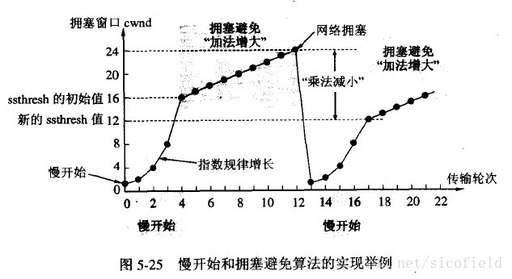

2.快重传与快恢复

快重传要求接收方在收到一个失序的报文段后就立即发出重复确认（为的是使发送方及早知道有报文段没有到达对方）而不要等到自己发送数据时捎带确认。快重传算法规定，发送方只要一连收到三个重复确认就应当立即重传对方尚未收到的报文段，而不必继续等待设置的重传计时器时间到期。

快重传配合使用的还有快恢复算法，有以下两个要点:

当发送方连续收到三个重复确认时，就执行“乘法减小”算法，把ssthresh门限减半。但是接下去并不执行慢开始算法。

考虑到如果网络出现拥塞的话就不会收到好几个重复的确认，所以发送方现在认为网络可能没有出现拥塞。所以此时不执行慢开始算法，而是将cwnd设置为ssthresh的大小，然后执行拥塞避免算法。如下图

#### 9.2.2.7 滑动窗口机制

TCP的滑动窗口主要有两个作用，一是提供TCP的可靠性，二是提供TCP的流控特性。同时滑动窗口机制还体现了TCP面向字节流的设计思路。可靠：对发送的数据进行确认。流控制：窗口大小随链路变化。

TCP的窗口滑动技术通过动态改变窗口的大小来调节两台主机之间数据传输。每个TCP/IP主机支持全双工数据传输，因此TCP有两个滑动窗口，一个用于接收数据，一个用于发送数据。接收方设备要求窗口大小为0时，表明接收方已经接收了全部数据，或者接收方应用程序没有时间读取数据，要求暂停发送。

TCP在传送数据时，第一次发数据发送方的窗口大小是由链路带宽决定的，但是接受方在接收到发送方的数据后，返回ack确认报文，同时也告诉了发送方自己的窗口大小，此时发送发第二次发送数据时，会改变自己的窗口大小和接受方一致。

当窗口过大时，会导致不必要的数据来拥塞我们的链路，但是窗口太小时，会造成很大的延时。**当链路变好了或者变差了这个窗口还会发生变话，并不是第一次协商好了以后就永远不变了。**

滑动窗口协议是TCP使用的一种流量控制方法。该协议允许发送方在停止并等待接收确认报文前可以连续发送多个分组。由于发送方不必每发一个分组就停下来等待确认，因此该协议可以加速数据的传输。
只有在接收窗口向前滑动时（与此同时也发送了确认），发送窗口才有可能向前滑动，收发两端的窗口按照以上规律不断地向前滑动。

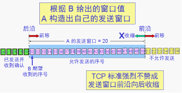

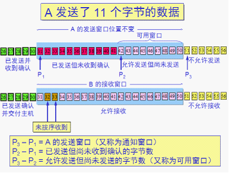

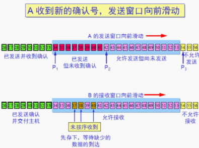

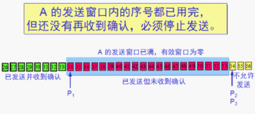

#### 9.2.2.8 TCP状态转移

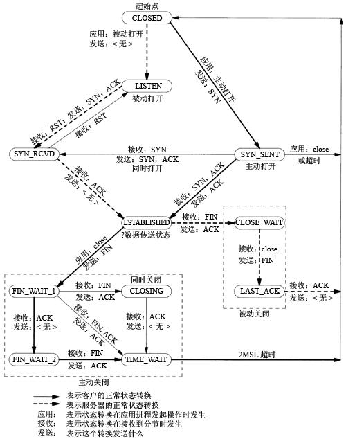

**1.CLOSED：起始点**，在超时或者连接关闭时候进入此状态。

2.LISTEN：服务端在等待连接过来时候的状态，此称为应用程序被动打开（等待客户端来连接）。

**3.SYN_SENT:**客户端发起连接，发送SYN给服务器端。如果服务器端不能连接，则直接进入CLOSED状态。

**4.SYN_RCVD：**跟3对应，服务器端接受客户端的SYN请求，服务器端由LISTEN状态进入SYN_RCVD状态。同时服务器端要回应一个ACK，同时发送一个SYN给客户端；另外一种情况，客户端在发起SYN的同时接收到服务器端得SYN请求，客户端就会由SYN_SENT到

SYN_RCVD状态。

**5.ESTABLISHED：**服务器端和客户端在完成3次握手进入状态，说明已经可以开始传输数据了

**以上是建立连接时服务器端和客户端产生的状态转移说明。下面是连接关闭时候的状态转移说明，关闭需要进行4次双方的交互，还包括要处理一些善后工作（TIME_WAIT状态），注意，这里主动关闭的一方或被动关闭的一方不是指特指服务器端或者客户端，是相对于谁先发起关闭请求来说的：**

**6.FIN_WAIT_1:**主动关闭的一方，由状态5进入此状态。具体的动作时发送FIN给对方。

**7.FIN_WAIT_2:**主动关闭的一方，接收到对方的FIN
ACK，进入此状态。由此不能再接收对方的数据。但是能够向对方发送数据。

**8.CLOSE_WAIT：**接收到FIN以后，被动关闭的一方进入此状态。具体动作时接收到FIN，同时发送ACK。

**9.LAST_ACK：**被动关闭的一方，发起关闭请求，由状态8进入此状态。具体动作时发送FIN给对方，同时在接收到ACK时进入CLOSED状态。

**10.CLOSING：**两边同时发起关闭请求时，会由FIN_WAIT_1进入此状态。具体动作是，接收到FIN请求，同时响应一个ACK。

**11.TIME_WAIT：**最纠结的状态来了。从状态图上可以看出，有3个状态可以转化成它，

**a.由FIN_WAIT_2进入此状态：**在双方不同时发起FIN的情况下，主动关闭的一方在完成自身发起的关闭请求后，接收到被动关闭一方的FIN后进入的状态。

**b.由CLOSING状态进入:**双方同时发起关闭，都做了发起FIN的请求，同时接收到了FIN并做了ACK的情况下，由CLOSING状态进入。

**c.由FIN_WAIT_1状态进入：**同时接受到FIN（对方发起），ACK（本身发起的FIN回应），与b的区别在于本身发起的FIN回应的ACK先于对方的FIN请求到达，而b是FIN先到达。这种情况概率最小。

#### 9.2.2.9 TCP第三次握手失败后怎么办

当客户端收到服务端的SYN+ACK应答后，其状态变为ESTABLISHED，并会发送ACK包给服务端，准备发送数据了。如果此时ACK在网络中丢失，过了超时计时器后，那么Server端会重新发送SYN+ACK包，重传次数根据/proc/sys/net/ipv4/tcp_synack_retries来指定，默认是5次。

如果重传指定次数到了后，仍然未收到ACK应答，那么一段时间后，Server自动关闭这个连接。**但是Client认为这个连接已经建立**，如果Client端向Server写数据，Server端将以RST包响应，方能感知到Server的错误。

#### 9.2.2.10 TCP当被告知接收窗口为0后的行为

当被告知接收窗口为0后，发送方不能再发送了，它会定期的发出一个探测信号以搞清这个窗口什么时间再次打开。如果发送方从来没有收到ACK（正常的窗口探测你肯定是能得到应答）信息，它就一直不断地重试，直到定时器过期。

#### 9.2.2.11 一个 TCP 连接上面能发多少 HTTP请求

HTTP/1.0中，一个服务器在发送完一个HTTP响应后，会断开TCP链接。但是这样每次请求都会重新建立和断开
TCP 连接，代价过大。

HTTP/1.1就把 Connection 头写进标准，默认开启持久连接，除非请求中写明 Connection:
close，那么浏览器和服务器之间是会维持一段时间TCP连接，不会一个请求结束就断掉。HTTP/1.1
存在一个问题，单个 TCP
连接在同一时刻只能处理一个请求，意思是说：两个请求的生命周期不能重叠，任意两个
HTTP 请求从开始到结束的时间在同一个 TCP 连接里不能重叠。

HTTP/1.1 规范中规定了 Pipelining
来试图解决这个问题，但是这个功能在浏览器中默认是关闭的。这是因为HTTP/1.1是个文本协议，同时返回的内容也并不能区分对应于哪个发送的请求，所以请求和响应顺序必须维持一致。这样的话在建立起一个
TCP
连接之后，假设客户端在这个连接连续向服务器发送了几个请求。按照标准，服务器应该按照收到请求的顺序返回结果，假设服务器在处理首个请求时花费了大量时间，那么后面所有的请求都需要等着首个请求结束才能响应。

**HTTP/1.1 时代，浏览器主要通过以下面两点提高页面加载效率：**

1.维持和服务器已经建立的 TCP 连接，在同一连接上顺序处理多个请求。

2.和服务器建立多个 TCP 连接（浏览器对同一 Host 建立 TCP 连接有限制）。

9.2.3 TCP与UDP区别
------------------

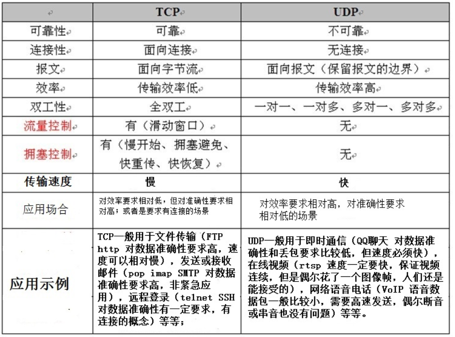

UDP首部8个字节，TCP首部最低20个字节。

**TCP对应的协议：**

1、**FTP**：定义了文件传输协议，使用21端口。常说某某计算机开了FTP服务便是启动了文件传输服务。下载文件，上传主页，都要用到FTP服务。

**2、Telnet**：它是一种用于远程登陆的端口，用户可以以自己的身份远程连接到计算机上，通过这种端口可以提供一种基于DOS模式下的通信服务。如以前的BBS是-纯字符界面的，支持BBS的服务器将23端口打开，对外提供服务。

**3、SMTP**：定义了简单邮件传送协议，现在很多邮件服务器都用的是这个协议，用于发送邮件，所用的是25端口。

**4、POP3**：它是和SMTP对应，POP3用于接收邮件。通常情况下，POP3协议所用的是110端口。也是说，只要你有相应的使用POP3协议的程序，就可以不以Web方式登陆进邮箱界面，直接用邮件程序就可以收到邮件。

**5、HTTP协议：**是从Web服务器传输超文本到本地浏览器的传送协议。

**UDP对应的协议：**

1、**DNS**：用于域名解析服务，将域名地址转换为IP地址。DNS用的是53号端口。

**2、SNMP**：简单网络管理协议，使用161号端口，是用来管理网络设备的。由于网络设备很多，无连接的服务就体现出其优势。

**3、TFTP**(Trival File Transfer
Protocal)，简单文件传输协议，该协议在熟知端口69上使用UDP服务。

9.3 HTTPS
---------

超文本传输协议HTTP协议被用于在Web浏览器和网站服务器之间传递信息，HTTP协议以明文方式发送内容，不提供任何方式的数据加密，如果攻击者截取了Web浏览器和网站服务器之间的传输报文，就可以直接读懂其中的信息，因此，HTTP协议不适合传输一些敏感信息，比如：信用卡号、密码等支付信息。为了解决HTTP协议的这一缺陷，需要使用另一种协议：安全套接字层超文本传输协议HTTPS，为了数据传输的安全，HTTPS在HTTP的基础上加入了SSL协议，SSL依靠证书来验证服务器的身份，并为浏览器和服务器之间的通信加密。

**HTTPS：是以安全为目标的HTTP通道，简单讲是HTTP的安全版**，即HTTP下加入SSL层，HTTPS的安全基础是SSL，因此加密的详细内容就需要SSL。HTTPS协议的主要作用可以分为两种：一种是建立一个信息安全通道，来保证数据传输的安全；另一种就是确认网站的真实性。

### 9.3.1 HTTPS的通信过程

**客户端发起HTTPS请求：**用户在浏览器里输入一个HTTPS网址，然后连接到服务端的443端口。

服务端的配置：采用HTTPS协议的服务器必须要有一套数字证书，可以自己制作，也可以向组织申请。区别就是自己颁发的证书需要客户端验证通过，才可以继续访问，而使用受信任的公司申请的证书则不会弹出提示页面。这套证书其实就是一对公钥和私钥。如果对公钥不太理解，可以想象成一把钥匙和一个锁头，只是世界上只有你一个人有这把钥匙，你

可以把锁头给别人，别人可以用这个锁把重要的东西锁起来，然后发给你，因为只有你一个人有这把钥匙，所以只有你才能看到被这把锁锁起来的东西。

**传送证书：**这个证书其实就是公钥，只是包含了很多信息，如证书的颁发机构，过期时间等等。

**客户端解析证书：**这部分工作是由客户端的SSL/TLS来完成的，首先会验证公钥是否有效，比如颁发机构，过期时间等等，如果发现异常，则会弹出一个警示框，提示证书存在的问题。如果证书没有问题，那么就生成一个随机值。然后用证书（也就是公钥）对这个随机值进行加密。就好像上面说的，把随机值用锁头锁起来，这样除非有钥匙，不然看不到被锁住的内容。

**传送加密信息：**这部分传送的是用证书加密后的随机值，目的是让服务端得到这个随机值，以后客户端和服务端的通信就可以通过这个随机值来进行加密解密了。

**服务端解密信息**：服务端用私钥解密后，得到了客户端传过来的随机值，然后把内容通过该随机值进行对称加密，将信息和私钥通过某种算法混合在一起，这样除非知道私钥，不然无法获取内容，而正好客户端和服务端都知道这个私钥，所以只要加密算法够彪悍，私钥够复杂，数据就够安全。

**传输加密后的信息：**这部分信息就是服务端用私钥加密后的信息，可以在客户端用随机值解密还原。

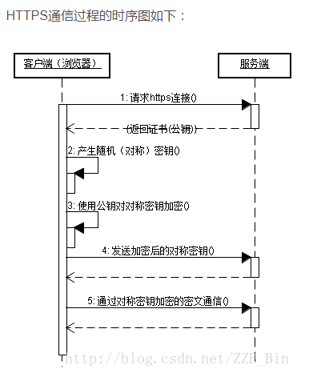

### 9.3.2 https与http区别

https协议需要到ca申请证书，一般免费证书较少，因而需要一定费用。

http是超文本传输协议，信息是明文传输，https则是具有安全性的ssl加密传输协议。

http和https使用的是完全不同的连接方式，用的端口也不一样，前者是80，后者是443。

http的连接很简单，是无状态的，HTTPS协议是由SSL+HTTP协议构建的可进行加密传

输、身份认证的网络协议，比http协议安全。

### 9.3.4 SSL工作原理

>   <https://blog.csdn.net/ENERGIE1314/article/details/54581411/>

>   **三种协议：1.握手协议 2.记录协议 3，警报协议**

9.4 计算机网络分层模型
----------------------

**9.4.1 计算机网络体系结构**

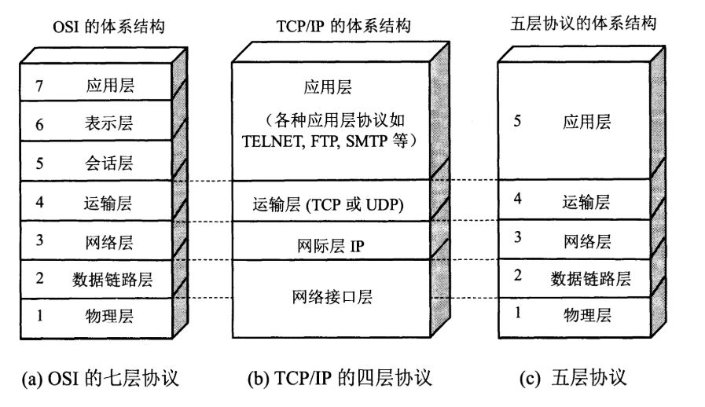

**五层协议**

**应用层：**为特定应用程序提供数据传输服务，例如 HTTP、DNS 等。数据单位为报文。

**运输层：**提供的是进程间的通用数据传输服务。由于应用层协议很多，定义通用的运输层协议就可以支持不断增多的应用层协议。运输层包括两种协议：传输控制协议
TCP，提供面向连接、可靠的数据传输服务，数据单位为报文段；用户数据报协议
UDP，提供无连接、尽最大努力的数据传输服务，数据单位为用户数据报。TCP
主要提供完整性服务，UDP 主要提供及时性服务。

**网络层：**为主机间提供数据传输服务，而运输层协议是为主机中的进程提供服务。网络层把运输层传递下来的报文段或者用户数据报封装成分组。

**数据链路层**：网络层针对的还是主机之间的数据传输服务，而主机之间可以有很多链路，链路层协议就是为同一链路的主机提供服务。数据链路层把网络层传下来的分组封装成帧。

**物理层**：考虑的是怎样在传输媒体上传输数据比特流，而不是指具体的传输媒体。物理层的作用是尽可能屏蔽传输媒体和通信手段的差异，使数据链路层感觉不到这些差异。

**OSI**

其中表示层和会话层用途如下：

**表示层：**数据压缩、加密以及数据描述，这使得应用程序不必担心在各台主机中数据内部格式不同的问题。

会话层 ：建立及管理会话。

五层协议没有表示层和会话层，而是将这些功能留给应用程序开发者处理。

**TCP/IP**

只有四层，相当于五层协议中数据链路层和物理层合并为网络接口层。TCP/IP
体系结构不严格遵循 OSI 分层概念，应用层可能会直接使用 IP 层或者网络接口层。

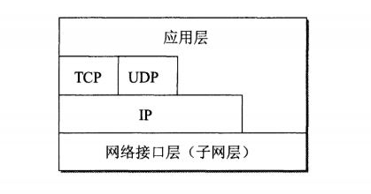

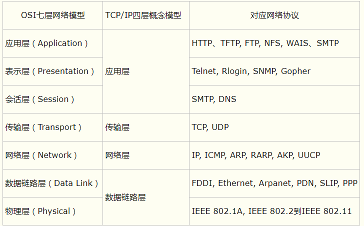

**9.4.2 ARP**

ARP（地址解析协议，Address Resolution Protocol）是网络层协议。ARP 实现由 IP
地址得到 MAC
地址。每个主机都会在自己的ARP缓冲区中建立一个ARP列表，以表示IP地址和MAC地址之间的对应关系。

当源主机要发送数据时，首先检查ARP列表中是否有对应IP地址的目的主机的MAC地址，如果有，则直接发送数据，如果没有，就向本网段的所有主机发送ARP数据包，该数据包包括的内容有：源主机IP地址，源主机MAC地址，目的主机的IP地址。

当本网络的所有主机收到该ARP数据包时，首先检查数据包中的IP地址是否是自己的IP地址，如果不是，则忽略该数据包，如果是，则首先从数据包中取出源主机的IP和MAC地址写入到ARP列表中，如果已经存在，则覆盖，然后将自己的MAC地址写入ARP响应包中，告诉源主机自己是它想要找的MAC地址。

源主机收到ARP响应包后。将目的主机的IP和MAC地址写入ARP列表，并利用此信息发送数据。如果源主机一直没有收到ARP响应数据包，表示ARP查询失败。

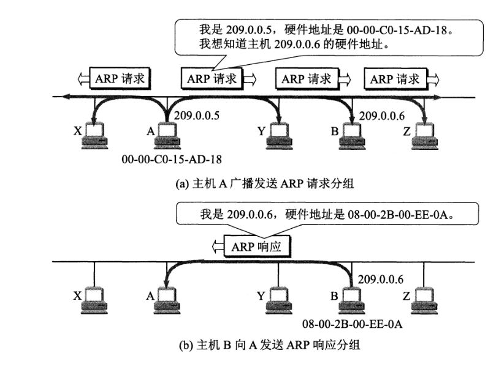

**RARP协议：**逆地址解析协议，作用是完成硬件地址到IP地址的映射，主要用于无盘工作站，因为给无盘工作站配置的IP地址不能保存

**9.7.3 ICMP 协议**

ICMP是InternetControl Message Protocol，网际控制报文协。

ICMP是TCP/IP协议族的一个子协议，用于在IP主机、路由器之间传递控制消息。控制消息是指网络通不通、主机是否可达、路由器是否可用等网络本身的消息。这些控制消息虽然并不传输用户数据，但是对于用户数据的传递起着重要的作用。ICMP报文有两种：差错报告报文和询问报文。

**ICMP的应用**

Ping：测试两台主机之间的连通性。

Traceroute：跟踪一个分组从源点到终点的路径。

**9.7.4 DHCP协议**

动态主机配置协议（Dynamic Host ConfigurationProtocol,
DHCP），是一种让系统得以连接到网络上，并获取所需要的配置参数手段。通常被应用在大型的局域网络环境中，主要作用是集中的管理、分配IP地址，使网络环境中的主机动态的获得IP地址、Gateway地址、DNS服务器地址等信息，并能够提升地址的使用率。

**9.7.5 路由选择协议**

**动态路由算法决定信息经过哪个路由器发送**。

#### 9.7.5.1 RIP协议：（routing information protocol）距离向量算法

（1）以跳数作为度量，距离16表示不可达

（2）使用UDP的520端口发送和接收RIP分组

（3）RIP每隔30s以广播形式发送一次路由信息，在邻居之间互传，和邻居分享自己全部的信息，为了防止出现广播风暴，其后续的分组将做随机延时后发送。RIP协议规定，只和自己相邻的路由器交换信息，不相邻的路由器不交换信息。交换的信息是：“我到本自治系统中所有网络的最短距离，以及到每个网络应该经过的下一跳路由器”

（4）如果一个路由在180s内未被更新，相应的距离应设置为无穷大，并从路由表中删除该表项

（5）RIP分组分为请求分组 和响应分组 

（6）RIP选择一条具有最少路由器的路由，哪怕还存在另外一条高速但路由器较多的路由。

（7）RIP基于Bellman-Ford 算法

**过程分析：**在路由器刚启动的时候，启用了RIP的接口会向外广播请求信息，接下来RIP进程进入到一个循环状态：监听来自路由器的请求信息和应答信息。当邻居收到请求信息以后，就发送应答信息给这个发出请求信息的路由器。

平均每个30s，启用了RIP的接口会发送应答信息，也就是（updata），这个update包含了路由器完整的信息表。

**实例分析：**https://blog.csdn.net/xuzhiwangray/article/details/50502233

#### 9.7.5.2 OSPF协议：链路状态算法

OSPF协议：链路状态算法

（1）每个结点都有完整的网络拓扑信息

（2）一个结点检查所有直接链路的状态，并将所得的状态信息发送给网上所有其他的结点，故OSPF是将自己知道的部分信息告诉了所有结点，此处运用洪泛法

（3）只有当链路状态变化时，路由器才用洪泛法向所有路由器发送信息

（4）IP分装，协议号89

（5）支持IPV4和IPV6，支持组播

（6）死亡时间：40s

（7）OSPF基于迪杰斯特拉算法

注：OSPF克服了RIP的很多缺陷，表现在

（1）OSPF不再采用跳数的概念，而是根据接口的吞吐率，拥塞情况，往返时间等实际链路的负载能力定出路由的代价，同时选择最短，最优路由并允许保持到达同一目标地址的多条路由，从而平衡网络负荷

（2）OSPF支持不同服务类型的不同代价。

（3）OSPF路由器不再交换路由表，而是同步各路由器对于网络状态的认识，即链路状态数据库。

9.5 IP
------

IP（Internet
Protocol的简写）地址，即用Internet协议语言表示的地址，用于在网络地址唯一地标识一台计算机。目前的IP版本有IPV4和IPV6。

**IP协议功能**

（1）寻址和路由；（根据对方的IP地址，寻找最佳路径传输信息）；

（2）传递服务：

①不可靠（IP协议只是尽自己最大努力去传输数据包），可靠性由上层协议提供（TCP协议）。

②无连接（事先不建立会话），不维护任何关于后续数据报的信息；

（3）数据包的分片和重组。

### 9.5.1 IP地址分类

A类地址，一个A类地址是由一个字节的网络地址和三个字节的主机地址组成，网络地址的最高位必须是“0”

B类地址，一个B类地址是由两个字节的网络地址和两个字节的主机地址组成，网络地址的最高位必须是“10”

C类地址，一个C类地址是由三个字节的网络地址和一个字节的主机地址组成，网络地址的最高位必须是“110”

D类地址，不区分网络地址和主机地址，D类地址是一种组播地址，D类地址的第一个字节以1110开始。目前D类地址被用在多点广播（Multicast）中。多点广播地址用来一次寻址一组计算机，它标识共享同一协议的一组计算机。

E类地址，不区分网络地址和主机地址，E类地址是保留地址用于以后使用。E类地址的第一个字节以1111开始。

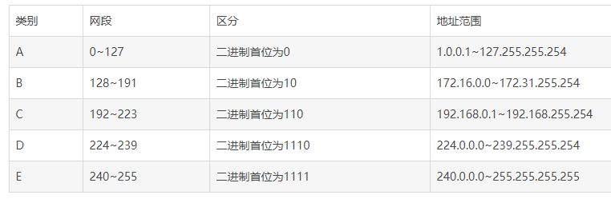

**特殊IP地址**

(1)**0.0.0.0**：严格说来，0.0.0.0已经不是一个真正意义上的IP地址了。它表示的是这样一个集合：所有不清楚的主机和目的网络。这里的“不清楚”是指在本机的路由表里没有特定条目指明如何到达。对本机来说，它就是一个“收容所”，所有不认识的“三无”人员，一律送进去。如果你在网络设置中设置了缺省网关，那么Windows系统会自动产生一个目的地址为0.0.0.0的缺省路由。

**(2)广播地址（255.255.255.255）:**限制广播地址。对本机来说，这个地址指本网段内（同一广播域）的所有主机。如果翻译成人类的语言，应该是这样：“这个房间里的所有人都注意了！”这个地址不能被路由器转发。

**(3)环回地址（127.0.0.1）:**本机地址，主要用于测试。用汉语表示，就是“我自己”。在Windows系统中，这个地址有一个别名“Localhost”。寻址这样一个地址，是不能把它发到网络接口的。除非出错，否则在传输介质上永远不应该出现目的地址为“127.0.0.1”的数据包。

(4)**165.254.x.x**:如果你的主机使用了DHCP功能自动获得一个IP地址，那么当你的DHCP服务器发生故障，或响应时间太长而超出了一个系统规定的时间，Wingdows系统会为你分配这样一个地址。

(5)**组播地址:**组播地址，从224.0.0.0到239.255.255.254都是这样的地址。224.0.0.1特指所有主机，
224.0.0.2特指所有路由器。这样的地址多用于一些特定的程序以及多媒体程序。如果你的主机开启了IRDP（Internet路由发现协议，使用组播功能）功能，那么你的主机路由表中应该有这样一条路由，每个子网的第一个和最后一个地址无效。

(6)**私有地址:这**些地址不会被Internet分配，他们再Internet上也不会被路由，虽然它们不能直接和Internet网连接，但通过技术手段仍旧可以和
Internet通讯（NAT技术）。

A类地址的私有地址是：10.0.0.0\~10.255.255.255

B类地址的私有地址是：172.16.0.0\~172.31.255.255.255

C类地址的私有地址是：192.168.0.0\~192.168.255.255

**子网划分:**通过在主机号字段中拿一部分作为子网号，把两级 IP 地址划分为三级 IP
地址。**IP 地址 ::= {\< 网络号 \>, \< 子网号 \>, \< 主机号
\>}。**要使用子网，必须配置子网掩码。一个 B 类地址的默认子网掩码为
255.255.0.0，如果 B 类地址的子网占两个比特，那么子网掩码为 11111111 11111111
11000000 00000000，也就是255.255.192.0。注意，外部网络看不到子网的存在。

**无分类:**无分类编址 CIDR 消除了传统 A 类、B 类和 C
类地址以及划分子网的概念，使用网络前缀和主机号来对 IP
地址进行编码，网络前缀的长度可以根据需要变化。IP 地址 ::= {\< 网络前缀号 \>, \<
主机号 \>}。CIDR的记法上采用在 IP
地址后面加上网络前缀长度的方法，例如128.14.35.7/20表示前20位为网络前缀。CIDR的地址掩码可以继续称为子

网掩码，子网掩码首1长度为网络前缀的长度。一个CIDR地址块中有很多地址，一个 CIDR
表示的网络就可以表示原来的很多个网络，并且在路由表中只需要一个路由就可以代替原来的多个路由，减少了路由表项的数量。把这种通过使用网络前缀来减少路由表项的方式称为路由聚合，也称为构成超网。

### 9.5.2 IP报文格式

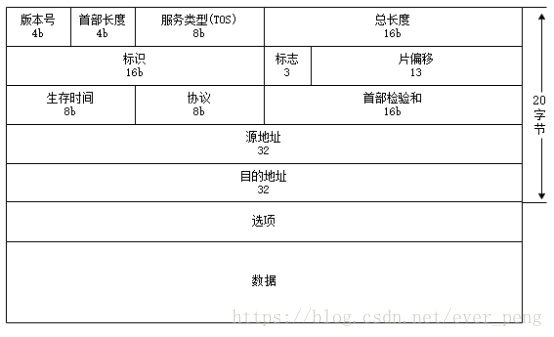

**版本号：**4个bit，用来标识IP版本号。这个4位字段的值设置为二进制的0100表示IPv4，设置为0110表示IPv6。目前使用的IP协议版本号是4。

**首部长度：**4个bit。标识包括选项在内的IP头部字段的长度。

**服务类型：**8个bit。服务类型字段被划分成两个子字段：3bit的优先级字段和4bit
TOS字段，最后一位置为0。4bit的TOS分别代表：最小时延，最大吞吐量，最高可靠性和最小花费。4bit中只能将其中一个bit位置1。如果4个bit均为0，则代表一般服务。

**总长度：**16个bit。接收者用IP数据报总长度减去IP报头长度就可以确定数据包数据有效负荷的大小。IP数据报最长可达65535字节。

**标识：**16个bit。唯一的标识主机发送的每一份数据报。接收方根据分片中的标识字段是否相同来判断这些分片是否是同一个数据报的分片，从而进行分片的重组。通常每发送一份报文它的值就会加1。

**标志：**3个bit。用于标识数据报是否分片。第1位没有使用，第2位是不分段（DF）位。当DF位被设置为1时，表示路由器不能对数据包进行分段处理。如果数据包由于不能分段而未能被转发，那么路由器将丢弃该数据包并向源发送ICMP不可达。第3位是分段（MF）位。当路由器对数据包进行分段时，除了最后一个分段的MF位被设置为0外，其他的分段的MF位均设置为1，以便接收者直到收到MF位为0的分片为止。

**片偏移：**13个bit。在接收方进行数据报重组时用来标识分片的顺序。用于指明分段起始点相对于报头起始点的偏移量。由于分段到达时可能错序，所以位偏移字段可以使接收者按照正确的顺序重组数据包。当数据包的长度超过它所要去的那个数据链路的MTU时，路由器要将它分片。数据包中的数据将被分成小片，每一片被封装在独立的数据包中。接收端使用标识符，分段偏移以及标记域的MF位来进行重组。

**生存时间:**8个bit。TTL域防止丢失的数据包在无休止的传播。该域包含一个8位整数，此数由产生数据包的主机设定。TTL值设置了数据报可以经过的最多的路由器数。TTL的初始值由源主机设置（通常为32或64），每经过一个处理它的路由器，TTL值减1。如果一台路由器将TTL减至0，它将丢弃该数据包并发送一个ICMP超时消息给数据包的源地址。

**协议：**8个bit。用来标识是哪个协议向IP传送数据。ICMP为1，IGMP为2，TCP为6，UDP为17，GRE为47，ESP为50。

**首部检验和：**根据IP首部计算的校验和码。

**源地址：**IP报文发送端的IP地址

**目的地址：**IP报文接收端的IP地址

**选项：**是数据报中的一个可变长的可选信息。选项字段以32bit为界，不足时插入值为0的填充字节。保证IP首部始终是32bit的整数倍。

9.6 安全加密与网站攻击
----------------------

### 9.6.1 安全加密技术

**常见的信息加密技术分为三类：单项散列加密、对称加密和非对称加密。**

#### 9.6.1.1 单项散列加密

单项散列加密是指通过对不同输入长度的信息进行散列计算，得到固定长度的输出，这个散列计算过程是单向的。为了加强单向散列计算的安全性，可以给散列算法加盐，salt相当于加密的密钥，增加破解难度。

**单向散列函数特点：**

>   对任意长度的消息散列值是定长的。

>   散列计算速度快，非常高效。

>   明文不同，散列加密后的密文一定不同；明文相同，散列加密后密文一定相同。

>   具备单向性，无法逆推计算。

>   单向散列的经典算法有 MD5、SHA、RSA-SHA等。

#### 9.6.1.2 对称加密

对称加密是最快速、最简单的一种加密方式，加密（encryption）与解密（decryption）用的是同样的密钥（secret
key）。对称加密有很多种算法，由于它效率很高，所以被广泛使用在很多加密协议的核心当中。

对称加密通常使用的是相对较小的密钥，一般小于256
bit。因为密钥越大，加密越强，但加密与解密的过程越慢。如果你只用1
bit来做这个密钥，那黑客们可以先试着用0来解密，不行的话就再用1解；但如果你的密钥有1
MB大，黑客们可能永远也无法破解，但加密和解密的过程要花费很长的时间。密钥的大小既要照顾到安全性，也要照顾到效率，是一个trade-off。

常见的对称加密算法：DES，AES，3DES等。

#### 9.6.1.3 非对称加密

非对称加密为数据的加密与解密提供了一个非常安全的方法，它使用了一对密钥，公钥（public
key）和私钥（private
key）。私钥只能由一方安全保管，不能外泄，而公钥则可以发给任何请求它的人。非对称加密使用这对密钥中的一个进行加密，而解密则需要另一个密钥（公钥加密，私钥解密；私钥加密，公钥解密）。常见的非对称加密算法加密和签名算法：RSA、DSA等。

由于非对称加密算法的运行速度比对称加密算法的速度慢很多，当需要加密大量的数据时，一般采用对称加密算法，提高加解密速度。
对称加密算法不能实现签名，因此签名只能非对称算法。

对称加密加密与解密使用的是同样的密钥，所以速度快，但由于需要将密钥在网络传输，所以安全性不高。非对称加密使用了一对密钥，公钥与私钥，所以安全性高，但加密与解密速度慢。
根据对称加密和非对称加密的特点，在实际的操作过程中，采用的方式是：采用非对称加密算法管理对称算法的密钥，然后用对称加密算法加密数据，这样就集成了两类加密算法的优点，既实现了加密速度快的优点，又实现了安全方便管理密钥的优点。

### 9.6.2 网络攻击

#### 9.6.2.1 SYN Flood攻击

**SYN
Flood攻击：**给服务器发了一个SYN后，就下线了，于是服务器需要默认等63s才会断开连接，这样，攻击者就可以把服务器的syn连接的队列耗尽，让正常的连接请求不能处理。

Linux下给了一个叫tcp_syncookies的参数来应对这个事：当SYN队列满了后，TCP会通过源地址端口、目标地址端口和时间戳打造出一个特别的Sequence
Number发回去（又叫cookie），如果是攻击者则不会有响应，如果是正常连接，则会把这个
SYN Cookie发回来，然后服务端可以通过cookie建连接（即使不在SYN队列中）。

请注意，请**先千万别用tcp_syncookies来处理正常的大负载的连接的情况。**因为，synccookies是妥协版的TCP协议，并不严谨。对于正常的请求，所以应该调整三个TCP参数：第一个是tcp_synack_retries，可以用来减少重试次数；第二个是tcp_max_syn_backlog，可以增大SYN连接数；第三个是tcp_abort_on_overflow，处理不过来干脆就直接拒绝连接了。

#### 9.6.2.2 DDOS攻击

DDoS攻击是Distributed Denial of
Service的缩写，即不法黑客组织通过控制服务器等资源，发动对包括国家骨干网络、重要网络设施、政企或个人网站在内的互联网上任一目标

的攻击，致使目标服务器断网，最终停止提供服务。

预防1：**高防服务器。**主要是指能独立硬防御 50Gbps
以上的服务器，能够帮助网站拒绝服务攻击，定期扫描网络主节点等。

**预防2**：DDoS清洗会对用户请求数据进行实时监控，及时发现DOS攻击等异常流量，在不影响正常业务开展的情况下清洗掉这些异常流量。

**预防3：CDN 加速。**在现实中，CDN
服务将网站访问流量分配到了各个节点中，这样一方面隐藏网站的真实
IP，另一方面即使遭遇 DDoS 攻击，也可以将流量分散到各个节点中，防止源站崩溃。

#### 9.6.2.3 SQL注入

所谓SQL注入，就是通过把SQL命令插入到Web表单提交或输入域名或页面请求的查询字符串，最终达到欺骗服务器执行恶意的SQL命令。

**预防1：加密处理**。将用户登录名称、密码等数据加密保存。加密用户输入的数据，然后再将它与数据库中保存的数据比较，这相当于对用户输入的数据进行了“消毒”处理，用户输入的数据不再对数据库有任何特殊的意义，从而也就防止了攻击者注入SQL命令。

**预防**2：**确保数据库安全**。只给访问数据库的web应用功能所需的最低的权限，撤销不必要的公共许可

**预防3：输入验证**。检查用户输入的合法性，确信输入的内容只包含合法的数据。数据检查应当在客户端和服务器端都执行之所以要执行服务器端验证，是为了弥补客户端验证机制脆弱的安全性。

#### 9.6.2.4 XSS攻击

XSS攻击全称为跨站脚本攻击(Cross Site
Scripting)。它的原理是攻击者向有XSS漏洞的网站中插入恶意的HTML代码，当其它用户浏览该网站时，这段HTML代码会自动执行，从而达到攻击的目的。比如，盗取用户Cookie、破坏页面结构、重定向到其它网站等。

**XSS的攻击方式分为两种**

反射式：点击恶意URL，恶意脚本会执行。

持久性XSS攻击：黑客提交含有恶意脚本的请求，保存在被攻击的web站点的数据库中，用户浏览网页的时候，恶意脚本被包含在正常页面中，达到攻击的目的。

**XSS的防御措施**

编码：对用户输入的数据进行HTML Entity编码

过滤：移除用户上传的DOM属性，如onerror等，移除用户上传的style节点，script节点，iframe节点等。

校正：避免直接对HTML Entity编码，使用DOM Prase转换，校正不配对的DOM标签。

#### 9.6.2.5 CSRF攻击

CSRF全称为跨站请求伪造（Cross-site request
forgery），是一种网络攻击方式，也被称为 one-click attack 或者 session riding。

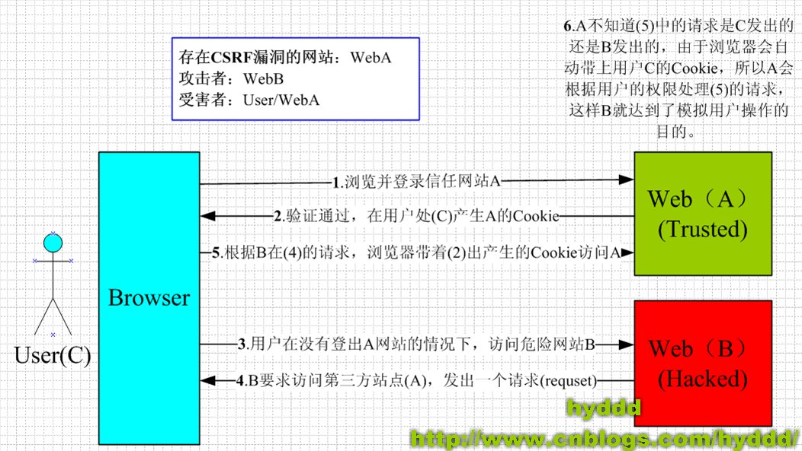

从上图可以看出，要完成一次CSRF攻击，受害者必须依次完成两个步骤：

>   **登录受信任网站A，并在本地生成Cookie。**

>   **在不登出A的情况下，访问危险网站B。**

CSRF攻击是源于WEB的隐式身份验证机制。WEB的身份验证机制虽然可以保证一个请求是来自于某个用户的浏览器，但却无法保证该请求是用户批准发送的！CSRF
攻击的应对之道：<https://www.ibm.com/developerworks/cn/web/1102_niugang_csrf>

9.7 浏览器中输入URL到页面加载的发生了什么
-----------------------------------------

**一般会经历以下几个过程：**

1、在浏览器地址栏中输入url

2、浏览器先查看**浏览器缓存-系统缓存-路由器缓存**，如果缓存中有，会直接在屏幕中显示页面内容。若没有，则跳到第三步操作。

3、在发送http请求前，需要**域名解析(DNS解析)**，解析获取相应的IP地址。

4、浏览器向服务器发起tcp连接，与浏览器建立tcp三次握手。

5、握手成功后，浏览器向服务器发送http请求，请求数据包。

6、服务器处理收到的请求，将数据返回至浏览器

7、浏览器收到HTTP响应

8、读取页面内容，浏览器渲染，解析html源码

9、生成Dom树、解析css样式、js交互

10、客户端和服务器交互

**步骤2的具体过程是：**

·**浏览器缓存**：浏览器会记录DNS一段时间，因此，只是第一个地方解析DNS请求；

·**操作系统缓存**：如果在浏览器缓存中不包含这个记录，则会使系统调用操作系统，获取操作系统的记录(保存最近的DNS查询缓存)；

·**路由器缓存**：如果上述两个步骤均不能成功获取DNS记录，继续搜索路由器缓存；

·**ISP缓存**：若上述均失败，继续向ISP搜索。

**DNS的工作原理及过程分下面几个步骤：**

**1、：**客户机提出域名解析请求，并将该请求发送给本地的域名服务器。

**2、：**当本地的域名服务器收到请求后，就先查询本地的缓存，如果有该纪录项，则本地的域名服务器就直接把查询的结果返回。

3、：如果本地的缓存中没有该纪录，则本地域名服务器就直接把请求发给根域名服务器，然后根域名服务器再返回给本地域名服务器一个所查询域(根的子域)
的主域名服务器的地址。

4、：本地服务器再向上一步返回的域名服务器发送请求，然后接受请求的服务器查询自己的缓存，如果没有该纪录，则返回相关的下级的域名服务器的地址。

5、：重复第四步，直到找到正确的纪录。

6、：本地域名服务器把返回的结果保存到缓存，以备下一次使用，同时还将结果返回给客户机。

9.8 WebSocket
-------------

WebSocket解决的问题是实现客户端与服务端的双向通信，它的特点如下：

（1）建立在TCP协议之上，服务器端的实现比较容易。

（2）与HTTP协议有着良好的兼容性。默认端口也是80和443，并且**握手阶段采用
HTTP协议**，因此握手时不容易屏蔽，能通过各种HTTP代理服务器。

（3）数据格式比较轻量，性能开销小，通信高效。

（4）可以发送文本，也可以发送二进制数据。

（5）没有同源限制，客户端可以与任意服务器通信。

**实际上，它的最大的特点在于服务端可以主动的向客户端推送消息。**

**WebSocket是HTML5出的东西（协议）**，也就是说HTTP协议没有变化，或者说没关系，但HTTP是不支持持久连接的（长连接，循环连接的不算）。首先HTTP有1.1和1.0之说，也就是所谓的keep-alive，把多个HTTP请求合并为一个，但是Websocket其实是一个新协议，跟HTTP协议基本没有关系，只是为了兼容现有浏览器的握手规范而已，也就是说它是HTTP协议上的一种补充。

HTTP的生命周期通过Request来界定，也就是一个Request
一个Response，那么在HTTP1.0中，这次HTTP请求就结束了。在HTTP1.1中进行了改进，使得有一个keep-alive，也就是说，在一个HTTP连接中，可以发送多个Request，接收多个Response。但是请记住
Request =
Response，在HTTP中永远是这样，也就是说一个request只能有一个response。而且这个response也是被动的，不能主动发起。

详细内容：<https://www.zhihu.com/question/20215561>

具体实现：https://github.com/abbshr/abbshr.github.io/issues/22
